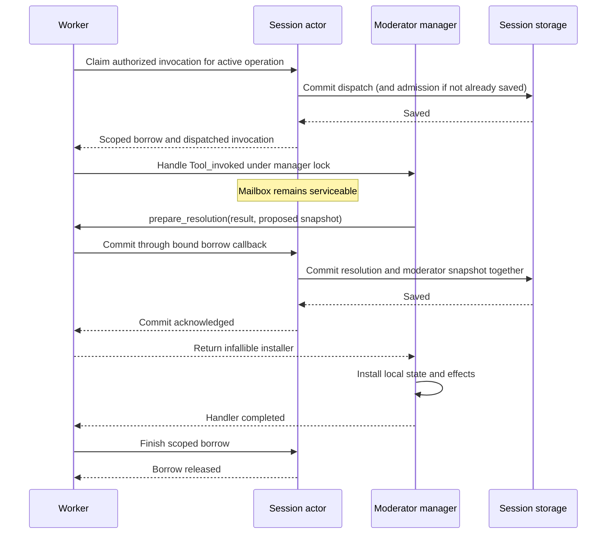

# ChatML extension records and capability discovery

The extension record/transaction foundations and strict declaration parsing are implemented. Model-visible
one-off scripts, moderator tools, subscription adapters and generated-child tools
are still under implementation; none of their feature flags is enabled yet.
This page describes the available storage and client protocol contracts, not a
runnable extension tutorial.

The extensibility-v1 moderator compiler also defines `Subscription.create`,
`get`, `complete`, `fail`, `cancel` and `arm`. These require an explicitly
injected host transaction. The qualified daemon now binds the script service to
actor staging for direct/managed moderator tools, ordinary/queued events and
observation handlers. Host expiry and transactional timer adapters are implemented
at that qualified scope, along with notification publication and delivery. One-off
and standalone tool surfaces do not include this module.

`create(kind, lifetime_ms, wake_policy)` returns a task of subscription ID. The
lifetime is `None` for the host default or `Some(positive_ms)`; wake policy is
`Request_turn`, `Next_turn` or `No_wake`. `get(id)` returns JSON status.
`complete(id, expected_epoch, payload)`, `fail(id, expected_epoch, tool_error)` and
`cancel(id, expected_epoch, reason)` return the retained JSON status. Host
callbacks must enforce source ownership, generation, schemas, quotas, lifetime
and first-terminal-winner semantics; defining the compiler surface grants none
of those permissions. Cancellation of a subscription does not imply cancellation
of a watched child or external process.

`arm(id, expected_epoch, timer_id, job_id)` accepts optional timer and job IDs,
advances the subscription epoch, and returns its new JSON status. A new timer must
be source-owned, still scheduled and not already bound; reusing that timer for a
different epoch is rejected. Arming cancels the previous outstanding timer and
stages the new timer binding with the subscription update. Passing `None` removes
that linkage. Job references use the existing session/generation read checks and
do not grant access to a child or cancel the referenced job.

The v1 `Schedule` module exposes `after_ms(delay_ms, json)`,
`after_ms_with_policy(delay_ms, json, misfire)`, `cancel(id)` and `get(id)` as tasks.
Creation returns an ID and defaults to `Deliver_once_immediately`; explicit policy
also accepts `Skip_if_expired` or `Fail`. `get` reads provisional or retained JSON
status, including the owned schedule envelope's due time and policy. `cancel`
returns unit and preserves a timer that is already terminal. These v1 operations
require a live schedule transaction and never fall back to immediate legacy host
callbacks. The legacy moderator surface retains its existing behavior.

The manager stages subscription mutations with the moderator transaction.
`Task.catch` rollback identifies individual updates, including repeated terminal
updates that return the same result, using private receipts hidden from the
script. Surviving job starts, subscription mutations and timer mutations are selected before the
owning save and acknowledged only after it succeeds. An ordinary or queued event
save failure leaves moderator state and the queue unchanged. The owning host
must discard all remaining provisional work on whole-handler failure.

Timer changes made by `Subscription.arm` or completion are retained through that
subscription operation's receipt. If a caught operation fails, its timer changes
are also discarded. Finishing a subscription cancels its linked outstanding timer
in the same checkpoint. Parent job cancellation similarly saves cancellation of
its active subscription and linked timer together. A completion that wins first
is preserved. Terminal delivery of notifications remains separate from these
work-state transitions.

The script service requests actor-owned subscription IDs and creator identity,
supplies the original declaration's completion schema, and applies the
host lifetime default or a permitted explicit lifetime. Pending acknowledgements
must identify a surviving creation from that same invocation. Nested callers
receive the acknowledgement while the nested moderator retains ownership.
Invalid acknowledgements discard every provisional subscription update. Managed
calls carry their admitted registry execution because their implementation
revision includes registry authority, rather than just the compiled tool hash.

Completion operations preserve a retained terminal winner. When an active
subscription is completed after its deadline, the service records expiry using
the expected epoch. This check is not yet an autonomous expiry scheduler.

The actor's host-only stage/select/read/abort operations require an actual live
moderator invocation or event borrow with the installed source identity.
Creation belongs to the currently dispatched moderator tool; an ordinary native
or one-off invocation cannot acquire subscription authority. The actor checks
source/session/generation, completion schemas, ordered predecessor transitions,
creation lifetime and admission quotas. It validates selected predecessors again
at save time, so a concurrent terminal winner cannot be overwritten by an older
moderator proposal. Creation followed by completion saves as two ordered changes
with the owning acknowledgement and moderator checkpoint.

Host limits default to 64 active subscriptions, 4096 retained records, a one-hour
default lifetime and a 24-hour maximum. V1 permits at most 1024 active subscriptions
and a 24-hour lifetime. Retained capacity is configurable; admission fails at
capacity instead of evicting unresolved records. Provisional creations reserve
capacity until rollback or their owning save. Failed saves, callback exit, stop
and shutdown discard remaining staged changes; retention inspection also waits
for the staging registry to be empty.

The internal `Agent_runtime.prepare_extensions` path now prepares the full captured
definition against the exact authorized native resources. `Runtime_builder.build_with_extensions`
consumes it with explicit host services, creates real moderator tool descriptors,
and installs owned native/moderator dispatch. The daemon binds these services only
when its internal `Daemon.options.qualify_chatml_extensions` option is true. This
defaults to false and has no CLI or configuration-file switch; public feature
flags remain disabled pending qualification.

The daemon binding checks native invocation ownership, session generation and the
pinned permission-profile digest. Native approval requests belong to the actual
persisted invocation, including during idle lifecycle execution without a model
operation. Shell calls retain their configured shell authorization service. Each
qualified runtime owns a child resource switch, released and joined on runtime
close, failed preparation or caller cancellation.

Native permission grants use the host binding's configuration fingerprint plus
the pinned permission profile and input. This fingerprint includes owner,
implementation, resource configuration, interface and metadata, and excludes the
random live capability ID. Equivalent reconstructed resources can therefore reuse
a persisted exact grant; a changed owner or resource configuration cannot. Live
capability resolution still requires its exact current ID and fingerprint.

For the extension builder, `start_moderator` returns a prepared checkpoint without
running startup tools. The host installs it before idle or first-turn activation.
Concurrent startup callers serialize through the shared execution coordinator;
stopped actors do not activate. Failed or interrupted startup/resume effects are
not automatically repeated across runtime rebuilds for the same source/generation.
An explicit reset or source replacement is required before retrying them.
Startup becomes resume only after a completed lifecycle receipt for that source
and generation. A stopped session may have an initial checkpoint before its
startup handler has ever executed.

Owned event claims read their manager checkpoint after acquiring the actor's
moderator gate, outside the mailbox. This prevents concurrent tool commits from
making a queued event's earlier checkpoint read stale. Fixed-snapshot APIs remain
available for explicit checkpoint assertions.

External timer and model-job delivery now prepares a detached queue append under
the manager lock and the actor checkpoint gate. The actor compares both the old
checkpoint and the captured schedule/job record, then saves the delivery receipt
and new checkpoint in one transaction. Only a successful save installs the live
queue update. Failed saves, duplicate delivery and stale job attempts or timer
payloads cannot leave an extra event in memory. A cancelled waiter releases the
runtime-owner mutex; cancellation cannot split the durable save from installation.

`Runtime_owner.deliver_schedule` and `deliver_model_job_completion` own this
boundary. The lower-level builder queue functions accept an optional preparation
callback for embedded hosts; those hosts must supply equivalent ownership and
persistence checks. Versioned queue ingress currently accepts validated
`Internal_event` envelopes. Legacy model-job events keep their legacy path;
the versioned `Job_completed` adapter remains part of background-work integration.

## Background request reconstruction

The internal `Chat_response.Background_request` service captures a tool call or
statically prepared one-off script as versioned JSON. It retains exact source and
compiler contract for scripts, input, effective resource limits, and stable
configuration fingerprints for only the selected tools. It serializes no live
capability IDs, executable closures, mutable interpreter state or invocation
borrows. The enclosing persisted job must supply session/generation, parent,
deadline and execution-attempt ownership.

Worker preparation explicitly re-admits these pins against the current host
registry. Equivalent reconstructed registrations receive fresh live references;
changes to owner, resources, implementation, interface or metadata reject the
request. Extra tools in the current registry do not widen the selection. Stored
limits must fit current host ceilings and are retained when host defaults grow.
Script preparation checks the compiler contract, recompiles without evaluating
initializers, and rechecks live bindings after the compiler-domain wait.

The internal actor `with_job_invocations` service gives an already claimed job
attempt one temporary execution scope. Script roots reference that job;
descendants require an active parent in the same scope and cannot extend its
deadline. Calls and outcomes use actor persistence and permission ownership
without creating a foreground operation or provider history. Foreground completion
preserves concurrent job invocations and their outstanding permission waits.

Cancellation and interruption save the job transition and cancelled permissions
together before notifying execution contexts or waiters. Each invocation also
listens for scope closure, including callers on another Eio switch. Returning
without joining child invocations fails and cancels their unfinished outcomes;
retained executors cannot start further calls. Completion/retry waits for the
scope to finish, and failed cleanup persistence retains an inactive owner for
reconciliation. This actor service still requires normal tool authorization and
does not itself install a generic worker or admit a new background job.

`Background_execution.run` composes reconstruction with that actor-owned executor.
It compares the request with the persisted job intent before compilation or tool
execution, then runs a native/managed tool or the exact one-off script. The shared
tool bridge retains complete structured failures, applies pre-tool routing and
current authorization, and uses disclosed outputs. The host must supply the
actual moderation and outcome-validation hooks and consume returned runtime
requests at its owning boundary.

`Chatml_execution.with_host_budget` supplies aggregate limits across this work
without counting a native wrapper as a ChatML invocation. Actual interpreter
entries consume depth slots, and existing ancestor limits still apply. Result
limits are checked before the job root's outcome is saved; a completed native
effect cannot be undone if its returned output later exceeds those limits.

`Runtime_owner.with_background_runtime` keeps the loaded runtime alive while an
owned callback executes outside the loading/administration mutex. Independent jobs
can therefore run concurrently and wait for each other. Unload and administration
reject while callbacks retain the runtime. Closing rejects new work and cancels
callbacks; the final callback release retires the runtime after cleanup. The actor
must remain running until those callbacks have unwound. Callbacks must join their
work and cannot retain the runtime for later use.

Extensibility-qualified daemon hosts now dispatch persisted `Async_tool` requests
through `Runtime_builder`, `Runtime_owner` and the ordinary job scheduler. Native
tools, standalone handlers and submitted one-off scripts use the actor's actual
job-attempt scope. The absolute deadline is the job creation time plus the stored
wall-time budget, so queueing and retries do not reset that budget. This also works
for native-only ChatMD prompts on explicitly qualified hosts. Default public
feature availability is unchanged.

The internal `Job_capacity` admission path can reserve a slot before the owning
job/acknowledgement transaction commits. Staged reservations consume the existing
hierarchical quotas but cannot execute. After durable commit, the host publishes
the reservation and the scheduler transfers that slot to the worker without a
second charge. Aborting an unpublished reservation releases it; caller cleanup
cannot release a published or claimed worker's slot. This capacity service grants
no tool authority and is not yet the script-facing `Job.start_*` integration.

Cancellation before launch, generation reset, and session teardown retire unclaimed
reservations. Claimed workers keep their slot until actual cleanup. A scheduler
also cancels retained workers when their actor is removed from the registry,
including workers still retrying a completion save. Recovered queued jobs without
process-local reservations acquire ordinary current-host capacity before execution.

Generic completion stores the complete `Completion` envelope in `Job.result`,
readable through `job.get`. Retry requires both a retryable failure and an explicit
job policy with attempts remaining. Stale attempts and active invocation scopes
cannot complete the job. Cancellation and restart interruption replace any prior
retry result with their terminal envelope. Legacy native tools that return error
text retain that contract; the scheduler does not classify text as structured
failure. Generic terminal delivery remains pending for its own event adapter and
is never sent through the legacy model-job completion event.

`Job.terminal_completion` decodes the typed result at the completion/delivery
boundary and checks it against the job's terminal status. A queued retry returns
no terminal completion even when its previous failure remains in `Job.result`.
Delivery validation uses the decoded outcome, preserving structured failure
details, cancellation reasons and expiry. Recovery rejects missing, malformed,
contradictory or incorrectly wrapped results when a delivery references them.
Legacy model-job results remain raw output, including JSON resembling a completion
envelope. Pending delivery can be retained before its initial acknowledgement is
published; notification history commits still require that acknowledgement and
remain idempotent across snapshot recovery.

If saving generic completion fails, the scheduler retains the result and its
worker capacity and retries only persistence, using a cancellable backoff from
50 milliseconds up to one second. It does not repeat tool effects or advance the
execution attempt. A cancelled, replaced or already-terminal attempt supersedes
that result. Shutdown discards the process-local pending result; normal startup
recovery records its still-running job as interrupted. An explicit tool retry can
start only after the preceding failure and retry decision have been saved.

Completion also retries failed cleanup saves for inactive invocation scopes and
finished moderator handlers/events. It never releases an active callback's owner.
Finished handlers discard their cancellation callback before saving cleanup, so a
rejected save cannot leave a cancellation function pointing into an ended Eio
context. Cleanup failure does not authorize replay of the handler or its effects.
Generic admission failures use separate workers, with at most one awaiting save
per session, so one failed save does not block the shared scheduling loop.

`Runtime_owner.close_and_wait` joins retained callback cleanup before the factory
closes the actor and its persistence writer. It is for external session teardown;
a callback closing its own owner must use nonblocking `close`. Daemon acceptance
tests verify real file reads, script/standalone state isolation, typed failures,
permission cancellation, and results retained across restart without model calls.
Work interrupted by shutdown is recorded explicitly rather than automatically
re-executed on restart.

Qualified background dispatch now invokes the configured v1 moderator's pre-tool
handler under the actor's moderator gate. Its execution receipt records the exact
job ID, attempt and inherited deadline, without claiming a foreground operation.
The event can call its authorized tools, rewrite/reject the pending call, and
commit moderator state and follow-up intent atomically. These job receipts use
schema version 3; ordinary existing receipts retain version 2, and old receipts
without a job field remain readable. Event descendants inherit the job deadline.

Background calls to stateful moderator tools also use an actor-owned handoff.
The actual moderator commits its state and the disclosed tool outcome together;
its native descendants retain parent links and permission ownership. Cancellation
cancels approvals for both the handler and its descendants before waking them.
Late approvals, expired services and obsolete attempts cannot regain authority.
Failed event checkpoint commits retain their failed receipt and prohibit automatic
effect replay. Unjoined moderator callbacks retain an inactive job owner for
reconciliation and cannot complete the job successfully.

Pre-tool event requests are already durable and are consumed by the existing
follow-up scheduler, not emitted a second time by the background adapter.
Managed-handler/native runtime requests now persist with their original invocation
outcome. Invocation codec 10 records handler intent separately from observation
intent. The scheduler waits for the owning job to finish, discards requests from
cancelled/interrupted owners, and saves action admission before executing it.
Compaction and dependent turns retain their operation binding; retiring one intent
cannot admit the other through old-generation reconciliation. Native handlers can
retain intent without an installed moderator. Transactional capacity reservation, committed
launch intent, public background-start tools, progress/artifact surfaces and
generic completion delivery remain under implementation. A decoded request or
its content digest is not an authorization grant. Execution must still use the
owning actor and current policy, moderation, approval and output-disclosure checks.

## Readonly script and generated-bundle validation

`Authoring_validation` checks candidates without constructing a ChatML runtime.
It uses the bounded Eio-domain compiler and static entrypoint contracts for
`one_off_script`, `standalone_tool`, and `moderator`. The `generated_chatmd` target
uses the captured-source parser and generated-definition admission pipeline. The host supplies the exact
runtime identity, supported targets, ordinary/delegated moderator surface and
compiler limits. The request cannot replace that context.

An extensibility-qualified host can register the explicit
`<tool name="ochat_validate"/>` helper by supplying
`authoring_validation_host` in its extension services or internal daemon options.
The option defaults to absent, and a declaration without the host fails before
session execution. There is no public CLI/configuration flag for this internal
qualification path. A01 will supply the compatible installed runtime/corpus
context before general authoring exposure.

For example, the readonly helper accepts:

```json tool=ochat_validate
{
  "version": 1,
  "target": "one_off_script",
  "source": "let main input = Task.pure(input)",
  "tools": []
}
```

Standalone candidates also require `input_schema` and `output_schema` using
the supported Ochat schema subset. Schemas are not accepted on the other inline
targets. Generated ChatMD uses `root_file` and a `sources` array of `{path, text}`
objects instead of `source` or schemas. Its report has `scope: "generated_bundle"`;
inline reports retain `scope: "inline_script"`.

```json tool=ochat_validate
{
  "version": 1,
  "target": "generated_chatmd",
  "root_file": "child.chatmd",
  "sources": [
    {"path": "child.chatmd", "text": "<import src=\"instructions.chatmd\"/>"},
    {"path": "instructions.chatmd", "text": "<developer>Review the supplied report.</developer>"}
  ],
  "tools": []
}
```

All imports and script sources must be present in the bounded bundle. Validation
never fills in a missing file from disk or fetches a URL. Generated declarations
can select inherited bindings; they cannot configure new file roots, shell tools,
MCP servers or implicit agent definitions. Moderators compile against the delegated
surface, which excludes direct `Model` and `Process` access. Initializers are not
evaluated and no generated artifact or session is created.

The report contains `valid`, the candidate source hash and source reference, a
validation identity, compiler/capability fingerprints, runtime identity,
topic-linked diagnostics, and separate `checked` and `deferred` lists. Parser and
type errors retain their source spans. Request, schema and selection errors use
their request paths rather than inventing positions inside the ChatML source.
Whole candidate source and unrelated capability descriptions are not echoed.
Diagnostic text and paths are byte-bounded without splitting UTF-8 characters.

`valid: true` means syntax, types, entrypoints and the declared capability subset
passed; provided schema definitions also passed. It does not evaluate global
initializers or prove that the workflow will succeed. All actual tool calls,
current permissions, input/output values, external effects and moderator state
serialization still require execution-time checks. For example, a closure can
be a well-typed moderator state while failing the runtime's serialization rule.
Inline reports defer ChatMD declaration checks. Generated reports check the captured
closure, ChatMD declarations, inherited bindings and authoring policy, while deferring
session creation, live parent moderation, lifetime/revocation and execution checks.

Validation identities bind source, target, schema content, exact selected live
bindings, the host's runtime/target contracts and compiler policy. Generated identities
also bind every captured source file, bundle limits and the installed catalog
fingerprint; the source reference identifies the root file. The helper's
native implementation identity also includes this host context. A receipt grants
no authority: execution services still compile/admit the supplied source and
recheck current capabilities. Caller cancellation propagates through joined
compiler cleanup, and the existing cooperative timing limitations apply.

The helper uses the normal native invocation borrow to obtain the caller's
capability ceiling and an expiring service scope to obtain its actual host context.
A generated child inheriting the helper validates inline moderators against its own
delegated surface, even if the registration originated in an ordinary parent.
Its requested tools remain inside its own selection. Restart preserves this behavior;
validation cannot use a parent-only reader or grant a new helper dependency.
`configure_generated` supplies host-owned bundle limits and installed catalog
metadata. Factory restoration uses the same configuration. Auto/preload authoring
packages may select only authentic helper bindings already inside the permitted
subset; missing helpers or catalog metadata reject. A01 still supplies the complete
corpus, retrieval, prepared examples and context insertion before general exposure.
The helper's ordinary tool call/output bookkeeping still occurs;
validation creates no Script invocation, child session, model request or tool
effect from the candidate. Offline daemon tests verify this with initializers
that would fail if evaluated and source that declares a real file-tool call.

`Authoring_validation.topics` and `help` provide stable topic dependencies for
A01's shared corpus and coverage manifest. `run_chatml` now carries its authored
task/package/helper metadata on the actual native registration, with short
entrypoint/call-syntax/topic pointers in the descriptor. Selection preserves the
metadata and it participates in capability identity. These hooks do not insert
a primer, load reference prose or fulfill automatic context policy on their own.

The service contracts are [Authoring_validation](../../lib/chat_response/authoring_validation.mli)
and [Authoring_validation_tool](../../lib/agent_session/authoring_validation_tool.mli).

## Moderator tool dispatch internals

The executable X02 fixture in `test/chatml_extensibility_fixtures/x02-review/`
implements `begin_review` entirely in ChatML moderator state. Concurrent requests
for the same revision return the same stored review reference; another revision
gets a distinct reference. Its daemon acceptance test also verifies explicit
errors for an unhandled tool and double resolution, canonical result publication,
and reference reuse after a daemon restart. Live script edits cannot replace the
restored session's pinned implementation. These review references are example
records, not generated agent sessions or background-work IDs.

`Moderator_manager.Registry.of_definition` binds an already validated extension
definition to a moderator manager. It reuses the compiled program and retains the
exact tool bindings. Ordinary legacy moderator registration remains unchanged.

`Moderator_manager.handle_invocation_entries` executes a dedicated `Tool_invoked`
event under the manager's execution lock. The invocation must be in `Dispatching`
state and match the prepared tool name, implementation fingerprint and selected
capability fingerprint. Input is checked against the tool's input schema before
the script runs. The script receives the versioned invocation context, input,
limits and selected capability references described by the compiler surface.

`Invocation.resolve(id, outcome)` is a local transactional task. Its resolution is
buffered until the handler succeeds. Commit requires exactly one resolution for
the dispatched ID. `Complete` values and `Pending` acknowledgements must satisfy
the output schema; `Fail` uses the host error envelope. A host-supplied validation
callback must confirm that pending work belongs to the current session/generation
and has an admitted completion path. The helper does not accept fabricated work
IDs merely because they have the right syntax.

The manager prepares its conversation overlay and an immutable prospective
identity snapshot before calling the host's `prepare_resolution` callback. The
snapshot includes the new moderator state, the complete queued event list
(existing events followed by newly emitted events), the halt flag, and the new
overlay with its allocated IDs and revision. The host can persist that snapshot
and the resolved invocation in one transaction before returning an infallible
installer. It does not need to call back into the locked manager to obtain state.
Snapshot serialization and local validation finish before this persistence hook.

The underlying runtime exposes this boundary through `prepare_transaction`,
including for resumed UI tasks. It runs after state validation and the legacy
`prepare_commit` callback, before any installer or runtime commit. When both hooks
are used, the legacy hook must only validate and prepare; it must not persist
independently. Runtime proposal values are borrowed; the manager converts them
to detached snapshot data before handing them to the resolution host. The host
must serialize access and make its persistence handoff cancellation-safe.

Missing, duplicate, wrong-ID, invalid-schema and rejected host
transactions leave these buffered effects uncommitted. The invocation path copies
serializable moderator state before execution and restores it on failure,
including array mutations and cancellation during a host callback. This does not
undo external effects or arbitrary mutable globals. Runtime-only state such as
closures and refs is rejected; source code should keep persistent state in the
explicit moderator state value.

The versioned `Runtime.emit` and `Schedule.after_ms` adapters accept JSON payloads
and wrap them as `Internal_event` data. They do not reinterpret a payload as a
native invocation or completion event. Legacy scripts retain their existing event
representation.

These are internal execution primitives, not public tool registration. Complete
shared tool routing, current authority checks, nested-call admission and
worker/reset recovery qualification remain required before a host exposes moderator tools. The
stream/actor integration below is available to qualified internal fixtures. The host
resolution installer must be infallible, must not yield, and must not re-enter
the manager lock. The prospective snapshot API itself does not implement the
actor's durable transaction or the active-worker borrow protocol; the scoped
worker service described below supplies that boundary.
Runtime task limits and bounded result/state conversion are present here; pure
evaluation interruption remains part of the execution-budget work.

### Transactional ordinary events

`Moderator_manager.handle_event_entries_transactional` provides the same
prospective snapshot boundary for ordinary v1 lifecycle and internal events.
It requires an authorization callback, checked under the manager lock before
execution, and an explicit scoped `Tool.call` callback. The host must supply
current event/source ownership and policy; this API never falls back to the
manager's legacy tool callback. The scoped callback is removed on success,
failure, exception and cancellation.

The handler's local effects and serializable state are validated before
`prepare_event` receives the complete proposed snapshot and outcome. The host
must save the event receipt and any scheduling intent with that snapshot, then
return an infallible, non-yielding installer. A failed handoff restores mutable
state and leaves the queue, halt and overlay unchanged. It does not undo or
repeat native effects that already ran. Legacy UI continuations are rejected
on this path.

An internal event must carry the v1 `Internal_event(tagged_json)` envelope.
Arbitrary legacy event values cannot impersonate lifecycle, invocation or
observation events. `Invocation.resolve` is invalid in an ordinary handler;
`Tool_invoked` and `Tool_observed` still use their dedicated methods.

This method delivers its supplied event without consuming the existing queue.
`handle_next_event_entries_transactional` instead selects the oldest queued v1
event under the same lock. Its authorization callback receives a detached envelope
for the host to compare with its durable queue and claim before execution. Its
prospective snapshot removes that head, retains the tail and appends new emits.
The live queue changes only after the host accepts the snapshot. An empty queue
returns no outcome and invokes neither authorization nor persistence.

The runtime executes a defensive copy of v1 moderator state and a detached copy
of the selected event. This prevents handler array mutations from changing a
retained queue entry, including when several emitted payloads share arrays with
the moderator state. Failed execution leaves the original state and queue intact.
The runtime primitive is `handle_next_queued_event`; callers must serialize access
and supply its value-copying and persistence callbacks.

These primitives do not automatically retry failures. The host must persist a
claim before external effects and record failed/interrupted disposition so a
retained event cannot replay effects after a failed checkpoint. The idle queued
event handoff below supplies that claim and acknowledgement boundary. Other event
phases, event-owned interactive permissions, host execution deadlines
and normal v1 runtime construction remain integration work. The legacy pop-first
drain remains separate and does not supply transactional acknowledgement.

### Actor and worker handoff

Ordinary events now have a separate `Moderator_execution` record in session
storage. Its `mex_` ID identifies an event execution, with no provider call or
synthetic tool invocation. Immutable context records session/generation, source,
optional owning foreground operation, event phase/data and the starting
checkpoint digest. Outcomes are `Running`, `Completed` with a resulting checkpoint
digest, `Failed`, or `Interrupted`. Completion can retain runtime requests as
pending intent. A dependent compaction has an exact operation binding that
survives intent application or discard. Terminal outcomes, requested actions and
established compaction bindings cannot be rewritten or replayed.

Session deltas, journal replay and snapshots retain these records. Aggregate
validation checks ownership, unique IDs and at most one running event execution.
Recovery interrupts unfinished event receipts, discards intent waiting on an
interrupted compaction, and discards pending intent belonging to an older session
generation. Other completed outcomes and current-generation pending intent remain.
Lifecycle summaries expose IDs and states without event payloads or error details.

`Session_actor.with_idle_queued_moderator_event` adds an internal execution handoff
for the head of an exact installed checkpoint. It saves a running receipt before
calling the handler outside the actor mailbox. The callback compares its selected
event with the manager's authorization envelope and passes the prospective
checkpoint and runtime requests to its bound commit callback. The actor checks
source identity and preservation of the unconsumed tail, then saves the completed
receipt, checkpoint and pending intent atomically. The borrow spans the manager's
local installation; checkpoint replacement, job/schedule delivery and competing
idle work cannot enter that gap. Reads and cancel-stop remain responsive.

Cancellation or failed execution leaves the old checkpoint intact and records an
interrupted or failed receipt. Such a receipt blocks further queued execution for
that source and generation, even if another handler changes the checkpoint. This
prevents implicit replay of external effects. If saving the terminal record also fails, the
borrow stays held and its commit callback expires; recovery interrupts the saved
running claim. Successful consumption may legitimately emit an identical event.

The internal `Session_actor.with_queued_moderator_retirement` handoff explicitly
retires a failed/interrupted head without executing a handler. It accepts a
quiescent running-idle or stopped session, retains exclusive ownership, and pairs
the retirement record with a checkpoint removing only that head. The original
failure remains unchanged and inspectable. The caller uses the manager's
`retire_queued_event_entries` preparation so the local queue changes only after
persistence accepts the retirement. Failed saves leave the queue and receipt
unchanged; retrying retirement does not retry the handler's external effects.

Retirement requires the exact original checkpoint and captured head, preventing
an old receipt from consuming a later equal-valued event. Changed checkpoints
require explicit reconciliation; this operation does not infer occurrence identity
from payload equality. Retirement can happen only once and cannot schedule work.
Its bounded reason and resulting checkpoint digest are retained separately from
the failure. Safe status projections report `failed.retired` or
`interrupted.retired` without disclosing the reason or event payload. Event record
JSON version 2 adds retirement; version 1 remains readable when it has no retirement.

The compiled-handler/actor expect test covers successful and concurrent claims,
rejected admission and completion saves, a rejected terminal save followed by
snapshot recovery, cancel-stop, an invalid queue tail, expired callbacks and
ownership during the durable/live checkpoint handoff. It uses the in-memory
persistence backend and snapshot codec, without provider calls or added history.
This is not a full daemon restart test or native-tool authorization qualification.

A further compiled-handler/actor expect integration emits two identical payloads,
fails the first after a probe effect, rejects a retirement save, then retires it
while stopped and runs the second occurrence once after restart. It checks stale
checkpoints/callbacks, duplicate retirement, unchanged failure, snapshot migration,
JSON compatibility and safe projection. This restart is the actor lifecycle; the
snapshot restore checks do not constitute a separate daemon-process restart.

`with_idle_queued_moderator_event_tools` adds a native executor scoped to the
running event. Direct child invocations retain `parent_event`, with no fabricated
invocation or provider-call parent. The actor admits only that active event's
same-source children, requires saved child outcomes before committing the event,
and cancels unsaved child results on callback exit. The scope rejects calls after
commit, return or stop and cannot be reused through a foreground invocation path.
The executor must be composed with `Native_tool_invocation.run_scoped`, which
checks capabilities, authorization, input and output disclosure. The executor
itself grants no tool policy or foreground-history authority.

Invocation JSON version 9 carries event lineage and optional observation follow-up
and compaction bindings. Older versions retain their existing decoding rules.
Cross-record validation requires the retained event's session, generation and
source to match the invocation; new admission requires its parent to be Running.
Native outcomes remain observable independently of event failure or interruption.
The compiled-handler/actor/native expect test covers success, policy denial,
rejected outcome persistence and cancel-stop, including wrong/expired ownership,
checkpoint rejection while native work is active, snapshots, codec round trips,
and subsequent source-bound observation without additional provider history.

`Script_tool_calls.with_event` binds that executor to the complete compiled
definition's captured capabilities and exact source. Its child factory records an
event parent directly. Invocation and observation scopes share the same native
admission, value bounds, disclosure, active-moderator rejection and 100-attempt
limit. Every event gets a fresh scope; callbacks expire when the handler returns.
Event receipts do not carry deadlines, so their cancellation/deadline enforcement
remains a host responsibility.

`Moderator_event.run_queued_idle` composes the bridge with one queued event's actor
claim and manager transaction. It obtains the definition from the manager,
compares the selected queue head with the actor's selection under the manager
lock, and saves runtime requests with the event checkpoint. There is no fallback
to an unscoped Tool.call callback. Empty queues and unavailable actors return no
work; errors stop the operation without replay or automatic failed-head retirement.
Returned runtime requests are already durable and must not be scheduled a second
time independently of their saved intent. Without configured script-tool services,
Tool.call returns `invocation.unavailable`; deterministic handler work still uses
the same durable claim and checkpoint transaction.

An offline compiled-manager/actor/native integration runs two handlers making 51
calls each, then observes all 102 outcomes, demonstrating that the call budget is
per handler. Additional cases preserve successful results after wakeup failure,
reject a binding replaced during authorization, propagate cancel-stop, and reject
a mismatched queue head before any native effect. Tests verify actual saved
outcomes, event lineage, retained scheduling intent, checkpoint agreement, no
additional provider history, and no invocation of the fallback tool callback.

`Runtime_owner` uses this helper for internally installed v1 managers, executing
at most 32 queued events per poll. It applies retained requests through the shared
event/observation scheduler after each batch, stops the batch on termination, and
requests another probe after event execution so saved native outcomes can be
observed even if their wakeup callback failed. Legacy managers retain their
existing event drain.

Polling and actor admission share the same unsettled-event guard. A running or
unretired failed/interrupted receipt blocks queued execution for its source and
generation, including after an observation changes the checkpoint. This avoids
repeated failed claims without hiding saved native outcomes or retained scheduling
requests. Failure does not automatically retire the queue head or retry effects.

The compiled-manager/actor/runtime-owner integration test runs 35 tool-using
events over bounded polls, observes all saved native outcomes despite failed
wakeups, and checks missing tool services, failure after an effect, rejected event
checkpoint saves, termination, cancel-stop and external poll cancellation. Both
cancellation paths preserve durable interruption and leave the owner mutex usable.
Subsequent observations may update moderator state while the failed event queue
stays blocked; additional polls cause no effects or checkpoint changes. Native
calls use event lineage and do not add provider-history items. These are offline
in-process integrations, not public runtime or process-crash qualification.

Invocation-owned requests use the shared actor permission mechanism during idle
native calls. Approval, denial, timeout, cancel-stop and cancellation while waiting
are covered by the compiled-handler/runtime-owner tests. The native invocation's
scoped identity also feeds shell approval/reviewer ownership selection; ordinary
legacy requests retain operation ownership. General runtime policy-service
construction and complete shell/child qualification remain separate work.

Startup/foreground event ownership, changed-checkpoint reconciliation,
and normal v1 runtime binding remain integration work.
This path is exercised through internally installed compiled managers, not public
tools or normal v1 ChatMD construction.

`Operation_worker.Capabilities.with_moderator_invocation` is a trusted, scoped
host service. The caller must complete capability and policy admission before
using it. The actor checks the active operation, session generation and invocation
identity, then records dispatch and grants an exclusive process-local borrow.
A model call may already have an exact, saved `Admitted` intent; otherwise the
claim records admission and dispatch together. The worker executes the handler outside the actor, so actor
reads, permissions and cancellation requests can continue through its mailbox.

The callback receives the dispatched invocation and a bound `commit` function.
Pass that function the manager's proposed snapshot and resolved invocation from
`prepare_resolution`. The actor saves both in one session transition. Only after
that succeeds does the manager install its state locally. The borrow remains
held through local installation and is released when the scoped callback ends.



Admission, commit acknowledgement and cleanup mailbox calls are protected from
caller cancellation so an accepted request is not abandoned while the actor is
saving it. Handler execution remains cancellable. This relies on the documented
non-yielding installation contract after successful preparation. A cancelled
operation cannot commit a new handler result. Graceful stopping permits an
already admitted handler to finish; new admissions require a running session.

Failed admission executes no handler and installs no borrow. Handler failure,
cancellation or returning without a commit records a terminal invocation without
installing new moderator state. Cancellation after a successful commit preserves
the recorded outcome and snapshot. Persistence failure is returned to the caller;
if cleanup cannot be saved, the borrow stays held for worker-terminal cleanup.
An unreleased borrow is also reconciled during the worker's terminal transition.
This is process-local cleanup, not restart reconciliation.

Saved commit callbacks become invalid after their scope or operation ends.
Duplicate commits, conflicting moderator checkpoints and runtime replacement
during a borrow are rejected. Independent calls queue outside the actor; a
recursive call or cross-owner acquisition cycle returns an explicit error before
admission. The service publishes no provider tool output, grants
no additional tool authority, and does not enable any extension feature flag.

### Ordinary native invocation ownership

The internal `Operation_worker.Capabilities.with_invocation` service records
foreground native or standalone invocation admission and outcome independently
of moderator state. Its callback runs outside the actor and receives a dispatched
record. Concurrent calls can run independently, and a moderator callback can
invoke a native tool without acquiring its own moderator lock again. A nested
invocation must reference a live parent callback in the same operation. Closed,
foreign or duplicate ownership is rejected before the callback runs; background
job ownership requires a separate service.

The actor reserves each execution record for that callback. Generic extension
transactions cannot replace it. Callback errors/exceptions become bounded
terminal failures, malformed outcomes become `invocation.invalid_output`, and
cancellation records a cancelled outcome. Outcome persistence failure leaves the
execution registered for terminal cleanup, without replaying the callback. Worker
exit cancels abandoned execution records before foreground result reconciliation.
Nested results that have been saved remain durable if the enclosing moderator
later fails and rolls back its own state.

`Native_tool_invocation.run` uses this lifecycle for both model and synchronous
script callers. It resolves an exact capability ID/fingerprint in the live selected
registry, checks invocation identity and input schema, invokes the host authorizer,
and resolves the capability again after any authorization wait. Revocation,
replacement, or selection changes prevent runner execution. It uses the originally
registered implementation, retaining its shell/file policy wrappers. Function
arguments use JSON encoding; custom arguments are raw strings.

The host must supply current invocation/pre-tool authorization and output
disclosure callbacks. Authorization that requires a busy moderator must fail
before effects, rather than defer its decision. Results pass disclosure and
protocol bounds before persistence. Raw runner output/progress and callback
diagnostics are not published by this service. Only the final disclosed value or
bounded failure is retained. Script callers receive the recorded outcome directly;
they do not create provider call IDs or history items. Model callers use the
separate canonical publication service below. Post-tool observation remains the
caller's responsibility and must run once after the recorded outcome.

These are internal services. The stream adapter described below connects native
execution and publication; a scoped bridge also connects native `Tool.call`
inside a moderator invocation. Normal runtime construction, full authorization/
observation integration and standalone dispatch remain required. No new public tool is
enabled by this foundation. Offline tests cover model/script policy and disclosure
failures, capability changes during authorization, custom input, concurrent calls,
borrowed-parent execution and rollback, stale parent rejection, cancellation and
outcome persistence rejection.

### Native calls from a moderator handler

`Script_tool_calls` binds `Tool.call` to an actual dispatched parent and that
prepared handler's captured native capabilities. `Moderator_tool_dispatch.create`
accepts the bridge through `script_tools`. The manager installs its callback only
while executing `Tool_invoked` under the manager lock and restores the existing
callback on success, failure or cancellation. Other event phases retain their
existing callbacks.

Each accepted native child uses the same persisted invocation service as a model
call. Its origin is `Moderator`, its parent is the active invocation, and it has
no provider call ID, canonical call or output receipt. The disclosed JSON value
returns to ChatML as `Ok(value)`; failures return bounded error codes. A failed
parent rolls back its own uncommitted moderator state but does not erase a saved
child outcome or undo that child's external effects.

The captured capabilities form a ceiling. The live registry must still contain
the same selected references after any approval wait; revocation or replacement
prevents execution. Input and returned JSON also respect the implementing
script's value bounds. A scope permits at most 100 call attempts, matching the
context ABI. A callback retained beyond its scope fails, and the actor rejects
new children of a parent whose callback has ended or committed.

Calling the active moderator's own tool returns `moderator_reentrancy`. The host
must explicitly declare when a native call requires a decision from that active
moderator; such a call records a failure before effects. The authorization callback
must not try to re-enter the active moderator or execute first and request approval
later. Halt checks use actor/lifecycle state instead of acquiring the held manager.

Each admitted child now carries a durable non-authorizing observation intent,
bound to the implementing moderator's script ID and validated source SHA256.
This identity does not depend on process-local capability registrations. The
intent survives cancellation and result persistence, including interruption
before the required `defer_observation` wake-up callback. That callback receives
the saved child before its result returns to ChatML. An error or exception
produces `invocation.observation_failed` without changing or retrying the child
outcome or removing its observation intent.

The observation has a separate lifecycle: `Awaiting`, `Observing`, then `Observed`
or `Observation_failed`. Only a recorded initial outcome can be claimed. The host
must exclusively claim and save `Observing` before executing a handler, then
atomically acknowledge it with the prospective moderator checkpoint. Pure
transitions reject repeated claims, changed owners, late intent attachment and
rewritten outcomes. Quiescent recovery preserves waiting intent and marks an
interrupted `Observing` receipt failed, without replaying scripts or native tools.
An observation failure does not mean the native tool failed.

The foreground worker capability `with_moderator_observation` now claims a retained
observation under the actor's exclusive moderator gate. It checks generation,
operation and parent completion, saves `Observing`, then runs the callback outside
the mailbox. `Moderator_manager.handle_observation_entries` checks the exact
observer source and projects a dedicated `Tool_observed` event. Its version 2
payload includes `invocation_id`, optional `parent_invocation`, optional
`parent_event`, `tool_name`, `origin`, and
the disclosed initial `outcome` in the Invocation JSON format. No provider call ID
or synthetic tool-result history is created. The event is specific to the v1
surface; ordinary `Runtime.emit` still wraps data in `Internal_event`.

Exactly one parent option is populated. Scripts must match the tagged `Some`/`None`
values; this replaces the earlier internal observation payload's bare invocation
parent string. The invocation context separately gains an additive `parent_event`
option while retaining context version 1. These surfaces remain internal pending
public v1 runtime qualification.

The manager validates a prospective state/overlay/internal-event snapshot before
calling the actor's commit callback. That callback atomically saves `Observed`
with the source-matching snapshot. Failed handling or acknowledgement rolls back
moderator data state and records a separate observation failure. A failure after
successful acknowledgement preserves that acknowledgement. The host must still
apply resulting runtime requests through its normal integration path.

`with_next_moderator_observation` selects and claims atomically under the same
gate. It chooses eligible records for the exact source in creation-time order,
breaking ties by invocation ID. Active parents, unresolved invocations and other
sources/generations are excluded. Both claim paths inspect committed moderator
termination as well as session halt state, without entering the live manager.
Thus a second drainer cannot consume work after another handler commits termination.

Both explicit and next-observation claims also compare the requested source
against the committed moderator snapshot before recording `Observing`. A missing
or replaced source is rejected without consuming the receipt. A stale live
manager therefore cannot reinstate its previous source by acknowledging old
observations. The owner integration test replaces the durable source while
retaining the old manager and queues a wakeup; draining must reject without
changing any state or executing native work. Restoring the matching source then
allows the original observations to proceed.

`Moderator_observation.drain` repeats this handoff with a default budget of 32
observations (configurable from 1 to 256). It returns committed outcomes and a
budget-exhaustion indicator, stops on failure or termination, and never retries
native work. Exhaustion requests a future probe; it does not prove more records
remain. Concurrent drainers cannot select the same record. The internal stream
adapter can enable `observe_nested` to drain after the parent moderator handoff
releases ownership and before returning the parent's canonical result. Observer
runtime requests join the parent's requests. This also finds intent retained
after wake-up callback failure or parent rollback.

`Session_actor.with_idle_moderator_observation` provides the same exclusive
selection and prospective acknowledgement without creating a foreground operation.
It requires an idle, running, unblocked session. Runtime replacement and competing
checkpoint APIs are rejected while the callback owns the moderator. New user input
is deferred using the existing idle borrow. The legacy idle completion/failure
APIs cannot release an observation callback's ownership. Cancel-stop interrupts
its Eio cancellation context after the stop is persisted, including cancellation
following a graceful stop. Restart is rejected until ownership is released.

`Moderator_observation.drain_idle` takes this scoped claim callback explicitly,
keeping runtime construction independent of the actor module. It retains runtime
requests with each acknowledgement for later durable application. It does not
apply requests or create a model operation. The idle expect-test matrix covers
successful/competing/reentrant handling, retained turn/termination requests,
handler and persistence failures, cancellation, and both stop modes. It checks
that live and persisted snapshots agree and native results/history remain intact.

`Session_actor.apply_moderator_follow_up` applies retained event and observation
requests together at an idle safe point. `apply_observation_follow_up` remains a
compatibility name for the same operation. The shared planner coalesces turns
and compactions into one action, prioritizes termination,
and discards requests from obsolete source identities or generations. It saves
receipt changes in the same transaction as operation admission or stopping;
a failed save starts no work. Turn admission requires an installed worker.
Compaction acceptance retains a requested turn until the next idle safe point;
it does not request compaction again after a reload. This acceptance records
scheduling, not successful execution. Explicit stop discards outstanding work,
so restarting does not rearm it.

The daemon's existing idle polling now detects retained requests even when no
internal event is queued, loads the runtime, and applies requests before draining
legacy events. A daemon integration test independently proves that observation
intent and event intent can each trigger termination without a queued event. The
event-only case has no invocation receipts. The fixture uses the real actor claim
and checkpoint boundary with a v1-shaped record, while the loaded public runtime
still uses its legacy compiler; no handler or model runs to apply these requests.
Actor tests mix event and observation requests, reject an obsolete event's stop
request, inject save failures, and verify one compaction followed by one coalesced
turn, reload between operations, stop/restart, and termination overriding work.
Each newly accepted compaction receipt also retains its operation ID. A cancelled
or failed compaction discards only the turns tied to that operation, atomically
with its terminal state. Recovery from a durable active compaction applies the
same rule before restoring execution. Independent requests and receipts for
other compactions survive; native tool outcomes remain unchanged. A successful
compaction still leaves its requested turn pending for the next idle safe point,
including after snapshot reload and recovery. Event recovery discards only the
turn tied to an interrupted active compaction; it does not mistake a completed
compaction's retained follow-up for interrupted work.
Legacy intermediate receipts without an operation binding are retired rather
than implicitly resumed.

The actor integration matrix includes cancellation before compaction execution,
failure to save a completed compaction, and recovery from a serialized active
admission snapshot. It verifies the actual operation binding and unchanged native
outcomes, plus preservation of unrelated requests. These are internal actor and
recovery-plan tests; full process-crash qualification remains a later integration
task.

Idle polling also detects current-generation terminal invocations awaiting an
observation for the committed source, even without queued internal events. With
a compiled v1 manager installed, `Runtime_owner` drains up to 32 observations
under individual actor borrows, applies their durable follow-up requests, and
then drains emitted internal events when the session remains idle. A later poll
finds any remaining eligible observations. Handler failure retains its separate
failure receipt; already acknowledged observations and native effects are not
replayed. Legacy managers have no v1 observer identity.

The runtime-owner integration expect test uses a real compiled handler and actor
with 35 eligible observations and one for another source revision. It verifies
32 then 3 acknowledgements across polls, delivery of emitted internal events,
durable termination, no further work after stopping, unchanged native call count,
no model operation or extra history, and agreement with the persistence backend.
This fixture installs the manager internally; it does not qualify public v1
runtime construction or a full daemon restart.

For internally installed hosts, `with_idle_moderator_observation_tools` adds a
native invocation executor tied to the exact observation borrow. It admits only
same-generation Moderator children of that observation with matching source
intent. It grants neither provider-history access nor tool authorization.
`Native_tool_invocation.run_scoped` uses this executor with the existing current
binding, policy, input and output checks. Cancel-stop cancels active native work;
calls after commit, stop or callback return are rejected. Acknowledgement cannot
commit while child outcomes remain unsaved. Borrow cleanup records interruption
for unfinished children without repeating effects or publishing provider outputs.

`Script_tool_calls.with_observation` binds this executor to the complete compiled
definition's retained native capabilities and moderator limits. Lifecycle-only
moderators do not need a dummy tool declaration. The bridge enforces the same
call budget, closed scope, source identity and active-moderator policy restrictions
as invocation handlers. An offline compiled-handler integration matrix covers
successful disclosure, denial, capability replacement after an authorization
wait, required active-moderator decisions, handler failure after effects, rejected
result persistence, cancel-stop during native execution and a forged parent.
It also verifies calls after acknowledgement/return cannot execute.

Runtime-owner draining now installs this bridge when the runtime supplies its
script-tool services. It obtains the definition from the installed manager and
creates a fresh actor/native scope for every observation, closing it before the
next claim. An event cannot reuse another event's invocation scope or call budget.
Without configured services, Tool.call returns `invocation.unavailable`; it does
not fall back to a manager callback that could bypass persisted admission.

The runtime-owner expect test exercises both configurations with a compiled
lifecycle-only moderator. With services enabled, 35 source observations make four
native calls each. The first bounded poll performs 128 native calls, proving the
100-call budget belongs to each handler rather than the whole batch. Later polls
acknowledge all 175 source/child observations and terminate; the 140 native calls
are not repeated. An unrelated source remains untouched. With services absent,
the same calls execute no native work. A failing fallback callback in both cases
proves observations do not use unscoped Tool.call. Neither path starts a model turn
or manufactures provider history during the drain.

**Normal v1 runtime construction is still required.** The stream
option remains off by default pending that integration. Tests exercise the
explicit foreground handoff with real compiled handlers, competing claims,
cancellation, rejected saves, wrong source/snapshot, mutable-state rollback,
duplicate acknowledgement and forbidden `Invocation.resolve`. They also cover
persisted intent and pure recovery plans. An expect-test matrix shows budget,
concurrent, failed and terminated drain dispositions while preserving unrelated
intent. The compiled native-call matrix runs with stream draining both disabled
and enabled. These do not yet qualify observation
delivery across real daemon restarts or administrative reset/compaction.

Compiled-handler tests cover native function/custom calls, policy denial,
revocation/replacement during approval, moderator reentrancy, unknown/unselected
tools, schema/value limits, disclosure, observer failure and parent rollback.
They also check callback restoration, absence of child provider history, and
agreement between live and persisted state. Scope tests cover call limits and
escaped/closed-parent callbacks. General standalone/script routing, normal-runtime
Tool.call installation and complete admission-attempt auditing remain open.

### Owned foreground event routing

`Moderator_event.foreground_handlers` connects an installed compiled moderator to
`Turn_worker.create ~moderator_events`. The worker binds the handlers to its actual
operation before delivering the submitted-item event. The host must install the
initial checkpoint first; a worker with a stale source fails without replacing it.
Ordinary events and queued
events use separate durable execution receipts; each handler gets an expiring
native-tool scope. Ordinary completion preserves the existing queue, while queued
completion consumes its selected head. Deferred native observations share the
bounded safe-point drain, with at most 256 total callbacks per drain.

The streaming loop preserves canonical entry IDs at pre-tool and post-tool
boundaries. Before a call is admitted, its pending arguments are available in the
pre-tool event; no provisional canonical history entry is invented. Post-tool
handling sees the committed result entry. Raw-item APIs reject owned handlers
instead of silently dropping their identity requirements. Transient model forks
have no moderator and cannot acknowledge requests owned by the root session.

Execution completion retains scheduling intent; it does not count as scheduling.
Turn-only requests pass through the stream's existing policy and consecutive-turn
budget. Immediately before provider dispatch, the actor saves their acceptance.
A rejected save prevents that provider call. Budget rejection, disabled follow-up
policy and worker failure retire unadmitted turn requests in the same transaction
as the worker's terminal state, so the idle scheduler cannot bypass the decision.

Requests for compaction, including a dependent turn, stay pending for the shared
idle scheduler. They are not also forwarded to the stream's legacy compaction
consumer. Successful foreground completion preserves them; failed or cancelled
managed workers discard unscheduled continuation work. End-session intent settles
with the actual terminal halt. A halted checkpoint stops model execution even
when no further moderator callback can run.

The offline compiled-manager/actor/stream fixture exercises ordinary and queued
turn requests, observation-requested turns, native model calls, compaction/turn
intent, early and final halt, budget exhaustion, disabled follow-ups and rejected
admission persistence and a stale installed source. The ordinary-event fixture additionally covers rollback
after a native effect, rejected checkpoint and terminal saves, cancellation and
idle resume. These are internal installation tests: normal ChatMD construction,
startup/resume wiring and complete public qualification remain required.

### Composed native and moderator stream dispatch

`Native_tool_dispatch.create` adapts the native invocation service to the existing
stream pipeline. Its explicit `declared` registry contains the names and exact
capability references advertised when the runtime was constructed, before any
lifecycle event or turn. Those names remain claimed after live revocation or registry
replacement, so a stale capability produces a recorded failure rather than
falling through to a legacy runner. Unknown names remain available to other host
services. Transient fork requests cannot borrow the root persisted owner.

`Tool_dispatch.chain` combines services with disjoint registered names. All
original-input validators run before pre-tool moderation; unknown targets must
pass. The first service claiming the final name owns execution and publication,
and errors never select another runner. Host preparation must reject overlapping
registrations before composition.

Native original input and call kind are checked before pre-tool hooks. Final
arguments and exact live bindings are checked after redirects/rewrites and any
authorization wait. Pre rejection, pre failure and session termination record
their explicit initial failures without executing native authorization or tools.
Native dispatch also checks current host termination before and after admission.

Both adapters use `Stream_invocation` to parse bounded input and record immutable
original/final execution fingerprints separately from the canonical display
payload. Redacting history does not replace the native runner's input. Recorded
outcomes use atomic publication receipts; the existing stream runs post-tool
observation once after publication. Post-hook failure preserves the published
outcome and produces the existing separate operation failure. Failed publication
preserves the saved result for foreground/restart recovery and does not run a
post hook or retry the implementation.

Offline tests exercise a compiled moderator, real actor/worker and provider-stream
fixture through this composition. They cover mixed native/moderator calls,
function/custom input, original kind/schema/JSON rejection, redirects and invalid
rewrites, generic permission denial, pre rejection/failure/termination, post
failure, revocation before dispatch and during authorization, halt during
authorization, disclosure failure, redacted history and permanent publication
rejection. A trap legacy runner ensures claimed native names never fall through.

This adapter is installed by the internal extension builder and qualified daemon
option described above. The scoped native bridge is available to moderator
dispatch. General standalone routing, the remaining host-wide admission audit and
public qualification are still required. No new feature flag is enabled.

### Atomic model-call intent

Before emitting an `Item_appended` observer event, the stream asks the service's
`commit_call` callback to retain the canonical call. Native and moderator adapters
use `Operation_worker.Capabilities.commit_invocation_call` to save the call and
its `Admitted` invocation in one actor transaction. A rejected save leaves neither
record. If an observer or dispatch fails after the save, foreground/restart
reconciliation cancels the unfinished invocation and publishes its matching
result. It does not retry a tool, moderator handler or observer.

This intent is durable evidence, not execution authority. Dispatch still checks
the owning operation, current generation, selected implementation and applicable
policy before effects. Queued calls cancelled before dispatch retain an
`Admitted` record until boundary recovery. Script-origin calls continue to use
their ordinary invocation claim; they do not create provider history.

The adapter caches the invocation and a digest of immutable request fields,
including the canonical call, original/final payloads and owner attribution. It
does not retain additional copies of the complete history. Cached requests must
still pass the actor's ownership and canonical-retention checks. A later session
halt can stop execution without rewriting the initial routing provenance.
Identical call-intent retries are no-ops, including after result publication;
conflicting content, duplicate call ownership and attempts to resurrect a removed
call with an existing receipt fail. Typed record equality preserves exact JSON
structure, including object field order, when checking retry identity.

Offline actor tests cover rejected saves, concurrent retries and immutable
published outcomes. The composed stream matrix injects initial-save, dispatch-save
and tool-call observer failures separately for native and moderator targets. It
checks canonical call/result pairing, cancellation recovery, callback counts and
agreement between live and persisted state.

### Canonical initial result publication

`Operation_worker.Capabilities.publish_invocation_output` saves a resolved model
invocation's initial tool output and publication receipt in one actor transition.
It checks the running operation and current generation before saving. Graceful
stopping allows publication of an admitted result; cancelled or stale workers
cannot publish. The service executes neither the handler nor post-tool hooks.

New model invocation records bind an application-owned `call_entry_id` at
admission. The referenced canonical entry must contain the matching tool name,
provider call ID and function/custom call kind. A later call reusing that provider
ID cannot receive this invocation's result. Multiple invocations cannot claim the
same canonical occurrence. Script origins cannot carry provider history bindings.

The supplied output contains the exact JSON serialization of the recorded
`Complete`, `Pending`, `Fail` or host cancellation envelope as provider-compatible
text. Schema validation and disclosure policy must finish before that outcome is
recorded; this storage API does not implement those policies. Function calls receive
function outputs and custom calls receive custom outputs. A newly published
receipt must reference the actual output after its bound call, without crossing
another matching call or output.

The output occurrence ID is retained on the invocation. Retrying the same
occurrence is a no-op, including after history compaction removes its text.
Another occurrence or a changed retained payload is rejected. Failed persistence
installs neither the output nor its receipt and emits no committed history event.
Snapshot and journal restoration validate retained result payloads against their
receipts. They preserve receipts independently of transcript retention.

Invocation records with routing provenance use JSON codec version 3. Without
routing, bound records retain codec 2 and unbound records retain codec 1. Records
with a discarded-publication disposition use codec 4; nested moderator records
with observation intent use codec 5. Acknowledged observations retaining runtime
follow-up requests use codec 6. Intermediate compaction acceptance and discarded
follow-up requests use codec 7. Receipts with a retained compaction operation ID
use codec 8. All eight
remain readable; missing optional S-expression fields load as absent. Older JSON
readers reject new codecs rather than silently discard their evidence. These
host-only additions do not change the ChatML context ABI or enable public feature
flags. The internal
stream adapter below calls this service; normal runtime construction remains
unfinished. Daemon restart reconciliation is described below; immediate
worker-cancellation reconciliation remains separate work.

An observation host can opt into `retain_follow_up` to store coalesced turn,
compaction and termination requests with the acknowledgement and prospective
moderator snapshot. The requests remain `Pending_follow_up` across recovery until
the host atomically saves `Applied_follow_up` with the scheduling or stop
transition. A `Compaction_accepted_follow_up` receipt retains a pending turn after
compaction admission; `Discarded_follow_up` retains the original request and the
reason it will not run. Applied means durably accepted, not that a requested operation has
finished. Requests cannot be replaced, silently dropped or rearmed, and applying them does
not rerun the observer or alter the native result. Existing foreground dispatch
uses returned requests and leaves this option disabled. The durable receipt is
used by the idle scheduler described above; normal v1 runtime construction
remains unfinished.

### Invocation recovery at daemon restart

`Invocation_recovery.plan` is a pure plan over durable state. Startup and lazy
session recovery apply it in the same transaction as the operation-interruption
boundary, before restoring a runtime. It never calls a model, handler, execution
policy or post-tool observer. Recorded outcomes have already passed the dispatch
boundary's output checks and are preserved exactly.

Unfinished invocations become resolved cancellations with a restart reason.
For model calls with a retained canonical occurrence, recovery reuses an existing
matching output or appends the recorded outcome as the appropriate function/custom
output. It commits the publication receipt and history event atomically. Mismatched
outputs and intervening reuse of the provider call ID fail recovery; it never
guesses a different call or reruns the implementation to reconstruct a result.

If the canonical call was removed, the original outcome stays resolved and gains
an immutable `publication_discarded` reason. Legacy model records without an
occurrence binding receive an explicit unbound-call disposition instead of a
fabricated output. Discarded records cannot publish later or coexist with their
retained bound call. Published receipts remain untouched even if transcript
compaction has removed their entries. Non-model invocations never gain provider
outputs; unfinished ones are interrupted, and recorded results remain retained.

The internal `Invocation_reconciled` journal delta can finish an existing record
from an older generation, but cannot admit/dispatch work or manufacture a successful
outcome. Ordinary `Invocation_changed` still requires the current generation.
Recovery assigns new IDs beyond the durable allocation high-water mark and
reserves separate space for the restored runtime. It also rejects an ID that
collides with retained history or invocation receipts, even if stored allocation
counters are inconsistent. A failed commit installs none
of the plan; rerunning it from the same state produces the same IDs. A successful
recovery is idempotent on subsequent restarts.

Offline tests cover function/custom outcomes, interrupted and already-cancelled
calls, existing receipts, missing calls, old generations, conflicting outputs,
provider-ID reuse, snapshot/delta roundtrips and allocation bounds. A real daemon
fixture persists resolved/dispatched calls, shuts down, lazily restores the stopped
session and verifies both pairs, then restarts again without duplicate outputs.
This restart path is separate from the administrative and foreground-boundary
reconciliation below.

Reset and rebuild now reconcile prior invocation records against the final
candidate history inside the administrative commit. Kept calls receive their
missing canonical outputs. Removed calls receive discarded-publication
dispositions; unfinished invocations also receive an interruption reason. These
dispositions live on the reset/rebuild archive reference, keyed by invocation ID.
Original inputs and recorded outcomes remain in the checksummed pre-change
archive instead of being copied into the new generation's active tool registry.
Published receipts already present in that archive are preserved unchanged.

The repaired history, allocation high-water mark and disposition index commit
with the reset. Failed persistence leaves the previous actor state and event
position unchanged. Reading the archive validates disposition IDs, duplicate
entries and permitted outcome/publication transitions against its original
invocations. Older archive references have an empty index.

### Invocation recovery at foreground boundaries

After a worker completes, fails or is cancelled, the actor reconciles model
invocations that have no parent job. It publishes the recorded outcome if one
exists, or a cancellation outcome for unfinished invocations. Independent script
and background-job invocations are left unchanged. Recovery executes no handler,
tool, provider or post hook. A result saved before cancellation remains that exact
result; the stale worker still cannot publish it itself.

The worker's terminal transition and permission cleanup persist first. Recovery
then commits missing history outputs, receipts and the allocation reservation
together. If publication fails again, the actor records a failed session with no
active operation. This preserves the original operation failure/cancellation
event and blocks further user turns. If storage also rejects that failure state,
the command returns an error; guards before subsequent turn and compaction work
still require successful reconciliation. A crash between commits is covered by
daemon restart recovery.

The same reconciliation guard runs before appending a new user turn, adopting
deferred messages, launching a worker or starting compaction. Thus a missing
result must be repaired before those paths consume history. Repeated recovery
does not add duplicate outputs or receipts. Offline tests cover function/custom
handler cancellation, saved results during cancellation, transient and persistent
publication rejection, and isolation from independently running invocations.

### Retained routing provenance

The streamed moderator adapter attaches routing evidence when admitting an
invocation: function/custom kind, original tool name, SHA-256 fingerprints and
byte lengths of the original and final raw arguments, and a separate fingerprint
of the canonical call's displayed arguments. The final target is retained in
`context.tool_name`; implementation and capability fingerprints remain in that
context. Keeping the canonical fingerprint separate permits normal payload
redaction without pretending the displayed text was the actual execution input.
This audit record adds no second copy of the plaintext arguments.

Preparation records whether original-input validation/pre-tool moderation passed,
original input was rejected, or the pre-tool handler rejected or failed the request. Passing
preparation does not prove final authorization or handler execution. A preparation
rejection cannot change the original target/arguments or resolve successfully.
Host cancellation and failure outcomes remain possible.

Routing is fixed at admission. Later invocation transitions cannot change or remove
it. Admission and retained-state checks bind its canonical kind, payload digest
and byte length to the actual history occurrence. Altered retained calls fail
restoration; compaction may remove transcript entries while preserving routing and
publication receipts. Original/final raw fingerprints are host-recorded evidence,
not independently signed attestations or a replacement for live policy checks.

### Routed moderator calls in the turn worker

`In_memory_stream.Tool_dispatch` carries the original and final tool names and
arguments, the actual committed call occurrence, canonical history and fork source.
A host can return a validated output with a dedicated commit callback, or select
the existing native runner. A request with a `rejection` reaches this dispatcher only
to record its failure; it must not execute an implementation or invoke the final
execution authorizer. Returning no routed result preserves the native synthetic
rejection without running its tool. Routed
commit callbacks replace the generic history append; they run before output
callbacks and post-tool moderation. Native outputs now follow the same ordering.

`Moderator_tool_dispatch` connects this boundary to a prepared extension
definition, its live moderator manager and the worker's actor capabilities. It
parses function arguments with bounded JSON parsing; custom-tool input is a JSON
string. Its pure `validate_original` hook checks known prepared tools before
pre-tool moderation. It uses the implementing script's validated limits, retained
in the prepared binding, to check the ChatML input projection's array length,
depth and value bytes as well as the schema. Invalid JSON, a schema mismatch or
an oversized projection skips that handler and
records `invocation.invalid_input` against the original canonical call. A typed
rejection distinguishes this case from a subsequent pre-tool policy denial;
validator diagnostic text is not published. Unknown targets pass through to other
services, so this adapter does not yet validate all native tool schemas.

The final target's schema and input projection limits are rechecked after any
rewrite or redirect and again inside the owning moderator
lock. A host admission callback then rechecks the live capability and revision,
followed by the turn worker's final-target permission check, before any handler
effects. This avoids authorizing a call before waiting for its owner and executing
it later under stale authority.

The manager validates the returned outcome and prospective state before a host
`prepare_outcome` check enforces disclosure and output limits. Rejected output or
handler/admission failure restores the moderator state and records a bounded
failure with the previous snapshot. Host classifications distinguish invalid
input, pre-tool rejection, permission denial, unhandled calls, duplicate resolution,
wrong invocation IDs, invalid output/state, disclosure rejection, handler failure and failed result
commits. Classification comes from the failing host stage, not parsing a script's
diagnostic text. Raw exception diagnostics are not placed in model-visible output.
Host persistence failures propagate without rerunning the handler. The qualified
runtime composes the standalone adapter before moderator/native dispatch, so a
standalone declaration never falls through to a same-named native runner.
Transient fork calls cannot use the root actor's invocation ownership.

With the internal dispatch service installed, pre-tool script errors, host
exceptions and invalid moderation outcomes produce `invocation.pre_tool_failed`.
The original call, terminal result and failure preparation are retained without
running the requested implementation or execution authorizer. Raw diagnostics are
not exposed, and cancellation still propagates to worker cleanup. Legacy streams
without the service retain their existing error propagation.

All ordinary extensibility-v1 moderator events now validate and defensively copy
serializable state, apply their declared task/fuel limits, and validate buffered
effects before committing. This includes both item and history-entry manager APIs.
A failed pre/post handler restores mutated arrays and discards buffered overlays
and internal events. External effects and mutable globals are not rolled back or
automatically retried. Task limits do not yet interrupt unproductive pure
evaluation; that remains part of the standalone execution work.

Moderator invocation execution rejects legacy UI suspension before a continuation
is installed. A rejected suspension restores copied state, discards buffered
effects and leaves no pending request that could block or resume a failed call.
Normal extensibility scripts do not expose UI approval operations; the guard also
protects hosts that compose runtime surfaces. Legacy UI handlers retain their
existing suspend/resume behavior.

Pre-tool and implementation runtime requests travel with the result. They are
reported after publication and participate in the turn decision. An end-session request prevents
further moderator hooks and provider turns after pending outputs are handled.
When a pre-tool handler rejects a call and ends the session, its call and terminal
result are still committed. The call's history observer is skipped because the
moderator has halted, and the initial rejection is published before the worker
applies the end-session request. The rejection uses the bounded host code
`invocation.pre_tool_rejected`; the moderator's raw diagnostic is not exposed.
Multiple calls in the same response are also handled. Stream observation calls
check termination under the moderator lock and, once halted, return an end-session
request without invoking the script. A pre hook that ends the session without
rejecting its current call stops that call too. Later function/custom calls retain
their canonical call/output pairs; prepared moderator tools publish a bounded
`invocation.session_ended` failure and a `Session_ended` preparation record.
This preparation may retain a prior rewrite or redirect, but cannot have a
successful outcome. Trailing assistant items remain in history without running
halted observers. Native runners are checked before dispatch and again after
authorization, so termination during a yielding authorization prevents new work.

Already queued moderator invocations recheck termination under the owning lock
before authorization, even if their earlier preparation passed. Their records
retain that preparation and publish the same terminal error. Previously committed
results are preserved; this check does not undo external effects or cancel work
that already began. Pending internal events remain queued when the manager has
halted; draining does not consume or execute them. Restart/job lifecycle handling
remains separate work.

Post-tool observation failures instead produce a separate, non-retryable durable
`operation.failed` event, with `phase=post_tool_response` and the committed output
occurrence ID. The initial tool result remains in history and its receipt remains
published. The observer failure cannot replace it or cause automatic re-execution.

`Turn_worker.create` accepts an internal dispatch factory using the actual worker
input and actor capabilities. Tests run a compiled ChatML moderator through this
worker and actor with an offline provider stream, covering success, policy denial,
disclosure rejection, malformed JSON, redirects and final-schema validation,
revocation, failed publication persistence, post-hook failure and end-session.
Original-input cases install a pre-tool handler that fails if called, proving
malformed JSON, invalid function/custom arguments and array/depth/byte projection
overflows are rejected before it runs. Limit cases use a permissive schema, so
schema rejection cannot mask missing resource checks. Direct preparation tests
also check values exactly at and just beyond each projection boundary.
Separate rewrite cases prove final validation still rejects invalid rewritten
arguments and permits valid ones; rewrites and redirects cannot bypass projection
limits by starting with a valid small input.
Pre-tool rejection also has a durable invocation and publication receipt, with
function/custom coverage, post-hook failure preservation and session termination.
Pre-tool failure cases mutate state and buffer effects before failing, raising a
host exception or returning conflicting decisions. They verify the durable failure,
unchanged live and persisted state, discarded buffers and no execution retry.
Additional cases verify exact terminal error codes and prevent script diagnostics
from impersonating host classifications. Concurrent adapter tests revoke authority
while a second call queues behind an active handler, cancel queued and active
calls, check that the actor remains responsive, and execute a later call with the
retained state. Result-save rejection is tested separately from publication-save
rejection; the former rolls back handler state and can record a terminal failure,
whereas the latter retains the already resolved outcome for reconciliation.
Multi-call fixtures cover end-session from pre hooks (with/without explicit
rejection) and from the asynchronous invocation handler, followed by custom/native
calls and a trailing assistant message. They check receipts, no extra provider
turn, unchanged state for stopped calls, zero native execution and no operation
failure. A held first handler plus queued second invocation proves termination
is rechecked before admission; a subsequent third call remains stopped too.
The internal extension builder now installs this adapter with daemon host services.
Remaining shared nested/standalone routing, admission audit and cross-host
qualification are still required. No extension feature flag is enabled by
installing this adapter.

### Synchronous call coordination

Actor handoffs and moderator execution share `Execution_gate` coordination.
Each actor and manager has its own exclusive resource. The coordinator tracks
active owner ancestry and dependencies between waiting call chains, rejecting
`moderator_reentrancy` or `moderator_wait_cycle` before entering the requested
resource. Other fibers can continue while an independent caller waits. Once a
queued actor request proceeds, its operation and session generation are checked
again. Shared tool routing must also revalidate current authority before effects;
coordination does not authorize a tool.

The dependency graph is protected by a short, non-yielding domain mutex; resource
waits use Eio mutexes outside it. Exceptions and cancellation remove registrations
and release owners. Fiber children inherit active ancestry, but scopes that have
already ended no longer count as held resources. Uncontended synchronous legacy
manager calls use domain-local ancestry. The graph allows up to 4096 active or
waiting acquisitions and 64 active ancestors, independently of narrower script
limits.

Eio domains do not automatically inherit fiber-local ownership. Host code that
moves synchronous nested work into a domain must use
`Execution_gate.inherit_context` around the submitted function. This transfers
coordination metadata, not tool authority. Independent background launches use
`Execution_gate.without_context`; never use it to bypass a synchronous dependency.
The existing asynchronous model executor uses this launch boundary so a fast
completion queues behind the originating moderator instead of being rejected as
recursive. Synchronous calls retain their ancestry.

This detects cycles among coordinated resources in this process. It is not a
distributed wait detector and does not observe arbitrary waits performed by
external programs. Shared invocation routing and end-to-end qualification remain
required before enabling moderator tools publicly.

## Capability discovery

`protocol.initialize` can return optional `extensions` metadata. Older responses
omit it. Both the metadata version and record codec version are currently 1;
unsupported versions fail decoding instead of dropping required information.
The catalog distinguishes known contracts from qualified host functionality:

- `chatml.invocations.v1`
- `chatml.background.v1`
- `chatml.notifications.v1`
- `agent.delegation.v1`
- `chatml.authoring.v1`

`available_features` is empty on current hosts. Negotiation intersects requested
features, server options and host qualification. Adding an extension string to
server options cannot activate an unfinished service. `server.info` applies the
same qualification filter. Capability discovery does not confer execution
permission; eventual tool admission must still check inherited authority.

Host identity distinguishes `daemon`, `embedded_durable`, `embedded_transient`
and the reserved `direct` host. Embedded sessions with an explicit data root use
`embedded_durable`; temporary data roots use `embedded_transient`. Host identity
and persistence lifetime are separate from the selected journal flush boundary:

| Journal mode | Acknowledgement boundary |
|---|---|
| `synced` | The journal append completes `Eio.File.sync` before success. |
| `buffered` | The append returns without a sync guarantee. |
| `memory` | Reserved for a host with no persistent journal. |

The current daemon maps both configured `each` and `interval` to a synced append;
`unsafe_buffered` maps to buffered. Embedded hosts also sync their journals, but
transient roots are removed on close. These facts do not promise durable external
execution, continuation replay or recovery of a deleted temporary root. A
process-restart test is not evidence of survival through power loss.

## Status snapshots and events

Snapshots have an additive `extension_status` list. Each version-1 summary contains
only its kind, typed identity, generation and lifecycle state. Missing fields on
older snapshots default to an empty list. Summaries omit tool arguments, results,
error text, schemas, capability fingerprints and arbitrary correlation text.
The server exposes them only to principals with `security.read`.

A changed projection is included in an existing durable `session.updated` event
as an optional `extension_status` field. It replaces the entire status list; an
empty list clears old state. Older clients can ignore the field and still advance
the event cursor. New clients decode strict kind-specific states and reject
ambiguous duplicate identities. Replacement snapshots and ordinary snapshots use
the same scope filter. Identical repeated terminal commits produce no extra
status update or history insertion.

## Durable records and atomic commits

Invocations retain admission context separately from their initial outcome and
provider-history publication. Subscriptions retain an originating invocation,
expiry, epoch and one immutable terminal winner. Deliveries retain a completion,
source, wake policy, attempt and one history identity. The session aggregate
checks ownership, generation and cross-record acknowledgement/result correlation.
One terminal work item has one delivery owner.

Subscription codec 2 additionally retains the creating moderator's script ID and
source SHA256. Codec 1 records still decode with no source binding and re-encode
as codec 1; they cannot acquire current-source moderator authority implicitly.
The source is immutable across updates. A subscription's source authority does
not depend on an optional invocation observation record. Older binaries that
support only subscription codec 1 cannot read newly bound codec 2 records.

Subscriptions created inside a background job use codec 3, adding the immutable
parent job ID and execution attempt. The actor captures these from the active
moderator execution; scripts cannot supply or change them. Older codec 1/2 records
retain their original absence of attempt binding. They cannot become a current
background job's dependency by inference. Restore checks invocation ancestry,
session, generation and retained attempt; a waiting parent additionally requires
that exact current attempt. Codec 3 requires a moderator source binding, and older
binaries that understand only codec 1/2 cannot read these records.

The daemon's existing schedule service sweeps subscription deadlines on startup
and during normal operation. This actor-only operation runs independently of a
busy moderator callback and does not load a runtime or call a model. At the
deadline, it saves `Expired`, advances the epoch and cancels a linked outstanding
schedule in one transaction. A previously claimed timer cannot commit its stale
checkpoint after cancellation. Linked jobs and unrelated schedules are preserved.
If persistence fails, the next pass retries against unchanged durable state; a
sweep with no overdue work creates no revision or event. A terminal result already
saved wins over later expiry, while an uncommitted moderator completion loses to
expiry that saves first.

An internal `Subscription_expired` journal transition permits expiry of existing
records from retained older generations, including when the session is stopped.
It cannot create a subscription, change its context or record a success. Ordinary
script mutations retain current-generation and source checks. This transition is
a new journal constructor; older binaries cannot replay journals containing it.
The sweep provides host deadline enforcement independently of moderator callbacks.
It does not expose a new model-facing expiry operation. Transactional timer creation
and arming use the actor staging described below; notification delivery remains
separate integration work.

The actor also has source-bound timer staging for the extensibility adapter.
Timer creation reserves a host ID, captures the live moderator invocation or event,
and records payload, due time and misfire policy. Selected timer mutations save
with the moderator checkpoint and subscription mutations. Rejected saves, discarded
effects and abandoned callbacks release their reservations; an uncommitted timer
cannot be claimed by the scheduler. A scheduler claim that wins before a staged
cancellation commits invalidates that cancellation's stale predecessor.

Owned timer records use a version-2 JSON envelope containing the schedule and its
ownership record. Existing unowned timers retain the original flat encoding and
snapshot representation. Older readers reject the owned envelope rather than
silently discarding ownership. Source, creator, identity, payload and timing are
immutable after admission. Binding a still-scheduled timer to a subscription epoch
is allowed once; the timer and subscription references must agree in the resulting
checkpoint. Changed sources, unavailable creators and stale or future active epochs
are rejected during aggregate validation.

The host can configure timer admission through `Session_factory.limits.schedules`:
defaults allow 256 active timers per session, 64 per moderator source, 4096 retained
records, a 24-hour delay and a 64 KiB/64-level payload budget. The host may widen
the timer delay ceiling. Admission compares the actual duration against that
ceiling without converting the ceiling to a signed timestamp span. Requested
delays use exact integer arithmetic and must produce a representable absolute
timestamp; an overflowing delay returns an error before reserving a timer. The
same checked calculation applies to legacy relative schedules and subscription
deadlines. Elapsed anchors use the validated endpoint difference, including valid
durations wider than a signed timestamp span, so live and recovered timers agree.
Reservations count until their transaction finishes. The compiled ChatML adapter and subscription
arming now use this internal staging interface in the qualified daemon. Owned
timer payloads appear as internal JSON data to scripts, so constructor-like text
cannot become a native tool event. The durable queue retains a private host frame
containing the exact claimed timer record. Its protocol numbers bypass the ChatML
JSON float projection so identity and payload spellings survive capture unchanged.
Delivery requires the installed source and a checkpoint that appends exactly that
frame; the schedule's delivered state and queue append save together.

Before running a queued timer, the actor checks its retained delivered record,
session, generation, moderator source and previous timer execution receipts. A
bound subscription must still be active, before its deadline, and point to that
timer at the captured epoch. A duplicate ID, missing or mismatched delivery, expired
subscription or obsolete binding is retired without invoking user code. Distinct
timers with identical payloads remain distinct deliveries; ordinary internal JSON
has no timer authority.

Automatic retirement saves its claim, interrupted disposition, retirement receipt
and removal of only the queue head in one transaction. A rejected save leaves no
intermediate claim and does not pop the live queue. Foreground retirement retains
the active operation's identity. A handler that actually started and failed still
uses explicit failure retirement; this path does not retry its external effects.
Cancel-stop now saves cancellation of active source-owned subscriptions and
Scheduled/Delivering timers with the existing job, permission and lifecycle changes.
It preserves terminal results. Graceful stop preserves this durable work; a later
cancel-stop still applies when the session is already stopped. Rejected saves leave
the actor, manager queue and worker cancellation state unchanged.

For an owned timer already enqueued but not claimed by a handler, cancel-stop adds
an immutable `delivery_cancellation` reason. This uses schedule JSON envelope 3;
ordinary owned records retain envelope 2 and legacy records retain their flat
encoding. A missing cancellation or version downgrade is rejected. The marker
preserves the timer's Delivered status, count, timestamp and payload. It invalidates
the queued frame without modifying a manager queue that may be borrowed; after an
authorized start, the frame retires without invoking its handler. A callback that
already acquired a durable execution claim instead follows interruption and
explicit failure retirement. Completed callbacks are not relabelled as cancelled.

Host subscription cancellation can terminalize retained older generations through
a dedicated delta, without admitting new work, changing source identity or forging
success. Explicit cancellation cannot be blocked by a wall-clock rollback: its
subscription completion timestamp is bounded below by creation time.

Owned relative timers now capture an actor-local monotonic anchor at creation,
before their handler can wait or save. Staging, binding and checkpoint commits
preserve that anchor; discarding one reservation does not reset another timer.
The daemon uses Eio's monotonic clock for polling, and the actor checks both due
selection and the actual claim against elapsed time. Moving the wall clock forward
does not fire a timer early; moving it backward does not extend its delay. An owned
delivery recorded after wall rollback uses a timestamp no earlier than creation.

Monotonic anchors are not persisted. A recovered actor derives a fresh remaining
duration once from its saved absolute due timestamp and current wall time, then
uses elapsed time for that process lifetime. Startup misfire policies still decide
what to do with schedules already overdue at recovery. Legacy unowned schedules
keep their wall-time due checks.

Source-owned subscriptions use the same elapsed-time anchoring for their relative
lifetime. Creation captures the duration before saving, and a discarded completion
does not reset it. The expiry sweep, explicit completion and queued bound-timer
admission consult that clock. The actor selects completion or expiry and stages the
result using one sampled clock pair; the script adapter retains the receipt and
coupled timer cancellation in the moderator transaction. Existing terminal winners
remain immutable. A failed callback rolls back its staged completion; independent
expiry still runs, without replaying the failed handler.

Wall timestamps remain useful for recovery and inspection. After a backward clock
adjustment, terminal timestamps are bounded below by creation, or by the stored
deadline for expiry. A subscription's recovery deadline is not a substitute for its
current runtime status. Ownership follows the live invocation and source identity,
not wall-clock ordering between invocation admission and subscription creation.
Inherited absolute job deadlines still constrain the parent wait and are never
extended by a subscription's relative lifetime. Reset/rebuild/upgrade classification
and automatic notification delivery remain separate work. General feature
advertisement remains gated on A01.

Session state schema 8 adds invocation-owned permission requests. It upgrades
schema 7 while preserving event-owned invocation lineage, schema 6
without that lineage, schema 5 with
event execution receipts preserved but no retirements, schema 4 with existing
extension records preserved, schema 3 with invocation records,
and schema 2 with empty extension records. Old schemas containing event execution
records are rejected; schema 5 records containing retirements are also rejected.
Schemas before 7 cannot contain event-owned invocations; schemas before 8 cannot
contain invocation-owned permissions. The permission JSON codec accepts exactly
one operation or invocation owner. The S-expression reader accepts the old
operation-id field, including in legacy snapshots and compaction archives.
Inconsistent old fields and unknown future
schemas fail closed. Snapshot, journal and compaction archive restoration apply
the same version checks. An older binary is not a supported reader of schema 8;
retain compatible backups before testing a binary rollback.

The host-internal `Session_actor.commit_extensions` operation atomically commits
record changes, moderator state, queued work intents and notification publication.
It requires the expected session revision and generation. The actor installs
state and broadcasts events only after persistence succeeds. It is not an RPC or
an authorization boundary. No external effect is rolled back by rejecting a local
transaction.

The host-internal actor API can stage generic background requests under a live native
invocation, managed tool handler or moderator event. Preparation derives the
owning invocation/event, parent job attempt and nesting depth from actor records.
The host reserves shared scheduler capacity, stages the unchanged prepared job,
and selects the exact job IDs in the surviving transaction effect log. These
host-internal APIs do not capture authority themselves: the request must already
be captured from the current borrowed tool registry and execution policy.

The owner saves selected jobs in the same durable transaction as its outcome or
moderator checkpoint. Only after that save succeeds does the actor publish their
capacity reservations. Failed persistence, callback failure, cancellation and
unselected starts release provisional capacity. A handled explicit failure value
can still commit selected work; an exception or invalid callback result cannot.
An acknowledgement cannot refer to a discarded start or another launch owner.

ChatML hosts can register a result-recording transactional operation whose effect
arguments include the returned reservation ID. `Task.catch` releases discarded
reservations before its recovery handler runs, including with nested catches.
Identical requests remain distinct operations. Hosts still clean up the surviving
reservations on whole-transaction failure. Standalone entrypoints accept these
operations only when the host provides a result/effect preparation callback;
ordinary one-off execution retains its existing restricted operation set.

New job records optionally retain versioned `launch` metadata. Legacy jobs omit
it. The actor validates ancestry on restoration and forbids changing launch
provenance on an existing job. Scheduler capacity uses this derived depth rather
than a caller-supplied payload depth. This is internal transaction integration;
the script-facing interfaces below are installed on qualified standalone and
one-off dispatch paths, including nested managed standalone calls, and qualified
stateful moderator handlers, events and observations. Bounded native progress is
available through job reads. Artifact publication and verified result reads are
installed on the qualified daemon; phase-wide asynchronous race/quota qualification
and automatic notification delivery retain their separate implementation tasks.

### Qualified script job operations

The extensibility compiler surfaces include these operations. A compiler surface
does not install a host service or enable general model-visible availability.
Qualified standalone tools, one-off executions and stateful moderators now use the
actor/scheduler service; other embeddings fail when the operation is not installed.

| Operation | Contract |
|---|---|
| `Job.start_tool(name, input)` | Stage one selected tool with schema-checked JSON input; return its job ID. |
| `Tool.spawn(name, input)` | Alias of the same transactional start on extensibility surfaces. The legacy moderator surface retains its existing spawn operation. |
| `Job.start_script(request)` | Stage a statically prepared `main : json -> json task` program using the one-off request shape: source, input, explicit tools and optional lowering of host limits. |
| `Job.get(id)` | Read the caller's own provisional ticket or a current-generation generic job in its session, after checking its captured tools against the caller's selection. |
| `Job.read_result(id)` | Return null while nonterminal, otherwise load the full completion envelope through the same ownership and captured-tool checks. Artifact reads are bounded and verified. |
| `Job.cancel(id)` | Cancel immediately; return unit. Cancellation of existing work is not reversed by `Task.catch`. |

Tool names and requested script dependencies must stay within the executing
script's captured registry. Reading or cancelling another generic job also requires
its pinned tools to fit that registry; a job ID cannot restore removed authority.
The check does not compile or run the saved request. Script compilation neither runs initializers nor loads
source paths; bindings are rechecked after the compiler domain returns. Requests
retain source/configuration and resource-policy pins for worker admission. New
launches debit both the call and spawned-task budgets and use the same hierarchical
capacity as running workers. They cannot evade nesting limits by inserting an
extra script invocation between jobs.

`Job.get` returns a version-1 JSON object containing `id`, `status`, `attempt`,
`created_at`, `completed_at` and `completion`. It omits executable payloads, source,
capability pins and permission identifiers. Status is `queued`, `running`,
`waiting_permission`, `waiting_completion`, `succeeded`, `failed`, `cancelled` or `interrupted`.
Completion is null while nonterminal, otherwise an inline completion envelope or
an explicit artifact descriptor. `Job.read_result` materializes the completion;
it neither reruns the operation nor consumes the result. Hosts may apply additional
output disclosure policy. Materialized values still pass through the script's
ordinary import and execution budgets.

Qualified job reads can also contain a transient `progress` snapshot. Native
runners emit the existing `Ochat_function.Progress` updates after normal tool
admission. The snapshot groups text by channel (`assistant`, `reasoning`, `stdout`,
`stderr`, `activity`), with an accepted-update sequence and a truncation flag per
channel. Updates are limited to 4 KiB, channel text to an 8 KiB UTF-8 suffix, and
each attempt to 4096 accepted updates. Invalid or oversized updates are discarded.
This is best-effort display data: queue pressure can lose updates, so the snapshot
must not be treated as complete stdout/stderr or the final tool result.

Progress ingress has separate bounded queue capacity and lower priority than
commands, cancellation and completion commits. Its buffers belong to the actual
job attempt and disappear when the worker scope ends, including on restart. They
are not canonical history, durable events or saved job state. `job.get` exposes
the live projection; job lists and session snapshots retain durable job records.
Script `Job.get` includes null progress when no live projection is available.

Progress also respects the root job's captured tool selection. A managed tool may
execute private native dependencies without exposing their raw progress through
the parent job. Only exact selected native bindings receive the display observer,
and that observer expires when the runner returns. Terminal results still follow
their independent outcome, schema, disclosure and persistence rules.

### Moderator-owned generic completion events

Qualified daemon moderators receive terminal generic tool/script jobs through an
`Internal_event` data object with `kind: "background_job_completed"`, `job_id`,
`attempt` (an exact decimal string), and `result` (an inline completion envelope
or explicit artifact reference). `Job.read_result(job_id)` performs the current
authorized read when the handler needs the full result. Legacy model jobs retain
their existing `Model_job_succeeded` / `Model_job_failed` contract.

Jobs started under a live moderator borrow now capture `launch.moderator_source`
in launch schema2. Historical schema1 records remain readable and omit this field.
The source cannot change on an existing job, and it must agree with any retained
creating observer/event. A source-free job never acquires a source simply because
a different moderator was loaded later. Root standalone Pending calls instead use
the host-managed completion adapter described below.

The host atomically saves the job's delivered marker and its exact private queue
frame. The actor validates the retained source, generation, attempt, result and
prior claims before running a handler. The script's current tool selection is
checked before projecting the result: queued data cannot bypass a revoked read
permission. A changed or forged attempt is retired without consuming a valid
delivery's identity. Failed saves change neither the marker nor the queue.

Before queueing a completion, the actor compares its captured moderator source
with the installed snapshot under the host's moderator gate. Replacing or removing
the moderator retires a pending terminal delivery as `discarded` with reason
`authority_changed`. The original job result remains available for authorized
inspection; no event is sent to the replacement moderator. Unchanged sources
continue through normal delivery, and stale requests or failed retirement saves
leave the original pending record intact. This uses the same durable retirement
record as standalone completion delivery; it does not migrate old handler state
into the replacement script.

Graceful stop preserves subscriptions and timers. If an approved prompt upgrade
replaces or removes their moderator before a timer is enqueued, the timer scheduler
records a permission failure when it becomes due. If it was already enqueued while
stopped, the upgrade archive retains that old queue; the replacement starts with
its newly initialized state and does not run the archived callback. The timer's
historical Delivered marker means its event was enqueued, not that the handler ran.
Old external-event registrations cannot submit to the replacement source.
Subscriptions expire at their original deadlines and retain their terminal state
through runtime reload; upgrading does not renew them or grant the replacement
their authority.

The [X03 shell bundle](../../test/chatml_extensibility_fixtures/x03-background-shell/README.md)
publishes a correlated notification after its initial Pending acknowledgement.
Success requests one model turn; failure/cancellation data uses No_wake. Completion
does not create another provider tool result. If its completion handler fails,
the original result and one failed-event receipt remain. The failed source is not
automatically replayed after new input or reload; it requires explicit reconciliation.
This also prevents repeating shell effects performed before the handler failed.

### Standalone completion contracts and admission

Root standalone tool calls now retain an immutable `Completion_contract` with
their canonical invocation (invocation schema11). It captures the original
completion schema, output byte/depth bounds, publisher permission fingerprint,
and exact selected dependency fingerprints. Native and moderator invocations
omit this field. Capturing it does not by itself request a notification.

`Standalone_completion_contract` rebinds these stable permission fingerprints
after runtime reload; it does not rely on the previous process's live capability
IDs. Removing or changing the publisher or a selected dependency denies rebinding.
A wider current registry cannot expand the original selection.

The internal `Standalone_delivery.prepare` path requires a real, published
`Pending(Job id, acknowledgement)` invocation and that invocation's owned terminal
job. It checks current authority and the exact materialized result before applying
the original completion policy. A rejected result projects only a fixed
`background.invalid_completion` error, without the rejected business data. The
original job result remains unchanged.

Delivery envelope5 records an immutable `Completion_projection`: the job attempt,
original contract hash, original stored-result hash and rejection verdict. Existing
unprojected deliveries still require exact agreement with their terminal work.
Accepted projections additionally satisfy the original schema and output bounds.
Replay recomputes inline rejections; artifact rejections bind the original storage
descriptor whose content was verified at admission. Replay does not read files.

If a valid original completion exceeds the notification's byte or depth limit,
the adapter now delivers a bounded `Job_result_reference`. It retains the exact
session, job, generation, attempt, terminal outcome, serialized completion size
and SHA256, plus the existing artifact descriptor when storage uses a blob. Inline
results use the same job reference without creating a second copy or a new blob.
The reference grants no read authority: `Job.read_result` and the authenticated
job/blob APIs still check their normal access rules and retained identity.

Such receipts use `Completion_projection` version2. Their notification uses
envelope version2 with `completion_representation: "retained_result"`. The completion
value contains the reference; its `outcome` describes the original work. The outer
success reports delivery of the reference, not a claim that failed work succeeded.
Ordinary business JSON that resembles a reference cannot select this host-owned
representation. Existing inline notifications retain envelope version1.

The full materialized result must pass its original schema and output bounds
before reference delivery is permitted. A schema-rejected artifact therefore
produces only the bounded failure, never a pointer around validation. Decoders
reject reference fields smuggled into older receipt versions, and replay checks
reference identity against the original job/storage digest. Notification limits
must still be large enough to represent the bounded reference or failure itself.

The actor's dedicated admission checks the private proposal's revision, ownership,
acknowledgement and shared notification quotas before saving an intent. A generic
extension transaction cannot introduce a projected delivery. The intent-only API
can retain a result while stopped without inserting history or waking a model.

The daemon scheduler now also installs the full host adapter for root standalone
Pending calls. Under the pinned runtime, the actor verifies current publisher and
dependency permissions before loading an artifact. It saves the checked intent and
the job's delivered marker in one transaction. Native callbacks then publish at the
current turn's input boundary or an idle safe point; no moderator is required.
Historical unowned deliveries do not gain this automatic behavior.

If a prompt upgrade changes the publisher or its delegated dependencies before
intent admission, the adapter durably marks the pending job delivery `discarded`
with reason `authority_changed` and a timestamp. It does not load the result
artifact, create a notification, or change the job's outcome. This removes the
obsolete delivery from automatic retry while preserving the original result for
authorized inspection. Stale requests, failed saves and other admission failures
leave delivery pending. A discarded delivery cannot be revived by journal replay
or a later permission change.

Session-state schema 9 introduced this disposition; current schema 14 safely upgrades schema 8/9/10/11/12/13
snapshots. Older snapshots cannot contain the new disposition; unknown delivery
versions or reasons fail decoding. Back up the complete data root before rolling
back to a binary that cannot read the current schema; do not edit stored version numbers to
bypass migration checks. The nested JSON delivery record uses version 1, separate
from the session-state and invocation schema versions.

The provider receives one supported User-role runtime data message after the original
tool acknowledgement. A completion can join an existing continuation or request a
later turn under the existing automatic-turn policy and budgets. Disabling extra
turns still permits data publication. Committed wake receipts prevent replay after
runtime reload. Publisher/dependency permissions are rechecked before publication
and recovered wake admission; revocation cannot disclose a retained result.

The root stream saves wake acceptance before dispatching the provider request,
including when the session has no moderator. A failed save prevents that request;
ending the turn without admission discards the wake while retaining its data.
The configured continuation policy applies to these sessions too. Nested model
forks do not accept the root session's notification wakes.

Actual daemon crash tests kill the process immediately after journal sync at the
terminal job result (before any notification intent), intent, history-publication
and wake-acceptance boundaries. Two independent
reopenings retain one real shell effect, the original artifact and one data frame.
An unaccepted wake may be admitted once on recovery; an accepted operation is not
automatically replayed, because its external outcome could be unknown. This is
durable admission and replay suppression, not an exactly-once provider API call.

Current daemon qualification covers actual shell completion, schema rejection that
preserves the original successful job, disabled extra turns, exact message/wake
counts, reload non-replay, and multiple jobs including cancellation before attempt
one. A raced notification plan defers; a session without a moderator never falls
through to the legacy moderator event handler. Large inline and real artifact
results are also qualified through the actual daemon adapter, bounded model input,
authorized chunked reads and process-crash recovery. Native stop/resume tests also
check actual process reaping, no data publication while stopped, and one retained
cancellation notification after runtime reload. Standalone cancellation requests
a turn under host policy; a moderator handler can choose a quieter policy, as X03
does. This qualification covers the daemon. Additional hosts and the broader
recovery matrix belong to E07; general feature exposure still waits for A01.

### Historical results after reset and rebuild

Reset and rebuild advance the session generation and retire its live jobs,
invocations, subscriptions and deliveries. With `keep_history`, reset preserves
existing notification entries as historical data; their old IDs do not schedule
work in the new generation. Clearing history or rebuilding removes those entries
from current history.

The pre-change archive retains the original job result and delivery receipt.
Use `session.export` with its retained archive revision to inspect that historical
snapshot, including inline job results and artifact descriptors. A descriptor
grants no authority: artifact downloads still require an authorized attachment
and the blob's principal scopes. Result cleanup scans retained session history and
archives, so removing the live job table alone does not make its artifact an orphan.
Reset/rebuild tests verify revision exports and artifact reads across cleanup and
runtime reload, with no repeated shell effect or automatic continuation.

### Artifact-backed terminal results

`Agent_store.Job_result_store` stores an already validated completion in a
session-owned blob. Its versioned `Job_artifact` reference binds the blob's digest
and metadata to the exact session, job, generation and attempt. Preparation does
not grant execution authority or replace schema and disclosure checks: the host
must perform those checks before writing the completion.

A preparation can retry persistence of the same reference without rewriting the
blob or running the tool again. Once persistence has been attempted, the service
will not discard the blob merely because the callback reports an error. The save
may have succeeded before its acknowledgement failed. Removing such an artifact
requires separate reconciliation proving it has no durable references. A preparation
whose persistence was never attempted can be discarded idempotently.

The publisher retains the selected completion and its reference in memory before
the first filesystem write. Failed intent, upload or metadata writes therefore retry
the same identity. Retries reuse matching complete files, rebuild matching partial
uploads, and reject conflicting bytes, metadata or symlinks before changing files.
They reestablish file and directory durability after ambiguous acknowledgements.
On daemon restart, recovery validates private preparations before the scheduler
interrupts unfinished running jobs. Complete durable, temporary or partial-file
contents can be recovered when their exact length and digest match the saved
selection. Missing or incomplete data does not imply completion and never causes
tool replay. The recovered result keeps its original reference and selection time.

Recovery applies only to current async job attempts. Terminal jobs, cancelled jobs
and older generations or attempts remain unchanged. Conflicting selected values,
corrupt data and links fail recovery; matching historical records can recover an
available complete copy without treating missing older copies as success. Normal
actor completion persistence still governs publication, including failures during
recovery itself. No result notification is delivered before that commit.

The host's `factory_limits.job_result_recovery_max_count` defaults to 4096 records
per session, and `job_result_recovery_max_bytes` defaults to 64 MiB of aggregate
selected payloads. Each payload also remains subject to `job_result_max_bytes`.
Exceeding a recovery budget prevents readiness and preserves the files; the operator
can adjust these host options. These are storage-recovery limits, not ChatML
language limits. Orphan cleanup remains separate and is not yet installed.

A waiting parent also reuses its already selected completion while publication is
pending. It does not reread a subsequently damaged child artifact or change that
outcome because its deadline passes during a save retry. Explicit cancellation or
a newer attempt still takes precedence over a cached completion.

Before uploading bytes, preparation writes a checksummed versioned record beneath
the session's private `result-preparations` directory. It binds the complete result
reference and expected blob metadata, so a failed upload or interrupted adoption
can be identified even when its data and metadata files are unpaired. This private
record establishes managed preparation ownership; an HTTP upload's caller-supplied
`allowed_use` label does not. Listing records rejects corruption, changed identities,
symlinks and exceeded read/count limits before returning candidates.

Daemon maintenance also checks this private record before expiring temporary blobs.
It preserves an exact managed preparation even after the ordinary upload expiry
time. A caller-supplied label without a matching private record still expires.
Corrupt or mismatched records and linked preparation directories stop that deletion
and report a maintenance error. Temporary metadata filenames must match their
validated blob IDs, preventing an unrelated record from directing expiry at another
blob. Managed preparations remain until publication or verified orphan cleanup.

An acknowledged publication removes the preparation record. If that removal fails,
publication still succeeds and the record remains for later reconciliation. A failed
or ambiguous publication acknowledgement retains it. Proven-unreferenced discard
removes blob data and metadata before removing the record, preserving retryability.

`Blob_reference_scan` provides a conservative candidate-ID scan across byte chunks,
including IDs embedded in historical payloads. It keeps split-ID suffixes within
one root and distinguishes unrelated roots. The scanner does not validate storage
or grant deletion authority: a collector must first validate every relevant durable
root and serialize with the owning actor. The maintenance collector combines those
checks for stopped sessions whose runtime is unloaded.

`Retention_reader` supplies bounded file reads and incremental directory enumeration
beneath an owned root. One collection attempt shares entry and byte budgets; each
file has its own ceiling. Linked paths, parent traversal, file growth and exhausted
budgets fail the attempt. Snapshot, journal-segment and archive decoders can consume
these already bounded bytes while preserving their existing integrity checks.
`Retained_history.scan` now combines current state, all retained snapshots and
journal segments, and archived states. It checks snapshot pointers and fallback
anchors, journal continuity and the live checkpoint, and archive identities and
digests. All fallback snapshots must recover the same journal head. It scans decoded
values as well as raw bytes so equivalent escaped ID spellings remain protected.
Corruption, incomplete records, missing files or budget exhaustion return an error
without a partial reference set.

Replay-window validation scans every retained full event, including replacement
snapshots, and checks session ownership, sequence continuity, payloads and projection
anchors under event/byte ceilings. Cached-response validation scans both the durable
file and the live cache: a failed write acknowledgement can leave a reply in only
one of those views. It decodes JSON before scanning, rejects corrupt or duplicate
records, and defers collection while any response is pending. Its verified callback
holds the cache lock so a concurrent response cannot publish a reference during
cleanup. The owning actor checkpoint must be acquired first; the callback must
not reenter the cache or wait on the actor.

The maintenance collector combines these reference APIs with historical roots,
blob/export consumers and pending result preparations before any deletion.

The daemon now creates one coordinated blob store. HTTP uploads, exports and
per-session result writers share it; result writers derive their own size policy
without creating a separate storage coordinator. A retention callback defers while
uploads or readers are active and excludes new storage operations until it returns.
Readers register their activity without holding the mutex during streaming, so a
slow download does not block another upload or a job result. Completion, abort,
switch shutdown and read cancellation release their activity. Normal IO failures
do not poison the coordinator. Scoped discard tokens expire when their callback
returns or raises. This establishes storage exclusion, not an unreferenced-artifact
proof; actor/cache/publisher ordering and complete root validation still apply.

`Blob_retention.scan` validates session and temporary blob consumers under that
storage scope. Both roots share the same remaining entry and byte budgets.
Ordinary blobs require matching metadata, length and digest; JSON is decoded before
scanning so escaped identifiers remain visible. Private-intent candidates form
dependency edges, while other blobs (including exports) are roots. Combining those
roots with session/history/cache/replay references finds transitively retained
candidates. An unrooted cycle does not retain itself.

Complete staged data without installed metadata is checked against its private
intent and decoded as a completion. Short partials and absent stages supply no
readable completion dependencies. If a retained root reaches such a candidate,
the graph refuses proof because its missing content could contain further
references. This also applies transitively through another candidate.
Unknown or unowned partials, broken ordinary
blob pairs, malformed JSON, ownership/digest mismatch and exhausted budgets refuse
the complete proof. Nonempty reserved global durable-blob storage also refuses
proof: that namespace has no current writer/consumer contract. The scanner itself
does not remove files or choose whether an active preparation may be discarded.

The host collector takes locks in this order: runtime owner, quiescent actor,
result publisher, idempotency response cache, shared blob coordinator. A loaded
runtime defers collection because its in-memory agent-response cache is another
retained root. A foreground operation, job/invocation execution, moderator borrow,
staged launch, active call, pending idempotency response, upload or blob reader
also defers. Caller cancellation does not release runtime ownership while the
actor checkpoint is still running. This maintenance does not force live sessions
to unload.

Before taking the storage scope, the collector validates current and historical
state, replay, both idempotency-cache views, the disk agent-response cache, response
logs, exports, and the session's reserved audit/idempotency directories. JSON and
S-expression values are decoded to retain escaped identifiers; provider JSON/SSE
logs must be complete. Unknown formats, corrupt cache bytes, symlinks or excessive
reads retain the preparation records and report a failed attempt. User workspace
and prompt trees are inputs, not managed artifact-retention roots. Pending result
contents protect their referenced candidates even before their own private intent
exists, and current nonterminal attempts retain their preparations.

Only unreferenced private preparations are discarded. An exact terminal job whose
final data and metadata are verified can retire its private marker without deleting
the result. Remaining temporary stage files keep their ownership record. Lost
publication acknowledgements therefore reconcile without rerunning the tool or
losing the published result.

Maintenance probes indexed sessions for preparation records and lazily loads stopped
sessions needing reconciliation; it skips archived sessions, preserving their
artifacts. A malformed session does not stop attempts for other sessions. Cycle
statistics include discarded results, retired preparation markers and deferred
collections. `Session_factory.limits.job_result_collection` defaults to 4,096
intents, 65,536 reader entries, 256 MiB of scan bytes and 64 MiB per file. Replay
and idempotency validators retain their separate count/byte ceilings. Budget excess
never supplies proof of absence; an operator may increase the host's limits.

Private-intent enumeration now uses the bounded reader too. The ordinary entrypoint
derives finite allowances from its record count; the collector entrypoint shares
the entire attempt's budget. It rejects unknown entries and recognizes the atomic
writer's actual `target.tmp-PID-sequence` names without treating them as published
intents. Those temporary names still consume the enumeration allowance.

Staged-discard operations verify the exact durable intent before touching files.
They preflight final/temporary data, metadata, partial uploads and matching atomic
write residue, remove data before metadata, and sync both blob directories.
Only then do they recheck the intent and remove its temporaries and canonical
record, followed by a directory sync. Stage-removal or sync failure preserves the
ownership record for retry. Failure acknowledging the final intent removal can
happen after cleanup has completed; fresh enumeration determines what remains.
An in-memory intent without its durable record cannot authorize deletion.
These operations still require a caller to prove complete reference absence and
exclude active work; automatic maintenance integration is not installed yet.

Reads verify the session and job binding, full metadata, bounded byte count and
SHA-256 digest before decoding the completion. Adoption refuses another target
session or an existing destination and restores temporary data if its metadata
save fails. Job-result blob reads require the same `send_messages` scope as job
reads, in addition to the transport's session access checks.

The daemon installs one publisher per session. Its host options default to inline
results up to 64 KiB and a 9 MiB storage ceiling; these options do not replace the
tool's captured output/schema limits or the language's execution policy. Actor
completion commits use the publisher after checking the live attempt and finishing
its invocation scopes. Failed commit retries reuse the same prepared reference.
Retryable failures that queue another attempt retain their existing inline diagnostic.
An otherwise valid completion above the host storage ceiling becomes a small inline
`background.result_limit` failure. This control diagnostic remains recordable even
under a very small configured result limit; publication does not retry the external
operation or endlessly retry an oversized payload. Publisher configuration cannot
advertise a ceiling above the underlying blob store's limit.
The daemon uses a result writer with that storage policy over the existing blob
directories; HTTP uploads keep their separate request-size limit. Lowering the
network request limit does not disable sessions or reduce the result storage ceiling.
Cancellation and expiry retain their control outcomes even when a deliberately tiny
data ceiling cannot fit their envelopes, preserving dependency cancellation behavior.

`Stored_completion` preserves the existing inline encoding and adds a version-1
`type: "artifact"` envelope containing `outcome` and `reference`. Only an async
job's result field interprets that envelope. A business value inside a successful
completion, or legacy model output resembling the envelope, remains ordinary JSON.
JSON and snapshot restoration reject artifact references with a mismatched session,
job, generation, attempt, terminal outcome or missing completion timestamp.

Waiting parents load the child's verified completion, then apply their captured
completion schema and output bounds before publishing their own result. A corrupt
or unavailable saved result produces an explicit failure without exposing storage
paths. Transient reads can retry until the captured deadline. The actor rechecks
the exact terminal record and active owner for script materialization; a job ID
does not bypass the script's selected tools. Transport clients can read the saved
blob in bounded chunks using `blob.read`.

Safe orphan reconciliation is installed. Phase-wide asynchronous race/quota
qualification remains in E05.05. Stale in-memory preparations may be evicted, but
possibly referenced blobs are retained. Large invocation audit records can still retain the original
outcome; this change removes large payloads from job results, not all historical
copies. General model-visible availability remains gated on authoring qualification.

Cancelling a provisional ticket releases capacity immediately and preserves a
cancelled record for the owner's eventual `Pending(Job(id), acknowledgement)`.
Its committed attempt stays zero and it never publishes a reservation to a worker.
A caught failed start is removed instead. Invalid initial acknowledgements and
rejected output policy abort all of that script scope's provisional starts before
host errors become tool failure outcomes.

Nested managed standalone calls keep their script budget and job scope active
through the common output policy. The final disclosed acknowledgement must still
match the declared schema and reference work started by that invocation. Failed
disclosure, rewritten invalid acknowledgements and foreign work references release
reservations before the host records a failure; they cannot accidentally commit
jobs merely because host errors are represented as tool failure outcomes.

`Tool.call` keeps its compact `Ok(json)`/`Error(string)` interface. A complete
result returns its value; a pending result returns its initial acknowledgement.
The nested invocation durably retains the full work reference. An author who needs
the ID in a compact reply should include it in the acknowledgement schema. The
parent receives one result and the internal invocation creates no extra provider
tool output.

Moderator preparation returns a deferred persistence callback and an infallible
installer. The manager validates the prospective state and disclosed outcome,
selects surviving job starts, checks its live budget, and then saves the checkpoint,
outcome/receipt and launches atomically. Failed preparation or persistence releases
provisional starts. After a successful save, installation acknowledges the commit
without checking an expired runner or treating later registry changes as a failure.
The same ordering applies to handlers, lifecycle/tool events, queued internal
events and foreground/idle observations.

When a background target itself returns `Pending`, its parent job enters
`waiting_completion`. The target invocation retains ownership of its job or
subscription; the parent records a versioned dependency with that invocation/work identity, the
original deadline, completion schema and output budget. The parent releases its
worker slot and runtime access while waiting. Its internal root records only the
initial acknowledgement; that acknowledgement is never reported as the parent's
terminal job result. A saved wait survives restart without replaying the target.
If the child was interrupted, that interruption becomes the parent's eventual
failure. A crash before the wait saves leaves the parent subject to the ordinary
running-job interruption rule.

Dependency reconciliation checks the eventual value against the captured result
contract. Invalid values become a bounded failure without copying rejected data
into the parent result. Retryable child failures do not automatically rerun the
parent's already-executed target. Expiry and cancellation atomically cancel
unfinished owned dependency chains and retire their pending permissions; they
cannot undo external effects. A child result saved by the retained deadline wins
over a later cancellation request. Stale worker callbacks cannot overwrite a
durable wait. Job dependencies preserve the existing version-1 JSON and snapshot
encoding; subscription dependencies use version-2 waiting-status JSON with a
tagged work reference. Subscription results follow the same original deadline and
completion contract. Cancelling a parent saves cancellation of an active owned
subscription in the same transaction, preserving any already terminal winner.
This does not cancel unrelated work that the subscription may be watching.
Subscription-backed waits release worker capacity and survive daemon restart
without rerunning the creating handler. The host expiry sweep also runs after
an overdue restart without calling the handler. Transactional timer linkage and
automatic model notification remain separate integration work.

The qualified daemon tests exercise these functions through normal model tool
dispatch, persisted invocations, native file reads and real worker scheduling.
They also cover nested one-off launches, selected-tool confinement, cancelled
ticket inspection and rejection of an invalid initial acknowledgement. General
feature advertisement still waits for A01; these tests use the internal qualification
option and simulated model streams, with no live provider requests.

The X03 shell fixture now exercises a real bounded shell process behind a
moderator-owned `Pending` acknowledgement. The root finishes that turn and handles
another input while the process remains running. Success retains distinct stdout,
stderr and exit status. Job cancellation and session stop reap the actual process;
an external mutation made before cancellation remains visible. Restart reports an
interrupted attempt and does not rerun the helper or duplicate that mutation.
Its script tool reads `work.sh` from the configured `tool_dir`; arbitrary shell
path arguments are not implicitly copied into the prompt artifact. Correlated
completion notification and wake-up remain the separate E06 part of X03.

After committing stop, the daemon excludes new runtime admission, cancels and
joins background leases outside the runtime-owner mutex, then unloads before
workspace cleanup. It no longer reports a transient busy-runtime failure merely
because the stopped job is still unwinding. This cleanup survives caller
cancellation. Retirement removes the old runtime reference before closing it, so
a close failure cannot leave a partially closed runtime installed. A later
authorized start can build a fresh runtime.

X04 also has an asynchronous standalone bundle: a wrapper starts the original
two-read comparison as an owned job and returns its job ID in the acknowledgement.
Parallel calls retain independent script state, their selected read capability,
and the declared completion schema. They create no extra session. These job-focused
tests explicitly disable extra automatic turns; the qualified daemon's standalone
delivery adapter can publish completion data and request a continuation under policy.

Publication uses `Runtime_notification(delivery_id)` provenance and commits its
history entry and receipt together. It requires the originating initial response
to be published. The explicit host publication API requires a running, idle
session; the daemon's automatic consumer also inserts at foreground safe points
after the complete tool batch. New publications use a fixed runtime-data label and
a version-1 JSON envelope inside one supported user-input message. The envelope
retains delivery/session/generation identity, creation time, source, correlation,
invocation/work references and the structured completion. Arbitrary result text
stays JSON data; it cannot select a provider role or replace the fixed framing.
The actor rejects entries that differ from their delivery envelope. Previously
persisted unframed records remain readable through the existing journal format.

Runtime provider entries do not carry host provenance. Rebuilding canonical
history therefore restores provenance by committed history ID, including worker
completion, runtime reload and retained compaction entries. Copied text under a
new user-message ID remains ordinary canonical input. Effective history retains
runtime provenance for unchanged entries and marks explicit moderator replacements
as replacements. JSON exports retain the protocol provenance; ChatMD exports
include a runtime-delivery annotation. Export annotations do not grant authority
when imported as a prompt.

The extensibility-v1 moderator compiler and manager now provide the typed
`Notification.publish(reference, completion, wake_policy)` contract. `reference`
is a `notification_correlation` record with `key : string`,
`invocation_id : option string` and `work : option work_ref`. The key is correlation
text, not authority or a substitute for delivery identity. Completion uses
`Succeeded(json)`, `Failed(tool_error)`, `Cancelled(string)` or `Expired`; wake
uses `Request_turn`, `Next_turn` or `No_wake`. Publish returns a task of delivery ID,
and `Notification.get(id)` returns the scoped provisional or retained JSON record.
These operations are absent from one-off and standalone computation surfaces.

Publication records private mutation receipts. Caught failure rolls them back;
the manager selects surviving receipts before persistence and acknowledges only
after the owning save and runtime installation. Invocation, ordinary/queued event
and observation paths carry a lexical notification transaction. A missing adapter
fails explicitly rather than publishing outside an owning scope.

Moderator-owned delivery records retain immutable ownership metadata: exact script
ID/source SHA256 and the creating invocation or moderator event. The version-2
envelope introduced that ownership around the existing version-1 body. New scoped
publications use version 4 to also persist the publisher's exact selected capability
fingerprints; optional wake receipts share this envelope. Legacy unowned
records retain their JSON and S-expression format. Recovery validates the retained
creator, session/generation and source-bound subscription correlation; a legacy
record cannot silently gain current moderator authority.

The daemon now installs a scoped admission service under the existing internal
qualification switch. The actor validates its live moderator/source, current
generation, explicit references and exact terminal work result before reserving
an intent. It accepts provisional subscription completion from the same handler;
the selected subscription and notification changes must still pass aggregate
validation in one checkpoint. Discarded, unselected, abandoned or rejected saves
leave no notification. A terminal job/subscription cannot acquire two delivery
owners. Notification reads require the same moderator source; legacy unowned
records cannot be claimed by a script.

Job-backed publication and reads also recheck the caller's selected job
capabilities, including during preparation. This read-only preparation check
does not reopen job execution or mutation. The host configures notification limits
through `Session_factory.limits.notifications`: defaults allow 256 pending per
session, 64 per source, 4096 retained and a 64 KiB/64-level completion payload.
Staged reservations count toward capacity; admission never evicts retained work.

Actual ChatML/daemon tests cover immediate, queued, observation, end-of-turn and
nested publication, including invalid acknowledgement rollback. Publication first
creates a durable pending intent. Foreground and idle consumers then commit eligible
data automatically, after the original tool response is published. Idle publication
uses the retained host follow-up policy. These surfaces
do not advertise a generally available notification feature yet.

Owned notification commits now check acknowledgement ancestry. A nested ChatML
tool call keeps its `Resolved` outcome and follows its parent invocation, job
launch or moderator event to the enclosing model call. That model call must have
published its original response before the notification can enter canonical
history. Omitting the optional correlation does not bypass the creator's boundary;
a referenced job also retains its launch boundary. Events must have committed
successfully, and missing, cyclic, foreign-generation, discarded or interrupted
ancestry cannot authorize insertion. Historical unowned deliveries retain their
original direct-publication rules.

`Notification_readiness.check` distinguishes a boundary still waiting for an
acknowledgement from an unusable ancestry that needs explicit disposition. Both
atomic insertion and snapshot validation use this check. It does not itself
grant result disclosure, establish a provider safe point or request a turn. Actual
nested daemon publication is automatic at foreground safe points, idempotent and
survives snapshot restoration without inventing another tool output.

The new execution service can commit a delivery with `track_wake:true` to record
a separate `Pending_wake` for `Request_turn`. This works for moderator and approved
host-adapter sources. The host can settle it as `Accepted_wake(operation_id)`
or `Discarded_wake(reason)`. Acceptance means that the named foreground turn was
admitted, not that a model request succeeded. Several deliveries can name the same
operation. The dedicated wake delta requires that operation to be an active turn in the same generation
in the running lifecycle; repeating an already-recorded disposition remains valid
after the turn ends. Settlement cannot insert history or replace a terminal result.

Records carrying this state without disclosure pins use delivery JSON envelope 3,
with source ownership when present; records with pins use envelope 4. Legacy commit
callers do not opt into tracking. Existing envelopes 1/2
and S-expressions without a wake receipt remain readable and do not acquire a new
wake on restore. `No_wake` and `Next_turn` carry no automatic-turn request. Dropping
or reopening a retained receipt, or using the history-insertion delta to settle a
wake, is rejected. The foreground consumer tracks new requested wakes and settles
only the deliveries supplied to its operation. The before-model admission checkpoint
accepts them; terminal cleanup discards any unadmitted requests. Idle scheduling
records wake acceptance after the new operation and lifecycle in the same save.
Budget rejection still saves eligible data, then discards only the requested wake.
Restored committed notifications with `Pending_wake` are eligible for scheduling
without inserting another history entry. Their publisher and disclosure ceiling
are rechecked before acceptance; revoked requests retain a discarded wake and their
original committed result.

The shared turn driver now accepts batches that separate notification data from
user-driven continuation. Quiet data remains in history without requesting a model
call; requested notification wakes use the normal honor-request-turn policy and
consecutive self-trigger budget. Sibling tool outputs finish before the batch is
consumed. Moderator end-session requests stop continuation while retaining the
committed data. The existing daemon and local TUI user queues use the user-input
adapter. The daemon now installs the foreground notification producer under its
internal qualification switch. It rebinds the exact persisted capability selection
against the current registry, excluding newly added tools and rejecting removed or
changed permissions. An absent historical ceiling cannot be inferred; an explicitly
empty ceiling stays empty. Job-backed data also revalidates its saved request under
that narrowed selection. Ownership and fingerprints remain host metadata outside
the model-facing notification envelope.

The producer prepares a bounded proposal over a session snapshot. The actor checks
the operation, generation, revision, installed source and foreground tool boundary
before atomically saving the notification frame and receipt. Failed saves leave
both unchanged; stale proposals wait for a later boundary. Revoked disclosure or
unusable acknowledgement ancestry retains a failed delivery with a generic
diagnostic and inserts no result into model history. A delivery-specific history ID
prevents duplicate insertion. Qualified daemon host-started follow-ups now share
the TUI's pause/rate/count decision and persist accounting with operation admission.
Suppressed handler/event requests retain a discarded intent and durable notice;
runtime reload cannot reset the limit. Genuine deferred user input coalesces as a
user turn and resets the count, while retaining the independent rate history.
See [budget policy](../chatml-budget-policy.md#qualified-daemon-host).
The idle producer waits for runtime activation and a quiescent running actor. It
processes bounded publication and restored-wake batches independently; waiting
acknowledgements cannot consume the restored-wake batch. Stop/compaction intent
takes precedence. Quiet data commits without a model call, and eligible requested
wakes coalesce with pending follow-up work or genuine deferred user input. Explicit
stop leaves queued data inspectable; a later authorized start can deliver it.

If a user starts first, a worker hook prepares new data and claims eligible saved
wakes before that operation's first provider call. Only newly committed entries are
appended to its input and receive item-appended callbacks. Restored data is not
re-emitted. The actual user operation satisfies those wakes, without consuming an
additional automatic follow-up or leaving a duplicate turn queued. Callback
termination preserves every committed entry and skips provider execution.

Idle callback drains honor the saved host pause flags and per-drain limit; see the
[qualified daemon policy](../chatml-budget-policy.md#qualified-daemon-host) for
pause/resume, retained accounting and activation behavior.
Crash qualification uses compiled notification publication in an independent
daemon process. It stops after journal sync at pending publication, committed data
with a pending wake, and accepted wake, then verifies `SIGKILL` and two reopenings.
Pending wakes produce one coalesced follow-up; an accepted wake is not replayed
after its operation is interrupted. Data and delivery IDs remain stable. A crash
after acceptance but before the provider call therefore retains an interrupted
operation rather than silently executing it again. This checks process crashes,
not power-loss behavior. The offline scenario is
`dune exec test/agent_server_e2e/agent_server_e2e.exe -- --scenario crash-matrix --case notification.wake-no-replay`.

Compaction retains delivery receipts and pending wake decisions. Already committed
notification frames may move into the archived history and summary; resuming their
wakes does not insert the original frames again. Unpublished notifications still
insert their data once after compaction. Stale pre-compaction delivery proposals
are rejected and prepared again against current state.

Remaining composition qualification, approved completion/ingress adapters, broader
lifecycle recovery and standalone local-host installation remain open. See
[safe-point input semantics](../chatml-safe-point-and-effective-history.md#notification-data-and-wake-requests).

## Recovery classifications

### External data ingress foundation

`Agent_session.External_ingress` defines admission and retained retry receipts for
external data events. A registration binds a session/generation, moderator source,
subscription epoch and lifetime, host-approved producer principal, exact
`external.*` namespace, payload schema and size/rate/receipt limits. The registration
ID is not a bearer credential. The host must authenticate the producer and supply
current session/source identity; caller JSON cannot establish that authority.

`prepare` validates bounded data using the non-executing tool-schema subset. A new
retry key returns an immutable event receipt with an `ige_` ID and canonical payload
digest. A repeated key and identical canonical data returns the original receipt
without allocating another ID or consuming capacity. Changing the payload conflicts.
Object member ordering does not change retry identity. Accepted timestamps retain
rate history across restoration; clock rollback conservatively counts future
receipts. Capacity exhaustion is an explicit rejection and does not evict results.

Registrations and receipts have an optional session snapshot field and a closed
`Ingress_changed` journal delta. The transition guard preserves bindings and prior
receipts, rechecks admission for each appended event, and forbids unrevocation.
Subscription epoch changes and terminalization prevent new events. A matching
retry can still receive its original acknowledgement after those changes, without
queueing more work. Current producer/source/generation, registration lifetime and
explicit revocation are checked even for retries. Older generations retain audit
data but cannot mutate current state. Administrative candidates cannot discard the
saved registration list.

The actor now exposes host-only create/read/revoke/select/abort registration
operations. They require the actual live moderator owner and installed source.
Creation derives the producer from the session's recorded creating principal;
missing identity rejects registration, and callers cannot supply another producer.
Registration is provisional until the owner's selected transaction commits. A
failed save, cancellation or discarded owner releases its reservations.

Registration can depend on a subscription created in the same transaction. The
commit rechecks the selected subscription versions and orders registration before
a later selected epoch invalidates it. An unselected subscription cannot authorize
a registration. Creation checks expiry again at commit, including the subscription's
elapsed-time deadline when the wall clock has not advanced.

Shared limits live in actor services and the daemon's embedding factory options.
Defaults are 64 active registrations, 256 retained registrations and 4 MiB of
accounted storage across durable and provisional values. Accounting uses the
largest serialized version for each ID and reserves 8 KiB per ID for bounded
revocation growth. It never evicts old receipts. Lower host limits prevent new
registration while still permitting revocation of existing records. The actor's
external event commit also enforces these aggregate limits.

The trusted host submission bridge prepares an immutable proposal against the
current actor revision. Commit rechecks its registration, source, subscription
deadline, quotas and exact moderator checkpoint. It saves the receipt and one
captured queue frame in the same transaction before installing the live queue.
The receipt timestamp is assigned at commit, so time spent preparing a proposal
cannot bypass rate limits. A rejected save changes neither the receipt list nor
the live queue; a stale proposal must be prepared again. Duplicate submissions
return their retained receipt without appending another event.

Queued delivery matches the exact retained receipt, source/generation and active
subscription epoch before running a moderator. Stale, forged and duplicate frames
are retired atomically without invoking user code. A forged copy cannot consume
the identity of valid data waiting behind it. Revoking a producer blocks future
submissions, including retries, but does not retract already accepted data;
cancel or advance the subscription to invalidate its queued workflow.

The private frame preserves exact IDs, integer epochs and JSON text through
snapshot restoration. The moderator receives an `Internal_event` with JSON fields
`kind: "external_data"`, `registration_id`, `event_id`, `subscription_id`, `epoch`,
`namespace` and `data`. Epoch is a decimal string to avoid rounding by the
ChatML JSON number representation. Helper data remains nested under `data` and
cannot become a native event constructor. Payload numbers use the normal ChatML
JSON projection when presented to the script; their durable original text remains
in the receipt and private frame.

Qualified daemon moderators now expose three task operations:

```ocaml
let* registration = Ingress.register(subscription, 0, "external.report", `Bool(true)) in
let* status = Ingress.get(registration) in
Task.pure(registration)
```

`register(subscription_id, expected_epoch, namespace, schema)` returns a registration
ID. `get(id)` returns version-1 JSON status with the registration/subscription IDs,
exact string epoch, namespace, lifetime, revocation reason, configured limits and
accepted receipt metadata. Status does not include producer credentials or payloads.
`revoke(id, reason)` returns the updated status. Registration and revocation share
the moderator's transaction: `Task.catch` rolls back discarded mutations and
durable acknowledgement happens only after the owning checkpoint is saved. Reads
can inspect that scope's provisional state. These operations are unavailable to
standalone and one-off scripts; the runtime captures producer and policy itself.

The actor-backed scope is installed for root/managed moderator invocations,
observations, ordinary events and queued events. Actual daemon composition tests
exercise compiled registration and caught registration/revocation rollback,
runtime unload/reload, host submission and subscription completion with no extra
model request. The runtime-owner submission adapter currently accepts a producer
identity only from a trusted host caller. Protocol 1.1 now supplies the narrow
[`ingress.submit` adapter](protocol.md#registered-external-data), deriving that
identity from the authenticated connection and requiring its dedicated scope.
The existing `ochat-agent-stdio --connect` gateway can serve as an external helper.
No new listener or model tool is added by this route. An admission
receipt does not mean a moderator handled the data or that a subscription/model
turn completed.

The [X08 source bundle](../../test/chatml_extensibility_fixtures/x08-external-completion/README.md)
demonstrates schema-checked external completion, public acknowledgement discovery,
and a later notification requesting one model turn. Its offline composition uses
real Unix peer authentication, submission-only helper scopes and two separate
gateway processes. Reconnected retries retain one receipt, one queued handler
and one conversation notification. The same source also runs over real loopback
HTTP with the production hashed-token authenticator. Missing/invalid bearer
credentials, insufficient scopes and foreign producers are denied; submission-only
credentials do not grant transcript access.

The `ingress.lost-ack-no-replay` crash scenario kills the daemon after the first
ingress receipt's actual journal sync, before the HTTP acknowledgement can return.
Two process reopenings and authenticated retries preserve the original receipt.
The saved queue produces one handler, one notification and one model continuation;
the second reopening does not repeat them. This proves recovery of durable
acceptance with a lost reply, not exactly-once execution of arbitrary external
effects. Later lifecycle interruption cases remain part of the recovery audit.

### Execution recovery

These classifications define the execution-service recovery work. Record replay
and local transaction deduplication are implemented; automatic reconciliation of
all execution states is not yet available.

| Retained state | Required recovery action |
|---|---|
| No committed invocation | Retry admission with the same request identity. |
| Admitted or dispatching, no result | Determine whether execution began; preserve interruption or uncertainty rather than fabricate success. |
| Committed queued intent, no launch | Reconcile claim and launch; do not execute arbitrary effects twice. |
| Initial outcome resolved, unpublished | Publish/reconcile the retained response without rerunning its handler. |
| Published pending acknowledgement | Continue tracking its owned job or subscription. |
| Terminal work, pending delivery | Retain the business result; deliver only at an eligible history boundary. |
| Committed notification | Replay its existing history identity; never insert a second copy. |
| Failed delivery | Allow explicit bounded delivery retry; do not repeat external work. |
| Interrupted external execution or approval continuation | Report interrupted/uncertain state; retry only under an explicit safe or idempotent policy. |

Active and unresolved records must not be removed to meet a retention target.
Notification text and delivery receipts have different lifetimes: compacting text
does not clear the committed receipt. Full reset, shutdown and restart reconciliation
are part of the remaining recovery implementation.

See the [protocol interfaces](protocol-types.md) for exact codecs and
[session architecture](../lib/agent_session/architecture.doc.md) for actor APIs.

## Tool schema validation foundation

`Chatmd_shell_spec.Tool_schema` provides shared pure compilation and validation;
parsed ChatMD extension tools compile input, initial-output and optional completion
schemas through this service during source capture. The supported
subset consists of boolean schemas and these object keywords:

- `type` (one type or a nonempty type union)
- `properties`, `required`, `additionalProperties`
- `items`, `minItems`, `maxItems`
- `minLength`, `maxLength`
- `minimum`, `maximum`
- `enum`, `const`, `anyOf`
- String metadata: `title`, `description`, `$comment`

Unknown keywords, including `$ref`, `$schema`, `format`, `pattern` and `oneOf`, are
rejected explicitly. There is no file/network reference resolution. Primitive
constraints apply to their respective value types, and an empty object schema
accepts all valid JSON. Contradictory bounds may compile as an unsatisfiable schema.

Numbers use exact decimal comparison, including values beyond floating-point
integer precision; mathematically integral decimals satisfy `integer`. Enum and
const compare objects independently of key order and numbers by mathematical value.
String lengths count Unicode scalars, not UTF-8 bytes or grapheme clusters.
Malformed UTF-8, invalid number tokens and duplicate JSON object keys fail validation.

Schema sources and values are limited to 1 MiB, 128 levels and 100,000 nodes.
Source nesting is checked before JSON parsing. Literal decimal exponent magnitude
is limited to 1,000,000 without allocating exponent-sized strings; length/count
bounds must fit the host integer range. Compilation and validation limit structural,
branch and equality work to 1,000,000 charged steps. Exhausting that budget is a
resource error, even inside `anyOf`; a later permissive branch cannot hide it.
These are schema-service ceilings, separate from the narrower runtime invocation
budgets and the execution services' cancellation guarantees.

Diagnostics distinguish invalid schemas/JSON, resource exhaustion and value
mismatch and include the failing value or schema path. Compilation does not load
sources, instantiate ChatML modules, or invoke any tool.

## Parsed extension declarations

The following declaration shapes are now parsed, serialized and captured in pinned
prompt artifacts. Their runtime execution remains disabled while the invocation
and authoring services are implemented. Nonexecuting handler, entrypoint, schema
and effective-capability checks are available through the preparation APIs below.

```xml
<script id="worker" language="chatml" kind="tool" src="worker.chatml"/>
<tool name="process_report" type="chatml" script="worker" entrypoint="run"
      input_schema="schemas/input.json" output_schema="schemas/output.json">
  <uses tool="read_file"/>
</tool>
```

Standalone scripts require an explicit ID. `uses` names exact registered tools,
without changing their configuration. Omission selects zero tools. Duplicate names
and cyclic dependencies between declared extension tools are rejected. Resolving
these references against the final authorized tool manifest is still pending.

```xml
<script id="coordinator" language="chatml" kind="moderator"
        api="extensibility-v1" src="coordinator.chatml"/>
<tool name="watch_result" type="moderator" moderator="coordinator"
      input_schema="schemas/watch.json" output_schema="schemas/ack.json"
      completion_schema="schemas/result.json"/>
```

Moderator tools require the selected version-1 moderator; a legacy moderator
without `api` cannot receive the new invocation event. At most one conversation
moderator is allowed. Moderator tools use their owner's configured capabilities;
`uses` belongs to standalone tool declarations. Binding both implementations,
combining extension tools with shell/custom/MCP configuration, unknown attributes
and duplicate attributes fail before schema reads.

An authoring policy is a single top-level declaration:

```xml
<authoring_context policy="manual"/>
```

`auto` and `manual` reject a `topics` attribute. `preload` requires a nonempty,
unique whitespace-separated topic list. The admission planner described below
checks topic existence and helper dependencies; context injection and runtime
registration remain unfinished. Hosts explicitly reject execution
with these new declarations instead of silently ignoring them. Ordinary inline
`uses`/`authoring_context` markup remains text outside its declaration scope.

Schema and script dependencies must be relative local paths within the prompt's
source root. Each extension source read is bounded to 1 MiB before an observer can
capture it. The artifact captures exact schema/script bytes, qualified handler IDs,
and the declaring source context. It restores without consulting changed or deleted
live files. Capture rejects differing bytes for one dependency during a single
build, more than 256 total source files, or an aggregate larger than 8 MiB. This
source boundary does not replace execution capability checks or artifact symlink
verification.

New authored prompt artifacts use parser schema version 5 and a distinct revision identity.
Existing parser-version-1 through version-4 artifacts still restore within their grammar
contracts; unknown parser/runtime versions fail. Existing moderator binary record
layouts are retained by additive declaration variants. Extension declarations
require version 2; inherited tool references require version 3; authoring-help
declarations require version 4; persistence-enabled authored agent tools require
version 5. Old-version
restoration checks the captured import/local-agent closure, using the normal
declaration semantics without executable preprocessing during that check. Inline
markup that is ordinary message text is not treated as a top-level declaration.
Ordinary authored restoration retains its existing preprocessing behavior after
the version check; scoped generated artifacts use the separate restoration contract described below.

## Static script contracts

`Chatml_host_runtime.compile_script` accepts optional `required_bindings` in the
host's type language. It checks final inferred bindings before resolving the
program, without evaluating initializers or invoking entrypoints. Missing names,
wrong arity, incompatible inputs/results and shadowed final definitions reject.
Shared type variables relate requirements such as moderator `initial_state` and
`on_event`. Source-level type aliases cannot redefine the host's expected types.
The synchronous function is an internal compiler facility. Hosts can use the
domain compilation service described below; complete runtime admission remains
unfinished.

`Chatml.Chatml_extension_surface` defines explicit version-1 compiler surfaces:

- `one_off_v1` provides core computation, task composition, diagnostic logging and
  `Tool.call`. `main(input)` must return `json task`.
- `tool_v1` adds typed invocation context and outcome aliases. `run(ctx, input)`
  must return `tool_outcome task`, with exactly two arguments.

Neither surface provides stdout printing, direct model/process access, tool
approval/rewriting, conversation mutation, session administration, spawning, timers
or UI operations. Approved background operations will arrive with the job service.
Compiling a `Tool.call` does not select or authorize a tool; the host still needs
the exact admitted capability binding and per-call policy checks.

Tool outcomes are tagged ChatML variants, distinct from ordinary JSON:

```ocaml
let run : tool_context -> json -> tool_outcome task =
  fun ctx input -> Task.pure(`Complete(input))
```

The other script outcomes are `Pending(work_ref, acknowledgement)` and
`Fail(tool_error)`. Work references are tagged `Job(id)`/`Subscription(id)` values;
error records contain `code`, `message`, `retryable` and JSON `details`. These tags
use ChatML's backtick syntax. Host cancellation is not a script-constructible
success or outcome tag. A type-correct work reference still requires runtime
ownership and lifecycle validation.

`tool_context` includes the version, invocation/provider/session IDs, generation,
origin, parent invocation/job references, tool identity/revision, capability
fingerprint, creation/deadline milliseconds, execution limits and selected
capability descriptors. Descriptors include an opaque ID, name, implementation
revision, fingerprint and input schema. These are host-provided snapshots; copying
or modifying a script record cannot change the host's actual execution authority.
The separate `input` argument contains the validated request. The context does not
expose transcript items, credentials, filesystem handles or callable OCaml values.

## Live tool capability bindings

`Chat_response.Tool_capability` stores bindings to the actual constructed tools.
`Agent_runtime` retains the declaration revision for each resulting implementation,
including each name produced by MCP discovery, and offers a lazy capability registry.
The registry includes the configured host resource/manifest/policy fingerprint and
the actual provider descriptor. Descriptors are checked as bounded valid JSON;
this does not yet compile their schema keywords or validate invocation arguments.

Selecting a list of names returns a subset of those same bindings. Empty selects
none; duplicate or unavailable names reject. Selection cannot install another
implementation, add roots, change a shell configuration, reconnect an MCP endpoint
or select a capability that was removed from the supplied registry. The owning
invocation service receives the original silent/progress runners.

Every live binding has a fresh opaque `cap_` identity and fingerprint. Resolving a
reference checks both within the selected registry. A different registration,
owner, or configuration cannot accept an old reference by falling back to its name.
Registry fingerprints are independent of selection order. Runtime construction
captures configuration digests; the registry retains neither serialized credentials
nor serialized executable closures. Its in-memory implementation closures continue
to own their existing configured resources.

This is live binding infrastructure. It does not implement durable grant restoration,
child authority inheritance, per-call moderation, or the invocation admission and
result-disclosure services. In particular, implementation access is a trusted host
operation, not a model-facing bypass for calling a tool. Runtime reconstruction must
re-admit durable capabilities explicitly; a configuration digest alone cannot prove
the identity of a reconnected remote implementation or a rebuilt native binary.

## Opt-in moderator compiler contract

`Chatml_extension_surface.moderator_v1` supplies the compiler contract for
`api="extensibility-v1"`. `initial_state` and the three-argument
`on_event(ctx, state, event)` share the same state type; the handler returns that
state in a task. The ordinary moderator surface remains unchanged.

The `moderator_event` alias includes the usual session/turn/item/tool-moderation
cases plus `Tool_invoked`, `Job_completed`, `Subscription_expired` and a JSON
`Internal_event`. A `Tool_invoked` payload contains `version`, a typed invocation
`context` and validated JSON `input`. Work completion payloads contain `version`,
`work`, optional `originating_invocation` and `result`; results distinguish
`Succeeded(json)`, `Failed(tool_error)`, `Cancelled(reason)` and `Expired`.
Native delivery must validate the work kind and ownership before constructing them.

The new `Invocation.resolve(id, outcome)` builtin constructs a task; it does not
resolve an invocation merely by being called. Transactional resolution, ownership
checking and handler dispatch are still being implemented.

For this API, `Runtime.emit` and `Schedule.after_ms` accept JSON payloads only.
Their tasks use the distinct host operation names `Runtime.emit_json` and
`Schedule.after_ms_json`. Host adapters must deliver these payloads inside
`Internal_event`; an object with a `type` field naming a native event remains data.
The adapters are not implemented yet. Keeping the operation names distinct prevents
a host from accidentally routing the new contract through a legacy handler that
accepts arbitrary event constructors. Existing legacy emit/timer behavior is unchanged.

## Preparing a declared handler

`Chat_response.Extension_compiler.prepare` combines a captured tool declaration,
its versioned script registry and the live capability registry. It validates handler
kind/version/entrypoint, retained source/schema digests, configured execution-limit
ceilings and the schema definitions. It selects the exact standalone `uses` subset
or the moderator owner's existing capabilities, then compiles against the matching
versioned surface and required entrypoint types. Initializers are not evaluated.

Source defaults to a 256 KiB limit, with an explicit host override capped at 1 MiB.
The resulting prepared value retains the compiled program, separate compiled
input/output/completion schemas, selected bindings and a fingerprint covering the
source/declaration/surface contract, schema dialect and live capability selection.
Schema validation during preparation checks definitions; runtime input and output
values still require validation at their respective invocation boundaries.

This is an internal synchronous preparation API. It does not load sources, perform
preprocessing, authorize new native tool declarations, or reconnect resources.
The source parser/capture stage must validate imports and definition dependency
cycles first. `prepare_in_domain` preserves those checks and uses the separate
compiler domain for typechecking. Public generated-definition validation must
combine the strict bundle parser, inherited-authority checks and this bounded
compiler path; runtime registration must use the prepared value before exposing a
handler. Runtime execution integration remains open.

`prepare_definition_in_domain` validates the whole parsed extension definition.
It reuses the parser's declaration-registry checks for duplicate IDs, handler kinds,
dependency cycles and authoring declaration uniqueness. Every versioned script is
compiled, including a lifecycle moderator with no associated tool and a standalone
script that no tool currently references. Invalid unused scripts cannot pass admission
merely because the first exposed tool is valid.

Input, output and completion schemas are checked before any compiler domain starts.
Successful schema compilation is reused, while retained digests are checked on every
declaration. Scripts with identical source and target share a compiled program;
multiple tools bound to one handler retain that same program. All compiler domains
share one cooperative time budget, so each script does not receive a fresh total budget.

The batch permits up to 128 extension scripts, 4096 extension tools, 16384 parsed
elements and 8 MiB of distinct script/schema source. Per-script and per-schema
limits still apply. The result exposes all compiled scripts, individually prepared
tools and a fingerprint covering declarations, compiler contracts and actual
capability bindings. No initializer or tool implementation runs during preparation.

This entrypoint validates versioned extensions; existing hosts retain responsibility
for legacy script execution. It does not load sources, construct runners, fulfill
authoring context plans or authorize generated native configuration. Generated
definitions use their separate inherited-authority admission. Runtime hosts must
consume the appropriate prepared results before enabling the new execution paths.

## Generated source bundles

`Chatmd_source_bundle.create` accepts an immutable root path and a map of
source bytes. It validates keys and limits without reading files, fetching URLs,
or preprocessing content. Defaults are 256 KiB per source, 2 MiB per bundle and
128 files; explicit limits cannot exceed 1 MiB, 8 MiB and 256 files respectively.
Duplicate paths, simple case collisions, file/directory conflicts, absolute paths
and parent segments in bundle keys are rejected. The fingerprint covers the root,
limits and sorted source digests. Filesystem materialization still needs its own
verification, including filesystem-specific name collisions and symlinks.

`Prompt.Chat_markdown.parse_source_bundle` parses the root and uniquely reachable
local agent definitions using only supplied bytes. Missing sources fail even if
a matching file exists on disk. Imports, script/schema dependencies and local
agent references resolve relative to the declaring source within the bundle.
Generated parsing retains inline-import provenance and canonical root-relative
source names. Repeated references to an agent definition do not create sessions.

This path never calls executable preprocessing, regardless of `OCHAT_META_REFINE`,
and rejects the `<!-- META_REFINE -->` marker in every parsed ChatMD source. It
requires valid UTF-8 ChatMD, bounds markup nesting (including combined import
ancestors) to 128, and caps cumulative
parsing at 100,000 tokens, 1,024 source reads and 8 MiB of read bytes. Repeated
imports count toward these limits. Ordinary authored-file parsing retains its
existing preprocessing and provenance policy. Both paths now accumulate parser
lists and text fragments in linear time, and source digests are cached per import
context.

Bundle parsing is not execution admission. Native tool declarations, shell rules,
MCP configuration and message resource references still require inherited-authority
checks before runtime construction or resource loading. No child session is
created, and no capability is granted by successful parsing. Persisted generated
artifacts must retain this parsing policy so restoration cannot silently use the
ordinary authored-file path; that integration remains part of generated-session
implementation.

## Compilation in an Eio domain

`Chatml_compilation.compile` calls the native ChatML compiler through
`Eio.Domain_manager.run` for a one-off, standalone-tool or extensibility-v1
moderator target. Other fibers in the calling domain can continue while the
compiler parses, typechecks and resolves the source. The compiled value returns
directly to the caller: no compiler executable, subprocess, pipes or artifact
serialization is needed.

Each compilation owns its lexer/parser, inference and resolution state. The
shared builtin type descriptions are immutable. Compilation never evaluates
initializers, fetches dependencies, instantiates sessions or calls tools.
Initializers that would fail at runtime can still pass compilation. The exact
builtin/alias/entrypoint contract remains part of prepared cache identities.

The default source budget is 256 KiB and is checked before starting a domain.
The default cooperative time budget is 5 seconds, measured with a monotonic clock.
These are host policies: the generic compiler accepts other positive, finite
budgets without universal source/time ceilings. `compile_with_policy ~policy:Unrestricted`
omits source/time budgets while retaining cooperative caller cancellation. Authored
extension admission retains its separately configured declaration/definition bounds;
submitted source cannot select or raise its host's policy.
Diagnostic message fields are capped at 16 KiB each.
Checkpoints before and between compiler stages and within inference traversals
yield to Eio, observe cancellation and check elapsed time. Work between checkpoints
must finish before cancellation takes effect, so this is not a hard deadline or a process/memory sandbox. Eio
joins the domain before returning; cancelled work is not detached or abandoned.

`Extension_compiler.prepare_in_domain` combines this compiler path with the same
source/schema and exact selected-capability checks as synchronous preparation.
`prepare_definition_in_domain` compiles every versioned script and reuses programs
for shared source/target pairs, under an aggregate cooperative time budget.
Compilation remains separate from dynamic initialization, state serialization,
per-call authorization and feature qualification. No model-visible feature is
enabled by these APIs alone.

`Chatml_host_runtime.compile_script_detailed` preserves the parser/typechecker stage,
original source span, concise message and rendered diagnostic. The existing
`compile_script` API returns the same rendered text as before. The domain compiler
retains structured details for parser/type errors and omits them for resource/host
failures. This lets validation consumers report locations without parsing formatted
error strings or rerunning the compiler.

### One-off source preparation

`Chat_response.One_off_script.prepare_in_domain` compiles a submitted source string
against the dedicated `main : json -> json task` contract. The host supplies the
caller's effective capability registry and explicit selected tool names. Missing
or duplicate names fail before compilation. Source limits are checked before
provenance hashing; no files, imports, initializers or tool effects are executed.

The opaque artifact retains the exact bytes, source hash, compiled program and
selected live bindings. Its identity includes the source, compiler surface and
entrypoint contract, schemas and implementation/capability identities. It stores
no evaluated globals. `revalidate` rejects removed or replaced selected bindings,
while additional current tools never widen the artifact's selection.

Validation diagnostics identify the `source`, `tools` or `limits` request field.
Parser/type failures retain their original span against the submitted source hash;
`one-off-<hash>.chatml` is a logical source label, not a file to load. Errors without
a compiler location retain whole-source provenance. This API provides static
preparation for the future run/authoring tools; it does not expose `run_chatml` or
borrow execution authority. The owned execution service is described below.
Public registration, remaining host integrations and authoring-context/helper
installation remain required.

## Standalone execution primitives

`Chatml_host_runtime.run_entrypoint` initializes a fresh program environment,
invokes a named function with supplied values and interprets its returned task.
It needs no `initial_state`, `on_event`, synthetic lifecycle event, persistent
session or model request. Its transient operation context is cleared on return,
failure or caller cancellation. Only diagnostic and synchronous external
operations from the supplied host configuration are installed.

`Chatml_execution.run` adds an Eio execution policy:

- `Bounded limits` shares fuel across initialization, expressions, builtin
  callbacks and task continuations. It checks array/value sizes and nesting,
  estimates cumulative language allocation, and enforces a cooperative elapsed
  time budget that includes tool waits. Host limit failures cannot be caught by
  source-level `Task.catch`.
- `Unrestricted` adds no local budget. At a root it omits resource budgets and
  automatic pure-evaluation yields. Inside a bounded run, all inherited ceilings
  still apply. Caller cancellation propagates through cooperative host operations.

The default bounded policy is 100,000 fuel, 1,024 spawned tasks, 30 seconds,
1 MiB per checked value, 16,384 array elements, value depth 128, 64 MiB of estimated
allocation, 100 tool-call attempts and 8 nested ChatML execution levels (including
the current run). Trusted hosts can supply other positive limits without hardcoded
policy ceilings, or choose unrestricted execution. These are resource policies,
not language restrictions or authority grants. The core host task interpreter
also omits task/fuel limits when none are supplied.

Nested runs debit their own and every active ancestor's fuel, allocation, tool-call
and spawned-task counters. Value checks apply at every level. Counters use atomic
updates, so concurrent children share the same allowance. Exhaustion remains
attached to the failed owner: catching a child result or requesting unrestricted
execution cannot erase an exhausted parent budget. A stricter child-only failure
can be handled while its parent still has resources.

`capture_context` retains opaque budget ancestry for a host domain handoff. `run`
merges captured and ambient contexts without double charging the same owner or
discarding stricter depth allowances. Descendants already retain their ancestors,
so repeated handoffs do not keep expanding the context. Closed scopes cannot be
reused as fresh executions. Native invocation borrows retain this context, and
one-off execution passes it through even when a host uses another Eio domain.

Actual Tool.call/Tool.spawn dispatch attempts consume the shared call allowance;
spawned effects also consume the task allowance. Host-returned values are checked
and charged before debug rendering or continuation execution. A result-limit
failure after a native effect does not undo that effect or replay it.

Allocation accounting estimates language operations, not actual OCaml heap use.
Builtin implementations are checked at their boundaries; arbitrary native code
does not become preemptible. Hosts remain responsible for selected capabilities,
current authorization, schemas, serialized output limits and persisted invocation
ownership. These primitives alone do not expose model-visible tools.

Persistent moderator environments use `Chatml_execution.create_runner`,
`runner_control` and `run_scoped`. The environment retains a control proxy while
each initialization or event gets fresh local counters and inherited parent
budgets. Closures from initialization therefore use the active event's controls.
The proxy expires with its lexical scope, including for unrestricted hosts;
retaining a fiber does not extend permission to evaluate that environment. The
runner does not serialize access: the moderator execution gate still owns that
responsibility. The execution service needs only an Eio monotonic clock.

`Moderator_manager.create` and `create_entries` require `env` for extensibility-v1
artifacts. The persisted runtime builder supplies it. The default policy uses the
script's declared fuel, task, wall-time, value, array and depth limits plus the
execution service's allocation, call-count and invocation-depth defaults. A trusted
embedder can supply `execution_policy`; this does not change capability checks or
the separate input, output and durable-state contracts. Legacy moderators retain
their existing behavior.

Controls cover v1 initialization, ordinary lifecycle/pre/post handlers,
transactional events and queued events, moderator tools, and observations. Pure
evaluation is checked before it constructs a task and inside continuations. Local
state and queued effects roll back on failure or cancellation, and a later event
can run with a fresh budget. Already-performed native effects remain performed.
Persistent state is checked before initialization logging and before transaction
preparation. Host history/context projections are not treated as one script-created
value; per-invocation input and script-visible operation/result checks still apply.
Further auditing of host projections, rendering and effective-limit reporting remains.

Focused tests cover recursive initializers, allocation exhaustion, a native effect
followed by a pure loop, state/queue rollback, repeated successful events after
failure, pure-computation cancellation, and expired unrestricted control proxies.
An idle session's stop cancels its owned event and returns an interruption after
releasing runtime ownership. It does not cancel the daemon's shared scheduler.
Cancellation of the drain caller or daemon itself still propagates.

`Agent_session.Standalone_tool_dispatch.create` is the internal stream adapter for
prepared standalone declarations. It uses the actor's invocation lifecycle and
canonical publication receipt, initializes fresh globals, passes the shared
`tool_context` and validated JSON input to `run`, and validates the returned outcome
before recording it. `Moderator_invocation.create_standalone`, `context`, `input`
and `decode_outcome` share the ABI and schema checks with moderator tools without
creating a moderator event. Pending references fail until an owned completion
service is available.

`Script_tool_calls.with_standalone` delegates native calls through the existing
authority/disclosure service, with `Script` origin and the actual parent invocation.
Its required host moderation callback runs after original-input schema checks.
Argument rewrites and redirects retain routing fingerprints, and a redirected
target must remain in the exact captured capability subset. Final native schema,
current authorization and post-approval capability checks still apply. Rewritten
values must also fit the script projection limits. Custom tools retain raw-string
payloads and routing fingerprints rather than JSON-quoted text. Pre-tool
rejections are recorded without calling native authorization or implementation.
An optional observation identity belongs to the conversation moderator; the
standalone tool script is not an event observer. Script results do not create
provider call IDs or tool-output history entries.

The adapter's actor tests cover concurrent fresh globals, parent/native denial,
revocation during approval, selected/unselected redirects, original and rewritten
input validation, custom payloads, invalid results after native work, initializer
limits and persisted canonical outcomes.

`Runtime_builder.build_with_extensions` installs this adapter and binds the exact
native resources captured during construction. `standalone_execution_limits` is
an explicit host callback; the daemon's qualification path uses captured script
limits with the execution service's default allocation budget. Standalone tools
can run without a moderator or alongside an extensibility-v1 moderator. Combining
them with a legacy moderator is currently rejected before legacy initialization.
The normal daemon feature flags remain disabled pending authoring qualification.

With a moderator, nested native calls pass through actor-owned `Pre_tool_call`
events. Their runtime requests join the standalone dispatch result, including a
terminal session decision. The completed native invocation retains observation
intent for that conversation moderator. Existing foreground/idle drains publish
`Tool_observed` with the actual `Script` origin and acknowledge it under ownership.
Only actual model calls receive provider-compatible tool output entries.

Concurrent callbacks may commit a halt while another event waits for ownership.
The waiting foreground handler rechecks the committed halt and returns the terminal
decision. Failed handlers with no committed halt retain their failure. This lets
already admitted provider calls finish their result publication without starting
more native effects or another provider request. Runtime-builder fixtures exercise
this alongside concurrent fresh globals, nested pre rejection, permitted file
argument rewriting and standalone execution without a moderator.

The public one-off `run_chatml` tool, generalized extension-to-extension selection,
effective budget/deadline projection and remaining authoring/qualification work
still belong to E04 and A01; this installation does not complete those phases.

The actor suite is organized in [focused test modules](../../test/agent_session/README.md),
with shared fixtures and the retained `@test/runtest-agent_session_test` entrypoint.

### Borrowing native invocation execution

`Native_tool_invocation.borrow` obtains an opaque, expiring handle to the current
native callback's actual actor executor. `execute_borrowed` admits a direct
`Script` child with the same session and generation and a deadline no later than
its parent's. Provider-call, history-call and background/event parent identities
cannot be supplied through this borrow. The actor still validates ownership and
persists admission, dispatch and terminal outcomes.

The child callback receives its own scoped identity. It can borrow that scope for
descendants, and returning restores the enclosing scope. Native dispatch preserves
the actual actor executor rather than replacing it with the parent's direct-child
adapter. Each nested lexical scope has its own lifetime. Retained handles and inherited fiber bindings
expire when their owning callback returns. Expiration is checked before actor
admission and again before the callback, since admission may yield.

Native dispatch also retains its verified selected registry in the scope.
`borrowed_capabilities` exposes that exact ceiling to trusted host services;
`select_tools` can narrow it but cannot restore removed tools or extend its
lifetime. A borrowed child must carry the narrowed registry fingerprint. Native
dispatch within that child cannot replace it with a broader registry. Capability
access fails before verification and after scope expiration.

Hosts must still enforce shared resource limits and route native effects through
`run_scoped` for schema, current policy, revocation and disclosure checks. Child
work must be joined within the caller's cancellation scope. Existing actor rules
for foreground, idle moderator and event ownership are unchanged; this API does
not grant a new owner or enable a model-visible tool. General script descendants
under idle/event moderator ownership still need their actor integration.

The actor fixture covers nested native and script callbacks, restored identity,
denial, revocation during authorization, cancellation, forged lineage/deadline
rejection and expired handles while another enclosing callback is active. Script
children retain terminal records without provider call IDs or output entries.

### Owned one-off execution

`Agent_session.One_off_execution.run` connects a prepared one-off artifact to an
active borrowed native invocation. It checks the artifact against the caller's
exact capability ceiling, including when the artifact was prepared earlier from
a broader registry. It then records a `Script` child named `chatml.main`, with the
source/contract identity in its implementation revision and a deadline narrowed
against the parent's. The program receives fresh globals and JSON input through
`main`; its JSON result becomes a validated `Complete` outcome.

`Script_tool_calls.with_one_off` shares the standalone native call path: original
schema checks, pre-tool moderation, selected-target rewriting/redirects, current
authorization and binding revalidation, and output disclosure. The current registry
is checked before initialization as well as at native dispatch. No standalone
declaration or moderator event is invented to run the program. The whole owned
callback has a deadline, including moderation, native tool and disclosure waits.
Pure evaluation/value/allocation limits use the existing execution service.

The result contains the persisted invocation and any moderator runtime requests;
the owning runtime must consume those requests. Program and nested native records
have no provider call IDs or tool-output entries. Only the real model-originated
caller publishes provider output.

Actor fixtures exercise real scoped file reads, concurrent fresh globals, an
out-of-root request without content disclosure, policy denial and revocation,
argument rewrite and rejection, unselected recursive calls, a prepared artifact
broader than its caller, pure initializer limits, timeout, bounded output and
cancellation. The native wrapper in this fixture is test-only. Final public tool
registration/response integration, remaining resource audits,
idle/event-owned descendants and authoring integration remain pending. Additional
fixtures prove recursive call/depth limits across actual actor-owned one-off
execution and Eio domain handoffs; generic execution tests cover aggregate fuel,
allocation/value limits, concurrent children, child-only recovery and expired
captured contexts.

### Submitted one-off requests and native outcomes

`Chat_response.One_off_request` defines the request schema and non-executing
policy validation. `source`, `input` and an explicit `tools` array are required;
an empty tool array grants no calls. Optional `timeout_ms` bounds compilation and
execution together. Optional `limits` may lower fuel, task/call counts, invocation
depth, allocation, value/output bytes, array size, value depth, source bytes and
compiler time (`compile_timeout_ms`). Higher limits fail with
`chatml.limit_escalation`; requests cannot choose unrestricted execution. Host
defaults use the compiler and generic execution defaults plus a 1 MiB output bound.
Capability selection still happens against the active caller's verified registry.

`Agent_session.Run_chatml_tool.execute` connects this request to compilation and
the owned one-off executor. Preparation failures return structured diagnostics
with the submitted source identity and compiler span when available, before a
Script child is admitted. Successful preparation creates the existing persisted
Script invocation and retains inherited tool/resource limits. The total timeout
is narrowed against the native parent's deadline; compiler cancellation remains
cooperative and joins its domain. Host failures and timeouts may leave an owned
child record even if the response cannot return its resolved record.

The response separates the single invocation outcome from host-only child data
and moderator runtime requests. `output` encodes that one outcome for the native
boundary. The host must consume runtime requests before completing its owned
response flow, including collected requests accompanying an execution failure.

`Tool_capability.create ~result_contracts` explicitly binds native outcome
interpretation to actual host registrations. `Native_output` is the default and
retains existing identities and opaque output behavior. `Invocation_v1` changes
the interface/permission fingerprint and decodes a versioned outcome only after
normal disclosure. Selection preserves the contract; names, returned text and
authored help metadata cannot opt into it. Complete, failure and cancellation
outcomes are validated and published once. Pending native outcomes are rejected
until a work-ownership validator is installed.

Actor fixtures call the actual request service, proving source-bound compilation
errors, source and tool-subset limits, rejection of increased limits, zero-call
execution and recursive calls that cannot reset their parent's allowance. Separate
native-result fixtures cover opaque lookalike text, malformed/unowned outcomes,
disclosure and idempotent publication.

`Agent_runtime.prepare_extensions ~native_registrations` accepts actual host
implementations with explicit revisions and native result contracts. It selects
them only for matching builtin declarations in the captured ChatMD document;
supplying a registration does not add it to the agent's tools. Duplicate host
names are rejected, and the selected implementation retains its exact callable,
revision and result contract in the capability registry.

`Run_chatml_tool.registration` constructs the native one-off tool with its real
request schema and `Invocation_v1` contract. Execution requires an active borrowed
native invocation and an owned runtime-request collector before it obtains host
services or compiles source. Moderator pre-hook requests enter the collector as
they occur, including when the remaining computation fails. Native and standalone
dispatchers return collected requests with their single canonical outcome. Requests
are coalesced by kind, retaining the first end-session reason. Captured collectors
can cross an owned domain handoff but cannot outlive their lexical scope or fall
back to an unrelated ambient collector.

Actor fixtures exercise the actual registration through native dispatch, checking
success and failure after a native effect, retained turn/compaction requests,
three persisted invocations and one canonical provider output. Separate checks
cover explicit registration selection, changed contracts/revisions, domain
handoffs and expired scopes. These request fixtures do not qualify the daemon's
scheduling/restart behavior.

The extensibility-aware `Runtime_builder` now installs `run_chatml` for an explicit
`<tool name="run_chatml"/>` declaration. Its `extension_services.one_off_policy`
sets the host's request ceiling; supplying services does not add undeclared tools.
Construction binds the actual native registry first, then installs the one-off
service resolver before deferred moderator activation or model execution. A
one-off-only document needs no moderator. Combining this tool with a legacy
moderator is rejected before initialization; coordinated moderation requires the
versioned extensibility interface. Ordinary hosts still reject the declaration,
and the daemon's qualification flag remains disabled by default until A01.

The executable source bundles in
`test/chatml_extensibility_fixtures/x01-report/` and `x04-standalone/` exercise
useful synchronous work through a qualified daemon. X01 reads two scoped report
files and groups failed checks; an out-of-root read produces the same native
denial as a direct model tool call. X04 loads a standalone script and schemas,
performs two selected reads, validates input/output, and initializes mutable
globals independently for calls submitted in the same provider batch. Neither
example needs a moderator or creates another session. Their offline provider
uses the ordinary tool-call/continuation pair; executing the scripts adds no
model request. The asynchronous X04 variant remains part of background-work
qualification. Run `dune build @test/chatml_composition/runtest` for these cases.

`Native_tool_moderation` carries the owning invocation's pre-tool callback and
observer through synchronous nesting. Its callback expires with its lexical scope;
an actual native borrow restores that same context across a domain handoff.
Standalone and one-off scripts retain their owning pre-tool routing. An active
moderator uses its scoped native policy without borrowing a foreground pre-hook.
If a tool requires an authorizing decision from that same active moderator, the
descendant is rejected before native authorization or effects. Otherwise it can
use the selected tool through the usual native permission checks.

Captured-runtime tests run two model-submitted scripts through the real builder,
scoped file reader, actor persistence and simulated provider stream. They cover
no moderator, normal moderation, rejected nested reads, argument rewriting,
session termination, recursive one-off calls, standalone-to-one-off composition
and default-host rejection. Compiler failures retain source-bound diagnostics in
the canonical model-facing failure; rejected limit escalation admits no Script
child. Recursive
execution adds native/script invocations without additional provider turns; all
model-facing results have canonical publication records.

Native requests made during a versioned moderator's `Tool.call` now join that
moderator transaction. The manager collects them during the native call, including
owned domain handoffs, then delivers them on the original interpreter before its
continuation. `Chatml_host_runtime.perform_local_effect` uses the declared local
operation, phase checks, execution controls and pending effect buffer. A native
callback cannot mutate the pending transaction from another domain through this
path. `Task.catch` restores these effects with its other local buffers; failed
handlers or rejected snapshot saves leave the prior state and halt status intact.
The native tool's external effects remain external and are not undone.

Event and idle-observation executors also admit Script descendants of a parent
that is still active under that exact owner. Session/generation and deadline
boundaries are preserved, and supplied observation intent must match the owner's
source. Logical Script nodes may omit observations. Descendants cannot manufacture
provider, history, event or job ownership. The same owner tracks all descendants
for cancellation, permission cleanup and completion before committing its event
or observation.

Captured builder cases exercise tool-using one-offs from foreground startup, idle
startup and idle observations. A required active authorizing hook fails without
executing the nested read or starting a provider turn. Actor admission tests reject
unknown/expired parents, wider deadlines, foreign sessions and mismatched sources
without entering callbacks or modifying persisted state. Transaction tests cover
successful requests, caught and uncaught failures, rejected saves, invalid phases
and domain handoffs. Generalized extension-to-extension routing, remaining resource
audits and authoring-helper integration still require full qualification.

### Prepared managed capability bindings

`Tool_capability` now distinguishes `Native` implementations from `Managed`
standalone/moderator targets. `descriptor` supplies the interface for either kind;
`native_implementation` returns an option and never manufactures an executable
for a managed target. The native-only invocation executor returns `invocation.managed_dispatch_required`
before native authorization or execution when it receives a managed binding.
Existing native identity formats and result contracts are preserved.

`Managed_tool_registry.prepare` builds a non-evaluated registry from captured
managed declarations and the host's existing capabilities. It validates script
and schema digests, exact `<uses>` dependencies, declaration cycles and help
metadata, then compiles against the combined registry. A standalone tool can
therefore capture another managed tool's exact reference. Existing bindings retain
their IDs and metadata; declarations cannot overwrite them or retag their help.
Managed tools cannot claim native authoring-helper roles.

The managed permission identity includes all captured scripts, tool/schema/help
declarations, runtime contracts and base permission identities. This conservatively
invalidates managed grants when that definition's authority changes. Equivalent
re-admission keeps permission identities while obtaining fresh live references.
Resolution checks exact IDs and fingerprints; revalidation rejects removed or
re-registered dependencies. None of these operations authorizes an invocation.

Tests compile standalone-to-standalone dependencies and a moderator target without
evaluating initializers or invoking native tools. They cover source/schema
identity changes, missing dependencies, declaration cycles, foreign live bindings,
removed base authority and attempted metadata replacement. An actor test verifies
that a managed target cannot fall through to a same-name native runner.

Qualified `Runtime_builder` construction installs this combined registry and
standalone managed dispatch. For example, a one-off script selecting only
`summary` can call that declared tool; `summary` may use its own captured
`read_file` dependency. The one-off cannot call `read_file` directly. Every nested
call remains a persisted invocation in the same session, with its real parent and
no additional provider-history entry. Native model dispatch handles only actual
native registrations; standalone and moderator model calls keep their dedicated
dispatchers.

`Managed_tool_registry.admit` checks the caller's exact live selection, the
registered implementation revision and the complete captured definition. It runs
again after authorization. A private admission links the caller's recorded
capability fingerprint to the compiled handler's own dependency registry. Only
that compiled implementation receives the dependency borrow, which expires on
return; its caller's selection is restored. The standalone ABI exposes those
declared dependencies without rewriting the invocation's persisted identity.

Managed execution uses fresh globals and inherited execution budgets, current
pre-tool moderation, input/output schemas and host disclosure. A pre-hook installed
after borrowing an executor stays attached to descendants; restoring an earlier
native scope cannot silently discard it. Outcomes are decoded and validated before
disclosure, and disclosed success values must still satisfy the output schema.

Offline actor tests execute `run_chatml → root → leaf → read_file`, repeat the root
to prove fresh globals, and reject direct access to the private dependency. Cases
cover denied permissions, dependencies revoked during authorization, pre-tool
rejection, invalid output and nested depth limits. They inspect persisted outcomes
and canonical history. General model-visible availability remains gated on A01;
full E04 qualification remains separate work.

### Nested moderator-handled tools

Qualified runtime construction also installs `Managed_moderator_dispatch`.
A one-off or standalone script can call a selected moderator-handled tool through
the owning actor's moderator handoff. It does not first admit a native wrapper or
create a provider-history entry. The invocation keeps its caller's selection and
the registered managed revision; a private admission connects it to the exact
compiled handler in the manager.

The actor rechecks that a nested caller is still live in the same operation after
waiting for the moderator gate. The call must have Script origin, a real parent,
no provider/job identity, and a deadline no later than its parent's. Borrowed
executors also recheck their lexical lifetime and selected capability fingerprint.
A caller that finishes while its child waits for the gate cannot start a handler
later.

The handler uses its captured dependencies under current policy. Its native and
script descendants remain owned by that moderator borrow, including foreground
descendants. The moderator cannot commit while those children still need a result;
an abandoned borrow cancels their unfinished records and cleans up pending
permissions. The moderator invocation itself can own a permission request.

Success commits the disclosed tool outcome and proposed moderator snapshot in one
actor transaction. The manager installs its state only after that save succeeds.
Permission denial, revoked bindings, handler failure, invalid disclosure and
failed saves retain a canonical failure with the previous moderator state. External
native effects are not undone or retried. Runtime requests are forwarded after
commit while the originating request scope is still bound.

An active moderator identity follows nested native and one-off calls. Calling back
into that moderator returns `moderator_reentrancy` before another handoff, even if
the intermediate one-off service was created outside the handler. Borrowed
executors also preserve the execution gate's active ancestry across Eio domain
handoffs, so a native extension cannot accidentally wait on its own moderator.
The metadata grants no tool authority and does not extend an owner's lifetime.

`Chatml_execution.run_scoped` and the manager invocation API accept explicit
caller budget context for domain handoffs. The controlled moderator runner merges
that context with its own limits. A pure moderator loop still consumes the calling
one-off's fuel; exhaustion rolls back its state and buffered requests. Supplying
inherited budget context without a controlled runner is rejected.

Offline tests cover captured ChatMD construction, one-off and standalone callers,
native descendants, permission ownership, expired queued callers, failed atomic
saves, disclosure validation, cancellation, reentrancy through `run_chatml`, native
cross-domain reentrancy and inherited fuel across a domain handoff. They compare
actor/backend snapshots and verify that nested calls add no provider-history
entries. Background work and generated child-session tools retain their later
phase requirements.

## Authoring policy admission plans

### Guidance provenance and effective-context inspection

The host integration hooks now distinguish previously read guidance from content
that is still present in a model input. `History.Runtime_authoring` carries
`Authoring_guidance` version 1: topic IDs, document and installed/authored source
hashes, completeness, purpose, context and policy fingerprints, and the digest of
the complete provider item. This metadata is supplied by the host; text that looks
like documentation cannot assign itself runtime provenance. JSON projections and
ChatMD exports preserve the label. Session-state schema 10 persists it and rejects
the new provenance inside older-schema snapshots. Ordinary schema 9 snapshots
upgrade without acquiring guidance.

`Chat_response.Authoring_presence.remember` builds serializable rediscovery
receipts without copying prose. `inspect` compares those receipts with the actual
effective history. Same-ID payload changes, moderator replacements (even with the
same text), redaction and missing entries cannot count as present guidance. A
changed target/runtime/capability context or author-policy fingerprint marks the
old content stale. Archived entries remain evidence of past retrieval, not of
current model context.

The resulting plan can request a missing automatic primer or identify missing
preloaded topics. Manual policy requests neither. Partial topics, rediscovery
pointers and authored prose cannot satisfy complete installed guidance. These
hooks perform no retrieval, tool calls, context insertion or model scheduling.
The A01 integration still owns the compatible corpus, bounded retained pointer
index, exact topic-version selection, budget accounting and refresh at model-input
boundaries. This foundation does not enable authoring features for general use.

### Registration and policy selection

`Chatmd_shell_spec.Authoring_metadata` describes which registered tools create
scripts or definitions. A version-1 help declaration contains a package ID,
explicit task kinds, stable topic IDs and any helpers the author explicitly
requires. Task kinds cover one-off scripts, standalone tools, moderator tools,
child agents and background workflows. Names containing `script` do not imply
this metadata. The optional metadata argument to `Tool_capability.create` binds
metadata to the actual registered implementation and its capability fingerprint.
Selection retains it; metadata for missing or duplicate names is rejected.

Read-only helper roles are assigned by trusted host registration. Reference and
validation roles require their reserved names, `ochat_authoring_context` and
`ochat_validate`. A matching name without the role is not sufficient. Helper
roles cannot also request authoring help, preventing recursive helper expansion.
The host remains responsible for registering the real read-only service: this
metadata is not a proof that an arbitrary function is read-only.

`Chat_response.Authoring_policy.resolve` produces an inspectable plan from an
approved capability ceiling, selected tools, policy and installed-corpus metadata.
For a child, the ceiling is the parent's selected registry. The resolver never
constructs or reconnects tools and does not consult an ambient global registry.

| Policy | Plan behavior |
|---|---|
| Auto with authoring tools | Require compatible installed package/topic metadata, select both authentic helpers from the ceiling, and request one shared primer. |
| Manual | Add no tools or guidance; expose pointers only to authentic helpers explicitly selected. Explicitly required helpers must already be selected. |
| Preload | Apply automatic behavior and validate the author's unique, compatible topic list in its declared order. |
| Auto/manual without authoring tools | Add no guidance or tools. Preload without authoring tools is a configuration error. |

The builtin script execution contracts do not themselves require a reference or
validation helper call. In manual mode, authors can select either helper or neither;
execution still performs its own mandatory validation. Auto/preload retain the
compatible-corpus and authentic-helper requirements. A custom tool's explicitly
declared `required_helpers` remain mandatory in every policy.

If a parent removes helpers, child auto/preload admission fails explicitly; it
does not restore them from the host's broader inventory. Manual mode remains
available without optional helpers. Missing installed catalogs, incompatible
packages/tasks/topics, malformed metadata and unavailable required helpers are
errors. This service performs no hidden downloads or filesystem reads.

`resolve_context` accepts the parsed ChatMD `authoring_context` declaration, checks
its retained version and preserves source provenance. Plans expose the effective
capabilities, added helper references, callable pointers, authoring-tool metadata,
primer intent, preloaded IDs, corpus identity and a fingerprint. Fingerprints bind
the actual capability metadata, corpus catalog, policy and topic order.

These are admission-plan primitives. The installed reference corpus, real helper
runners, runtime context integration, token-budget
checks, rendered tool descriptions, effective-history injection and compaction
rediscovery are still under implementation. A plan requesting one primer is not
yet evidence that it was inserted into a provider request. No authoring feature
is advertised as available by these primitives.

### Declaring help for a custom authoring tool

A top-level companion declaration assigns help metadata to an exact registered
callable name. It works with native, custom, script-backed and expanded MCP tool
registrations; the name must actually be present when registration is admitted.

```xml
<authoring_help tool="write_workflow"
  package="workflow-authoring"
  tasks="one_off_script child_agent"
  topics="chatml/basics chatmd/children"
  required_helpers="ochat_validate"/>
```

The package/topic names in this syntax example must match the compatible installed
catalog; the example does not assert that these packages are installed yet.
`tasks` accepts `one_off_script`, `standalone_tool`, `moderator_tool`, `child_agent`
and `background_workflow`. The optional `required_helpers` list accepts
`ochat_authoring_context` and `ochat_validate`. These are dependencies, not grants
of helper authenticity. Only host registration can assign trusted helper roles.

The declaration has no body and permits only the five shown attributes. Tool,
package, task and topic lists are validated, with duplicate attributes, task/topic
entries and declarations rejected. Imports retain source provenance; their
namespace does not rewrite callable names. Inline `authoring_help` markup inside
messages remains ordinary text. Generated children inherit their selected tool's
existing metadata and cannot replace it with their own companion declaration.

`Authoring_registration.create` binds this metadata to actual expanded tool runners
without invoking them. It rejects unknown names, overrides of host metadata,
reserved-helper authoring declarations and invalid retained versions. The original
implementation is preserved; declaration provenance contributes to capability
identity. `sources` exposes the authored provenance for inspection.

`Authoring_registration.resolve` combines that registration with authoring policy
admission. It returns the registry and effective plan: automatic helper additions,
manual control, selected preload topics and shared-primer intent. All helpers must
already belong to the supplied host-approved ceiling. Hosts must fulfill the
plan before exposing tools. Ordinary runtime startup still explicitly rejects
new authoring declarations until the context service is integrated; parsing a
declaration is not evidence that guidance reaches a model request.

## Generated definition admission

`Chat_response.Generated_admission.prepare` combines bounded source-bundle parsing,
exact parent capability selection, authoring policy and domain compilation.
It accepts already approved/delegable parent capabilities plus an explicit requested
subset. A generated definition selects from that subset with references such as:

```xml
<config model="host-supported-model" reasoning_effort="high"/>
<developer>Review the supplied report using the available file tool.</developer>
<tool type="inherited" name="read_file"/>
```

The reference uses the exact registered name, including any existing namespace.
It does not alias, rebuild or reconfigure the tool. Only `type` and `name` are
accepted; duplicate attributes and non-whitespace children reject. The selected
binding retains the original runner and resource context. Changing the child's
source directory therefore does not change the parent's read roots or shell rules.
Ordinary runtime construction rejects these references without inherited admission.

Generated definitions may further narrow their requested tool set. They cannot
introduce native, shell, MCP, agent or extension tool implementations, including
through imports, or redefine an inherited moderator tool. Use the inherited
session/agent tool for explicit subagent work. Initial messages permit plain text,
not implicit document/image/agent execution or forged provider history. The host
owns session identity and must authorize the selected model and reasoning settings.

A definition may select one `extensibility-v1` lifecycle moderator. Its
`delegated_moderator_v1` compiler surface removes direct `Model`, `Process` and
stdout `print`; external work uses the inherited tool service. The compiler checks
entrypoint types and source limits without evaluating initializers. Compilation
uses a cooperative time budget and waits for domain cleanup. Other own-session
operations still require admission by the eventual delegated host.

The result retains the parsed definition, actual capability bindings, authoring
plan, compiled moderator and source/contract fingerprints. It does not create a
persisted child, materialize generated artifacts, reconstruct capabilities after
restart, enforce revocation or mediate the parent's stateful tool policies.
The caller must supply an already-delegable ceiling; the parent's live registry
alone is not proof of safe delegation. These responsibilities remain with the
owning delegation service. No new runtime feature is enabled by this admission API.

### Scoped generated artifact capture and restoration

`Agent_session.Generated_definition` adds immutable artifact preparation,
installation and restoration around that static admission API. It accepts actual
live parent capability references, resolves them against the host-supplied
delegable registry, and checks that the selection is still current after
compilation. The prepared result includes only the final effective binding pins;
unused parent tools are not inherited.

The artifact captures the supplied bounded source bundle, including imported
ChatMD and lifecycle script files. It has no global catalog definition or live
source path. Parser contract 4 and generated runtime contract 2 distinguish it
from ordinary prompt artifacts; the ordinary prompt loader rejects this contract.
Model/reasoning configuration remains in the captured definition, but its actual
host availability must still be authorized by session admission.
Generated admission parses `reasoning_effort` with the installed runtime's codec;
unsupported values fail readonly validation before session creation or initialization.

Installation is atomic through the existing prompt artifact store. Retrying an
installed revision succeeds only when its verified manifest is identical; changed
contents cannot overwrite the revision. Restoration verifies the admission record's
expected manifest digest as well as the complete tree,
rebinds saved configuration pins against the parent's current authorized registry,
recompiles without initialization, and requires the same effective selection.
Same-named tools with changed configuration and stale live references are rejected.

The creation coordinator must reserve/protect the artifact before installation and
persist the capability pins in its host-owned delegation record. The artifact is
not an execution grant. Parent identity/generation, live policy and revocation,
stateful moderator mediation, child lifetime and staged session creation are
separate E08 integration responsibilities. This API does not yet create a child
session or enable a model-visible creation tool.

### Durable creation reservations

`Agent_store.Delegation_store` stores private, checksummed creation intents under
the exclusively owned data root. `Session_store.delegations` provides the shared
instance. A key is scoped to parent session, parent generation and principal.
The request digest must include all selected creation inputs; a conflicting digest
cannot replace an existing request. Concurrent matching retries retain the first
reserved child, artifact and transaction IDs, even across store reopening.

The admission records the parent revision, host authority digest, exact artifact
manifest digest, effective capability configuration pins and selected lifetime.
Independent lifetime requires a recorded authorization digest; this field records
the host's admission decision and does not itself authorize independence. These
records contain configuration identities, not serialized functions or credentials.

The persisted stages are `Reserved`, `Artifact_installed`, `Child_installed` and
`Linked`. Advancing a stage requires the coordinator to have verified the actual
store effect. Repeating an attained stage preserves the newer stage. Revocation
is terminal and retains both the admission and last recorded stage; a retry cannot
reactivate it. Failed write acknowledgements are reconciled by rereading the
durable record, and successful retries reestablish file and directory durability.

`Generated_definition.install_reserved` checks the current reservation, revocation,
manifest and capability pins before installing captured bytes. It advances the
artifact stage only after verifying the complete installed artifact. If revocation
races with installation, advancement fails and the captured bytes remain retained
for reconciliation.

Daemon startup pruning protects active reservations, installed/linked children,
every recorded parent revision, cached catalog revisions and all indexed session
revisions, including archives. A permanently revoked `Reserved` or
`Artifact_installed` attempt can release its artifact only when neither a final
nor staged child directory exists. The artifact's complete manifest, source and
materialized file inventory must match its admitted digest under bounded reads.
Links, mismatched data and exhausted validation budgets prevent pruning.

Before deletion, the ledger durably records `artifact_collection = Prepared`.
This uses ledger version 3; unmarked records remain version 2 and older versions
remain readable. The immutable admission/reference hash does not change. If
deletion is interrupted, the same marked artifact can be finished after restart
without requiring the already-deleted files to validate again. Child-directory
and reference protection still applies. The ledger lock spans this decision and
pruning; startup runs it before accepting new management/creation calls.

`delegation_recovery_max_count` and `delegation_recovery_max_bytes` bound ledger
scans. `delegation_artifact_max_entries` (65,536) and
`delegation_artifact_max_bytes` (64 MiB) bound the shared artifact validation pass.
Ordinary command-receipt expiration never removes creation records: revoked retry
identities remain inspectable and cannot reactivate a collected attempt. Tests
cover source corruption, links, invalid markers, lost write acknowledgement,
partial deletion/store reopen, shared references and actual daemon restarts.

The scoped factory connects these records to initialization, parent-management
linking, policy checks and recovery. Model-facing creation has separate service
and qualification requirements. A stored record or child ID alone grants no
execution or management access.

### Generated runtime construction

`Runtime_builder.build_generated` now consumes the captured generated definition
through the same worker, moderator manager, actor invocation, lifecycle,
notification and background services as an authored session. It verifies the
materialized artifact tree before constructing the runtime. The generated
moderator is compiled once under `Delegated_moderator_v1` and retained through
the common extension-definition interface; it is not recompiled under the broader
ordinary moderator surface.

`Agent_runtime.inherit_native` selects the exact admitted live parent bindings.
It preserves their native implementations and effective resource context, filters
advertised names/classifications, and retains the parent's shell redaction service.
Changing the child's workspace does not rebase a parent's read roots. Removed or
re-registered bindings reject; an equivalent newly constructed parent requires
explicit saved-pin restoration through `Generated_definition.restore` first.
Standalone managed bindings retain their original compiled handlers and exact
transitive dependencies. A child exposing only `read_report` can execute its
private `private_reader` → `read_file` implementation without advertising either
dependency to the model. Private calls use the invoking child's actor, approvals,
background jobs and outcomes, while ancestor restrictions still apply. The host
rechecks the live parent registry and the actual invocation's dependency scope;
public tool names alone do not authorize private calls. Private shell dependencies
keep the shell approval path without an additional generic approval prompt.

The inherited view contains no parent lifecycle scripts or mutable moderator
state. Stateful moderator-handled tools, including private transitive dependencies
of standalone tools, still reject with `delegation.owner_dispatch_unavailable`.
Their original-owner dispatch remains required before they can be delegated.

Native registrations may also carry a host-owned delegation restriction. It
participates in live and saved permission identity and survives selection;
authored help cannot remove it. Generated admission and native inheritance check
the selected bindings, and standalone delegation checks every private dependency.
Legacy `<tool agent="…">` declarations lack the generated caller's policy and
approval services, and the legacy `fork` placeholder requires its owning driver.
Both reject with `delegation.native_context_unavailable` when inherited. A host
may supply a compatible implementation through an actual native registration;
sharing a tool name does not confer that support. The persisted-session API has
its own service and qualification requirements.

Inherited MCP tools retain the parent's connected client and catalog identity;
creating children does not reconnect to the server or expose its other tools.
Observed schema changes or removal reject before the remote call, and saved
capability pins reject a changed schema when a stopped child starts after restart.
Restoring the original catalog permits matching bindings to be reconstructed.
The daemon regression exercises a parent, child and grandchild across four starts,
checks child-owned one-off approvals and invocation records, rejects an unselected
catalog-control tool, and audits actual remote calls. Its provider is fake and
the MCP peer runs locally over stdio.

Generated sessions can have their own instructions and supported model/reasoning
configuration, with or without a lifecycle moderator. Moderator snapshots restore
against the pinned script, and startup effects still wait for actor-owned lifecycle
activation. Plain-text input is supported without attachments; implicit ChatMD
resource loading rejects. The delegated surface omits direct `Model`, `Process`
and stdout `print`, the runtime supplies no direct model recipe capability, and
the direct model-job execution entrypoint rejects. Ordinary conversation model
turns remain available, as do effects through admitted inherited tools.

The offline `generated.provider-settings-restart` runtime fixture inspects the
actual HTTP request JSON sent to a loopback Responses endpoint. Parent, child and
grandchild retain distinct models, reasoning effort and token limits, while child
requests advertise only their selected tools and contain only their own instructions.
The same assertions hold after daemon restart and a live parent-file edit: existing
sessions keep their pinned definitions. This verifies request construction and
persistence without a paid provider call; remote model availability is a separate
provider/host concern.

Native stream routing keeps the tool registry that was advertised at runtime
construction separate from the current execution registry. A removed tool remains
claimed by the checked dispatcher even if revocation happened during lifecycle
activation or an earlier turn. Its call fails current capability validation instead
of falling through to the old native runner. Authorization waits still trigger a
fresh live-binding check before execution.

The offline actor fixture uses real parent/child directories and a scoped parent
file tool, with fake provider turns. It covers native-only and moderated children,
policy denial, revocation during lifecycle authorization before model dispatch,
canonical invocation results, and moderator-state restoration with fresh equivalent
parent bindings. It does not claim persisted child-service recovery or real-model
authoring quality.

The builder is an internal runtime component, not the child-creation service.
The owning coordinator must still authorize model availability, mediate current
parent restrictions, keep inherited resources alive, persist the management link,
and coordinate creation, stop and recovery. General model-visible exposure remains
gated on authoring-support qualification.

### Generated session identity and checkpoint references

Session summaries can identify a generated definition with a `generated` prompt
reference and its `revision_id`. This identifies captured source; it is not a
catalog entry or a creation grant. Ordinary `session.create` rejects this reference,
including when the caller supplies a valid existing revision. Generated creation
must use the scoped delegation service. The protocol rejects transient generated
session specifications.

Session-state schema 11 adds an optional private delegation reference. A generated
checkpoint requires that reference, a matching child session and revision, durable
persistence and no catalog prompt identity. Ordinary checkpoints cannot carry a
delegation reference. Existing ordinary schema-10 states migrate, including their
authoring provenance; older schemas cannot carry the new generated tag/reference.

`Delegation_store.reference` binds the scoped parent request, child and revision
IDs, request digest and a digest of the full immutable admission. The checkpoint
does not copy mutable creation stages or revocation into that identity. After
loading, `Delegation_store.resolve` verifies the reference against the current
private ledger. It returns revoked records too so recovery can inspect them;
resolution alone does not permit execution. The host must check the returned
disposition and current authority before effects or disclosure.

Structural checkpoint validation and private-ledger verification are separate:
a well-formed reference containing a substituted admission digest still fails
ledger resolution. Missing/mismatched references, child identities, revisions,
catalog substitutions and transient generated checkpoints reject during restore.
The offline storage fixture installs an actual artifact, child directory and
snapshot, reopens the store and checks this relationship through revocation.

The factory now restores stopped generated sessions through a distinct generated
source path. It resolves the private admission, verifies the expected manifest and
the complete artifact tree, and requires the scoped generated parser/runtime
contract. `Generated_definition.load_artifact` performs this verification without
compiling scripts, evaluating initializers or obtaining parent tool capabilities.
The same verification is reused by executable definition restoration.

Retained transcript inspection therefore works after parent deletion or delegation
revocation. The existing authenticated session access and disclosure rules still
apply. A generated source never becomes a synthetic catalog prompt or uses the
ordinary authored runtime as a fallback. Manifest substitution and an ordinary
artifact contract reject before a recovered actor or transcript is exposed.

Qualified execution and administrative runtime preparation require a loaded,
running parent with the admitted current authority. A missing qualified parent
returns `delegation.runtime_unavailable` before history reservation or runtime
initialization. The factory restores executable definitions against that parent's
leased native bindings, then builds the child with its own actor, permission,
schedule and job services. Public generated creation and the remaining inherited
policy adapters are still under implementation.

The offline daemon fixture seeds a genuine child artifact, ledger record, directory,
journal and snapshot, then revokes its admission and removes the parent. Two daemon
restarts retrieve the retained transcript through `session.get` without loading a
runtime or calling a provider. This qualifies factory recovery of stored children;
the fixture's direct storage setup is not a public child-creation implementation.

### Current delegated execution authority

`Delegation_authority` binds a prepared generated runtime to its private creation
reference and exact live selected capabilities. The host supplies authoritative
parent state, ledger resolution and live registrations. Preparation checks the
child ID, revision, manifest and inherited permission profile. Execution requires
the durable `Linked` stage and an unrevoked admission.

Every ancestor must still have the admitted generation, source, permission profile,
workspace and runtime policy. By default, each must also be running without a
terminal failure. The
checker follows private parent references, validates each narrowing against its
parent's current bindings, and requires linked ancestor admissions. The ancestry
depth limit is configurable (default 32); cycles and excess depth reject. An
equivalent newly registered tool still requires explicit live rebinding throughout
the chain. Ordinary conversation changes do not invalidate the policy fingerprint.

Generated runtime construction now requires this guard. Checks surround native
authorization and output preparation, including their waits, and guard worker
entry, lifecycle admission, model-input safe points, idle delivery and background
execution. Runtime-owner access also revalidates. A failing host lookup propagates
without poisoning the owner's mutex, allowing resource cleanup to finish.

Offline tests exercise parent stop and policy changes during authorization,
admission revocation during output preparation or model-input gathering, unlinked
children and ancestor revocation. They assert no unauthorized file disclosure or
subsequent provider request. Separate ancestry tests check narrowing across two
delegation edges and fresh live rebinding without invoking a tool.

Trusted hosts can supply `authorize_independent` to validate an independent
admission's exact authorization digest against current host policy and resource
ownership. Omission rejects independent lifetime. The callback is repeated after
yielding ancestry/binding lookups. Authorization removes execution-liveness and
stop-counter dependence above that independent edge, including upstream owned
edges. An owned child below it still requires its immediate parent to run and
cannot miss a stop/restart. No ancestor identity, policy, linkage, binding or
revocation check is skipped; deleting an ancestor still denies access.

Parent moderation still requires the original owner-aware enforcement path. An
independent lifetime grant cannot replace an unavailable policy handler or make
obsolete runtime resources authoritative. A child's own moderator may narrow its
behavior further. These checks complement resource leases and stop/cancellation.
The qualified factory accepts explicit `Independent` lifetime with a trusted
`independent_lifetime_policy` revision configured by its host. It records a digest
of that grant and checks the current grant on restore and invocation. The default
remains `Owned`; absent authorization rejects independent creation. Creation needs
an active parent through the durable linking checkpoint. General model-facing
creation remains separate work.

The independent-authority tests use real private ledger records with trusted host
states. They cover stopped ancestry, owned peers/descendants, grant changes during
lookup, changed stopped-parent policy, deletion and transitive revocation. The
generated actor/runtime matrix also uses real inherited file reads, its own
moderator and fake provider requests: explicit authorization permits execution
after parent stop; host grant revocation during tool admission prevents disclosure
and further provider requests. These qualify the guard and runtime integration,
not the entire persisted lifetime test matrix. Separate factory tests exercise
persisted independent creation and daemon recovery as described below.

### Owned-child cancellation and resource cleanup

`Session_actor.stop_delegated` is an internal host operation that matches the
child's complete persisted private reference before applying the ordinary durable
stop transition. It does not attach a synthetic writer or grant approval rights.
It remains usable when the parent is stopped or the admission revoked, since
those states may require cancelling an already-created child.

`Delegation_lifecycle.stop_owned` resolves that reference in the private ledger,
requires owned lifetime and requests cancel-stop. It waits outside actor and
registry locks for foreground invocations, moderator work, job scopes and staged
work to finish, then joins and unloads the child's runtime. The initial ledger
lookup and cleanup are protected against caller cancellation so this can run from
a cancelled parent resource lease's finalizer. A failed stop save leaves the
runtime available for recovery; the caller must retain parent resources on error.
Stopping preserves the child's data, history and inspectable actor.

The factory's committed-stop callback now joins runtime cleanup for automatic
stops, using the same operation as explicit stop commands. Concurrent cleanup
requests share one retirement and its success or failure. This prevents automatic
and explicit cleanup from racing into a spurious conflict or closing twice.

Offline tests use real private records and actors with a memory persistence
backend. They cover foreign/independent relationships, failed saves, repeated
stop of a revoked unlinked child, and cancellation of a child invocation while
its cleanup is deliberately blocked. A retained parent runtime cannot close
until child cleanup finishes, including cancellation of the stop caller and a
contended ledger lookup. No provider request is made.

This supplies the shared stop/join service. Executable factory loads now install
the parent dependency described below. The generated-session coordinator still
needs to serialize creation with parent stop/revocation, reconcile incomplete
creation stages and cover descendants without a currently loaded runtime.

### Generated execution lifetime

`Runtime_activity` registers generated execution under the runtime's construction
switch while retaining the invoking fiber's context bindings. The foreground
worker receives its own nested switch for provider/helper fibers; background
execution and runtime-owner moderator/event callbacks use the same runtime scope.
This lets a host cancel and join executable work before releasing inherited
resources, even when callers belong to other switches.

Caller cancellation interrupts and joins only that caller's activity. Runtime
switch cancellation interrupts all of its activities and waits for their cleanup.
New work cannot enter a closed runtime. Callback failures preserve their original
exception and do not cancel siblings. This scope provides lifetime ownership;
private admission, invocation permissions and disclosure checks remain required.

Runtime-owner requests translate a closed or locally cancelled generated scope
into `Interrupted` while preserving cancellation of their actual caller. A local
child cancellation must not fail the shared daemon scheduler. Authored runtimes
retain their existing execution path without this optional scope.

Offline tests hold nested cleanup behind barriers, cancel individual callers or
the whole runtime, verify context bindings and sibling isolation, and check late
requests and owner cleanup. Generated runtime/actor tests also exercise the scope
with real inherited file tools and fake provider turns.

### Executable generated factory loads and recovery

The host also has a resource-only construction path:
`Runtime_owner.with_delegation_resources` and
`Delegated_runtime.prepare_independent`. An ordinary parent unload cancels its
execution borrows and detaches its worker, while retaining the exact native and
compiled resources used by resource borrowers. The parent can load a fresh runtime;
the last old-resource borrower closes only the retired runtime. Maintenance and
administration still exclude retained resources. Permanent close cancels and joins
all borrowers, including when it overlaps an ordinary unload. Deferred close
failures are reported to the last borrower without poisoning the owner mutex.

These are internal lifetime primitives. The qualified independent factory uses a
dedicated resource scope per child, reconstructing the private ancestor chain
without loading stopped execution runtimes. Each ancestor remains retained against
eviction, reset and workspace cleanup until the child releases its resources.
Owned descendants below the independent edge share its ancestor binding lookup;
they still stop with their immediate parent. Permanent ancestor deletion joins
child cleanup before removing the workspace. Shutdown preserves running intent.
Retaining resources never grants permission to execute under obsolete policy.

Resource retention also covers a durable initial-start intent before native
borrowing begins. Stop cleanup and reset consult privately linked independent
records and their published workspace/start metadata under the ancestor's owner
lock. A lost linking acknowledgement therefore cannot remove the child's temporary
root while it awaits activation. The initial-start scheduler can recover a linked
child that was installed but never published in the process-local registry, and
reload evicted ancestor actors without starting their execution runtimes.

Unfinished creation reconciliation validates the current lifetime grant and uses
the live parent's retained ancestor bindings. It does not load stopped execution
runtimes above an independent edge. An invalidated host grant revokes unfinished
creation. Actual process-kill tests cover independent creation and an owned child
under an independent coordinator whose original ancestor is stopped, with two
daemon reopenings per boundary.

An ancestor with stateful moderation is currently rejected for independent
delegation, because a separately available original policy owner is required.
The factory does not clone moderator state or silently omit its restrictions.
Offline daemon tests cover temporary-root retention, actual inherited file reads,
owned descendants, stop/restart, lazy ancestor loading and deletion. They also
exercise inherited shell approvals/grants, MCP connection sharing and schema pins,
and private standalone/background dependencies under both Owned and Independent
lifetimes. The Independent cases keep the original ancestor stopped and unloaded,
including after restart. Unsupported parent moderation rejects before any child
reservation, without changing its policy state or making a model call.

`Runtime_builder.prepare_resources` supplies the construction part of stopped
ancestor restoration. It verifies an authored revision's captured source tree and
uses the same native/extension registrations as ordinary construction, including
contextual `run_chatml` and validation helpers. The returned resource bundle has no
worker, moderator manager, actor services or history. It does not convert prompt
messages or evaluate any ChatML initializer. Authorized native setup can still
perform IO, such as shell-policy checks and MCP connection setup; this is separate
from the no-effect authoring validator.

`Runtime_builder.inherit_resources` narrows an admitted generated definition from
those exact resources. Standalone handlers retain their original compiled objects
and private dependencies across ancestor levels; unavailable stateful handlers
reject. All levels depend on the root resource switch. Fresh native registrations
require explicit readmission/rebinding, even when their persisted permission pins
match. The fixture uses failing parent, standalone and child initializers to prove
that none are evaluated during construction, then checks retained private read
roots, handler identity and rejection of a corrupted captured tree.

`Runtime_owner.with_resource_lifetime` can retain separately reconstructed resources
for a stopped ancestor without loading its execution runtime. Stop preserves the
borrow; permanent close cancels/joins it, and reset/maintenance remain excluded.
`Delegated_runtime.prepare_resources` connects externally owned resource bundles to
the common child construction/activity scope. Hosts must still validate delegation
before resource setup and retain every ancestor scope. The qualified factory's
`Independent_resources` traversal supplies those checks and borrows, with a
configured maximum ancestry depth and repeated validation after native setup.

`Agent_server.Delegated_runtime.prepare` holds a parent runtime lease around the
child's construction switch. Closing the child cancels and joins its activities,
closes its native runtime, then releases the lease. Parent cancellation also joins
the child's work before releasing inherited resources. If the parent has durably
stopped, the factory applies the child's private-reference stop transition after
activity cleanup. Daemon shutdown preserves running intent for later recovery.
This callback uses the actor only: acquiring the child's runtime-owner mutex here
could deadlock against a close already waiting for the same scope to finish.

Accepted stop retirement uses an additional dependency barrier. Factory runtime
owners stop and join their loaded owned children before releasing parent leases;
each child owner applies the same rule to its descendants. Siblings receive
cancellation concurrently, so one blocked cleanup cannot delay another sibling's
cancellation. The barrier validates the bounded private relationship graph and
rejects cycles before entering descendant owners. Execution depth limits do not
prevent cleanup of an already installed failed or inactive child.

`Runtime_owner.create_with_unload` runs this barrier outside its mutex after
excluding new runtime admissions. Concurrent unload callers share its completion,
including typed errors or exceptions. Failure retains the parent's resources for
retry. The existing actor-only parent-cancellation callback remains separate;
calling the same child's runtime owner from that callback would still deadlock.
Permanent close also joins the dependency barrier. For an owner with inherited
dependencies, `close` excludes new admissions; `close_and_wait` performs or joins
cleanup before cancelling leases and retiring resources. A background callback can
request close without waiting on itself. Typed cleanup failures remain observable
and retain resources for retry, even after admission has permanently closed.

During daemon shutdown, a running parent's barrier closes owned child runtimes
without requesting durable session stop. A stopped parent still applies its
durable stop epoch to descendants. The registry rejects new registrations and
loads, but retains the loaded relationship graph and all actors until runtime
cleanup completes. Only then does it close actor mailboxes and persistence writers.
This prevents a parent's stop acknowledgement from racing a child's mailbox closure.
Failed runtime cleanup leaves the loaded graph available for a shutdown retry.
Once registry shutdown begins, cancellation or the grace deadline cannot skip
actor and writer closure after runtime cleanup. Protected cleanup can therefore
finish after that deadline; shutdown does not return with live actor mailboxes.

Dependency cancellation begins after the durable stop request, even while the
parent's foreground operation is still unwinding. The factory schedules this work
outside the actor's commit callback; it does not acquire another owner from that
callback or retire the active parent. Terminal retirement joins the dependency
barrier again, using the persisted child stop acknowledgements and shared unload
completions. A stop response can therefore report stopped intent with an operation
still in progress; that response does not claim cleanup is complete.

An offline factory test keeps two grandchild provider cleanups behind a barrier.
Both must receive cancellation before either is released, while the root runtime
remains loaded and its stop request remains pending. After release, root stop
returns only after all four runtimes have retired. This test originally exposed
an early root-stop response and now guards the corrected behavior.
An active-parent variant also blocks the parent's own provider cleanup. Descendants
must receive cancellation before that cleanup is released. Releasing only the
parent's cleanup leaves its runtime loaded until both grandchildren finish; then
all four runtimes retire automatically. Provider calls in both variants are fakes.
Two shutdown variants hold the same descendant cleanup barriers while checking
that parent resources remain loaded. After shutdown and restart, the accepted-stop
variant restores all four sessions stopped; ordinary shutdown restores their
running intent. Runtime-owner tests also combine permanent close with concurrent
stop, typed/exception cleanup failures and successful retry.

Construction failure and cancellation do not publish a usable runtime. Cancellation
before publication returns `Interrupted`. Closed runtimes reject later execution;
cleanup failures remain observable to close callers. Stopping and restarting a
child can reuse a parent that remains running.

Startup orders generated sessions needing recovery by the private ledger's ancestry,
including stopped intermediate ancestors, and loads/registers each available parent
before restoring its descendants. Missing private records, cycles and excessive
depth fail recovery. Owned children whose parent disappeared recover stopped. The host's
`factory_limits.delegation_max_depth` defaults to 32 and also configures runtime
authority checks. Failure closes and removes entries recovered by that attempt.
Stopped generated transcript inspection does not require live ancestors.

The registry publishes its loaded entries as one immutable atomic map. A lookup
can inspect an already-loaded parent while an on-demand child loader holds the
registry mutation lock. This snapshot does not load parents, retain resources or
grant authority: the factory still obtains actual actor state and a runtime lease.

Some offline daemon tests seed real artifacts and private child records, then exercise
public attach/start/send/stop operations. They cover inherited scoped file reads,
initializer failure, child stop/restart, and parent stop waiting on deliberately
blocked provider cleanup. An active root/child/grandchild tree survives two daemon
restarts with fresh inherited bindings; the leaf also reloads on demand and runs
a fake-provider turn. A configured depth below the stored chain length rejects.
Those seeded cases do not qualify the still-pending public creation transaction,
creation crash recovery, independent lifetime or the remaining policy adapters.

### Contextual native tools in descendants

An inherited `run_chatml` keeps its original capability identity, native environment
and execution policy, while retrieving script services from the actual invoking
session. `Script_tool_calls` binds these services during model native dispatch and
inside nested actor-executor callbacks. The binding must match the active native
invocation's session and generation, and expires when that dispatch returns.
Borrowed executors cannot restore the parent's actor/job services over this binding.
The native borrow still supplies the exact selected tool ceiling, and normal
permission, moderation, output and authority checks remain in force.

The offline active-tree fixture now executes recursive `run_chatml` calls from a
grandchild after each of two restarts and on-demand reload. It reads through the
inherited file capability, rejects a tool removed from the parent's selection,
and requires all five invocation records to belong to the grandchild. Neither
ancestor receives invocation/job records. The fixture explicitly uses manual
authoring policy; it does not qualify automatic corpus injection or the remaining
validation-helper, shell and managed-tool delegation adapters.

### Inherited shell caller services

Generated children keep the registered parent's compiled shell configuration:
executable identities, working directory, environment, roots, command policy,
reviewers, interceptors, audit configuration, sandbox requirements and limits.
Changing a child's source directory does not reconstruct those resources.

Native dispatch supplies the actual caller through an expiring
`Shell_runtime.Call_context`. `Runtime.executor_config_for_call` overlays that
session's identity and approval store on the original executor. UI approval uses
the actual child's actor and invocation owner. An exact-session grant is recorded
in that child's persisted shell state; neither its parent nor a grandchild gains
the grant merely by sharing the inherited implementation. Other compiled reviewer
decisions remain part of the inherited configuration.

`Shell_access.Executor.with_execution_scope` retains existing authority checks and
adds the invoking host's current check. The dispatcher verifies session/generation,
implementation identity, lifecycle and the final inherited authorization guard.
Execution checks run after approval returns, before remembering grants, and before
prepared commands execute. Revocation during an approval wait therefore prevents
the approval from authorizing a later effect. An expired lexical scope rejects
both escaped fibers and retained executor configurations; it does not fall back
to the registration owner's approvals.

Offline qualification creates actual persisted child and grandchild sessions with
an inherited fixed shell command. The child receives and stores its own approval,
reuses its exact-session grant, and reuses it after daemon restart. The grandchild
requires a separate approval; revoking its private admission while it waits leaves
no grant or subsequent provider call. Normal disclosure checks return the retained
sanitized failure, and restart keeps the revoked grandchild stopped. Lower-level
tests verify unchanged working directory/environment, separate approval namespaces,
ancestor-check composition and scope expiry. Provider responses are fake; the
integration command is the local `/bin/echo`.

The same direct-shell and private standalone-to-shell checks run with Independent
lifetime and a stopped original parent. Approval provenance and grant reuse remain
with the calling child after resources are reconstructed. The future public
session/helper bridge has separate service and authorization requirements.

### Durable delegated moderator handoffs

The actor and moderator engine provide an internal handoff for checking an owned
child invocation candidate against the parent's live moderator state. The qualified
generated-session factory installs this handoff for extensibility-v1 parents.
Legacy parent moderators remain unsupported and reject delegation.

`Session_actor.with_delegated_moderator_event` requires host authorization and owns
the parent's moderator gate. Its receipt identifies the child session, generation,
invocation and private admission digest. The child operation is not treated as a
parent operation. Native policy calls belong to the parent's event, and the parent
checkpoint, decision, host UI notices and runtime intent commit together. UI notices
belong to the parent and are not repeated on receipt replay; the extensibility-v1
language surface itself does not expose `Ui`. Stop-cancel interrupts
policy work even when the parent also has an unrelated foreground operation.
Escaped executors and late decision commits cannot reuse the completed borrow.
Ordinary foreground completion retains independently owned policy callbacks,
native calls and pending runtime requests. A managed foreground summary cannot
overwrite a newer actor-committed moderator checkpoint. A foreground end-session
request cancels independent policy work, as explicit stop-cancel does.

The host authorizer is repeatable and checks the private relation; it does not run
the policy script. The handoff calls it again before entering the handler, around
native admission, before decision commit and before returning results or saved
decisions. Revocation during a native call withholds its result from the handler
while retaining the native outcome in the parent's durable record. Revocation
after a successful decision commit withholds that reply without rolling back the
parent's installed moderator state. A later authorized retry can reuse the saved
decision. Native implementations retain responsibility for checks after their own
internal permission waits and before physical effects.

`Moderator_event.run_delegated` uses the normal transactional event engine and
parent services. A fresh result includes the parent's outcome for host handling;
an identical completed retry returns the stored receipt without reexecuting the
handler. Changed request, admission, parent identity or moderator source rejects.
Failed and interrupted attempts cannot automatically repeat policy side effects.
The saved decision cannot change when the parent's runtime intent is later applied.
An end-session request retains the parent's intent and produces a rejecting decision.

Delegated receipts use moderator-execution JSON codec 4; ordinary and job receipts
retain codecs 2 and 3. Session-state schema 15 stores these optional fields. Earlier
snapshots without them upgrade normally, while older schema labels cannot carry
delegated decisions. Tests cover checkpoint restoration, substituted retries,
atomic actor persistence failure, live manager rollback, stop cancellation and
decision reuse without repeating parent effects.

Factory wiring verifies actual parent/child authority, retains the parent's
runtime, applies parent outcomes at its own boundary, and enforces the decision on
the child. Rewrites and redirects require coordinated routing because an admitted
invocation's context is immutable; the host must not execute the original arguments
after a policy rewrite. No model-facing mediation tool is exposed by this handoff.

### Host preparation before model tool admission

`In_memory_stream.Tool_dispatch.with_preparation` installs one host policy on a
composed persisted dispatcher. It runs after the child's pre-tool moderation and
after allocation of the canonical history identity, but before the call is saved,
observed or executed. It may approve, reject, rewrite arguments or redirect to a
selected target. Rewriting changes both the canonical call and the eventual
dispatch; redaction is applied to the final display payload. The original request
and final execution payload retain separate routing fingerprints.

`Stream_invocation.id_for_call` binds a model invocation ID to its session,
generation, operation and allocated history ID. Preparation can use that identity
before admission, and argument changes retain it. It is an owned candidate identity,
not proof that the invocation has already committed. Reused provider item/call IDs
in later turns do not collapse distinct history entries into one invocation.

Invalid and previously rejected calls skip host preparation. Transient fork
requests cannot use this persisted-owner hook. With the hook installed, admission
and execution must use an owned dispatcher; a redirect cannot fall back to a legacy
runner. The existing final-target schema, binding, permission and disclosure checks
still apply. Preparation exceptions become bounded pre-tool failures, while
cancellation propagates normally. Hosts must explicitly coordinate ancestor policy
decisions in one callback; composing multiple preparation policies is rejected.

The streamed-provider integration tests cover function and custom rewrites,
redirects, redacted canonical history, stable invocation IDs, published outcomes,
invalid input, policy rejection/failure, revocation during preparation, unavailable
legacy targets and failed admission persistence. These are internal routing
primitives used by the qualified factory integration below.

`Script_tool_calls.with_preparation` now provides the shared preparation service
for model calls, one-off/standalone script descendants and moderator-event native
calls. The host receives the reserved invocation ID, actual session and generation,
the owning model operation/history entry or native invocation/event, the selected
capabilities, and the locally moderated call. `Runtime_builder` attaches the same
service to the composed model dispatcher when one is installed.

Local rejection and invalid local input skip host policy. The selected bindings
are checked before and after policy waits. Rewrites and redirects must satisfy
the target schema and remain within that selection, even if the runtime registry
contains additional tools. Script routing preserves the original payload evidence
across local and host rewrites. Model routing retains its function/custom kind.
Normal authorization, execution limits and disclosure checks remain in force.
The qualified factory installs this service on generated runtimes.

### Parent policies in generated sessions

The factory checks the candidate's actual running model operation and reserved
history identity, dispatching native invocation, or running moderator event. It
also verifies the child's generation, private admission and exact selected tool
bindings. Those checks repeat around parent-policy waits; preparation is not an
authorization grant for the eventual native effect.

Policy order is child-local moderation, immediate parent, then successive ancestors.
An unmoderated intermediate does not hide its ancestors. Each parent uses its own
installed manager, history, native services and actor checkpoint. A rejection
short-circuits the chain and returns a sanitized failure to the child. Rewrites and
redirects remain within the child's selected bindings and target schemas. Already
committed parent state and effects remain committed if a later ancestor rejects.

Delegation fingerprints include the parent's installed moderator identity without
including its changing conversation state. The host's source proof must match the
persisted, non-halted checkpoint. Missing or changed sources reject; unmoderated
parents retain their existing fingerprint format. The runtime lease keeps the
manager available while handling policy, and parent end-session intent is applied
on the parent even if the child can no longer receive the saved decision.

Timer delivery, job completion, ingress and idle moderator work retain cancellable
runtime leases while waiting for moderator checkpoints. They do not hold the
runtime-owner mutex across those waits: a delegated policy callback may already
own the checkpoint and need the owner to recheck its authority. Stop retirement
cancels and joins these leases before releasing resources. Delivery interrupted by
that local retirement returns `Interrupted` to a live scheduler caller; propagating
its cancellation into the shared daemon switch would terminate actors still needed
for cleanup. Caller cancellation still propagates. A separate work mutex preserves
serialization between idle draining and delivery without locking owner queries.
An interrupted timer enqueue restores an uncommitted claim to Scheduled so a
later runtime can deliver it. Already committed or explicitly cancelled timers
reject that retry; shutdown cannot turn a pending delivery into a terminal failure.
Orderly daemon shutdown first closes scheduler admission and cancels running jobs,
then allows already-dispatched timer and job-completion callbacks to finish within
`shutdown_grace_ms`. This avoids interrupting short callbacks just before their
checkpoint commits. The wait is bounded; after the grace expires, normal runtime
retirement proceeds. A callback interrupted before commit retains its ambiguous
receipt and is never automatically replayed. Cancellation cannot skip the final
actor/resource cleanup, which may outlive the callback grace.
User messages deferred during idle event handling resume after the callback
releases its borrow, even
when it requests no turn and publishes no notification. The handoff commits the
message adoption and user turn together; a failed save leaves the message pending.

The offline factory regression creates a real persisted child, checks rewritten
file contents and a rejected subsequent call, and verifies decision provenance and
the parent's state counter. After daemon restart, a grandchild still reaches the
root policy through an unmoderated child. A subsequent policy end-session stops
the entire owned subtree. A companion admission check proves that an Independent
request cannot omit these parent rules: it rejects before creating a private
delegation record or child. Public creation tools remain a separate phase.

### Qualified persisted child creation

`Session_factory.create_generated_session` is an internal host service for creating
a generated child, stopped by default. It accepts an already admitted definition,
parent session ID, idempotency key, optional display name and `start_immediately`.
External adapters
must authenticate their invoking parent; this API does not make a session ID an
access grant or expose a model tool.

The factory retains the loaded parent's runtime, checks its current policy and
exact selected capabilities, and derives the durable principal, workspace and
permission profile from that parent. The request digest covers source, effective
capability pins, display name and initial start request. Repeated requests use the reserved child/revision
IDs even when preparation allocated new candidate artifact IDs. Changed inputs
under the same scoped key conflict; changed admitted parent authority rejects.
An archived child or an installed child whose storage has been removed returns
`Session_not_found`. Retry never recreates that child. Archive checks use the
durable identity-bearing marker before recovery can update the index.

Artifact installation remains protected by the private ledger. The factory writes
a normal `Created` journal transaction and initial snapshot inside the private
session staging directory before atomic installation. Initial history contains
the child's admitted plain messages, without parent transcript copying, resource
loads, moderator initialization or provider calls. Journal creation uses `Flush`;
snapshot and directory publication use the existing durable store operations.

After normal stopped recovery verifies the child, the factory records
`Child_installed` and performs the final parent-policy check and `Linked` advance
inside a parent actor checkpoint. It never builds a runtime or reenters the parent
actor or runtime owner from that callback. Creation and startup reconciliation
capture the installed immutable moderator identity before the checkpoint, then
compute the fingerprint from current actor state with that captured identity.
This avoids a lock inversion with idle polling, which may hold the runtime owner
while asking the actor for state. Source, halt, policy and stop-epoch changes still
reject. A deterministic fixture holds the actual parent runtime owner at the
`Child_installed` boundary and verifies publication reaches `Linked` before that
owner is released, for both moderated and unmoderated parents.
A changed parent revokes the pending admission; failure
retains the child and private intent. Fresh unregistered actor resources close on
both returned errors and exceptions. Registration follows linking.

The active-tree fixture now uses this creation service instead of seeding child
storage. It checks identical retries, conflicts, separate initial instructions and
the same child IDs after two daemon restarts, then starts/sends through the public
session APIs and executes inherited recursive scripts. These tests qualify normal
creation and retained retry behavior, including rejection after archive/removal.
The qualified native creator described below exercises this service through model
and nested script invocation. Public session management tools and the external
helper bridge remain separate work. Abandoned unreferenced source artifacts use the startup
collection protocol described above; creation records are retained.

### Qualified native creator invocation

Internally qualified hosts can explicitly declare `<tool name="agent_create"/>`.
This registration uses the shared native invocation contract and the invoking
session's service scope. Ordinary hosts and prompts do not gain it automatically;
general exposure and installed authoring guidance remain pending.

The current version 1 request supplies `root_file`, `sources` (an array of objects
with `path` and `text`), an explicit `tools` array and `idempotency_key`. Optional
`start_immediately` defaults to false, `lifetime` defaults to `owned`, and
`display_name` supplies display metadata. Model and reasoning settings belong in
the captured ChatMD configuration. Independent lifetime still requires the host's
explicit authorization. Source capture and compilation use the host's configured
limits. This internal request currently accepts inline captured bundles; it does
not accept arbitrary server source paths or a different workspace selection.

Parent identity, generation, principal, workspace and tool bindings come from
the live invocation and retained factory records. A nested `run_chatml` call uses
that script's narrowed tools and actual calling session, including when the
creator registration was inherited from an ancestor. Generated declarations may
select inherited bindings but cannot replace them with new resource configuration.
The service rechecks live authority after compilation and before returning data.

A successful outcome contains the session ID, pinned definition revision,
current session summary, effective tool names and parent/child management IDs.
Those IDs identify the recorded relationship; possessing them grants no authority.
A transient embedded host returns `capability_unavailable` and guidance to use a
durable host. Invalid source, changed-key payloads and unavailable tool selection
return typed failed outcomes without silently creating a different child.

Each model call has one persisted provider response. A nested script creator call
has its own invocation record and returns its value to the script without adding
a synthetic provider response. Real process-kill tests disconnect the issuing
client before execution and interrupt both after child linkage and after the
initial successful outcome is synced but before provider publication. Recovery
publishes the exact saved response when available, otherwise records interruption;
it does not automatically replay the model or creator implementation. An explicit
retry with the original creation key resolves to the same child across repeated
daemon restarts. These tests establish process-restart behavior, not power-loss
survival beyond the configured store flush guarantees.

### Qualified managed-session status

Internally qualified hosts can also declare `<tool name="agent_status"/>` and
select that exact binding in generated children. Its request is a `session_id`
object. The service checks the invoking parent's recorded relationship before
loading the target, then current policy, generation and revocation before
disclosure. Being an ancestor or sharing an operator principal does not create
a direct management relationship. Nested scripts use their actual invoking
session and need only the selected status capability to inspect a child they own.

Status reports lifecycle, current operation ID/kind/state and the count of pending
permissions. It omits transcript, tool arguments, failure text and permission
details. Inspection does not resolve approvals or start a stopped child. An idle
session does not establish completion of a particular submitted message. This is
part of the qualified management service. Wait/stop tools and the public
helper bridge are still being implemented.

### Managed submission receipt foundation

Session-state schema 16 adds internal managed submission receipts. The actor's
authenticated management entrypoint commits a receipt with the accepted input,
using the same idle/deferred admission paths as ordinary client messages. It
requires an exact child delegation reference; the host must authorize the calling
parent before invoking it. It creates no client attachment or approval rights.

A receipt retains the scoped creation reference, send key, request digest, target
generation and accepted history ID. Identical retries reuse it; changed payloads
conflict. New sends to stopped sessions reject. Hosts explicitly choose a receipt
count ceiling or an unrestricted trusted setting; existing identities remain
readable when the admission ceiling is reached.

Deferred input is distinct from adopted input awaiting a turn. Adoption survives
compaction, and assignment records the actual processing operation. Assistant
message IDs can accumulate while that operation runs, but only its typed terminal
event marks the receipt completed, failed, cancelled or interrupted. Thus several
deferred messages can share an operation without treating an intermediate message
or Idle status as proof of completion. Reconciliation is written into the same
journal delta as the input/operation change.

Reset retains terminal receipt identities and invalidates unresolved old-generation
receipts. Reusing a pre-reset key cannot silently submit the message again. Explicit
input removal invalidates unresolved correlation; compaction preserves adopted
correlation. Older state without receipts migrates with an empty list, while old
schema tags carrying the new records reject.

Internally qualified durable hosts can declare `<tool name="agent_send"/>`.
Its request contains `session_id`, plaintext `message`, and `idempotency_key`.
It uses the same caller-scoped service for direct model calls and nested ChatML
`Tool.call`. The generated session's existing input boundary forbids implicit
ChatMD resource loading and attachments. The response includes a stable
`receipt_id`, target ID/generation, status, terminal flag, operation ID when known,
output count and timestamps. It excludes transcript and private delegation data.

Default host limits admit at most 4,096 retained receipts per child and 256 KiB
per message; host options can configure either limit or explicitly use `None`
for trusted unrestricted admission. Replays of retained keys work at capacity
and when the child is stopped, without restarting it. New sends to a stopped child
reject. Receipts are not automatically expired into repeatable operations.
Tests cover native/script retries, conflicts, busy/deferred admission, foreign
targets, configured bounds and terminal receipt replay across daemon restart.

### Qualified managed output reads

Internally qualified durable hosts can declare `<tool name="agent_read"/>`.
Requests require `session_id` and optionally accept `receipt_id`, `cursor`, and
`limit` (default 16, maximum 128). The same scoped service handles native and
nested ChatML calls. It authenticates the actual parent's relationship before
loading the target and rechecks authority before disclosing results. Reads do
not start stopped children, consume another reader's output, or resolve approvals.

Output pages include committed assistant messages after the initial prompt,
history provenance, covering submission IDs and operation IDs. They omit initial
prompt examples, system/developer messages, reasoning and tool traffic. Redacted
entries retain their redaction marker with a null payload. A receipt-filtered page
also includes current receipt metadata: assistant text alone is not operation
completion. `generation` and `revision` identify the observed snapshot.

Every page includes `next_cursor`, including when `caught_up` is true. Continue
with that cursor to read later appends. A cursor binds the private management
relationship, target generation, query, output projection and consumed output.
Changing those bindings, replacing history (including deleting unread output),
replay-window expiry, tampering, or restarting the host expires the cursor
explicitly. Retry without a cursor for a
fresh bounded snapshot; do not interpret expiry as an empty response. When a
selected receipt references output no longer retained, the service reports
`agent.read.snapshot_required` and a missing-output count. An unfiltered fresh
snapshot can inspect the remaining history, with `history_compacted` indicating
that earlier history has been compacted.

The default host page ceiling is 256 KiB, configurable through
`managed_output_page_max_bytes`. Ordinary `items` have `kind: "output"` and a
complete `value` record. An oversized record uses `kind: "output_fragment"`,
`entry_id`, `byte_offset`, `total_bytes`, `text` and `complete`. Fragment text is
valid UTF-8 containing part of the serialized output record. Concatenate fragments
for the same entry in offset order, then decode the JSON when `complete` is true.
This preserves large responses without truncation. A ceiling too small to fit
metadata or make fragment progress returns an error. Caught-up status describes
this snapshot and does not imply that the child or selected operation has ended.

### Managed child waits (implementation in qualification)

On internally qualified durable hosts, `<tool name="agent_wait"/>` uses the same
management authority as read/send. Supply `session_id` and a specific target:

- `receipt_id` alone waits for that submission's terminal outcome. Deferred and
  coalesced submissions retain their own receipt IDs; assistant text or an idle
  observation does not establish completion.
- `cursor` waits for assistant output after that position. Include the same
  `receipt_id` used to obtain the cursor when the read selected a receipt. A
  terminal receipt does not satisfy this output predicate when no unread output
  remains. Obtain an initial position through `agent_read`.

`timeout_ms` defaults to 10000 and accepts 0–30000; zero performs an immediate
check. The result includes `reason` (`receipt_terminal`, `output_available` or
`timeout`), bounded `receipt` metadata, the original `cursor` for output waits,
and scoped `status`. It does not consume or return output pages. Continue using
`agent_read` with the original cursor. A completed receipt can represent failure,
cancellation or interruption as well as successful completion; inspect its status.

The worker waits on committed-event broadcasts outside the actor, using a
monotonic timeout. Capturing the broadcast before reading state avoids losing a
commit between the check and sleep. Quiet waits recheck caller authority using a
250ms heartbeat, and all disclosure rechecks the management relationship. Cancelling
the wait cancels only that invocation; timeout never stops or resumes the child
and never resolves an approval. Longer asynchronous workflows can invoke this
same tool through the existing background/subscription framework and retry their
specific predicate. The native call itself keeps a bounded synchronous contract.

Missing receipt targets return `agent.wait.not_found`; output queries retain the
read service's validation errors under the `agent.wait` prefix. Cursor expiry and
retention gaps retain explicit `agent.wait.cursor_expired` or
`agent.wait.snapshot_required` errors with `snapshot_required: true`; a changed
child generation during a wait also requires a new snapshot. After host restart,
durable receipts remain queryable while process-bound cursors must be refreshed.
This path remains internally gated pending the complete authoring-guidance phase.

### Managed child stop admission

Internally qualified durable hosts can declare `<tool name="agent_stop"/>`.
Requests require `session_id`, `idempotency_key`, and an explicit `mode`:
`graceful` permits already admitted work to finish; `cancel` requests cancellation
through the existing session stop transition. New work still requires a running
session. Stopping preserves stored history and never grants approval authority.

Session-state schema 17 adds immutable private stop receipts. The actor checks the
private relationship and saves the receipt in the same transaction as stop intent,
before invoking cancellation. The retry key is scoped to that relationship. A
matching key/mode returns the original receipt, including after daemon restart,
explicit child restart or administrative reset. Reusing a key with a different
mode returns `agent.stop.conflict`. Use a new key for a new stop or to escalate a
graceful stop to cancellation. Failed persistence admits no receipt or stop effect.

Responses contain `receipt`, bounded current `status`, and `progress`:

- `stopping`: the original stop is still applicable and observed state is not yet
  stopped.
- `stopped`: that stop remains applicable and the actor reports stopped.
- `superseded`: the child has resumed, changed generation or entered a later stop
  epoch. The old request was replayed without stopping the new lifetime.

The immutable receipt proves durable admission. Even an observed stopped state is
not a join of all runtime/descendant resource cleanup. Consult current status for
operation and permission state; repeated status/read calls do not resume children.
Progress does not claim that a particular submission completed successfully; use
its submission receipt with `agent_wait` or `agent_read` to inspect that outcome.
Authority is checked before target access and again before receipt/status disclosure.

`managed_stop_max_count` defaults to `Some 4096`; trusted hosts can set `None` for
unrestricted receipt admission. Existing retry identities remain usable at capacity
and are not automatically expired into repeatable effects. Older checkpoints without
stop receipts migrate to schema 17, while an older schema tag carrying stop receipts
is rejected. Administrative replacement retains immutable retry identities.

Graceful completion uses a non-adopting final safe point: deferred user input and
notifications remain stored for later explicit resume. An admitted response can
finish without failing merely because desired state changed to stopped. Cancellation
continues to reject finishing work through the existing operation-state guards.

### Shared session-management request adapter

`Agent_session.Session_management` is the transport-independent adapter used by
all six native lifecycle tools. A trusted host supplies an admitted, expiring
`Native_tool_invocation.borrowed`, the permitted operation list and the existing
creation/management services. The adapter uses no native registration lookup or
ambient CLI credentials. Operation permission is distinct from the exact tool
subset a generated child can inherit.

The version-1 adapter envelope (distinct from a transport's JSON-RPC envelope) is:

```json session-management-envelope
{
  "version": 1,
  "operation": "read",
  "arguments": { "session_id": "ses_example" }
}
```

Operations are `create`, `send`, `read`, `status`, `wait` and `stop`. Their arguments
use the same decoder as the corresponding native tool. Responses use the existing
invocation outcome envelope. Unsupported versions, unknown/duplicate fields and
unknown operations reject. The envelope cannot choose a caller identity or expand
the allowed operation list. Disallowed operations and expired borrows fail before
calling a service; the services still enforce current relationship/target authority.

This is a host API, not a transport credential or a new public protocol method.
The [private helper bridge](../bin/ochat_agent_helper.doc.md) now binds it to
internally qualified durable-host shell invocations through explicit named-tool
grants. The actual caller's borrow and existing services are acquired at dispatch,
and the helper has no operator token or control-socket lookup. Grant policy identity
participates in authored resource fingerprints and resource-only reconstruction,
so an older delegated binding cannot silently acquire widened helper services.
The complete moderator-handled helper/subscription compositions remain E09/E10
qualification work; ordinary same-user Unix CLI access is
not a substitute for a constrained helper identity. General exposure remains
gated until A01.

### Authored agent-tool persistence contract (implementation in progress)

The parser now accepts author-controlled policies:

```xml
<tool name="reviewer" agent="agents/reviewer.chatmd" local persistence="optional"/>
```

Omitting `persistence`, or specifying `one_off`, preserves the ordinary agent tool
and its `input: string` schema. `persistent` selects a fixed persistent policy;
`optional` adds model-selected `mode`, defaulting to `one_off`. Persistence-enabled
contracts include optional `session_id`: omit it for a new persistent instance,
or supply it to continue an authorized instance of that authored tool. One-off
calls reject session IDs; fixed persistent contracts reject mode overrides.
Descriptions preserve authored text and add create/continue, receipt, timeout and
shared lifecycle-tool guidance. IDs identify sessions and do not confer authority.

The legacy runner still rejects persistence-enabled declarations until the shared
authored session adapter is installed. Internal foundations now include:

- `Authored_agent_source` selects the named declaration from a captured parent
  revision and constructs a specialist-root artifact from those immutable bytes.
  Relative imports, native declarations, scripts and nested-agent sources retain
  their directory relationships across live-file edits and store relocation. The
  entire captured parent closure is retained conservatively. Uncaptured absolute
  or remote specialist sources reject; source capture does not authorize tools.
  Its reserved installer verifies the current ledger origin,
  source identity, manifest and admitted private pins before writing. Concurrent
  or uncertain retries retain the original artifact identity, and stage advancement
  rechecks revocation. The verified loader distinguishes ordinary authored artifacts
  from generated-only definitions and permits retained inspection after revocation.
  Factory source restoration selects that loader by the private ledger origin;
  executable runtime restoration still needs the authored resource adapter.
  An inherited wrapper keeps its original defining source. The shared authority
  service separately checks the actual calling parent's revision and permissions.
  `Runtime_builder.prepare_authored_resources` now reparses the selected captured
  specialist through the shared authored parser, then prepares its native/managed
  private tools with explicit host admission. Imported source-relative roots retain
  their captured directories; the parent's public tools are not prepared or merged.
  Preparation initializes no scripts and installs no speculative child artifact.
  Shell authorization and MCP setup can still have their normal explicit host
  effects. The owning host must retain the resource switch, bind the wrapper and
  supply actual-caller invocation/approval mediation before executing a child.
  `Runtime_builder.build_authored_child` consumes those prepared resources and
  canonical admitted history through the shared worker, dispatch and lifecycle
  services. It verifies the captured source, installed tree and exact live private
  registry before initialization. Each runtime gets its own moderator manager;
  its own moderator-handled tools dispatch there. Captured moderators compile
  against the delegated tool-mediated contract, excluding direct Process/Model
  recipes and legacy scripts. The same inherited authority, activity cancellation
  and plain-text input restrictions apply as for generated children.
  `Authored_resources` binds those private closures to exact live public wrapper
  capabilities and removes the entries when their owning resource scope closes.
  An inherited wrapper can select its original resources; another same-name tool
  cannot. This is a resource index, not a session registry or creation retry map.
  Factory runtime restoration now distinguishes authored ledger origins and uses
  that index with the shared child runtime and parent-policy checks. Internally
  qualified roots install the wrappers and their private resources in the same
  owned scope. Creation uses the common durable reservation, artifact installation,
  session publication and activation transaction, with source-specific admission.
  Literal initial messages use `Initial_prompt_history`, shared with generated
  definitions; resource-loading messages and provider results need separate
  admission and are currently rejected before creation.
- Delegation ledger v4 can retain the authored tool name and source fingerprint
  in its immutable admission/reference. Changed names or source identities conflict
  on a retry, including attempts to relabel a generated reservation. Older generated
  records keep their original admission hashes. The generated artifact installer
  rejects authored reservations.
  Ledger v5 adds `Invocation_owned` for internally admitted one-off authored calls.
  It retains the actual parent invocation ID, and a retry cannot change that scope
  or convert it into reusable ownership. Earlier records keep their original
  versions and admission hashes.
- `Authored_agent_call` composes admitted creation and exact-instance validation
  with shared send/wait/read services outside actor locks. Stable invocation keys
  retain retry identity. Results contain session ID, receipt and a bounded output
  page with its continuation cursor; pending and failed submissions remain explicit.
  The freshest read determines status, so output presence never implies completion.
- `Authored_agent_binding` ties the captured source to an exact native wrapper
  and approved private resource registry. Wrapper revisions include private
  permission/resource pins. Same-name replacements and changed live resources need
  fresh admission. Private tools never merge into the parent's public selection.
  The common delegation authority service can resolve this private registry for
  an authored edge, while checking each ancestor against its own public registry.
  The host adapter is required and is rechecked after yielding ancestor lookups.
- Qualified extension hosts can construct the native wrapper with
  `Authored_agent_call.registration` and supply it to `Agent_runtime.prepare_extensions`.
  An explicit persistence-enabled declaration selects it; absent declarations do
  not expose it. The declared policy must match the wrapper schema/result contract.
  Each invocation resolves services through its actual actor borrow, after semantic
  argument validation. The qualified factory supplies the persistent adapter and
  verifies the exact authored declaration and actual caller on continuation.
- Optional tools default to the admitted one-off adapter. It uses the same durable
  creation and submission services, returns correlated assistant text, then stops
  and joins the child and its owned descendants before returning. Cancellation
  follows the same cleanup path. Internal session/audit records remain stored and
  stopped; no reusable session ID is returned. Ordinary `Agent` declarations retain
  their existing behavior.
  The one-off child's execution requires the exact invoking call to remain
  `Dispatching`. Authority checks repeat that requirement after yielding, even
  through Independent descendant edges. Recovery stops children whose invocation
  ended; explicit restart or another native invocation cannot turn them into
  persistent children. Generic output selection is shared with `agent_read`;
  failed submissions, missing or redacted output do not become successful answers.

Nested private persistent declarations are prepared from leaves to root, retaining
each declaration's captured source identity and separate private capability registry.
The entire graph is checked for cycles and the host's delegation depth limit before
native preparation can request shell admission or connect external resources.
Cycles and excessive depth reject explicitly. Resource-only Independent ancestry
reconstruction uses the same preparation path and selects authored or generated
restoration from the private ledger origin. It verifies authored artifacts and
private resource pins without restarting an ancestor's conversation or moderator.

Public availability remains gated. The remaining approval, concurrency and
fault-recovery qualification are unfinished.
Partial-creation reconciliation now
selects the authored artifact and private bindings, but its authored fault matrix
is not yet qualified. Abrupt-crash recovery of an active one-off also needs a
dedicated integration test; orderly restart and active cancellation are covered.
The composition tests use real actor scopes with recording service callbacks;
source and ledger tests use actual artifact and ledger persistence. The daemon
fixture now exercises actual named-tool creation, continuation, separate instances,
fixed/optional persistent policies, generic status, inherited wrappers and foreign
caller/declaration rejection. It verifies private native file reads and moderator
state across durable daemon restart. Catalog rebuilds retain the installed manifest
and original creation timestamp for unchanged revision IDs, preventing false source
changes during restoration.
Default one-off calls through direct and inherited wrappers return assistant text,
retain stopped children across restart, and reject continuation. Cancelling a
parent call joins the simulated blocked child provider before returning.
The nested graph daemon fixture exercises root-to-specialist-to-specialist native
calls, checks that private tool names do not leak to ancestors, then creates an
explicitly authorized Independent generated descendant inheriting the nested wrapper.
It stops the Owned ancestors, creates a specialist through that descendant, restarts
the daemon and continues the same specialist using captured sources despite a live
file edit. The stopped ancestors remain unloaded throughout continuation.
The separate authored
runtime integration test uses real captured resources, artifact/ledger storage and
a session actor with memory persistence: its own ghost tool performs native reads,
state survives repeated calls, fresh managers isolate state, checkpoints restore,
and revocation during read authorization blocks execution and further model calls.
The provider stream is simulated. Generated definitions still
require inherited tool references and cannot introduce fresh authored bindings.
Mixed-ancestry tests use real capability registrations and ledger records with
fixture parent states. They check private-tool isolation, quiet grant revocation,
resource replacement, parent stop and ancestor revocation without executing tools.

### Durable initial activation

Automatic creation starts the child only after its management relationship is
linked. Session-state schema 12 persists a separate `pending_initial_start` bit
while the newborn child remains stopped. The first actual start, explicit stop,
reset or permanent activation failure consumes it in the actor transaction.
The original `Spec.start_immediately` flag remains part of the creation request;
it is never used to resurrect a subsequently stopped child. Schema 11 checkpoints
migrate with no pending intent, including older generated sessions whose original
request flag remains true.

The session index carries a rebuildable pending-start hint. Daemon startup hydrates
these children, and the start scheduler resumes their activation after creation
reconciliation. Temporarily queued, starting or compacting ancestors leave the
intent pending. The runtime still checks the complete current delegated authority
before initialization and execution. Permanent activation failure is saved as a
failed, stopped child with its original ID and transcript; a keyed retry returns
that child. Retryable errors leave the intent available for another attempt.

Automatic activation loads the runtime and makes the session ready; it does not
submit a user message or start a model turn. Process-death coverage additionally
kills creation at child installation, linking and completed initial activation,
then verifies scheduler-driven recovery and stop-preserving retries across two
restarts. The active descendant fixture uses automatic creation, and a failing
generated moderator initializer is checked through the real factory API.

### Interrupted generated creation

Session-state schema 13 records a monotonic `stop_epoch` when running intent
becomes stopped. The epoch advances in the same journal transaction, including
moderator-driven end-session and administrative replacements. Replaying older
journals does not invent historical epochs; older snapshots start at zero.
Ledger v2 binds the observed parent epoch into new creation admissions. Legacy
v1 admissions retain their original reference hashes.

Creation and startup reconciliation compare the admitted epoch even if the parent
has already restarted. Pending initial activation also checks it before and after
runtime loading. Loaded runtime guards pin their parent lifetime, and parent-lease
cleanup recognizes a stop followed by a restart. Broader start/stop serialization
remains under implementation; the counter alone does not provide those lifecycle
guarantees. Interrupted descendant cleanup uses the acknowledgement described below.

Session-state schema 14 adds each child's `parent_stop_epoch` acknowledgement.
New children start with the admission's parent counter. Legacy children use the
private admission until recovery persists an acknowledgement. Runtime preflight
compares this saved value with the current parent counter; loading a new runtime
cannot silently forget a parent stop.

Recovery first commits stopped intent without loading the child runtime, then uses
the normal actor cancellation path to cancel outstanding work and acknowledge the
parent stop atomically. The unloaded runtime owner is joined before publishing the
recovered entry. A crash between intent and cancellation leaves the old
acknowledgement, so another recovery completes cleanup. Stopped intermediate
ancestors are loaded before remaining active descendants, even if the intermediate
session's index update survived an earlier interrupted recovery.

An authorized explicit start reconciles and joins old child work before runtime
loading. The actor then checks the parent acknowledgement expected by that prepared
start. A newer stop rejects a stale start; repeated callbacks for an already handled
parent epoch leave a subsequently restarted child unchanged. Independent children
are outside owned stop propagation; their executable ownership support remains a
separate unfinished feature.

The offline crash fixture creates a real root/child/grandchild tree, kills the
process after the parent's stop journal sync, and interrupts recovery twice more:
at the child's stop journal sync and after its stopped index update. Two subsequent
daemon restarts preserve IDs and history, finish cancellation before loading child
runtimes, and permit explicit resumed conversation through a fake provider.

Factory execution and administrative preparation now require `Linked` before
reserving history or initializing a generated runtime. A stored but unpublished
child can be inspected; knowing its ID does not let a client start it early.

Startup reconciles incomplete private creation records before accepting commands
or starting schedulers. It verifies installed artifacts and can discover a complete
child directory even when the index update was lost. An installed stopped child is
recovered, its source is recompiled without initialization, and its current parent,
capability pins, ancestry and permission profile are checked before linking under
the parent actor checkpoint. Corrupt installed data fails closed.

An intent without a child remains available for a keyed retry: the digest alone
cannot reconstruct requested display metadata. Missing or stopped parents revoke
unfinished admissions; changed authority or halted/failed parents also revoke.
Temporarily queued, starting or compacting parents leave the intent pending until
a retry can obtain active authority. Revocation retains inspectable child data.

At startup, `Delegation_store.discard_uninstalled_staging` revalidates the private
reservation and removes only that transaction's unpublished artifact/session
staging directory when the corresponding final destination is absent and its
installation stage has not committed. It rejects non-directory roots, does not
follow links while deleting, and syncs the parent directory. Installed destinations
and private retry identities remain intact. This is cleanup of interrupted private
staging, not collection of installed artifacts or management records.

The offline crash suite terminates actual creation processes at eight boundaries:
reservation, partial artifact bytes, artifact install, artifact-stage record,
partial initial snapshot, child install before its index update, child-stage record
and final linking. Fresh processes recover and retry the same child ID across two
restarts and execute a fake-provider turn. Additional injected-I/O cases lose the
child-stage acknowledgement, verify that public start leaves the unlinked actor
exactly unchanged, and qualify stopped/deleted-parent revocation with retained
history and no runtime/provider activity. These tests exercise process death and
the existing flush operations; they do not establish power-loss survival.
