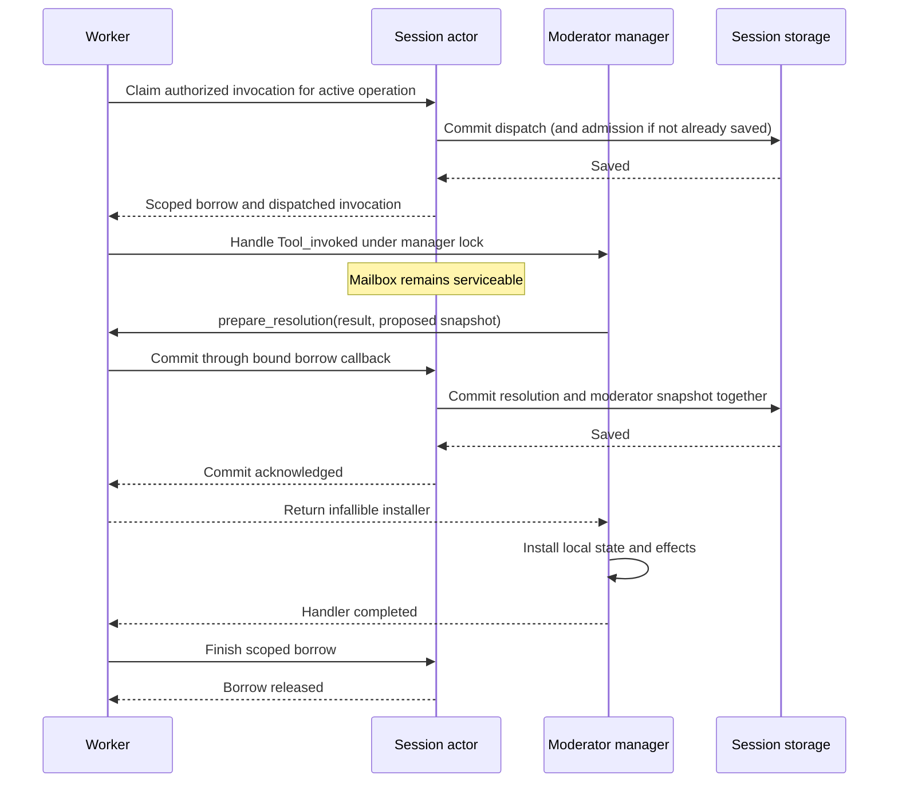

# ChatML extension records and capability discovery

The extension record/transaction foundations and strict declaration parsing are implemented. Model-visible
one-off scripts, moderator tools, subscription adapters and generated-child tools
are still under implementation; none of their feature flags is enabled yet.
This page describes the available storage and client protocol contracts, not a
runnable extension tutorial.

The internal `Agent_runtime.prepare_extensions` path now prepares the full captured
definition against the exact authorized native resources. `Runtime_builder.build_with_extensions`
consumes it with explicit host services, creates real moderator tool descriptors,
and installs owned native/moderator dispatch. The daemon binds these services only
when its internal `Daemon.options.qualify_chatml_extensions` option is true. This
defaults to false and has no CLI or configuration-file switch; public feature
flags remain disabled pending qualification.

The daemon binding checks native invocation ownership, session generation and the
pinned permission-profile digest. Native approval requests belong to the actual
persisted invocation, including during idle lifecycle execution without a model
operation. Shell calls retain their configured shell authorization service. Each
qualified runtime owns a child resource switch, released and joined on runtime
close, failed preparation or caller cancellation.

Native permission grants use the host binding's configuration fingerprint plus
the pinned permission profile and input. This fingerprint includes owner,
implementation, resource configuration, interface and metadata, and excludes the
random live capability ID. Equivalent reconstructed resources can therefore reuse
a persisted exact grant; a changed owner or resource configuration cannot. Live
capability resolution still requires its exact current ID and fingerprint.

For the extension builder, `start_moderator` returns a prepared checkpoint without
running startup tools. The host installs it before idle or first-turn activation.
Concurrent startup callers serialize through the shared execution coordinator;
stopped actors do not activate. Failed or interrupted startup/resume effects are
not automatically repeated across runtime rebuilds for the same source/generation.
An explicit reset or source replacement is required before retrying them.
Startup becomes resume only after a completed lifecycle receipt for that source
and generation. A stopped session may have an initial checkpoint before its
startup handler has ever executed.

Owned event claims read their manager checkpoint after acquiring the actor's
moderator gate, outside the mailbox. This prevents concurrent tool commits from
making a queued event's earlier checkpoint read stale. Fixed-snapshot APIs remain
available for explicit checkpoint assertions.

External timer and model-job delivery now prepares a detached queue append under
the manager lock and the actor checkpoint gate. The actor compares both the old
checkpoint and the captured schedule/job record, then saves the delivery receipt
and new checkpoint in one transaction. Only a successful save installs the live
queue update. Failed saves, duplicate delivery and stale job attempts or timer
payloads cannot leave an extra event in memory. A cancelled waiter releases the
runtime-owner mutex; cancellation cannot split the durable save from installation.

`Runtime_owner.deliver_schedule` and `deliver_model_job_completion` own this
boundary. The lower-level builder queue functions accept an optional preparation
callback for embedded hosts; those hosts must supply equivalent ownership and
persistence checks. Versioned queue ingress currently accepts validated
`Internal_event` envelopes. Legacy model-job events keep their legacy path;
the versioned `Job_completed` adapter remains part of background-work integration.

## Moderator tool dispatch internals

The executable X02 fixture in `test/chatml_extensibility_fixtures/x02-review/`
implements `begin_review` entirely in ChatML moderator state. Concurrent requests
for the same revision return the same stored review reference; another revision
gets a distinct reference. Its daemon acceptance test also verifies explicit
errors for an unhandled tool and double resolution, canonical result publication,
and reference reuse after a daemon restart. Live script edits cannot replace the
restored session's pinned implementation. These review references are example
records, not generated agent sessions or background-work IDs.

`Moderator_manager.Registry.of_definition` binds an already validated extension
definition to a moderator manager. It reuses the compiled program and retains the
exact tool bindings. Ordinary legacy moderator registration remains unchanged.

`Moderator_manager.handle_invocation_entries` executes a dedicated `Tool_invoked`
event under the manager's execution lock. The invocation must be in `Dispatching`
state and match the prepared tool name, implementation fingerprint and selected
capability fingerprint. Input is checked against the tool's input schema before
the script runs. The script receives the versioned invocation context, input,
limits and selected capability references described by the compiler surface.

`Invocation.resolve(id, outcome)` is a local transactional task. Its resolution is
buffered until the handler succeeds. Commit requires exactly one resolution for
the dispatched ID. `Complete` values and `Pending` acknowledgements must satisfy
the output schema; `Fail` uses the host error envelope. A host-supplied validation
callback must confirm that pending work belongs to the current session/generation
and has an admitted completion path. The helper does not accept fabricated work
IDs merely because they have the right syntax.

The manager prepares its conversation overlay and an immutable prospective
identity snapshot before calling the host's `prepare_resolution` callback. The
snapshot includes the new moderator state, the complete queued event list
(existing events followed by newly emitted events), the halt flag, and the new
overlay with its allocated IDs and revision. The host can persist that snapshot
and the resolved invocation in one transaction before returning an infallible
installer. It does not need to call back into the locked manager to obtain state.
Snapshot serialization and local validation finish before this persistence hook.

The underlying runtime exposes this boundary through `prepare_transaction`,
including for resumed UI tasks. It runs after state validation and the legacy
`prepare_commit` callback, before any installer or runtime commit. When both hooks
are used, the legacy hook must only validate and prepare; it must not persist
independently. Runtime proposal values are borrowed; the manager converts them
to detached snapshot data before handing them to the resolution host. The host
must serialize access and make its persistence handoff cancellation-safe.

Missing, duplicate, wrong-ID, invalid-schema and rejected host
transactions leave these buffered effects uncommitted. The invocation path copies
serializable moderator state before execution and restores it on failure,
including array mutations and cancellation during a host callback. This does not
undo external effects or arbitrary mutable globals. Runtime-only state such as
closures and refs is rejected; source code should keep persistent state in the
explicit moderator state value.

The versioned `Runtime.emit` and `Schedule.after_ms` adapters accept JSON payloads
and wrap them as `Internal_event` data. They do not reinterpret a payload as a
native invocation or completion event. Legacy scripts retain their existing event
representation.

These are internal execution primitives, not public tool registration. Complete
shared tool routing, current authority checks, nested-call admission and
worker/reset recovery qualification remain required before a host exposes moderator tools. The
stream/actor integration below is available to qualified internal fixtures. The host
resolution installer must be infallible, must not yield, and must not re-enter
the manager lock. The prospective snapshot API itself does not implement the
actor's durable transaction or the active-worker borrow protocol; the scoped
worker service described below supplies that boundary.
Runtime task limits and bounded result/state conversion are present here; pure
evaluation interruption remains part of the execution-budget work.

### Transactional ordinary events

`Moderator_manager.handle_event_entries_transactional` provides the same
prospective snapshot boundary for ordinary v1 lifecycle and internal events.
It requires an authorization callback, checked under the manager lock before
execution, and an explicit scoped `Tool.call` callback. The host must supply
current event/source ownership and policy; this API never falls back to the
manager's legacy tool callback. The scoped callback is removed on success,
failure, exception and cancellation.

The handler's local effects and serializable state are validated before
`prepare_event` receives the complete proposed snapshot and outcome. The host
must save the event receipt and any scheduling intent with that snapshot, then
return an infallible, non-yielding installer. A failed handoff restores mutable
state and leaves the queue, halt and overlay unchanged. It does not undo or
repeat native effects that already ran. Legacy UI continuations are rejected
on this path.

An internal event must carry the v1 `Internal_event(tagged_json)` envelope.
Arbitrary legacy event values cannot impersonate lifecycle, invocation or
observation events. `Invocation.resolve` is invalid in an ordinary handler;
`Tool_invoked` and `Tool_observed` still use their dedicated methods.

This method delivers its supplied event without consuming the existing queue.
`handle_next_event_entries_transactional` instead selects the oldest queued v1
event under the same lock. Its authorization callback receives a detached envelope
for the host to compare with its durable queue and claim before execution. Its
prospective snapshot removes that head, retains the tail and appends new emits.
The live queue changes only after the host accepts the snapshot. An empty queue
returns no outcome and invokes neither authorization nor persistence.

The runtime executes a defensive copy of v1 moderator state and a detached copy
of the selected event. This prevents handler array mutations from changing a
retained queue entry, including when several emitted payloads share arrays with
the moderator state. Failed execution leaves the original state and queue intact.
The runtime primitive is `handle_next_queued_event`; callers must serialize access
and supply its value-copying and persistence callbacks.

These primitives do not automatically retry failures. The host must persist a
claim before external effects and record failed/interrupted disposition so a
retained event cannot replay effects after a failed checkpoint. The idle queued
event handoff below supplies that claim and acknowledgement boundary. Other event
phases, event-owned interactive permissions, host execution deadlines
and normal v1 runtime construction remain integration work. The legacy pop-first
drain remains separate and does not supply transactional acknowledgement.

### Actor and worker handoff

Ordinary events now have a separate `Moderator_execution` record in session
storage. Its `mex_` ID identifies an event execution, with no provider call or
synthetic tool invocation. Immutable context records session/generation, source,
optional owning foreground operation, event phase/data and the starting
checkpoint digest. Outcomes are `Running`, `Completed` with a resulting checkpoint
digest, `Failed`, or `Interrupted`. Completion can retain runtime requests as
pending intent. A dependent compaction has an exact operation binding that
survives intent application or discard. Terminal outcomes, requested actions and
established compaction bindings cannot be rewritten or replayed.

Session deltas, journal replay and snapshots retain these records. Aggregate
validation checks ownership, unique IDs and at most one running event execution.
Recovery interrupts unfinished event receipts, discards intent waiting on an
interrupted compaction, and discards pending intent belonging to an older session
generation. Other completed outcomes and current-generation pending intent remain.
Lifecycle summaries expose IDs and states without event payloads or error details.

`Session_actor.with_idle_queued_moderator_event` adds an internal execution handoff
for the head of an exact installed checkpoint. It saves a running receipt before
calling the handler outside the actor mailbox. The callback compares its selected
event with the manager's authorization envelope and passes the prospective
checkpoint and runtime requests to its bound commit callback. The actor checks
source identity and preservation of the unconsumed tail, then saves the completed
receipt, checkpoint and pending intent atomically. The borrow spans the manager's
local installation; checkpoint replacement, job/schedule delivery and competing
idle work cannot enter that gap. Reads and cancel-stop remain responsive.

Cancellation or failed execution leaves the old checkpoint intact and records an
interrupted or failed receipt. Such a receipt blocks further queued execution for
that source and generation, even if another handler changes the checkpoint. This
prevents implicit replay of external effects. If saving the terminal record also fails, the
borrow stays held and its commit callback expires; recovery interrupts the saved
running claim. Successful consumption may legitimately emit an identical event.

The internal `Session_actor.with_queued_moderator_retirement` handoff explicitly
retires a failed/interrupted head without executing a handler. It accepts a
quiescent running-idle or stopped session, retains exclusive ownership, and pairs
the retirement record with a checkpoint removing only that head. The original
failure remains unchanged and inspectable. The caller uses the manager's
`retire_queued_event_entries` preparation so the local queue changes only after
persistence accepts the retirement. Failed saves leave the queue and receipt
unchanged; retrying retirement does not retry the handler's external effects.

Retirement requires the exact original checkpoint and captured head, preventing
an old receipt from consuming a later equal-valued event. Changed checkpoints
require explicit reconciliation; this operation does not infer occurrence identity
from payload equality. Retirement can happen only once and cannot schedule work.
Its bounded reason and resulting checkpoint digest are retained separately from
the failure. Safe status projections report `failed.retired` or
`interrupted.retired` without disclosing the reason or event payload. Event record
JSON version 2 adds retirement; version 1 remains readable when it has no retirement.

The compiled-handler/actor expect test covers successful and concurrent claims,
rejected admission and completion saves, a rejected terminal save followed by
snapshot recovery, cancel-stop, an invalid queue tail, expired callbacks and
ownership during the durable/live checkpoint handoff. It uses the in-memory
persistence backend and snapshot codec, without provider calls or added history.
This is not a full daemon restart test or native-tool authorization qualification.

A further compiled-handler/actor expect integration emits two identical payloads,
fails the first after a probe effect, rejects a retirement save, then retires it
while stopped and runs the second occurrence once after restart. It checks stale
checkpoints/callbacks, duplicate retirement, unchanged failure, snapshot migration,
JSON compatibility and safe projection. This restart is the actor lifecycle; the
snapshot restore checks do not constitute a separate daemon-process restart.

`with_idle_queued_moderator_event_tools` adds a native executor scoped to the
running event. Direct child invocations retain `parent_event`, with no fabricated
invocation or provider-call parent. The actor admits only that active event's
same-source children, requires saved child outcomes before committing the event,
and cancels unsaved child results on callback exit. The scope rejects calls after
commit, return or stop and cannot be reused through a foreground invocation path.
The executor must be composed with `Native_tool_invocation.run_scoped`, which
checks capabilities, authorization, input and output disclosure. The executor
itself grants no tool policy or foreground-history authority.

Invocation JSON version 9 carries event lineage and optional observation follow-up
and compaction bindings. Older versions retain their existing decoding rules.
Cross-record validation requires the retained event's session, generation and
source to match the invocation; new admission requires its parent to be Running.
Native outcomes remain observable independently of event failure or interruption.
The compiled-handler/actor/native expect test covers success, policy denial,
rejected outcome persistence and cancel-stop, including wrong/expired ownership,
checkpoint rejection while native work is active, snapshots, codec round trips,
and subsequent source-bound observation without additional provider history.

`Script_tool_calls.with_event` binds that executor to the complete compiled
definition's captured capabilities and exact source. Its child factory records an
event parent directly. Invocation and observation scopes share the same native
admission, value bounds, disclosure, active-moderator rejection and 100-attempt
limit. Every event gets a fresh scope; callbacks expire when the handler returns.
Event receipts do not carry deadlines, so their cancellation/deadline enforcement
remains a host responsibility.

`Moderator_event.run_queued_idle` composes the bridge with one queued event's actor
claim and manager transaction. It obtains the definition from the manager,
compares the selected queue head with the actor's selection under the manager
lock, and saves runtime requests with the event checkpoint. There is no fallback
to an unscoped Tool.call callback. Empty queues and unavailable actors return no
work; errors stop the operation without replay or automatic failed-head retirement.
Returned runtime requests are already durable and must not be scheduled a second
time independently of their saved intent. Without configured script-tool services,
Tool.call returns `invocation.unavailable`; deterministic handler work still uses
the same durable claim and checkpoint transaction.

An offline compiled-manager/actor/native integration runs two handlers making 51
calls each, then observes all 102 outcomes, demonstrating that the call budget is
per handler. Additional cases preserve successful results after wakeup failure,
reject a binding replaced during authorization, propagate cancel-stop, and reject
a mismatched queue head before any native effect. Tests verify actual saved
outcomes, event lineage, retained scheduling intent, checkpoint agreement, no
additional provider history, and no invocation of the fallback tool callback.

`Runtime_owner` uses this helper for internally installed v1 managers, executing
at most 32 queued events per poll. It applies retained requests through the shared
event/observation scheduler after each batch, stops the batch on termination, and
requests another probe after event execution so saved native outcomes can be
observed even if their wakeup callback failed. Legacy managers retain their
existing event drain.

Polling and actor admission share the same unsettled-event guard. A running or
unretired failed/interrupted receipt blocks queued execution for its source and
generation, including after an observation changes the checkpoint. This avoids
repeated failed claims without hiding saved native outcomes or retained scheduling
requests. Failure does not automatically retire the queue head or retry effects.

The compiled-manager/actor/runtime-owner integration test runs 35 tool-using
events over bounded polls, observes all saved native outcomes despite failed
wakeups, and checks missing tool services, failure after an effect, rejected event
checkpoint saves, termination, cancel-stop and external poll cancellation. Both
cancellation paths preserve durable interruption and leave the owner mutex usable.
Subsequent observations may update moderator state while the failed event queue
stays blocked; additional polls cause no effects or checkpoint changes. Native
calls use event lineage and do not add provider-history items. These are offline
in-process integrations, not public runtime or process-crash qualification.

Invocation-owned requests use the shared actor permission mechanism during idle
native calls. Approval, denial, timeout, cancel-stop and cancellation while waiting
are covered by the compiled-handler/runtime-owner tests. The native invocation's
scoped identity also feeds shell approval/reviewer ownership selection; ordinary
legacy requests retain operation ownership. General runtime policy-service
construction and complete shell/child qualification remain separate work.

Startup/foreground event ownership, changed-checkpoint reconciliation,
and normal v1 runtime binding remain integration work.
This path is exercised through internally installed compiled managers, not public
tools or normal v1 ChatMD construction.

`Operation_worker.Capabilities.with_moderator_invocation` is a trusted, scoped
host service. The caller must complete capability and policy admission before
using it. The actor checks the active operation, session generation and invocation
identity, then records dispatch and grants an exclusive process-local borrow.
A model call may already have an exact, saved `Admitted` intent; otherwise the
claim records admission and dispatch together. The worker executes the handler outside the actor, so actor
reads, permissions and cancellation requests can continue through its mailbox.

The callback receives the dispatched invocation and a bound `commit` function.
Pass that function the manager's proposed snapshot and resolved invocation from
`prepare_resolution`. The actor saves both in one session transition. Only after
that succeeds does the manager install its state locally. The borrow remains
held through local installation and is released when the scoped callback ends.



Admission, commit acknowledgement and cleanup mailbox calls are protected from
caller cancellation so an accepted request is not abandoned while the actor is
saving it. Handler execution remains cancellable. This relies on the documented
non-yielding installation contract after successful preparation. A cancelled
operation cannot commit a new handler result. Graceful stopping permits an
already admitted handler to finish; new admissions require a running session.

Failed admission executes no handler and installs no borrow. Handler failure,
cancellation or returning without a commit records a terminal invocation without
installing new moderator state. Cancellation after a successful commit preserves
the recorded outcome and snapshot. Persistence failure is returned to the caller;
if cleanup cannot be saved, the borrow stays held for worker-terminal cleanup.
An unreleased borrow is also reconciled during the worker's terminal transition.
This is process-local cleanup, not restart reconciliation.

Saved commit callbacks become invalid after their scope or operation ends.
Duplicate commits, conflicting moderator checkpoints and runtime replacement
during a borrow are rejected. Independent calls queue outside the actor; a
recursive call or cross-owner acquisition cycle returns an explicit error before
admission. The service publishes no provider tool output, grants
no additional tool authority, and does not enable any extension feature flag.

### Ordinary native invocation ownership

The internal `Operation_worker.Capabilities.with_invocation` service records
foreground native or standalone invocation admission and outcome independently
of moderator state. Its callback runs outside the actor and receives a dispatched
record. Concurrent calls can run independently, and a moderator callback can
invoke a native tool without acquiring its own moderator lock again. A nested
invocation must reference a live parent callback in the same operation. Closed,
foreign or duplicate ownership is rejected before the callback runs; background
job ownership requires a separate service.

The actor reserves each execution record for that callback. Generic extension
transactions cannot replace it. Callback errors/exceptions become bounded
terminal failures, malformed outcomes become `invocation.invalid_output`, and
cancellation records a cancelled outcome. Outcome persistence failure leaves the
execution registered for terminal cleanup, without replaying the callback. Worker
exit cancels abandoned execution records before foreground result reconciliation.
Nested results that have been saved remain durable if the enclosing moderator
later fails and rolls back its own state.

`Native_tool_invocation.run` uses this lifecycle for both model and synchronous
script callers. It resolves an exact capability ID/fingerprint in the live selected
registry, checks invocation identity and input schema, invokes the host authorizer,
and resolves the capability again after any authorization wait. Revocation,
replacement, or selection changes prevent runner execution. It uses the originally
registered implementation, retaining its shell/file policy wrappers. Function
arguments use JSON encoding; custom arguments are raw strings.

The host must supply current invocation/pre-tool authorization and output
disclosure callbacks. Authorization that requires a busy moderator must fail
before effects, rather than defer its decision. Results pass disclosure and
protocol bounds before persistence. Raw runner output/progress and callback
diagnostics are not published by this service. Only the final disclosed value or
bounded failure is retained. Script callers receive the recorded outcome directly;
they do not create provider call IDs or history items. Model callers use the
separate canonical publication service below. Post-tool observation remains the
caller's responsibility and must run once after the recorded outcome.

These are internal services. The stream adapter described below connects native
execution and publication; a scoped bridge also connects native `Tool.call`
inside a moderator invocation. Normal runtime construction, full authorization/
observation integration and standalone dispatch remain required. No new public tool is
enabled by this foundation. Offline tests cover model/script policy and disclosure
failures, capability changes during authorization, custom input, concurrent calls,
borrowed-parent execution and rollback, stale parent rejection, cancellation and
outcome persistence rejection.

### Native calls from a moderator handler

`Script_tool_calls` binds `Tool.call` to an actual dispatched parent and that
prepared handler's captured native capabilities. `Moderator_tool_dispatch.create`
accepts the bridge through `script_tools`. The manager installs its callback only
while executing `Tool_invoked` under the manager lock and restores the existing
callback on success, failure or cancellation. Other event phases retain their
existing callbacks.

Each accepted native child uses the same persisted invocation service as a model
call. Its origin is `Moderator`, its parent is the active invocation, and it has
no provider call ID, canonical call or output receipt. The disclosed JSON value
returns to ChatML as `Ok(value)`; failures return bounded error codes. A failed
parent rolls back its own uncommitted moderator state but does not erase a saved
child outcome or undo that child's external effects.

The captured capabilities form a ceiling. The live registry must still contain
the same selected references after any approval wait; revocation or replacement
prevents execution. Input and returned JSON also respect the implementing
script's value bounds. A scope permits at most 100 call attempts, matching the
context ABI. A callback retained beyond its scope fails, and the actor rejects
new children of a parent whose callback has ended or committed.

Calling the active moderator's own tool returns `moderator_reentrancy`. The host
must explicitly declare when a native call requires a decision from that active
moderator; such a call records a failure before effects. The authorization callback
must not try to re-enter the active moderator or execute first and request approval
later. Halt checks use actor/lifecycle state instead of acquiring the held manager.

Each admitted child now carries a durable non-authorizing observation intent,
bound to the implementing moderator's script ID and validated source SHA256.
This identity does not depend on process-local capability registrations. The
intent survives cancellation and result persistence, including interruption
before the required `defer_observation` wake-up callback. That callback receives
the saved child before its result returns to ChatML. An error or exception
produces `invocation.observation_failed` without changing or retrying the child
outcome or removing its observation intent.

The observation has a separate lifecycle: `Awaiting`, `Observing`, then `Observed`
or `Observation_failed`. Only a recorded initial outcome can be claimed. The host
must exclusively claim and save `Observing` before executing a handler, then
atomically acknowledge it with the prospective moderator checkpoint. Pure
transitions reject repeated claims, changed owners, late intent attachment and
rewritten outcomes. Quiescent recovery preserves waiting intent and marks an
interrupted `Observing` receipt failed, without replaying scripts or native tools.
An observation failure does not mean the native tool failed.

The foreground worker capability `with_moderator_observation` now claims a retained
observation under the actor's exclusive moderator gate. It checks generation,
operation and parent completion, saves `Observing`, then runs the callback outside
the mailbox. `Moderator_manager.handle_observation_entries` checks the exact
observer source and projects a dedicated `Tool_observed` event. Its version 2
payload includes `invocation_id`, optional `parent_invocation`, optional
`parent_event`, `tool_name`, `origin`, and
the disclosed initial `outcome` in the Invocation JSON format. No provider call ID
or synthetic tool-result history is created. The event is specific to the v1
surface; ordinary `Runtime.emit` still wraps data in `Internal_event`.

Exactly one parent option is populated. Scripts must match the tagged `Some`/`None`
values; this replaces the earlier internal observation payload's bare invocation
parent string. The invocation context separately gains an additive `parent_event`
option while retaining context version 1. These surfaces remain internal pending
public v1 runtime qualification.

The manager validates a prospective state/overlay/internal-event snapshot before
calling the actor's commit callback. That callback atomically saves `Observed`
with the source-matching snapshot. Failed handling or acknowledgement rolls back
moderator data state and records a separate observation failure. A failure after
successful acknowledgement preserves that acknowledgement. The host must still
apply resulting runtime requests through its normal integration path.

`with_next_moderator_observation` selects and claims atomically under the same
gate. It chooses eligible records for the exact source in creation-time order,
breaking ties by invocation ID. Active parents, unresolved invocations and other
sources/generations are excluded. Both claim paths inspect committed moderator
termination as well as session halt state, without entering the live manager.
Thus a second drainer cannot consume work after another handler commits termination.

Both explicit and next-observation claims also compare the requested source
against the committed moderator snapshot before recording `Observing`. A missing
or replaced source is rejected without consuming the receipt. A stale live
manager therefore cannot reinstate its previous source by acknowledging old
observations. The owner integration test replaces the durable source while
retaining the old manager and queues a wakeup; draining must reject without
changing any state or executing native work. Restoring the matching source then
allows the original observations to proceed.

`Moderator_observation.drain` repeats this handoff with a default budget of 32
observations (configurable from 1 to 256). It returns committed outcomes and a
budget-exhaustion indicator, stops on failure or termination, and never retries
native work. Exhaustion requests a future probe; it does not prove more records
remain. Concurrent drainers cannot select the same record. The internal stream
adapter can enable `observe_nested` to drain after the parent moderator handoff
releases ownership and before returning the parent's canonical result. Observer
runtime requests join the parent's requests. This also finds intent retained
after wake-up callback failure or parent rollback.

`Session_actor.with_idle_moderator_observation` provides the same exclusive
selection and prospective acknowledgement without creating a foreground operation.
It requires an idle, running, unblocked session. Runtime replacement and competing
checkpoint APIs are rejected while the callback owns the moderator. New user input
is deferred using the existing idle borrow. The legacy idle completion/failure
APIs cannot release an observation callback's ownership. Cancel-stop interrupts
its Eio cancellation context after the stop is persisted, including cancellation
following a graceful stop. Restart is rejected until ownership is released.

`Moderator_observation.drain_idle` takes this scoped claim callback explicitly,
keeping runtime construction independent of the actor module. It retains runtime
requests with each acknowledgement for later durable application. It does not
apply requests or create a model operation. The idle expect-test matrix covers
successful/competing/reentrant handling, retained turn/termination requests,
handler and persistence failures, cancellation, and both stop modes. It checks
that live and persisted snapshots agree and native results/history remain intact.

`Session_actor.apply_moderator_follow_up` applies retained event and observation
requests together at an idle safe point. `apply_observation_follow_up` remains a
compatibility name for the same operation. The shared planner coalesces turns
and compactions into one action, prioritizes termination,
and discards requests from obsolete source identities or generations. It saves
receipt changes in the same transaction as operation admission or stopping;
a failed save starts no work. Turn admission requires an installed worker.
Compaction acceptance retains a requested turn until the next idle safe point;
it does not request compaction again after a reload. This acceptance records
scheduling, not successful execution. Explicit stop discards outstanding work,
so restarting does not rearm it.

The daemon's existing idle polling now detects retained requests even when no
internal event is queued, loads the runtime, and applies requests before draining
legacy events. A daemon integration test independently proves that observation
intent and event intent can each trigger termination without a queued event. The
event-only case has no invocation receipts. The fixture uses the real actor claim
and checkpoint boundary with a v1-shaped record, while the loaded public runtime
still uses its legacy compiler; no handler or model runs to apply these requests.
Actor tests mix event and observation requests, reject an obsolete event's stop
request, inject save failures, and verify one compaction followed by one coalesced
turn, reload between operations, stop/restart, and termination overriding work.
Each newly accepted compaction receipt also retains its operation ID. A cancelled
or failed compaction discards only the turns tied to that operation, atomically
with its terminal state. Recovery from a durable active compaction applies the
same rule before restoring execution. Independent requests and receipts for
other compactions survive; native tool outcomes remain unchanged. A successful
compaction still leaves its requested turn pending for the next idle safe point,
including after snapshot reload and recovery. Event recovery discards only the
turn tied to an interrupted active compaction; it does not mistake a completed
compaction's retained follow-up for interrupted work.
Legacy intermediate receipts without an operation binding are retired rather
than implicitly resumed.

The actor integration matrix includes cancellation before compaction execution,
failure to save a completed compaction, and recovery from a serialized active
admission snapshot. It verifies the actual operation binding and unchanged native
outcomes, plus preservation of unrelated requests. These are internal actor and
recovery-plan tests; full process-crash qualification remains a later integration
task.

Idle polling also detects current-generation terminal invocations awaiting an
observation for the committed source, even without queued internal events. With
a compiled v1 manager installed, `Runtime_owner` drains up to 32 observations
under individual actor borrows, applies their durable follow-up requests, and
then drains emitted internal events when the session remains idle. A later poll
finds any remaining eligible observations. Handler failure retains its separate
failure receipt; already acknowledged observations and native effects are not
replayed. Legacy managers have no v1 observer identity.

The runtime-owner integration expect test uses a real compiled handler and actor
with 35 eligible observations and one for another source revision. It verifies
32 then 3 acknowledgements across polls, delivery of emitted internal events,
durable termination, no further work after stopping, unchanged native call count,
no model operation or extra history, and agreement with the persistence backend.
This fixture installs the manager internally; it does not qualify public v1
runtime construction or a full daemon restart.

For internally installed hosts, `with_idle_moderator_observation_tools` adds a
native invocation executor tied to the exact observation borrow. It admits only
same-generation Moderator children of that observation with matching source
intent. It grants neither provider-history access nor tool authorization.
`Native_tool_invocation.run_scoped` uses this executor with the existing current
binding, policy, input and output checks. Cancel-stop cancels active native work;
calls after commit, stop or callback return are rejected. Acknowledgement cannot
commit while child outcomes remain unsaved. Borrow cleanup records interruption
for unfinished children without repeating effects or publishing provider outputs.

`Script_tool_calls.with_observation` binds this executor to the complete compiled
definition's retained native capabilities and moderator limits. Lifecycle-only
moderators do not need a dummy tool declaration. The bridge enforces the same
call budget, closed scope, source identity and active-moderator policy restrictions
as invocation handlers. An offline compiled-handler integration matrix covers
successful disclosure, denial, capability replacement after an authorization
wait, required active-moderator decisions, handler failure after effects, rejected
result persistence, cancel-stop during native execution and a forged parent.
It also verifies calls after acknowledgement/return cannot execute.

Runtime-owner draining now installs this bridge when the runtime supplies its
script-tool services. It obtains the definition from the installed manager and
creates a fresh actor/native scope for every observation, closing it before the
next claim. An event cannot reuse another event's invocation scope or call budget.
Without configured services, Tool.call returns `invocation.unavailable`; it does
not fall back to a manager callback that could bypass persisted admission.

The runtime-owner expect test exercises both configurations with a compiled
lifecycle-only moderator. With services enabled, 35 source observations make four
native calls each. The first bounded poll performs 128 native calls, proving the
100-call budget belongs to each handler rather than the whole batch. Later polls
acknowledge all 175 source/child observations and terminate; the 140 native calls
are not repeated. An unrelated source remains untouched. With services absent,
the same calls execute no native work. A failing fallback callback in both cases
proves observations do not use unscoped Tool.call. Neither path starts a model turn
or manufactures provider history during the drain.

**Normal v1 runtime construction is still required.** The stream
option remains off by default pending that integration. Tests exercise the
explicit foreground handoff with real compiled handlers, competing claims,
cancellation, rejected saves, wrong source/snapshot, mutable-state rollback,
duplicate acknowledgement and forbidden `Invocation.resolve`. They also cover
persisted intent and pure recovery plans. An expect-test matrix shows budget,
concurrent, failed and terminated drain dispositions while preserving unrelated
intent. The compiled native-call matrix runs with stream draining both disabled
and enabled. These do not yet qualify observation
delivery across real daemon restarts or administrative reset/compaction.

Compiled-handler tests cover native function/custom calls, policy denial,
revocation/replacement during approval, moderator reentrancy, unknown/unselected
tools, schema/value limits, disclosure, observer failure and parent rollback.
They also check callback restoration, absence of child provider history, and
agreement between live and persisted state. Scope tests cover call limits and
escaped/closed-parent callbacks. General standalone/script routing, normal-runtime
Tool.call installation and complete admission-attempt auditing remain open.

### Owned foreground event routing

`Moderator_event.foreground_handlers` connects an installed compiled moderator to
`Turn_worker.create ~moderator_events`. The worker binds the handlers to its actual
operation before delivering the submitted-item event. The host must install the
initial checkpoint first; a worker with a stale source fails without replacing it.
Ordinary events and queued
events use separate durable execution receipts; each handler gets an expiring
native-tool scope. Ordinary completion preserves the existing queue, while queued
completion consumes its selected head. Deferred native observations share the
bounded safe-point drain, with at most 256 total callbacks per drain.

The streaming loop preserves canonical entry IDs at pre-tool and post-tool
boundaries. Before a call is admitted, its pending arguments are available in the
pre-tool event; no provisional canonical history entry is invented. Post-tool
handling sees the committed result entry. Raw-item APIs reject owned handlers
instead of silently dropping their identity requirements. Transient model forks
have no moderator and cannot acknowledge requests owned by the root session.

Execution completion retains scheduling intent; it does not count as scheduling.
Turn-only requests pass through the stream's existing policy and consecutive-turn
budget. Immediately before provider dispatch, the actor saves their acceptance.
A rejected save prevents that provider call. Budget rejection, disabled follow-up
policy and worker failure retire unadmitted turn requests in the same transaction
as the worker's terminal state, so the idle scheduler cannot bypass the decision.

Requests for compaction, including a dependent turn, stay pending for the shared
idle scheduler. They are not also forwarded to the stream's legacy compaction
consumer. Successful foreground completion preserves them; failed or cancelled
managed workers discard unscheduled continuation work. End-session intent settles
with the actual terminal halt. A halted checkpoint stops model execution even
when no further moderator callback can run.

The offline compiled-manager/actor/stream fixture exercises ordinary and queued
turn requests, observation-requested turns, native model calls, compaction/turn
intent, early and final halt, budget exhaustion, disabled follow-ups and rejected
admission persistence and a stale installed source. The ordinary-event fixture additionally covers rollback
after a native effect, rejected checkpoint and terminal saves, cancellation and
idle resume. These are internal installation tests: normal ChatMD construction,
startup/resume wiring and complete public qualification remain required.

### Composed native and moderator stream dispatch

`Native_tool_dispatch.create` adapts the native invocation service to the existing
stream pipeline. It captures the selected names and exact capability references
for that turn. Those names remain claimed even after live revocation or registry
replacement, so a stale capability produces a recorded failure rather than
falling through to a legacy runner. Unknown names remain available to other host
services. Transient fork requests cannot borrow the root persisted owner.

`Tool_dispatch.chain` combines services with disjoint registered names. All
original-input validators run before pre-tool moderation; unknown targets must
pass. The first service claiming the final name owns execution and publication,
and errors never select another runner. Host preparation must reject overlapping
registrations before composition.

Native original input and call kind are checked before pre-tool hooks. Final
arguments and exact live bindings are checked after redirects/rewrites and any
authorization wait. Pre rejection, pre failure and session termination record
their explicit initial failures without executing native authorization or tools.
Native dispatch also checks current host termination before and after admission.

Both adapters use `Stream_invocation` to parse bounded input and record immutable
original/final execution fingerprints separately from the canonical display
payload. Redacting history does not replace the native runner's input. Recorded
outcomes use atomic publication receipts; the existing stream runs post-tool
observation once after publication. Post-hook failure preserves the published
outcome and produces the existing separate operation failure. Failed publication
preserves the saved result for foreground/restart recovery and does not run a
post hook or retry the implementation.

Offline tests exercise a compiled moderator, real actor/worker and provider-stream
fixture through this composition. They cover mixed native/moderator calls,
function/custom input, original kind/schema/JSON rejection, redirects and invalid
rewrites, generic permission denial, pre rejection/failure/termination, post
failure, revocation before dispatch and during authorization, halt during
authorization, disclosure failure, redacted history and permanent publication
rejection. A trap legacy runner ensures claimed native names never fall through.

This adapter is installed by the internal extension builder and qualified daemon
option described above. The scoped native bridge is available to moderator
dispatch. General standalone routing, the remaining host-wide admission audit and
public qualification are still required. No new feature flag is enabled.

### Atomic model-call intent

Before emitting an `Item_appended` observer event, the stream asks the service's
`commit_call` callback to retain the canonical call. Native and moderator adapters
use `Operation_worker.Capabilities.commit_invocation_call` to save the call and
its `Admitted` invocation in one actor transaction. A rejected save leaves neither
record. If an observer or dispatch fails after the save, foreground/restart
reconciliation cancels the unfinished invocation and publishes its matching
result. It does not retry a tool, moderator handler or observer.

This intent is durable evidence, not execution authority. Dispatch still checks
the owning operation, current generation, selected implementation and applicable
policy before effects. Queued calls cancelled before dispatch retain an
`Admitted` record until boundary recovery. Script-origin calls continue to use
their ordinary invocation claim; they do not create provider history.

The adapter caches the invocation and a digest of immutable request fields,
including the canonical call, original/final payloads and owner attribution. It
does not retain additional copies of the complete history. Cached requests must
still pass the actor's ownership and canonical-retention checks. A later session
halt can stop execution without rewriting the initial routing provenance.
Identical call-intent retries are no-ops, including after result publication;
conflicting content, duplicate call ownership and attempts to resurrect a removed
call with an existing receipt fail. Typed record equality preserves exact JSON
structure, including object field order, when checking retry identity.

Offline actor tests cover rejected saves, concurrent retries and immutable
published outcomes. The composed stream matrix injects initial-save, dispatch-save
and tool-call observer failures separately for native and moderator targets. It
checks canonical call/result pairing, cancellation recovery, callback counts and
agreement between live and persisted state.

### Canonical initial result publication

`Operation_worker.Capabilities.publish_invocation_output` saves a resolved model
invocation's initial tool output and publication receipt in one actor transition.
It checks the running operation and current generation before saving. Graceful
stopping allows publication of an admitted result; cancelled or stale workers
cannot publish. The service executes neither the handler nor post-tool hooks.

New model invocation records bind an application-owned `call_entry_id` at
admission. The referenced canonical entry must contain the matching tool name,
provider call ID and function/custom call kind. A later call reusing that provider
ID cannot receive this invocation's result. Multiple invocations cannot claim the
same canonical occurrence. Script origins cannot carry provider history bindings.

The supplied output contains the exact JSON serialization of the recorded
`Complete`, `Pending`, `Fail` or host cancellation envelope as provider-compatible
text. Schema validation and disclosure policy must finish before that outcome is
recorded; this storage API does not implement those policies. Function calls receive
function outputs and custom calls receive custom outputs. A newly published
receipt must reference the actual output after its bound call, without crossing
another matching call or output.

The output occurrence ID is retained on the invocation. Retrying the same
occurrence is a no-op, including after history compaction removes its text.
Another occurrence or a changed retained payload is rejected. Failed persistence
installs neither the output nor its receipt and emits no committed history event.
Snapshot and journal restoration validate retained result payloads against their
receipts. They preserve receipts independently of transcript retention.

Invocation records with routing provenance use JSON codec version 3. Without
routing, bound records retain codec 2 and unbound records retain codec 1. Records
with a discarded-publication disposition use codec 4; nested moderator records
with observation intent use codec 5. Acknowledged observations retaining runtime
follow-up requests use codec 6. Intermediate compaction acceptance and discarded
follow-up requests use codec 7. Receipts with a retained compaction operation ID
use codec 8. All eight
remain readable; missing optional S-expression fields load as absent. Older JSON
readers reject new codecs rather than silently discard their evidence. These
host-only additions do not change the ChatML context ABI or enable public feature
flags. The internal
stream adapter below calls this service; normal runtime construction remains
unfinished. Daemon restart reconciliation is described below; immediate
worker-cancellation reconciliation remains separate work.

An observation host can opt into `retain_follow_up` to store coalesced turn,
compaction and termination requests with the acknowledgement and prospective
moderator snapshot. The requests remain `Pending_follow_up` across recovery until
the host atomically saves `Applied_follow_up` with the scheduling or stop
transition. A `Compaction_accepted_follow_up` receipt retains a pending turn after
compaction admission; `Discarded_follow_up` retains the original request and the
reason it will not run. Applied means durably accepted, not that a requested operation has
finished. Requests cannot be replaced, silently dropped or rearmed, and applying them does
not rerun the observer or alter the native result. Existing foreground dispatch
uses returned requests and leaves this option disabled. The durable receipt is
used by the idle scheduler described above; normal v1 runtime construction
remains unfinished.

### Invocation recovery at daemon restart

`Invocation_recovery.plan` is a pure plan over durable state. Startup and lazy
session recovery apply it in the same transaction as the operation-interruption
boundary, before restoring a runtime. It never calls a model, handler, execution
policy or post-tool observer. Recorded outcomes have already passed the dispatch
boundary's output checks and are preserved exactly.

Unfinished invocations become resolved cancellations with a restart reason.
For model calls with a retained canonical occurrence, recovery reuses an existing
matching output or appends the recorded outcome as the appropriate function/custom
output. It commits the publication receipt and history event atomically. Mismatched
outputs and intervening reuse of the provider call ID fail recovery; it never
guesses a different call or reruns the implementation to reconstruct a result.

If the canonical call was removed, the original outcome stays resolved and gains
an immutable `publication_discarded` reason. Legacy model records without an
occurrence binding receive an explicit unbound-call disposition instead of a
fabricated output. Discarded records cannot publish later or coexist with their
retained bound call. Published receipts remain untouched even if transcript
compaction has removed their entries. Non-model invocations never gain provider
outputs; unfinished ones are interrupted, and recorded results remain retained.

The internal `Invocation_reconciled` journal delta can finish an existing record
from an older generation, but cannot admit/dispatch work or manufacture a successful
outcome. Ordinary `Invocation_changed` still requires the current generation.
Recovery assigns new IDs beyond the durable allocation high-water mark and
reserves separate space for the restored runtime. It also rejects an ID that
collides with retained history or invocation receipts, even if stored allocation
counters are inconsistent. A failed commit installs none
of the plan; rerunning it from the same state produces the same IDs. A successful
recovery is idempotent on subsequent restarts.

Offline tests cover function/custom outcomes, interrupted and already-cancelled
calls, existing receipts, missing calls, old generations, conflicting outputs,
provider-ID reuse, snapshot/delta roundtrips and allocation bounds. A real daemon
fixture persists resolved/dispatched calls, shuts down, lazily restores the stopped
session and verifies both pairs, then restarts again without duplicate outputs.
This restart path is separate from the administrative and foreground-boundary
reconciliation below.

Reset and rebuild now reconcile prior invocation records against the final
candidate history inside the administrative commit. Kept calls receive their
missing canonical outputs. Removed calls receive discarded-publication
dispositions; unfinished invocations also receive an interruption reason. These
dispositions live on the reset/rebuild archive reference, keyed by invocation ID.
Original inputs and recorded outcomes remain in the checksummed pre-change
archive instead of being copied into the new generation's active tool registry.
Published receipts already present in that archive are preserved unchanged.

The repaired history, allocation high-water mark and disposition index commit
with the reset. Failed persistence leaves the previous actor state and event
position unchanged. Reading the archive validates disposition IDs, duplicate
entries and permitted outcome/publication transitions against its original
invocations. Older archive references have an empty index.

### Invocation recovery at foreground boundaries

After a worker completes, fails or is cancelled, the actor reconciles model
invocations that have no parent job. It publishes the recorded outcome if one
exists, or a cancellation outcome for unfinished invocations. Independent script
and background-job invocations are left unchanged. Recovery executes no handler,
tool, provider or post hook. A result saved before cancellation remains that exact
result; the stale worker still cannot publish it itself.

The worker's terminal transition and permission cleanup persist first. Recovery
then commits missing history outputs, receipts and the allocation reservation
together. If publication fails again, the actor records a failed session with no
active operation. This preserves the original operation failure/cancellation
event and blocks further user turns. If storage also rejects that failure state,
the command returns an error; guards before subsequent turn and compaction work
still require successful reconciliation. A crash between commits is covered by
daemon restart recovery.

The same reconciliation guard runs before appending a new user turn, adopting
deferred messages, launching a worker or starting compaction. Thus a missing
result must be repaired before those paths consume history. Repeated recovery
does not add duplicate outputs or receipts. Offline tests cover function/custom
handler cancellation, saved results during cancellation, transient and persistent
publication rejection, and isolation from independently running invocations.

### Retained routing provenance

The streamed moderator adapter attaches routing evidence when admitting an
invocation: function/custom kind, original tool name, SHA-256 fingerprints and
byte lengths of the original and final raw arguments, and a separate fingerprint
of the canonical call's displayed arguments. The final target is retained in
`context.tool_name`; implementation and capability fingerprints remain in that
context. Keeping the canonical fingerprint separate permits normal payload
redaction without pretending the displayed text was the actual execution input.
This audit record adds no second copy of the plaintext arguments.

Preparation records whether original-input validation/pre-tool moderation passed,
original input was rejected, or the pre-tool handler rejected or failed the request. Passing
preparation does not prove final authorization or handler execution. A preparation
rejection cannot change the original target/arguments or resolve successfully.
Host cancellation and failure outcomes remain possible.

Routing is fixed at admission. Later invocation transitions cannot change or remove
it. Admission and retained-state checks bind its canonical kind, payload digest
and byte length to the actual history occurrence. Altered retained calls fail
restoration; compaction may remove transcript entries while preserving routing and
publication receipts. Original/final raw fingerprints are host-recorded evidence,
not independently signed attestations or a replacement for live policy checks.

### Routed moderator calls in the turn worker

`In_memory_stream.Tool_dispatch` carries the original and final tool names and
arguments, the actual committed call occurrence, canonical history and fork source.
A host can return a validated output with a dedicated commit callback, or select
the existing native runner. A request with a `rejection` reaches this dispatcher only
to record its failure; it must not execute an implementation or invoke the final
execution authorizer. Returning no routed result preserves the native synthetic
rejection without running its tool. Routed
commit callbacks replace the generic history append; they run before output
callbacks and post-tool moderation. Native outputs now follow the same ordering.

`Moderator_tool_dispatch` connects this boundary to a prepared extension
definition, its live moderator manager and the worker's actor capabilities. It
parses function arguments with bounded JSON parsing; custom-tool input is a JSON
string. Its pure `validate_original` hook checks known prepared tools before
pre-tool moderation. It uses the implementing script's validated limits, retained
in the prepared binding, to check the ChatML input projection's array length,
depth and value bytes as well as the schema. Invalid JSON, a schema mismatch or
an oversized projection skips that handler and
records `invocation.invalid_input` against the original canonical call. A typed
rejection distinguishes this case from a subsequent pre-tool policy denial;
validator diagnostic text is not published. Unknown targets pass through to other
services, so this adapter does not yet validate all native tool schemas.

The final target's schema and input projection limits are rechecked after any
rewrite or redirect and again inside the owning moderator
lock. A host admission callback then rechecks the live capability and revision,
followed by the turn worker's final-target permission check, before any handler
effects. This avoids authorizing a call before waiting for its owner and executing
it later under stale authority.

The manager validates the returned outcome and prospective state before a host
`prepare_outcome` check enforces disclosure and output limits. Rejected output or
handler/admission failure restores the moderator state and records a bounded
failure with the previous snapshot. Host classifications distinguish invalid
input, pre-tool rejection, permission denial, unhandled calls, duplicate resolution,
wrong invocation IDs, invalid output/state, disclosure rejection, handler failure and failed result
commits. Classification comes from the failing host stage, not parsing a script's
diagnostic text. Raw exception diagnostics are not placed in model-visible output.
Host persistence failures propagate without rerunning the handler. The qualified
runtime composes the standalone adapter before moderator/native dispatch, so a
standalone declaration never falls through to a same-named native runner.
Transient fork calls cannot use the root actor's invocation ownership.

With the internal dispatch service installed, pre-tool script errors, host
exceptions and invalid moderation outcomes produce `invocation.pre_tool_failed`.
The original call, terminal result and failure preparation are retained without
running the requested implementation or execution authorizer. Raw diagnostics are
not exposed, and cancellation still propagates to worker cleanup. Legacy streams
without the service retain their existing error propagation.

All ordinary extensibility-v1 moderator events now validate and defensively copy
serializable state, apply their declared task/fuel limits, and validate buffered
effects before committing. This includes both item and history-entry manager APIs.
A failed pre/post handler restores mutated arrays and discards buffered overlays
and internal events. External effects and mutable globals are not rolled back or
automatically retried. Task limits do not yet interrupt unproductive pure
evaluation; that remains part of the standalone execution work.

Moderator invocation execution rejects legacy UI suspension before a continuation
is installed. A rejected suspension restores copied state, discards buffered
effects and leaves no pending request that could block or resume a failed call.
Normal extensibility scripts do not expose UI approval operations; the guard also
protects hosts that compose runtime surfaces. Legacy UI handlers retain their
existing suspend/resume behavior.

Pre-tool and implementation runtime requests travel with the result. They are
reported after publication and participate in the turn decision. An end-session request prevents
further moderator hooks and provider turns after pending outputs are handled.
When a pre-tool handler rejects a call and ends the session, its call and terminal
result are still committed. The call's history observer is skipped because the
moderator has halted, and the initial rejection is published before the worker
applies the end-session request. The rejection uses the bounded host code
`invocation.pre_tool_rejected`; the moderator's raw diagnostic is not exposed.
Multiple calls in the same response are also handled. Stream observation calls
check termination under the moderator lock and, once halted, return an end-session
request without invoking the script. A pre hook that ends the session without
rejecting its current call stops that call too. Later function/custom calls retain
their canonical call/output pairs; prepared moderator tools publish a bounded
`invocation.session_ended` failure and a `Session_ended` preparation record.
This preparation may retain a prior rewrite or redirect, but cannot have a
successful outcome. Trailing assistant items remain in history without running
halted observers. Native runners are checked before dispatch and again after
authorization, so termination during a yielding authorization prevents new work.

Already queued moderator invocations recheck termination under the owning lock
before authorization, even if their earlier preparation passed. Their records
retain that preparation and publish the same terminal error. Previously committed
results are preserved; this check does not undo external effects or cancel work
that already began. Pending internal events remain queued when the manager has
halted; draining does not consume or execute them. Restart/job lifecycle handling
remains separate work.

Post-tool observation failures instead produce a separate, non-retryable durable
`operation.failed` event, with `phase=post_tool_response` and the committed output
occurrence ID. The initial tool result remains in history and its receipt remains
published. The observer failure cannot replace it or cause automatic re-execution.

`Turn_worker.create` accepts an internal dispatch factory using the actual worker
input and actor capabilities. Tests run a compiled ChatML moderator through this
worker and actor with an offline provider stream, covering success, policy denial,
disclosure rejection, malformed JSON, redirects and final-schema validation,
revocation, failed publication persistence, post-hook failure and end-session.
Original-input cases install a pre-tool handler that fails if called, proving
malformed JSON, invalid function/custom arguments and array/depth/byte projection
overflows are rejected before it runs. Limit cases use a permissive schema, so
schema rejection cannot mask missing resource checks. Direct preparation tests
also check values exactly at and just beyond each projection boundary.
Separate rewrite cases prove final validation still rejects invalid rewritten
arguments and permits valid ones; rewrites and redirects cannot bypass projection
limits by starting with a valid small input.
Pre-tool rejection also has a durable invocation and publication receipt, with
function/custom coverage, post-hook failure preservation and session termination.
Pre-tool failure cases mutate state and buffer effects before failing, raising a
host exception or returning conflicting decisions. They verify the durable failure,
unchanged live and persisted state, discarded buffers and no execution retry.
Additional cases verify exact terminal error codes and prevent script diagnostics
from impersonating host classifications. Concurrent adapter tests revoke authority
while a second call queues behind an active handler, cancel queued and active
calls, check that the actor remains responsive, and execute a later call with the
retained state. Result-save rejection is tested separately from publication-save
rejection; the former rolls back handler state and can record a terminal failure,
whereas the latter retains the already resolved outcome for reconciliation.
Multi-call fixtures cover end-session from pre hooks (with/without explicit
rejection) and from the asynchronous invocation handler, followed by custom/native
calls and a trailing assistant message. They check receipts, no extra provider
turn, unchanged state for stopped calls, zero native execution and no operation
failure. A held first handler plus queued second invocation proves termination
is rechecked before admission; a subsequent third call remains stopped too.
The internal extension builder now installs this adapter with daemon host services.
Remaining shared nested/standalone routing, admission audit and cross-host
qualification are still required. No extension feature flag is enabled by
installing this adapter.

### Synchronous call coordination

Actor handoffs and moderator execution share `Execution_gate` coordination.
Each actor and manager has its own exclusive resource. The coordinator tracks
active owner ancestry and dependencies between waiting call chains, rejecting
`moderator_reentrancy` or `moderator_wait_cycle` before entering the requested
resource. Other fibers can continue while an independent caller waits. Once a
queued actor request proceeds, its operation and session generation are checked
again. Shared tool routing must also revalidate current authority before effects;
coordination does not authorize a tool.

The dependency graph is protected by a short, non-yielding domain mutex; resource
waits use Eio mutexes outside it. Exceptions and cancellation remove registrations
and release owners. Fiber children inherit active ancestry, but scopes that have
already ended no longer count as held resources. Uncontended synchronous legacy
manager calls use domain-local ancestry. The graph allows up to 4096 active or
waiting acquisitions and 64 active ancestors, independently of narrower script
limits.

Eio domains do not automatically inherit fiber-local ownership. Host code that
moves synchronous nested work into a domain must use
`Execution_gate.inherit_context` around the submitted function. This transfers
coordination metadata, not tool authority. Independent background launches use
`Execution_gate.without_context`; never use it to bypass a synchronous dependency.
The existing asynchronous model executor uses this launch boundary so a fast
completion queues behind the originating moderator instead of being rejected as
recursive. Synchronous calls retain their ancestry.

This detects cycles among coordinated resources in this process. It is not a
distributed wait detector and does not observe arbitrary waits performed by
external programs. Shared invocation routing and end-to-end qualification remain
required before enabling moderator tools publicly.

## Capability discovery

`protocol.initialize` can return optional `extensions` metadata. Older responses
omit it. Both the metadata version and record codec version are currently 1;
unsupported versions fail decoding instead of dropping required information.
The catalog distinguishes known contracts from qualified host functionality:

- `chatml.invocations.v1`
- `chatml.background.v1`
- `chatml.notifications.v1`
- `agent.delegation.v1`
- `chatml.authoring.v1`

`available_features` is empty on current hosts. Negotiation intersects requested
features, server options and host qualification. Adding an extension string to
server options cannot activate an unfinished service. `server.info` applies the
same qualification filter. Capability discovery does not confer execution
permission; eventual tool admission must still check inherited authority.

Host identity distinguishes `daemon`, `embedded_durable`, `embedded_transient`
and the reserved `direct` host. Embedded sessions with an explicit data root use
`embedded_durable`; temporary data roots use `embedded_transient`. Host identity
and persistence lifetime are separate from the selected journal flush boundary:

| Journal mode | Acknowledgement boundary |
|---|---|
| `synced` | The journal append completes `Eio.File.sync` before success. |
| `buffered` | The append returns without a sync guarantee. |
| `memory` | Reserved for a host with no persistent journal. |

The current daemon maps both configured `each` and `interval` to a synced append;
`unsafe_buffered` maps to buffered. Embedded hosts also sync their journals, but
transient roots are removed on close. These facts do not promise durable external
execution, continuation replay or recovery of a deleted temporary root. A
process-restart test is not evidence of survival through power loss.

## Status snapshots and events

Snapshots have an additive `extension_status` list. Each version-1 summary contains
only its kind, typed identity, generation and lifecycle state. Missing fields on
older snapshots default to an empty list. Summaries omit tool arguments, results,
error text, schemas, capability fingerprints and arbitrary correlation text.
The server exposes them only to principals with `security.read`.

A changed projection is included in an existing durable `session.updated` event
as an optional `extension_status` field. It replaces the entire status list; an
empty list clears old state. Older clients can ignore the field and still advance
the event cursor. New clients decode strict kind-specific states and reject
ambiguous duplicate identities. Replacement snapshots and ordinary snapshots use
the same scope filter. Identical repeated terminal commits produce no extra
status update or history insertion.

## Durable records and atomic commits

Invocations retain admission context separately from their initial outcome and
provider-history publication. Subscriptions retain an originating invocation,
expiry, epoch and one immutable terminal winner. Deliveries retain a completion,
source, wake policy, attempt and one history identity. The session aggregate
checks ownership, generation and cross-record acknowledgement/result correlation.
One terminal work item has one delivery owner.

Session state schema 8 adds invocation-owned permission requests. It upgrades
schema 7 while preserving event-owned invocation lineage, schema 6
without that lineage, schema 5 with
event execution receipts preserved but no retirements, schema 4 with existing
extension records preserved, schema 3 with invocation records,
and schema 2 with empty extension records. Old schemas containing event execution
records are rejected; schema 5 records containing retirements are also rejected.
Schemas before 7 cannot contain event-owned invocations; schemas before 8 cannot
contain invocation-owned permissions. The permission JSON codec accepts exactly
one operation or invocation owner. The S-expression reader accepts the old
operation-id field, including in legacy snapshots and compaction archives.
Inconsistent old fields and unknown future
schemas fail closed. Snapshot, journal and compaction archive restoration apply
the same version checks. An older binary is not a supported reader of schema 8;
retain compatible backups before testing a binary rollback.

The host-internal `Session_actor.commit_extensions` operation atomically commits
record changes, moderator state, queued work intents and notification publication.
It requires the expected session revision and generation. The actor installs
state and broadcasts events only after persistence succeeds. It is not an RPC or
an authorization boundary. No external effect is rolled back by rejecting a local
transaction.

Publication uses `Runtime_notification(delivery_id)` provenance and commits its
history entry and receipt together. It requires the originating initial response
to be published. The current foundation permits publication only while the
session is running and idle; active-turn safe-point delivery and provider data
framing remain unfinished execution-service work.

## Recovery classifications

These classifications define the execution-service recovery work. Record replay
and local transaction deduplication are implemented; automatic reconciliation of
all execution states is not yet available.

| Retained state | Required recovery action |
|---|---|
| No committed invocation | Retry admission with the same request identity. |
| Admitted or dispatching, no result | Determine whether execution began; preserve interruption or uncertainty rather than fabricate success. |
| Committed queued intent, no launch | Reconcile claim and launch; do not execute arbitrary effects twice. |
| Initial outcome resolved, unpublished | Publish/reconcile the retained response without rerunning its handler. |
| Published pending acknowledgement | Continue tracking its owned job or subscription. |
| Terminal work, pending delivery | Retain the business result; deliver only at an eligible history boundary. |
| Committed notification | Replay its existing history identity; never insert a second copy. |
| Failed delivery | Allow explicit bounded delivery retry; do not repeat external work. |
| Interrupted external execution or approval continuation | Report interrupted/uncertain state; retry only under an explicit safe or idempotent policy. |

Active and unresolved records must not be removed to meet a retention target.
Notification text and delivery receipts have different lifetimes: compacting text
does not clear the committed receipt. Full reset, shutdown and restart reconciliation
are part of the remaining recovery implementation.

See the [protocol interfaces](protocol-types.md) for exact codecs and
[session architecture](../lib/agent_session/architecture.doc.md) for actor APIs.

## Tool schema validation foundation

`Chatmd_shell_spec.Tool_schema` provides shared pure compilation and validation;
parsed ChatMD extension tools compile input, initial-output and optional completion
schemas through this service during source capture. The supported
subset consists of boolean schemas and these object keywords:

- `type` (one type or a nonempty type union)
- `properties`, `required`, `additionalProperties`
- `items`, `minItems`, `maxItems`
- `minLength`, `maxLength`
- `minimum`, `maximum`
- `enum`, `const`, `anyOf`
- String metadata: `title`, `description`, `$comment`

Unknown keywords, including `$ref`, `$schema`, `format`, `pattern` and `oneOf`, are
rejected explicitly. There is no file/network reference resolution. Primitive
constraints apply to their respective value types, and an empty object schema
accepts all valid JSON. Contradictory bounds may compile as an unsatisfiable schema.

Numbers use exact decimal comparison, including values beyond floating-point
integer precision; mathematically integral decimals satisfy `integer`. Enum and
const compare objects independently of key order and numbers by mathematical value.
String lengths count Unicode scalars, not UTF-8 bytes or grapheme clusters.
Malformed UTF-8, invalid number tokens and duplicate JSON object keys fail validation.

Schema sources and values are limited to 1 MiB, 128 levels and 100,000 nodes.
Source nesting is checked before JSON parsing. Literal decimal exponent magnitude
is limited to 1,000,000 without allocating exponent-sized strings; length/count
bounds must fit the host integer range. Compilation and validation limit structural,
branch and equality work to 1,000,000 charged steps. Exhausting that budget is a
resource error, even inside `anyOf`; a later permissive branch cannot hide it.
These are schema-service ceilings, separate from the narrower runtime invocation
budgets and the execution services' cancellation guarantees.

Diagnostics distinguish invalid schemas/JSON, resource exhaustion and value
mismatch and include the failing value or schema path. Compilation does not load
sources, instantiate ChatML modules, or invoke any tool.

## Parsed extension declarations

The following declaration shapes are now parsed, serialized and captured in pinned
prompt artifacts. Their runtime execution remains disabled while the invocation
and authoring services are implemented. Nonexecuting handler, entrypoint, schema
and effective-capability checks are available through the preparation APIs below.

```xml
<script id="worker" language="chatml" kind="tool" src="worker.chatml"/>
<tool name="process_report" type="chatml" script="worker" entrypoint="run"
      input_schema="schemas/input.json" output_schema="schemas/output.json">
  <uses tool="read_file"/>
</tool>
```

Standalone scripts require an explicit ID. `uses` names exact registered tools,
without changing their configuration. Omission selects zero tools. Duplicate names
and cyclic dependencies between declared extension tools are rejected. Resolving
these references against the final authorized tool manifest is still pending.

```xml
<script id="coordinator" language="chatml" kind="moderator"
        api="extensibility-v1" src="coordinator.chatml"/>
<tool name="watch_result" type="moderator" moderator="coordinator"
      input_schema="schemas/watch.json" output_schema="schemas/ack.json"
      completion_schema="schemas/result.json"/>
```

Moderator tools require the selected version-1 moderator; a legacy moderator
without `api` cannot receive the new invocation event. At most one conversation
moderator is allowed. Moderator tools use their owner's configured capabilities;
`uses` belongs to standalone tool declarations. Binding both implementations,
combining extension tools with shell/custom/MCP configuration, unknown attributes
and duplicate attributes fail before schema reads.

An authoring policy is a single top-level declaration:

```xml
<authoring_context policy="manual"/>
```

`auto` and `manual` reject a `topics` attribute. `preload` requires a nonempty,
unique whitespace-separated topic list. The admission planner described below
checks topic existence and helper dependencies; context injection and runtime
registration remain unfinished. Hosts explicitly reject execution
with these new declarations instead of silently ignoring them. Ordinary inline
`uses`/`authoring_context` markup remains text outside its declaration scope.

Schema and script dependencies must be relative local paths within the prompt's
source root. Each extension source read is bounded to 1 MiB before an observer can
capture it. The artifact captures exact schema/script bytes, qualified handler IDs,
and the declaring source context. It restores without consulting changed or deleted
live files. Capture rejects differing bytes for one dependency during a single
build, more than 256 total source files, or an aggregate larger than 8 MiB. This
source boundary does not replace execution capability checks or artifact symlink
verification.

New prompt artifacts use parser schema version 4 and a distinct revision identity.
Existing parser-version-1, version-2 and version-3 artifacts still restore within their grammar
contracts; unknown parser/runtime versions fail. Existing moderator binary record
layouts are retained by additive declaration variants. Extension declarations
require version 2; inherited tool references require version 3; authoring-help
declarations require version 4. Old-version
restoration checks the captured import/local-agent closure, using the normal
declaration semantics without executable preprocessing during that check. Inline
markup that is ordinary message text is not treated as a top-level declaration.
Ordinary authored restoration retains its existing preprocessing behavior after
the version check; generated artifact restoration is a separate, unfinished path.

## Static script contracts

`Chatml_host_runtime.compile_script` accepts optional `required_bindings` in the
host's type language. It checks final inferred bindings before resolving the
program, without evaluating initializers or invoking entrypoints. Missing names,
wrong arity, incompatible inputs/results and shadowed final definitions reject.
Shared type variables relate requirements such as moderator `initial_state` and
`on_event`. Source-level type aliases cannot redefine the host's expected types.
The synchronous function is an internal compiler facility. Hosts can use the
domain compilation service described below; complete runtime admission remains
unfinished.

`Chatml.Chatml_extension_surface` defines explicit version-1 compiler surfaces:

- `one_off_v1` provides core computation, task composition, diagnostic logging and
  `Tool.call`. `main(input)` must return `json task`.
- `tool_v1` adds typed invocation context and outcome aliases. `run(ctx, input)`
  must return `tool_outcome task`, with exactly two arguments.

Neither surface provides stdout printing, direct model/process access, tool
approval/rewriting, conversation mutation, session administration, spawning, timers
or UI operations. Approved background operations will arrive with the job service.
Compiling a `Tool.call` does not select or authorize a tool; the host still needs
the exact admitted capability binding and per-call policy checks.

Tool outcomes are tagged ChatML variants, distinct from ordinary JSON:

```ocaml
let run : tool_context -> json -> tool_outcome task =
  fun ctx input -> Task.pure(`Complete(input))
```

The other script outcomes are `Pending(work_ref, acknowledgement)` and
`Fail(tool_error)`. Work references are tagged `Job(id)`/`Subscription(id)` values;
error records contain `code`, `message`, `retryable` and JSON `details`. These tags
use ChatML's backtick syntax. Host cancellation is not a script-constructible
success or outcome tag. A type-correct work reference still requires runtime
ownership and lifecycle validation.

`tool_context` includes the version, invocation/provider/session IDs, generation,
origin, parent invocation/job references, tool identity/revision, capability
fingerprint, creation/deadline milliseconds, execution limits and selected
capability descriptors. Descriptors include an opaque ID, name, implementation
revision, fingerprint and input schema. These are host-provided snapshots; copying
or modifying a script record cannot change the host's actual execution authority.
The separate `input` argument contains the validated request. The context does not
expose transcript items, credentials, filesystem handles or callable OCaml values.

## Live tool capability bindings

`Chat_response.Tool_capability` stores bindings to the actual constructed tools.
`Agent_runtime` retains the declaration revision for each resulting implementation,
including each name produced by MCP discovery, and offers a lazy capability registry.
The registry includes the configured host resource/manifest/policy fingerprint and
the actual provider descriptor. Descriptors are checked as bounded valid JSON;
this does not yet compile their schema keywords or validate invocation arguments.

Selecting a list of names returns a subset of those same bindings. Empty selects
none; duplicate or unavailable names reject. Selection cannot install another
implementation, add roots, change a shell configuration, reconnect an MCP endpoint
or select a capability that was removed from the supplied registry. The owning
invocation service receives the original silent/progress runners.

Every live binding has a fresh opaque `cap_` identity and fingerprint. Resolving a
reference checks both within the selected registry. A different registration,
owner, or configuration cannot accept an old reference by falling back to its name.
Registry fingerprints are independent of selection order. Runtime construction
captures configuration digests; the registry retains neither serialized credentials
nor serialized executable closures. Its in-memory implementation closures continue
to own their existing configured resources.

This is live binding infrastructure. It does not implement durable grant restoration,
child authority inheritance, per-call moderation, or the invocation admission and
result-disclosure services. In particular, implementation access is a trusted host
operation, not a model-facing bypass for calling a tool. Runtime reconstruction must
re-admit durable capabilities explicitly; a configuration digest alone cannot prove
the identity of a reconnected remote implementation or a rebuilt native binary.

## Opt-in moderator compiler contract

`Chatml_extension_surface.moderator_v1` supplies the compiler contract for
`api="extensibility-v1"`. `initial_state` and the three-argument
`on_event(ctx, state, event)` share the same state type; the handler returns that
state in a task. The ordinary moderator surface remains unchanged.

The `moderator_event` alias includes the usual session/turn/item/tool-moderation
cases plus `Tool_invoked`, `Job_completed`, `Subscription_expired` and a JSON
`Internal_event`. A `Tool_invoked` payload contains `version`, a typed invocation
`context` and validated JSON `input`. Work completion payloads contain `version`,
`work`, optional `originating_invocation` and `result`; results distinguish
`Succeeded(json)`, `Failed(tool_error)`, `Cancelled(reason)` and `Expired`.
Native delivery must validate the work kind and ownership before constructing them.

The new `Invocation.resolve(id, outcome)` builtin constructs a task; it does not
resolve an invocation merely by being called. Transactional resolution, ownership
checking and handler dispatch are still being implemented.

For this API, `Runtime.emit` and `Schedule.after_ms` accept JSON payloads only.
Their tasks use the distinct host operation names `Runtime.emit_json` and
`Schedule.after_ms_json`. Host adapters must deliver these payloads inside
`Internal_event`; an object with a `type` field naming a native event remains data.
The adapters are not implemented yet. Keeping the operation names distinct prevents
a host from accidentally routing the new contract through a legacy handler that
accepts arbitrary event constructors. Existing legacy emit/timer behavior is unchanged.

## Preparing a declared handler

`Chat_response.Extension_compiler.prepare` combines a captured tool declaration,
its versioned script registry and the live capability registry. It validates handler
kind/version/entrypoint, retained source/schema digests, configured execution-limit
ceilings and the schema definitions. It selects the exact standalone `uses` subset
or the moderator owner's existing capabilities, then compiles against the matching
versioned surface and required entrypoint types. Initializers are not evaluated.

Source defaults to a 256 KiB limit, with an explicit host override capped at 1 MiB.
The resulting prepared value retains the compiled program, separate compiled
input/output/completion schemas, selected bindings and a fingerprint covering the
source/declaration/surface contract, schema dialect and live capability selection.
Schema validation during preparation checks definitions; runtime input and output
values still require validation at their respective invocation boundaries.

This is an internal synchronous preparation API. It does not load sources, perform
preprocessing, authorize new native tool declarations, or reconnect resources.
The source parser/capture stage must validate imports and definition dependency
cycles first. `prepare_in_domain` preserves those checks and uses the separate
compiler domain for typechecking. Public generated-definition validation must
combine the strict bundle parser, inherited-authority checks and this bounded
compiler path; runtime registration must use the prepared value before exposing a
handler. Runtime execution integration remains open.

`prepare_definition_in_domain` validates the whole parsed extension definition.
It reuses the parser's declaration-registry checks for duplicate IDs, handler kinds,
dependency cycles and authoring declaration uniqueness. Every versioned script is
compiled, including a lifecycle moderator with no associated tool and a standalone
script that no tool currently references. Invalid unused scripts cannot pass admission
merely because the first exposed tool is valid.

Input, output and completion schemas are checked before any compiler domain starts.
Successful schema compilation is reused, while retained digests are checked on every
declaration. Scripts with identical source and target share a compiled program;
multiple tools bound to one handler retain that same program. All compiler domains
share one cooperative time budget, so each script does not receive a fresh total budget.

The batch permits up to 128 extension scripts, 4096 extension tools, 16384 parsed
elements and 8 MiB of distinct script/schema source. Per-script and per-schema
limits still apply. The result exposes all compiled scripts, individually prepared
tools and a fingerprint covering declarations, compiler contracts and actual
capability bindings. No initializer or tool implementation runs during preparation.

This entrypoint validates versioned extensions; existing hosts retain responsibility
for legacy script execution. It does not load sources, construct runners, fulfill
authoring context plans or authorize generated native configuration. Generated
definitions use their separate inherited-authority admission. Runtime hosts must
consume the appropriate prepared results before enabling the new execution paths.

## Generated source bundles

`Chatmd_source_bundle.create` accepts an immutable root path and a map of
source bytes. It validates keys and limits without reading files, fetching URLs,
or preprocessing content. Defaults are 256 KiB per source, 2 MiB per bundle and
128 files; explicit limits cannot exceed 1 MiB, 8 MiB and 256 files respectively.
Duplicate paths, simple case collisions, file/directory conflicts, absolute paths
and parent segments in bundle keys are rejected. The fingerprint covers the root,
limits and sorted source digests. Filesystem materialization still needs its own
verification, including filesystem-specific name collisions and symlinks.

`Prompt.Chat_markdown.parse_source_bundle` parses the root and uniquely reachable
local agent definitions using only supplied bytes. Missing sources fail even if
a matching file exists on disk. Imports, script/schema dependencies and local
agent references resolve relative to the declaring source within the bundle.
Generated parsing retains inline-import provenance and canonical root-relative
source names. Repeated references to an agent definition do not create sessions.

This path never calls executable preprocessing, regardless of `OCHAT_META_REFINE`,
and rejects the `<!-- META_REFINE -->` marker in every parsed ChatMD source. It
requires valid UTF-8 ChatMD, bounds markup nesting (including combined import
ancestors) to 128, and caps cumulative
parsing at 100,000 tokens, 1,024 source reads and 8 MiB of read bytes. Repeated
imports count toward these limits. Ordinary authored-file parsing retains its
existing preprocessing and provenance policy. Both paths now accumulate parser
lists and text fragments in linear time, and source digests are cached per import
context.

Bundle parsing is not execution admission. Native tool declarations, shell rules,
MCP configuration and message resource references still require inherited-authority
checks before runtime construction or resource loading. No child session is
created, and no capability is granted by successful parsing. Persisted generated
artifacts must retain this parsing policy so restoration cannot silently use the
ordinary authored-file path; that integration remains part of generated-session
implementation.

## Compilation in an Eio domain

`Chatml_compilation.compile` calls the native ChatML compiler through
`Eio.Domain_manager.run` for a one-off, standalone-tool or extensibility-v1
moderator target. Other fibers in the calling domain can continue while the
compiler parses, typechecks and resolves the source. The compiled value returns
directly to the caller: no compiler executable, subprocess, pipes or artifact
serialization is needed.

Each compilation owns its lexer/parser, inference and resolution state. The
shared builtin type descriptions are immutable. Compilation never evaluates
initializers, fetches dependencies, instantiates sessions or calls tools.
Initializers that would fail at runtime can still pass compilation. The exact
builtin/alias/entrypoint contract remains part of prepared cache identities.

The default source budget is 256 KiB and is checked before starting a domain.
The default cooperative time budget is 5 seconds, measured with a monotonic clock.
These are host policies: the generic compiler accepts other positive, finite
budgets without universal source/time ceilings. `compile_with_policy ~policy:Unrestricted`
omits source/time budgets while retaining cooperative caller cancellation. Authored
extension admission retains its separately configured declaration/definition bounds;
submitted source cannot select or raise its host's policy.
Diagnostic message fields are capped at 16 KiB each.
Checkpoints before and between compiler stages and within inference traversals
yield to Eio, observe cancellation and check elapsed time. Work between checkpoints
must finish before cancellation takes effect, so this is not a hard deadline or a process/memory sandbox. Eio
joins the domain before returning; cancelled work is not detached or abandoned.

`Extension_compiler.prepare_in_domain` combines this compiler path with the same
source/schema and exact selected-capability checks as synchronous preparation.
`prepare_definition_in_domain` compiles every versioned script and reuses programs
for shared source/target pairs, under an aggregate cooperative time budget.
Compilation remains separate from dynamic initialization, state serialization,
per-call authorization and feature qualification. No model-visible feature is
enabled by these APIs alone.

`Chatml_host_runtime.compile_script_detailed` preserves the parser/typechecker stage,
original source span, concise message and rendered diagnostic. The existing
`compile_script` API returns the same rendered text as before. The domain compiler
retains structured details for parser/type errors and omits them for resource/host
failures. This lets validation consumers report locations without parsing formatted
error strings or rerunning the compiler.

### One-off source preparation

`Chat_response.One_off_script.prepare_in_domain` compiles a submitted source string
against the dedicated `main : json -> json task` contract. The host supplies the
caller's effective capability registry and explicit selected tool names. Missing
or duplicate names fail before compilation. Source limits are checked before
provenance hashing; no files, imports, initializers or tool effects are executed.

The opaque artifact retains the exact bytes, source hash, compiled program and
selected live bindings. Its identity includes the source, compiler surface and
entrypoint contract, schemas and implementation/capability identities. It stores
no evaluated globals. `revalidate` rejects removed or replaced selected bindings,
while additional current tools never widen the artifact's selection.

Validation diagnostics identify the `source`, `tools` or `limits` request field.
Parser/type failures retain their original span against the submitted source hash;
`one-off-<hash>.chatml` is a logical source label, not a file to load. Errors without
a compiler location retain whole-source provenance. This API provides static
preparation for the future run/authoring tools; it does not expose `run_chatml` or
borrow execution authority. Runtime connection, inherited capability/budget
propagation and authoring-context/helper installation remain required.

## Standalone execution primitives

`Chatml_host_runtime.run_entrypoint` initializes a fresh program environment,
invokes a named function with supplied values and interprets its returned task.
It needs no `initial_state`, `on_event`, synthetic lifecycle event, persistent
session or model request. Its transient operation context is cleared on return,
failure or caller cancellation. Only diagnostic and synchronous external
operations from the supplied host configuration are installed.

`Chatml_execution.run` adds an Eio execution policy:

- `Bounded limits` shares fuel across initialization, expressions, builtin
  callbacks and task continuations. It checks array/value sizes and nesting,
  estimates cumulative language allocation, and enforces a cooperative elapsed
  time budget that includes tool waits. Host limit failures cannot be caught by
  source-level `Task.catch`.
- `Unrestricted` omits resource budgets and automatic pure-evaluation yields.
  Caller cancellation still propagates through cooperative host operations.

The default bounded policy is 100,000 fuel, 1,024 spawned tasks, 30 seconds,
1 MiB per checked value, 16,384 array elements, depth 128 and 64 MiB of estimated
allocation. Trusted hosts can supply other positive limits without hardcoded
policy ceilings, or choose unrestricted execution. These are resource policies,
not language restrictions or authority grants. The core host task interpreter
also omits task/fuel limits when none are supplied.

Allocation accounting estimates language operations, not actual OCaml heap use.
Builtin implementations are checked at their boundaries; arbitrary native code
does not become preemptible. Hosts remain responsible for selected capabilities,
current authorization, schemas, serialized output limits and persisted invocation
ownership. These primitives alone do not expose model-visible tools.

`Agent_session.Standalone_tool_dispatch.create` is the internal stream adapter for
prepared standalone declarations. It uses the actor's invocation lifecycle and
canonical publication receipt, initializes fresh globals, passes the shared
`tool_context` and validated JSON input to `run`, and validates the returned outcome
before recording it. `Moderator_invocation.create_standalone`, `context`, `input`
and `decode_outcome` share the ABI and schema checks with moderator tools without
creating a moderator event. Pending references fail until an owned completion
service is available.

`Script_tool_calls.with_standalone` delegates native calls through the existing
authority/disclosure service, with `Script` origin and the actual parent invocation.
Its required host moderation callback runs after original-input schema checks.
Argument rewrites and redirects retain routing fingerprints, and a redirected
target must remain in the exact captured capability subset. Final native schema,
current authorization and post-approval capability checks still apply. Rewritten
values must also fit the script projection limits. Custom tools retain raw-string
payloads and routing fingerprints rather than JSON-quoted text. Pre-tool
rejections are recorded without calling native authorization or implementation.
An optional observation identity belongs to the conversation moderator; the
standalone tool script is not an event observer. Script results do not create
provider call IDs or tool-output history entries.

The adapter's actor tests cover concurrent fresh globals, parent/native denial,
revocation during approval, selected/unselected redirects, original and rewritten
input validation, custom payloads, invalid results after native work, initializer
limits and persisted canonical outcomes.

`Runtime_builder.build_with_extensions` installs this adapter and binds the exact
native resources captured during construction. `standalone_execution_limits` is
an explicit host callback; the daemon's qualification path uses captured script
limits with the execution service's default allocation budget. Standalone tools
can run without a moderator or alongside an extensibility-v1 moderator. Combining
them with a legacy moderator is currently rejected before legacy initialization.
The normal daemon feature flags remain disabled pending authoring qualification.

With a moderator, nested native calls pass through actor-owned `Pre_tool_call`
events. Their runtime requests join the standalone dispatch result, including a
terminal session decision. The completed native invocation retains observation
intent for that conversation moderator. Existing foreground/idle drains publish
`Tool_observed` with the actual `Script` origin and acknowledge it under ownership.
Only actual model calls receive provider-compatible tool output entries.

Concurrent callbacks may commit a halt while another event waits for ownership.
The waiting foreground handler rechecks the committed halt and returns the terminal
decision. Failed handlers with no committed halt retain their failure. This lets
already admitted provider calls finish their result publication without starting
more native effects or another provider request. Runtime-builder fixtures exercise
this alongside concurrent fresh globals, nested pre rejection, permitted file
argument rewriting and standalone execution without a moderator.

The public one-off `run_chatml` tool, generalized extension-to-extension selection,
effective budget/deadline projection and remaining authoring/qualification work
still belong to E04 and A01; this installation does not complete those phases.

The actor suite is organized in [focused test modules](../../test/agent_session/README.md),
with shared fixtures and the retained `@test/runtest-agent_session_test` entrypoint.

### Borrowing native invocation execution

`Native_tool_invocation.borrow` obtains an opaque, expiring handle to the current
native callback's actual actor executor. `execute_borrowed` admits a direct
`Script` child with the same session and generation and a deadline no later than
its parent's. Provider-call, history-call and background/event parent identities
cannot be supplied through this borrow. The actor still validates ownership and
persists admission, dispatch and terminal outcomes.

The child callback receives its own scoped identity. It can borrow that scope for
descendants, and returning restores the enclosing scope. Native dispatch preserves
an already installed child scope instead of replacing its executor with the
parent's direct-child adapter. Both retained handles and inherited fiber bindings
expire when their owning callback returns. Expiration is checked before actor
admission and again before the callback, since admission may yield.

This handle carries persistence/admission access only. Hosts must still select
capabilities, enforce shared resource limits and route native effects through
`run_scoped` for schema, current policy, revocation and disclosure checks. Child
work must be joined within the caller's cancellation scope. Existing actor rules
for foreground, idle moderator and event ownership are unchanged; this API does
not grant a new owner or enable a model-visible tool. General script descendants
under idle/event moderator ownership still need their actor integration.

The actor fixture covers nested native and script callbacks, restored identity,
denial, revocation during authorization, cancellation, forged lineage/deadline
rejection and expired handles while another enclosing callback is active. Script
children retain terminal records without provider call IDs or output entries.

## Authoring policy admission plans

`Chatmd_shell_spec.Authoring_metadata` describes which registered tools create
scripts or definitions. A version-1 help declaration contains a package ID,
explicit task kinds, stable topic IDs and any helpers the author explicitly
requires. Task kinds cover one-off scripts, standalone tools, moderator tools,
child agents and background workflows. Names containing `script` do not imply
this metadata. The optional metadata argument to `Tool_capability.create` binds
metadata to the actual registered implementation and its capability fingerprint.
Selection retains it; metadata for missing or duplicate names is rejected.

Read-only helper roles are assigned by trusted host registration. Reference and
validation roles require their reserved names, `ochat_authoring_context` and
`ochat_validate`. A matching name without the role is not sufficient. Helper
roles cannot also request authoring help, preventing recursive helper expansion.
The host remains responsible for registering the real read-only service: this
metadata is not a proof that an arbitrary function is read-only.

`Chat_response.Authoring_policy.resolve` produces an inspectable plan from an
approved capability ceiling, selected tools, policy and installed-corpus metadata.
For a child, the ceiling is the parent's selected registry. The resolver never
constructs or reconnects tools and does not consult an ambient global registry.

| Policy | Plan behavior |
|---|---|
| Auto with authoring tools | Require compatible installed package/topic metadata, select both authentic helpers from the ceiling, and request one shared primer. |
| Manual | Add no tools or guidance; expose pointers only to authentic helpers explicitly selected. Explicitly required helpers must already be selected. |
| Preload | Apply automatic behavior and validate the author's unique, compatible topic list in its declared order. |
| Auto/manual without authoring tools | Add no guidance or tools. Preload without authoring tools is a configuration error. |

If a parent removes helpers, child auto/preload admission fails explicitly; it
does not restore them from the host's broader inventory. Manual mode remains
available without optional helpers. Missing installed catalogs, incompatible
packages/tasks/topics, malformed metadata and unavailable required helpers are
errors. This service performs no hidden downloads or filesystem reads.

`resolve_context` accepts the parsed ChatMD `authoring_context` declaration, checks
its retained version and preserves source provenance. Plans expose the effective
capabilities, added helper references, callable pointers, authoring-tool metadata,
primer intent, preloaded IDs, corpus identity and a fingerprint. Fingerprints bind
the actual capability metadata, corpus catalog, policy and topic order.

These are admission-plan primitives. The installed reference corpus, real helper
runners, runtime context integration, token-budget
checks, rendered tool descriptions, effective-history injection and compaction
rediscovery are still under implementation. A plan requesting one primer is not
yet evidence that it was inserted into a provider request. No authoring feature
is advertised as available by these primitives.

### Declaring help for a custom authoring tool

A top-level companion declaration assigns help metadata to an exact registered
callable name. It works with native, custom, script-backed and expanded MCP tool
registrations; the name must actually be present when registration is admitted.

```xml
<authoring_help tool="write_workflow"
  package="workflow-authoring"
  tasks="one_off_script child_agent"
  topics="chatml/basics chatmd/children"
  required_helpers="ochat_validate"/>
```

The package/topic names in this syntax example must match the compatible installed
catalog; the example does not assert that these packages are installed yet.
`tasks` accepts `one_off_script`, `standalone_tool`, `moderator_tool`, `child_agent`
and `background_workflow`. The optional `required_helpers` list accepts
`ochat_authoring_context` and `ochat_validate`. These are dependencies, not grants
of helper authenticity. Only host registration can assign trusted helper roles.

The declaration has no body and permits only the five shown attributes. Tool,
package, task and topic lists are validated, with duplicate attributes, task/topic
entries and declarations rejected. Imports retain source provenance; their
namespace does not rewrite callable names. Inline `authoring_help` markup inside
messages remains ordinary text. Generated children inherit their selected tool's
existing metadata and cannot replace it with their own companion declaration.

`Authoring_registration.create` binds this metadata to actual expanded tool runners
without invoking them. It rejects unknown names, overrides of host metadata,
reserved-helper authoring declarations and invalid retained versions. The original
implementation is preserved; declaration provenance contributes to capability
identity. `sources` exposes the authored provenance for inspection.

`Authoring_registration.resolve` combines that registration with authoring policy
admission. It returns the registry and effective plan: automatic helper additions,
manual control, selected preload topics and shared-primer intent. All helpers must
already belong to the supplied host-approved ceiling. Hosts must fulfill the
plan before exposing tools. Ordinary runtime startup still explicitly rejects
new authoring declarations until the context service is integrated; parsing a
declaration is not evidence that guidance reaches a model request.

## Generated definition admission

`Chat_response.Generated_admission.prepare` combines bounded source-bundle parsing,
exact parent capability selection, authoring policy and domain compilation.
It accepts already approved/delegable parent capabilities plus an explicit requested
subset. A generated definition selects from that subset with references such as:

```xml
<config model="host-supported-model" reasoning_effort="high"/>
<developer>Review the supplied report using the available file tool.</developer>
<tool type="inherited" name="read_file"/>
```

The reference uses the exact registered name, including any existing namespace.
It does not alias, rebuild or reconfigure the tool. Only `type` and `name` are
accepted; duplicate attributes and non-whitespace children reject. The selected
binding retains the original runner and resource context. Changing the child's
source directory therefore does not change the parent's read roots or shell rules.
Ordinary runtime construction rejects these references without inherited admission.

Generated definitions may further narrow their requested tool set. They cannot
introduce native, shell, MCP, agent or extension tool implementations, including
through imports, or redefine an inherited moderator tool. Use the inherited
session/agent tool for explicit subagent work. Initial messages permit plain text,
not implicit document/image/agent execution or forged provider history. The host
owns session identity and must authorize the selected model and reasoning settings.

A definition may select one `extensibility-v1` lifecycle moderator. Its
`delegated_moderator_v1` compiler surface removes direct `Model`, `Process` and
stdout `print`; external work uses the inherited tool service. The compiler checks
entrypoint types and source limits without evaluating initializers. Compilation
uses a cooperative time budget and waits for domain cleanup. Other own-session
operations still require admission by the eventual delegated host.

The result retains the parsed definition, actual capability bindings, authoring
plan, compiled moderator and source/contract fingerprints. It does not create a
persisted child, materialize generated artifacts, reconstruct capabilities after
restart, enforce revocation or mediate the parent's stateful tool policies.
The caller must supply an already-delegable ceiling; the parent's live registry
alone is not proof of safe delegation. These responsibilities remain with the
owning delegation service. No new runtime feature is enabled by this admission API.
