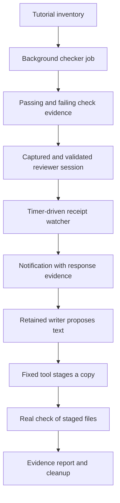

# Build a living documentation lab

Turn a tutorial inventory into a continuing investigation. This application runs
real checks in the background, creates a reviewer for the problem it finds, keeps
that conversation for follow-up, asks a writer for proposed text, stages a bounded
correction and rechecks the resulting files.

The interesting part is the composition. ChatMD defines the capabilities.
ChatML tracks work and delivers evidence when it is ready. Separate model
conversations assess what the checks mean. The final report keeps those judgments
distinct from commands that actually ran.

## Open and run the complete project

Inspect [lab.chatmd](../examples/applications/documentation-lab/lab.chatmd) and the
companion files in the source reader, then download **Living documentation lab**.
The complete archive contains:

```text
documentation-lab/
  lab.chatmd
  server.sexp
  runtimes/tutorial-checks.chatmd
  agents/reviewer.chatmd
  agents/writer.chatmd
  scripts/coordinator.chatml
  scripts/check-tutorial.chatml
  scripts/probe-review.chatml
  schemas/
  requests/
  workspace/sample-project/
    tutorial-inventory.json
    tutorials/passing.md
    tutorials/broken.md
    checks/check-tutorial.sh
    checks/stage-proposal.sh
    expected/original.json
    staging/README.txt
  README.md
  LICENSE.txt
```

Install Ochat and configure provider access to `gpt-6-astra`. Specialists request
high reasoning. The sample needs `/bin/sh`, `awk`, `cat` and a supported required
confinement backend. Parent, reviewer and writer conversations use your provider.
The raw repository example directory is not the assembled archive: sample inputs
are placed beneath `workspace/` when the bundle is assembled.

From the extracted directory:

```sh
ochat shell inspect lab.chatmd -canonical
ochat-agent-server -config "$PWD/server.sexp" -validate-only
ochat-agent-server -config "$PWD/server.sexp"
```

Connect from another terminal in the same directory:

```sh
chat-tui --no-config --connect "unix://$PWD/agent.sock" \
  --new-daemon-session --prompt lab --workspace lab
```

The private daemon stores sessions in `private-data/`, outside `workspace/`.
Only `workspace/sample-project/` is available through the file tool. The
configuration deliberately authorizes the inspected shell manifest and allows
the declared tools, including the fixed staging capability, up front.

That choice matters: a daemon profile with `tool_default allow` supplies an
automatic shell approver too. It would not turn an `ask` rule into a human click.
This sample uses explicit allow rules for its fixed tools, with required
confinement, no network and staging-only writes. Review those files before
starting it. For a human-approval walkthrough, use the
[guarded engineering assistant](guarded-engineering.md).

## Know what the lab can access

The [root definition](../examples/applications/documentation-lab/lab.chatmd)
binds the following capabilities. The included daemon profile allows these
declared tools; there is no per-command human approval in this configuration.
Nested calls retain their selected dependencies and current runtime checks.

| Tool or group | Implementation and permitted work | Decision boundary |
| --- | --- | --- |
| `read_file` | Named `project` root at `workspace/sample-project/`; reads inventory, tutorials and staged evidence. | Does not expose private configuration or the session store. |
| `check_one_tutorial` | Fixed checker through the `tutorial-checks` shell runtime. | Required confinement, read-only execution, no network; accepts known phase/tutorial arguments. |
| `apply_proposal` | Fixed stager through the `tutorial-staging` runtime. | Required confinement permits staging-directory writes; the command selects only `staging/broken.md` and treats proposal text literally. |
| `check_tutorials` | Standalone script selecting `read_file` and `check_one_tutorial`. | Validates the known inventory before checking; cannot select the staging tool. |
| `probe_review` | Standalone script selecting `agent_wait` and `agent_read`. | Observes a specific owned child receipt and bounded output; creates no child and writes no file. |
| `begin_lab_checks`, `stage_lab_proposal` | Moderator-handled tools start the corresponding job and retain its evidence. | The coordinator admits one pending check/stage run; an acknowledgement does not prove its effect succeeded. |
| `watch_lab_review`, `lab_report`, `close_lab` | The same moderator retains watches, reports their results and requests cleanup. | Watch ownership, deadlines and record limits remain explicit; reading the report starts no checks. |
| `agent_create` and the lifecycle tools | Captured-definition admission, messages, status, output, waiting and stop requests. | Direct owned-child relationships and delegated tool authority apply; an ID does not grant access to another session. |
| `propose_fix` | Authored persistent writer with its own scoped reader. | Returns proposed wording; no shell or editing capability. |

Authoring documentation and validation helpers accompany the declared creation
capability. They provide syntax/runtime guidance and non-executing validation,
not permission to execute an unadmitted candidate. A generated reviewer receives
only the explicitly selected `read_file` binding; it does not receive this entire
table of parent capabilities.

## Follow the evidence through the workflow

Ask the parent:

> Check the original tutorials in the background. Investigate the failing one
> with a dynamically created reviewer that inherits only read_file. Keep its
> conversation, collect its response asynchronously, and ask the writer for a
> proposed verification section. Show the proposed text, stage it using the
> configured sample capability, and recheck the staged tutorial. Report the
> evidence, what remains uncertain, and cleanup status.



| Part | Responsibility |
| --- | --- |
| Main agent | Choose assignments, capture reviewer instructions, explain findings and preserve disagreements. |
| Moderator | Retain run/watch identities, acknowledge background work, process events and publish correlated results. |
| Standalone ChatML tools | Validate the known inventory, call the checker and perform one bounded receipt probe. |
| Reviewer and writer | Assess evidence and propose wording in separate retained conversations. |
| Runtime | Admit capabilities, enforce confinement, execute jobs, retain receipts/output and deliver notifications. |

This is a conversational coordinator. The moderator does not secretly perform
the entire investigation: the model uses the tools to move between stages and
can answer questions while work proceeds. An unattended coordinator can make
more of those choices in a script; the
[workflow decision guide](../chatml/README.md) explains the execution
forms.

## Run supported checks in the background

`begin_lab_checks` with `{"phase":"original"}` starts `check_tutorials` as a job
and returns an accepted run/job ID. Its tool result is an acknowledgement. The
moderator later reads the canonical terminal job result and publishes a separate
notification with a request for another model turn.

The [check program](../examples/applications/documentation-lab/scripts/check-tutorial.chatml)
reads the two-entry inventory, checks supported IDs, paths and the
`verification-v1` identifier, then calls a fixed shell tool. Inventory data is
never treated as a command string. The checker reports:

| Original input | Mechanical result |
| --- | --- |
| `tutorials/passing.md` | Pass: a Verification heading and Expected result line exist. |
| `tutorials/broken.md` | Fail: verification guidance is missing. |

The checker exits 0 for a pass, 1 for a tutorial failure and 2 for invalid or
missing input. A succeeded job can contain a failed tutorial check. A job failure
is a different condition, such as failing to obtain or decode usable evidence.
The bundled `expected/original.json` is a comparison fixture; the actual run and
its result establish what happened in this session.

Only one check or stage job may be pending at once. `lab_report` can inspect
retained progress without launching another check.

## Create a reviewer for the actual problem

The parent receives authoring tools through its declared creation capability.
It queries `ochat_authoring_context`, captures a task-specific ChatMD definition,
validates it with `ochat_validate`, then creates the same bytes with
`agent_create`.

The source reader includes a
[reviewer template](../examples/applications/documentation-lab/agents/reviewer.chatmd),
[validation request](../examples/applications/documentation-lab/requests/validate-reviewer.json)
and [creation request](../examples/applications/documentation-lab/requests/create-reviewer.json).
These show complete captured bytes. They are not implicitly loaded merely because
the files exist. The parent can adapt the instructions for the actual tutorial
while preserving the configuration and authority contracts.

The child selects only the parent's existing `read_file` binding and declares it
with `type="inherited"`. It cannot redefine the reader's roots or add shell,
staging, authoring or child-management tools. The example uses
`start_immediately: true` and owned lifetime. Keep the exact creation key and
payload for an uncertain retry; a new key can create another child.

Send the concrete assignment through `agent_send` and retain both the child ID
and submission receipt. The session ID identifies the continuing conversation;
the receipt identifies the work being watched. Retrying a message requires its
same key and text; a new intended message needs a new key.

## Watch a response without blocking the conversation

Register `watch_lab_review` with `tutorial_id`, `role: "reviewer"`,
`session_id` and `receipt_id`. It returns a watch ID immediately. This is a
moderator-handled tool: `Tool_invoked` dispatch and `Invocation.resolve` supply
its implementation.

The moderator starts a bounded probe job. The probe calls `agent_wait` with zero
timeout for that exact receipt. If still pending, a timer schedules another probe
after two seconds. The watcher checks its identity and epoch before processing
an event, rearms only while work remains, and stops at completion or its five-minute
application deadline. It does not use a native child-response push API.

When the receipt is terminal, the probe reads a bounded output page. The
subscription completes with the wait/output evidence; the moderator publishes
that retained result and requests a turn. A successfully completed watch can
contain a **failed child receipt**. Inspect `wait.receipt.status` and the output
before claiming that the reviewer succeeded.

The watcher records one terminal snapshot for one receipt. Duplicate registration
of that receipt rejects, and completed watches stop rearming. Follow-up work in the
same child produces a new receipt that can have its own watch. For additional
output pages, retain `next_cursor` and use `agent_read` with the same query.
Reconstruct fragments before interpreting their JSON. An idle session or
`caught_up` output page does not prove that a receipt succeeded.

## Propose, stage and really recheck

`propose_fix` is an authored persistent writer. Give it the tutorial, actual
checker evidence and reviewer findings explicitly; it cannot see another child's
conversation by itself. Keep its returned session/receipt and register a watch
with `role: "writer"` when collecting its response.

The writer proposes text. It cannot edit files. A useful proposal explains the
command and expected result while acknowledging what the mechanical check does
and does not prove. Show that text before asking `stage_lab_proposal` to apply it.
The tool accepts `arguments: ["broken", PROPOSED_TEXT]` and records a background
stage run. Its fixed command treats the proposal as a literal argument, never as
shell source.

The stage writes only `staging/broken.md`, combining the original tutorial with
the proposed section. A different tutorial ID rejects before writing. The
original tutorial remains unchanged. The runtime confines writes to the staging
directory; the application itself chooses the single destination.

Inspect the actual stage result, then call `begin_lab_checks` with
`{"phase":"staged"}`. The broken tutorial now reads the staged copy; the passing
tutorial still uses its unchanged original. An unapplied proposal, a failed stage
or a missing staged file is not evidence of a passing recheck.

The checker recognizes an exact `## Verification` heading and a line beginning
`Expected result:`. A passing result establishes those conventions, not the
quality or completeness of the proposed explanation.

## Report uncertainty and close the lab

`lab_report` returns run inputs, job IDs, canonical results, reviewer queries and
watch results. Use those records to connect each conclusion to a tutorial path,
check result and reviewer response. Include proposals, the stage result, the
recheck and any unresolved work. Preserve disagreements instead of averaging them
into an unsupported release recommendation.

The sample retains at most eight run records and eight watcher records per parent.
It does not silently discard unresolved work to make room for more. A timeout,
failed probe, failed child or missing response belongs in the report. Use direct
lifecycle inspection before deciding whether to submit a new attempt.

`close_lab` closes the coordinator, cancels pending jobs/timers/watches and
requests cancellation of known reviewer sessions. It retains stop responses for
inspection. A stop receipt proves admission, not that all cleanup has joined.
Stop any child created but never registered with a watch separately. Further
starts reject in a closed lab; a new investigation needs a deliberate new parent.

Cancellation does not roll back an external write already performed. Inspect the
staged file after interruption and explicitly recheck it before retrying. Durable
records do not transparently resume a process or arbitrary script program counter.
An interrupted probe becomes a visible failed watch; an overdue timer rechecks
the application deadline. Recovery and a fresh attempt are separate decisions.

Quit the TUI with Esc then `:q` and Enter, and stop the daemon with Ctrl-C.
Keep the extracted directory for retained session data. `private-data/` contains
the example's store; original tutorial files and staged proposals remain separate.
For the individual techniques, revisit
[background results](../tutorials/background-results.md),
[generated specialists](../tutorials/generated-specialist.md) and the
[persistent review team](persistent-review-team.md).

## Adapt the lab's authority deliberately

For a **proposal-only lab**, remove `stage_lab_proposal` and `apply_proposal`
from the root and remove the `tutorial-staging` declaration from the imported
runtime file. Update the parent and writer instructions to finish with proposed
text and original check evidence. Keep the checker in original phase; a proposal without
a staged file cannot support a staged recheck. Reinspect the changed manifest
and validate the configuration before creating a fresh session.

For a **tool-free generated reviewer**, pass an empty `tools` selection and omit
the inherited reader from the captured child source. Supply the tutorial and
check evidence in its message instead. Validate and create the same captured
bytes, and keep the usual session/receipt watcher. This narrows the reviewer
without changing the parent's own checker or writer capabilities.

For a different project, replace the fixed inventory/checker and their schemas
together, then review the actual executable, read roots, writable roots and
policy in [tutorial-checks.chatmd](../examples/applications/documentation-lab/runtimes/tutorial-checks.chatmd).
Changing a schema or model instruction alone does not change shell authority.
