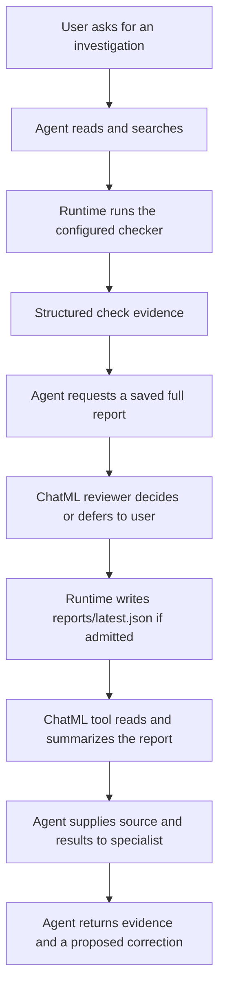

# Build a guarded engineering assistant

Give an agent useful project capabilities, then make the boundaries visible.
This complete application investigates Lantern's documentation, searches the
source, runs real checks, saves a reviewed report, summarizes it with a ChatML
tool, and asks a specialist to assess the evidence.

The initial project has a deliberate problem: the setup guide never explains how
to verify success. You will see the difference between a checker finding that
omission, a script deciding whether a report may be saved, and an agent proposing
better documentation. Each has its own job and authority.

## Open the complete project

Inspect [engineer.chatmd](../examples/applications/guarded-engineering/engineer.chatmd)
and the complete companion files in the source reader below. The bundle contains
two entry points, shared capability declarations, shell runtimes, a specialist,
ChatML scripts, JSON schemas, the sample project and a README. Everything needed
is included; you can read all files here before downloading them.

Complete [installation](../agent-server/quickstart.md) and provider configuration
for `gpt-6-astra`. The sample requires `/bin/sh`, `/bin/cat`, `/usr/bin/grep` and
`awk`, plus a supported Ochat confinement backend. These are the sample's command
dependencies. Parent, specialist and optional model-review requests use your provider.

Extract **Guarded engineering assistant**, change into its directory, and run:

```sh
mkdir -p reports
ochat shell inspect engineer.chatmd -canonical
chat-tui --no-config --local --authorize-shell-manifest -file engineer.chatmd
```

Read the manifest before using the authorization flag. It admits the exact
compiled configuration for this process; command policy and required confinement
still apply. The `reports` directory must exist before startup. With an
uninstalled checkout, substitute absolute built executable paths and keep the
extracted bundle as your working directory.

This application uses the native local host. It does not need a daemon and will
not continue running after the TUI exits. For the smaller pieces first, follow
[shell customization](../tutorials/shell-customization.md),
[reusable ChatML tools](../tutorials/chatml-tool.md) and
[one-off specialists](../tutorials/specialist.md).

## Know what each tool can do

The common [capabilities.chatmd](../examples/applications/guarded-engineering/capabilities.chatmd)
keeps model instructions and tool bindings together. The two roots choose the
report-review mechanism without redefining the work itself.

| Tool | Useful work | Authority and decision |
| --- | --- | --- |
| `read_file` | Read source documentation and saved evidence. | Named `project` and `reports` roots; no file editing. Host permission policy still applies. |
| `inspect_setup` | Return the maintained setup file through a fixed command. | `/bin/cat` with a fixed path, no caller arguments; read-only inspection runtime. |
| `search_docs` | Find literal text and matching line references. | Fixed grep options plus exactly a pattern and path; inspection runtime confines reads to the sample. |
| `check_docs` | Run selected checks, optionally saving `reports/latest.json`. | Fixed checker program, literal arguments, structured bounded output; separate check runtime permits only the configured output root. Saved reports require review. |
| `summarize_checks` | Count failures in saved report files. | Standalone ChatML tool with strict object input, output schema and explicit use of the existing file reader. It does not run checks. |
| `review_docs` | Assess source and check evidence, then propose clearer verification guidance. | Separate one-off authored agent, tool-free and given only the caller's supplied text. It cannot apply a change. |

The [inspection runtime](../examples/applications/guarded-engineering/runtimes/inspection.chatmd)
has no writable root, child-process capability or network. The
[check runtime base](../examples/learning/shell-customization/runtimes/checks-base.chatmd)
allows project code to use `awk`, reads the project and required system command
directories, writes beneath `reports`, and has no network or privilege-change
capability. That broader check authority is a deliberate choice for project code;
it is separate from the fixed inspection tools.

## Follow one investigation

Send this request:

> Investigate the Lantern setup guide. Read the source and search for verification
> guidance, run all checks, save the full report, summarize latest.json, and give
> the actual evidence to review_docs. Propose a fix with file references. Do not
> edit the tutorial or rerun report writes after an approval is denied.

The model chooses and explains the investigation steps. ChatML makes report
decisions and calculates totals. The runtime admits tool calls, enforces configured
boundaries, runs commands and publishes their results.



### Read and search before drawing conclusions

The file reader can use root `project` with `docs/setup.md` or `docs/reference.md`.
For `search_docs`, an input such as
`{"arguments":["Verification","docs"]}` searches literal text under `docs` and
returns paths and line numbers. The fixed `--` ends option parsing before the
model's pattern/path. The runtime still limits file access; a string in a prompt
cannot enlarge that boundary.

Finding the word in a reference does not prove the setup tutorial explains
verification. Read the named file and distinguish search evidence from the
checker's rule and the specialist's judgment.

### Run checks and save evidence deliberately

`check_docs` takes `{"arguments":["--check","all"]}`. Expect exit 1 and:

```json
[
  {"check":"setup instructions","status":"passed"},
  {"check":"source links","status":"passed"},
  {"check":"verification steps","status":"failed"}
]
```

This is an expected check failure, with evidence in stdout. It is different from
an execution denial or invalid input. Add `"--write-report"` as the third argument
when requesting a saved report. The
[report reviewer](../examples/learning/shell-customization/scripts/report-reviewer.chatml)
rejects selective saved reports, approves the first full-report request, and
defers subsequent full reports to the user. Its retained state records an approval
decision, not a successful write. Inspect the command result and read back
`latest.json` through the `reports` root before claiming the evidence was saved.

The bundled `expected-report.json` is comparison data. Reading it does not prove
that this session ran a checker.

### Process the saved report with ChatML

Call `summarize_checks` with `{"files":["latest.json"]}`. The
[report script](../examples/learning/check-reports/scripts/aggregate.chatml)
uses `let*` to read each selected report through its declared file dependency,
decodes the check results, and aggregates failures. Input and output schemas
live beside it in the bundle. Expected output after the initial full check is:

```json
[{"check":"verification steps","failures":1}]
```

The script fails on malformed report input instead of inventing partial totals.
It cannot add a shell tool simply by naming one: this standalone tool's declared
dependency is `read_file`. Root instructions connect the actual check, saved
evidence and calculation into one investigation.

### Give a specialist the evidence

The [authored reviewer](../examples/applications/guarded-engineering/agents/reviewer.chatmd)
receives the setup/reference text and actual check results in its `input` string.
It has its own developer instructions and no tools. The caller must supply the
evidence; the child does not automatically share the parent's history or files.

Its response should identify the missing verification instructions and propose
wording, with a source reference. The parent should preserve uncertainty or a
disagreement between that advice and the mechanical checker. Neither agent has
edited the file. For follow-up in the same specialist conversation, use the
[persistent-specialist pattern](../tutorials/persistent-specialist.md).

## Try boundaries and a real correction

| Exercise | What to observe |
| --- | --- |
| Save only the `links` check | The reviewer denies the selective report; existing evidence remains. |
| Save another full report in the same session | The reviewer defers to host approval. Deny it and verify the earlier file remains. |
| Search for an absent string in `docs` | Grep returns exit 1 with no matches; this is not an execution failure. |
| Request a read or search outside the sample roots | The configured boundary rejects or prevents access. Do not substitute a broader runtime to bypass it. |
| Temporarily rename setup.md | The checker returns exit 2 with a missing-input diagnostic. Restore the file afterward. |

To correct the sample as a human, add a `## Verification` heading and a line
beginning `Expected result:` to setup.md. Explain the expected check output and
the deliberate initial omission. Run all checks again: the three conventions
should now pass. Review the wording separately—the checker only tests its named
conventions. A later saved report still follows the configured approval policy.
Starting a new local session resets the reviewer's decision state. Its first full
report can be approved automatically again, even if the directory contains an
older report. Archive earlier evidence when you need to retain multiple runs.

For a model-based report decision, exit and launch
[model-engineer.chatmd](../examples/applications/guarded-engineering/model-engineer.chatmd)
with the same local/authorization flags. This variant denies selective reports
through static policy, then invokes the runtime's tool-free model reviewer for
full reports. The reviewer receives its bounded runtime decision context; it
cannot read project files. Its `agent` attribute labels that callback. The authored
`review_docs` agent is a separate evidence-review tool, with a different role.
Malformed or failed model review denies execution. See the
[custom decision lesson](../tutorials/shell-customization.md#try-the-separate-model-review-variant)
for the adapter's exact scope.

## Diagnose setup and finish

A missing backend or writable-root error is a startup/configuration problem:
check the supported backend and the `reports` directory. A missing sample file
usually means the bundle was copied incompletely or the working directory changed.
A permission denial is not fixed by rewriting the developer message. See
[shell host setup](../guide/chatmd-shell-host-integration.md) and
[guardrails troubleshooting](../tutorials/shell-guardrails.md).

Wait for work to finish, then exit with Esc, `:q`, Enter. Native local state ends
with this process; it leaves no detached specialist running. Source and report
files remain. Archive the extracted directory or remove only that exact copy
after exit. No publishing, Git operation or public service is part of this workflow.

The bundle's verification record in the [example catalog](../examples/README.md)
separates source/admission checks, real confined execution and simulated model
responses. A plausible model answer alone is not execution evidence.
