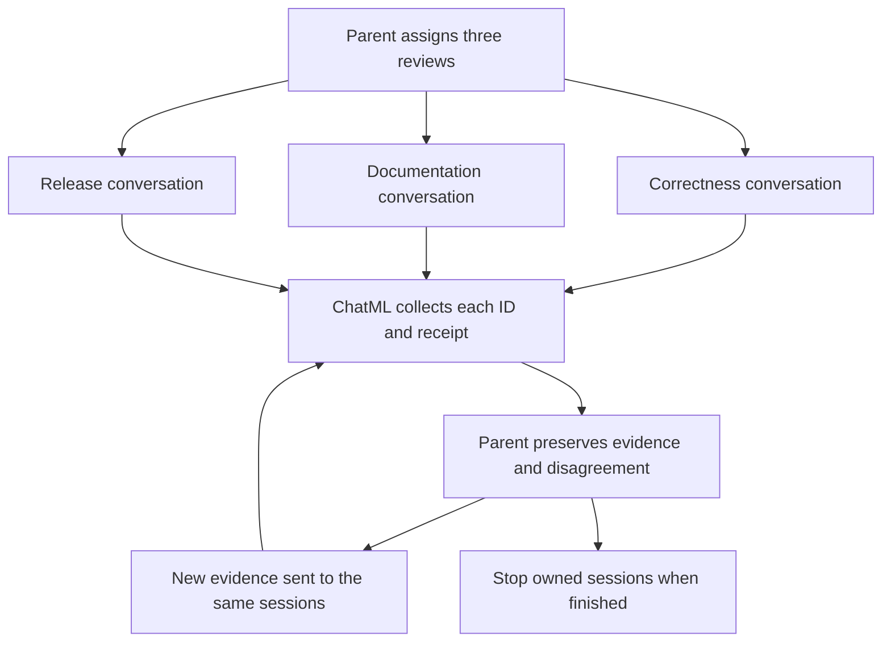

# Keep a team of specialist reviewers

A review often needs several kinds of judgment, followed by a second conversation
when the evidence changes. This application gives Lantern a correctness reviewer,
a reader-experience reviewer and a release-readiness reviewer. Each keeps its own
investigation. A ChatML tool collects their progress and evidence without erasing
disagreement or treating an unfinished review as a successful one.

Use it for release reviews, design proposals or investigations where the same
specialists should revisit their earlier conclusions. For an isolated question,
the documentation reviewer can also run as a one-off tool.

## Start the complete team

Read [team.chatmd](../examples/applications/persistent-review-team/team.chatmd)
and all companion files in the source reader. Download **Persistent review team**,
extract it and enter its directory. Install Ochat and configure provider access to
`gpt-6-astra`; specialist definitions request high reasoning. Parent and specialist
turns use your provider.

The bundle contains a private Unix daemon configuration. The daemon retains
sessions in `private-data/`; only `sample-project/` is the read-only workspace.
No shell authorization is needed because this team has no shell tool. The sample
report is recorded input, not a new check result.

```sh
ochat-agent-server -config "$PWD/server.sexp" -validate-only
ochat-agent-server -config "$PWD/server.sexp"
```

From a second terminal in the same directory:

```sh
chat-tui --no-config --connect "unix://$PWD/agent.sock" \
  --new-daemon-session --prompt team --workspace lantern
```

Checkout users can substitute absolute paths to the built server and TUI. Keep
the extracted directory as the working directory. The configuration allows the
declared read and lifecycle tools so reviewers can work unattended. A child does
not gain access to sibling private data or the server configuration. Transient
native local mode cannot replace this durable setup.

## Give each specialist a distinct job

| Named tool | Role | Lifetime |
| --- | --- | --- |
| `correctness_review` | Compare commands, recorded results and proposed claims. | Always persistent. |
| `documentation_review` | Explain what a newcomer needs to understand and do. | Defaults to one-off; accepts persistent mode. |
| `integration_review` | Assess release requirements and missing evidence. | Always persistent. |
| `collect_reviews` | Observe status, receipt completion and one output page per reviewer. | Stateless ChatML tool; creates no agents. |

All three specialists have their own scoped file reader and instructions. The
integration reviewer cannot see the other conversations unless the parent supplies
their findings. The parent coordinates assignments and writes the final report.
ChatML gathers observations; the runtime manages durable sessions, permissions,
receipt correlation and output publication.

| Capability | Binding and permitted work | Approval behavior in this bundle |
| --- | --- | --- |
| Parent `read_file` | Named `project` root at the configured `sample-project/` workspace. | The private reader profile allows reads; paths outside that root remain unavailable. |
| Three authored reviewer tools | Each companion definition has its own file reader scoped to the same workspace. | The profile allows the calls. Each specialist can read sample evidence, but has no shell, editing or sibling-history tool. |
| `collect_reviews` | Selects only `agent_status`, `agent_wait` and `agent_read`. | Allowed lifecycle observations still require the caller's owned-child relationship; the script cannot send, create or stop a session. |
| `agent_send`, `agent_status`, `agent_wait`, `agent_read`, `agent_stop` | The parent manages its retained children and their correlated output. | The profile permits these operations; knowing an unrelated ID cannot extend that authority or answer a child's approval request. |

The [private server configuration](../examples/applications/persistent-review-team/server.sexp)
keeps its store and configuration outside the readable workspace. Model requests
are separate provider operations; a file-reader permission does not configure
provider credentials or make those requests free.



## Compare one-off and retained work

First ask the parent:

> Ask documentation_review one quick question: what verification guidance is
> missing from docs/setup.md? Use its default one-off mode.

The tool accepts `{"input":"What verification guidance is missing?"}` and returns
the one-off answer. That call supplies no reusable session handle. Now request a
continuing team:

> Start all three reviews of requirements.txt, docs/setup.md, docs/reference.md and
> expected-report.json. Use persistent mode for documentation_review. Keep each
> role, returned session ID and submission receipt. Collect their findings and
> identify where their release recommendations disagree.

The optional declaration accepts:

```json
{
  "input": "Review the learning journey against requirements.txt. Cite evidence and propose verification wording.",
  "mode": "persistent"
}
```

For fixed-persistence tools, pass `input` and omit `mode`. A retained result gives
the child `session_id`, submission receipt and bounded output. The submission can
still be pending; save its actual `receipt_id`. Do not invent IDs from examples.

Each call without a session ID creates another instance. Continue an instance
through the same named wrapper with its `session_id`; the wrapper checks its own
declaration and ownership. Do not hand a documentation-review ID to the correctness
wrapper. The shared `agent_send`, `agent_status`, `agent_wait`, `agent_read` and
`agent_stop` tools can manage all these owned children.

## Collect evidence without losing its identity

The caller keeps this table:

| Value | Meaning |
| --- | --- |
| Role | Human-readable assignment, such as documentation. |
| `session_id` | Which continuing conversation to address. |
| `receipt_id` | Which submitted message's outcome and output to inspect. |
| Cursor | Position in that exact session/receipt output query; initially null. |

`collect_reviews` accepts one to three records with those four fields. For example,
the following is a shape illustration: replace the labels with actual returned
identifiers before calling it.

```json
{
  "reviewers": [
    {
      "role": "documentation",
      "session_id": "RETURNED_SESSION_ID",
      "receipt_id": "RETURNED_RECEIPT_ID",
      "cursor": null
    }
  ]
}
```

The [coordinator script](../examples/applications/persistent-review-team/scripts/coordinator.chatml)
performs three observations per reviewer: status, a zero-time receipt wait, and a
read of up to 16 output records. It returns the role and IDs together with
`status`, `completion` and `output` observations. Each observation contains `ok`,
`value` and `error`. A lifecycle-call error is retained in that review's result;
healthy reviewers can still contribute evidence. Invocation cancellation or a
script/runtime failure can terminate the whole collection call.

Inspect the completion receipt's terminal status. Success, failure, cancellation
and interruption are different outcomes. Session `idle` does not prove success.
An output page's `caught_up` flag means no more output at that read point, not that
the receipt finished. Keep `next_cursor` and use it for the next read of the same
query. Large records may span fragments; reconstruct them before interpreting
their JSON. The [lifecycle reference](../guide/chatml-authoring-children.md#read-output-and-recover-cursors)
explains paging and cursor recovery.

This collector deliberately does not wait for everyone. Use `agent_wait` on a
pending receipt when waiting helps, or collect again when there is new progress.
A timeout does not stop a child. Avoid a rapid polling loop; the
[background-results lesson](../tutorials/background-results.md) introduces
notifications for longer work.

## Revisit the same investigation

Read `sample-project/follow-up.txt` and ask:

> Send this proposed verification wording to the same reviewers. Ask each to
> refine its earlier findings against requirements.txt. Keep the distinction
> between explaining the current failure and proving a corrected check passes.

For the optional tool, send `input`, `mode: "persistent"` and its existing
`session_id`. For fixed tools, send `input` and the existing ID. Alternatively,
use `agent_send` with `session_id`, `message` and a fresh `idempotency_key`.
Reuse that key only for an uncertain retry of the identical intended message.

Follow-up returns a **new receipt for the same conversation**. Save it and begin
its output query with a null cursor; a previous receipt's cursor belongs to a
different query. Preserve the earlier findings in the parent's report. The
specialist has its earlier conversation, but the parent still needs the correct
receipt to collect this follow-up's answer.

The proposed text has not been applied or run. A useful report cites requirements,
records each reviewer's proposal, explains any disagreement and lists what remains
unverified. A mechanically plausible change is not evidence of a passing release.
The [guarded engineering application](guarded-engineering.md) demonstrates real
checks and a separate human correction when you are ready to validate a proposal.

## Handle a missing review and finish

To explore interrupted work, ask the parent to cancel one retained reviewer with
`agent_stop` and a fresh key. A quick reviewer may already have finished; inspect
the actual receipt rather than claiming cancellation happened. A new send to a
stopped child rejects. Keep that failure visible alongside healthy reviewers'
findings. Start a replacement only deliberately, as a new instance.

A provider failure can leave a failed receipt with partial or no output. Missing
files and denied reads are tool errors the reviewer may explain; those do not
necessarily mean its whole submission failed. Use the actual receipt status and
available evidence for the distinction. The parent's status/read calls cannot
approve a child's permission request.

After collecting the report, stop every retained child, including extra instances
created while comparing modes. `graceful` lets admitted work finish; `cancel`
requests interruption. A stop receipt records admission, not a join of all cleanup;
inspect stop progress and status. Retained conversation and output remain readable
subject to current authority and retention. Parent stop cancels owned children.

Quit the TUI with Esc, then `:q` and Enter. Stop the daemon with Ctrl-C. Keep the
extracted directory if you want its saved sessions; deleting `private-data/`
removes that example's durable data. For connection problems, check both terminals'
working directories and the daemon socket before changing workspace permissions.

Continue with [generated specialists](../tutorials/generated-specialist.md) when
the parent should define a task-specific role instead of selecting an authored
one. Both patterns use the same lifecycle tools and inherited authority rules.

## Adapt the team without broadening access

For a **two-specialist team**, remove `integration_review` from
[team.chatmd](../examples/applications/persistent-review-team/team.chatmd) and update
the parent's assignments accordingly. Pass only the two retained reviewer records
to the collector; its existing schema accepts one to three. Stop any previously
created third reviewer before moving to a new parent definition. Editing the root
does not revoke an already running captured session by itself.

For a **tool-free authored specialist**, remove `read_file` from that companion's
ChatMD and change its instructions to use the evidence supplied in `input`.
The parent must include the relevant file contents and later changes. Authored
companions declare their own tools: changing only the parent's reader does not
rewrite their definitions. Revalidate the complete bundle and start a fresh
parent when testing the modified role.

To add automated checks or modifications, start from the
[engineering assistant's separate runtimes](guarded-engineering.md#know-what-each-tool-can-do)
instead of treating a review recommendation as an access grant. The existing
team intentionally produces advice and evidence without changing project files.
