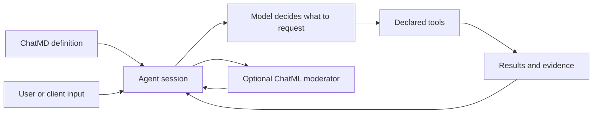

# How Ochat's pieces fit together

Start with an agent that understands your project. Give it file and search tools
to gather evidence, a shell tool to run checks, and a specialist to review the
result. Add ChatML when the workflow needs decisions you want to express as code:
which checks to run, when to request review, or how to deliver background results.

Those pieces live in files you can inspect, reuse and version alongside the
project. A session is where that definition becomes a running conversation.

## From a definition to useful work

| Piece | What you control | Example |
| --- | --- | --- |
| [ChatMD](../chatmd/README.md) | Instructions, model settings, tool declarations and attached scripts | Define a documentation reviewer with access to selected files. |
| [Tools](../tools/README.md) | The operations available to that agent | Read a source file, run a configured check, or ask a specialist. |
| [Shell runtimes](../shell/README.md) | Command capabilities, file/environment/network rules and review behavior | Give inspection and build tools different access. |
| [ChatML](../chatml/README.md) | Deterministic logic and event-driven workflow decisions | Collect check results and request review only for failures. |
| [Subagents](../guide/subagents.md) | Delegation, specialist instructions and conversation lifetime | Keep a reviewer available for follow-up questions. |
| [Host and session](../agent-server/concepts.md) | Where work runs and how long it remains available | Use a local terminal for interactive work or a daemon for client-independent sessions. |

The model chooses within the tools and instructions it receives. A script can
sequence work and react to events. The runtime executes admitted operations,
enforces the relevant permissions, and manages their lifecycle. A description of
a tool is not permission to access arbitrary files or run arbitrary commands.

## Grow an agent as the work grows

**First, gather evidence.** A file-reading agent can explain a setup guide from
the actual text. The [file-tool lesson](../tutorials/file-tool.md) shows the full
definition, sample input and file-access configuration.

**Then delegate a perspective.** Give a specialist its own review instructions.
The [specialist lesson](../tutorials/specialist.md) starts with a one-off review;
the [delegation guide](../guide/subagents.md) explains when to retain that
conversation or let the parent define a new specialist.

**Add useful operations.** A shell tool can run a project's checker, formatter or
build command. Its [runtime configuration](../shell/README.md) determines the
capabilities and guardrails. A build can execute project code, so review its
effects and confinement rather than assuming a command name makes it harmless.

**Make coordination repeatable.** Use a ChatML program to transform results, a
reusable script tool to expose that logic, or a moderator to retain workflow
state and arrange later actions. [Choose an execution form](../chatml/README.md)
before choosing the script's entry point.

## Definitions, conversations and work have different lifetimes

An authored agent tool points to a reusable definition. Calling it once does
not necessarily create a persistent specialist. Persistent variants return a
session identity you can use for later messages and outputs. Starting a new
instance and messaging an existing instance are different operations.

A local host runs work while its process lives. A daemon can own sessions beyond
an individual client connection. Persistent children require an admitted durable
service; a tool declaration cannot provide one by itself. Retained data also
does not mean an interrupted shell process resumes after a restart.

For a first conversation, follow [installation](../agent-server/quickstart.md),
[build troubleshooting](../guide/build-troubleshooting.md) when needed, then
[run your first agent](../agent-server/tutorials/local-tui.md). For a larger
project, browse [applications](../applications/README.md) and
[complete example sources](../examples/README.md).
