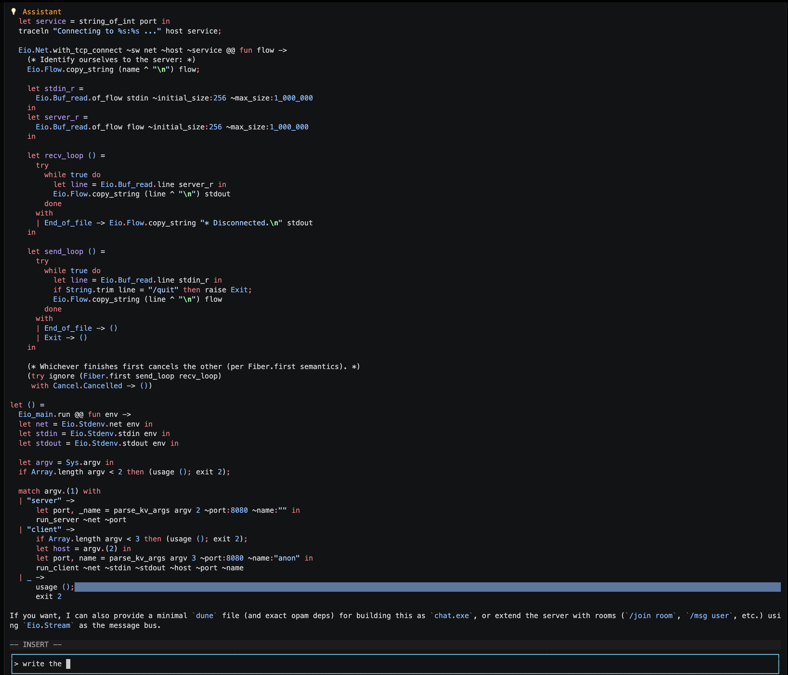

# chat_tui – interactive terminal client (guide + key bindings)

`chat_tui` is the Notty-based terminal UI for running **ChatMarkdown** prompts interactively.

- **Installed binary name:** `chat-tui`
- **From the repo:** `dune exec chat_tui -- …`

ChatMarkdown is Markdown + a small XML dialect; the runtime does **not** depend on file
extensions, so any `.md` can be a ChatMarkdown prompt.

---

<div>

</div>


## chat_tui in 60 seconds

`chat_tui` is designed for the “draft → run → iterate” loop:

- **Multi-line drafts without accidental sends:** `Enter` inserts a newline; **`Meta+Enter` submits**.
- **Streaming output in one place:** assistant text, tool calls, and tool outputs stream into the history viewport.
- **Vim-ish interaction:** Insert / Normal / Cmdline modes, plus message selection and yank/edit/resubmit.
- **Sessions you can resume/branch/export:** persistent snapshots under `$HOME/.ochat/sessions/<id>`.
- **Manual context compaction:** `:compact` produces a concise summary so long chats stay usable.
- **Syntax highlighting:** Rich syntax highlighting enabled for Markdown, XML, Json, Ocaml with more to come.


## Launch

Installed (via opam):

```console
$ chat-tui -file prompts/interactive.md
```

From the repo:

```console
$ dune exec chat_tui -- -file prompts/interactive.md
```

Notes:
- If `-file` is omitted, the default prompt file is `./prompts/interactive.md`.
- The prompt file may be any filename; `.md` is fine.

---

## Muscle-memory cheat sheet (high signal)

> Terminology: `Meta` is usually **Alt** (Linux terminals) or **Option** (macOS terminals).

### Insert mode (typing mode)

| Keys | Action |
|---|---|
| (type) | insert text |
| `Enter` | insert newline in the draft |
| `Meta+Enter` | **submit** the draft |
| `Esc` (bare) | switch to **Normal** mode |
| `↑ / ↓ / PageUp / PageDown` | scroll history (disables auto-follow) |
| `Home / End` | jump history viewport top/bottom (End re-enables auto-follow) |
| `Ctrl-l` | force a redraw (useful if your terminal got visually corrupted) |
| `Ctrl-k / Ctrl-u / Ctrl-w` | kill to end-of-line / beginning-of-line / previous word |
| `Ctrl-y` | yank (paste the last killed/copied text) |
| `Meta-v` (or `Meta-s`) | toggle selection anchor in the draft |
| `Ctrl-C / Ctrl-X` (selection active) | copy / cut selection |
| `Ctrl-r` | toggle draft mode: **Plain** ⇄ **Raw XML** |

**Important:** `Ctrl-C` copies only when a selection is active; otherwise it quits the TUI.
On some terminals, `Alt-s` may arrive as the `ß` character; that also toggles the selection anchor.

### Normal mode (Vim-ish commands over the draft + message selection)

| Keys | Action |
|---|---|
| `i` | enter Insert mode |
| `:` | enter command-line (Cmdline) mode |
| `h j k l` | move cursor in the draft |
| `w / b` | word motion forward/back (draft) |
| `0 / $` | start/end of line (draft) |
| `gg / G` | jump history viewport top / bottom |
| `[` / `]` | move the **selected message** up / down |
| `Esc` | cancel streaming (if in-flight) else “quit-via-ESC” path (see below) |

### Cmdline (after typing `:` in Normal mode)

| Command | Action |
|---|---|
| `:w` | submit the draft (same as `Meta+Enter`) |
| `:q` / `:quit` | quit |
| `:wq` | quit (**does not submit first**) |
| `:c` / `:cmp` / `:compact` | compact context |
| `:d` / `:delete` | delete selected message |
| `:e` / `:edit` | yank selected message into editor and switch to **Raw XML** |

---

## Modes and the one subtle ESC behavior

`chat_tui` has three editor modes:

- **Insert:** you type into the draft buffer.
- **Normal:** keys act like commands (Vim-ish) and you can select messages.
- **Cmdline:** a `:` prompt for commands like `:compact` or `:edit`.

### ESC is intentionally overloaded

This is the most important behavior to learn:

- **Insert + bare `Esc`** → switches to **Normal** mode (it does *not* cancel streaming).
- **Normal + `Esc`** → “cancel or quit”:
  - if a response is streaming: **cancel** the in-flight request
  - otherwise: triggers the “quit-via-ESC” shutdown path (which changes export prompting)

Practical tip:
- To cancel while you’re typing in Insert: press `Esc` (go Normal), then `Esc` again (cancel).

---

## Editing & navigation (power features)

### Draft editing (Insert mode)

Beyond basic typing:

- **Line navigation:** `Ctrl-A` / `Ctrl-E` (start/end of line)
- **Whole-draft navigation:** `Ctrl-Home` / `Ctrl-End`
- **Word navigation:** `Ctrl+←/→`, `Meta+←/→`, plus `Meta-b` / `Meta-f`
- **Multi-line cursor movement inside the editor:** `Ctrl+↑/↓`
  (plain `↑/↓` scrolls the history viewport instead)
- **Duplicate line:** `Meta+Shift+↑/↓`
- **Indent/unindent line:** `Meta+Shift+→/←`
- **Kill/yank:** `Ctrl-k`, `Ctrl-u`, `Ctrl-w`, `Ctrl-y`
- **`Meta+Backspace`:** kill previous word

### Message selection + yank/edit/resubmit (a great workflow)

This is one of the fastest ways to iterate on a previous result:

1. `Esc` → Normal
2. `[` / `]` to select the message you care about
3. `:e` to yank it into the draft (switches to Raw XML)
4. Edit and submit with `Meta+Enter` (or `:w`)

Use cases:
- tweak a previous tool call and rerun it
- quote and refine an earlier instruction

---

## Submitting, streaming, and mid-stream control

### Submitting

- `Meta+Enter` (Insert) or `:w` (Cmdline) submits the draft.
- The UI inserts a brief “(thinking…)” placeholder immediately, then replaces it with streaming tokens.
- Auto-follow is enabled on submit so new output stays visible.

### “Note From the User” while streaming

If a response is currently streaming and you submit again, the draft text is **not** queued as a new
visible user turn. Instead it is injected into the in-flight request as:

> `This is a Note From the User:\n…`

This lets you correct or refine mid-stream without restarting the run.

---

## Draft modes: Plain Markdown vs Raw XML

The draft buffer has two interpretations:

- **Plain**: normal Markdown text sent as a user message.
- **Raw XML**: low-level ChatMarkdown XML elements (useful for editing tool calls/tags precisely).

How to toggle:
- Insert: `Ctrl-r`
- Normal: `r` (bare) toggles Plain ⇄ Raw XML
  - (`Ctrl-r` in Normal is redo)

`:e` / `:edit` always yanks into the editor and forces **Raw XML** so you can safely rework
structured content.

---

## Quitting & export (predictable rules)

There are two distinct shutdown experiences:

### Quit via `:q` (or `Ctrl-C`)

- Quits immediately.
- **Export happens automatically** to:
  - `--export-file FILE` if provided, otherwise
  - the original prompt file path (`-file …`).

### Quit via `Esc` while idle (Normal mode)

When no response is streaming and you press `Esc` in Normal mode, `chat_tui` treats that as a
“quit-via-ESC” request and prompts:

```text
Export conversation to promptmd file? [y/N]
```

If you say yes, it may also ask for an output path when `--export-file` is not set.

Notes:
- There is no `/quit` slash command.
- `q` only triggers Quit in the Insert-mode key handler; for consistent quitting, prefer `:q` or `Ctrl-C`.
- The prompt text says “promptmd”; it refers to exporting a **ChatMarkdown transcript**.

---

## Persistent sessions (resume / branch / reset / export)

Sessions are stored under:

```text
$HOME/.ochat/sessions/<id>/
  snapshot.bin
  snapshot.bin.lock
  archive/
  .chatmd/cache.bin
  prompt.chatmd        (a copy of the prompt, when available)
```

Key behaviors:

- If you open a prompt without session flags, `chat_tui` uses a **deterministic session id**
  derived from the prompt path (so re-opening the same prompt resumes naturally).
- `--new-session` forces a fresh session id (handy for branching).

### Snapshot saving on exit

By default, `chat_tui` asks on exit whether to save the snapshot:

```text
Save session snapshot? [Y/n]
```

Use:
- `--auto-persist` to always save without prompting
- `--no-persist` to never save

### CLI flags (authoritative)

| Flag | Meaning |
|---|---|
| `--list-sessions` | list session ids and their prompt file |
| `--session <ID>` | resume a specific session |
| `--new-session` | start a brand-new session for the prompt |
| `--session-info <ID>` | print metadata and exit |
| `--reset-session <ID> [--prompt-file FILE] [--keep-history]` | archive snapshot and reset |
| `--rebuild-from-prompt <ID>` | archive snapshot, clear history/cache, and rebuild from stored prompt copy |
| `--export-session <ID> --out FILE` | export a session to a standalone ChatMarkdown file and exit |
| `--export-file FILE` | set export destination on normal quit |
| `--parallel-tool-calls` / `--no-parallel-tool-calls` | toggle parallel execution of tool calls |
| `--auto-persist` / `--no-persist` | control snapshot persistence on exit |

---

## Context compaction (`:compact`) — current behavior

When a conversation grows too large, you can compact it manually:

```text
:compact    (aliases: :c, :cmp)
```

Rules:
- Compaction cannot run while a response is streaming.
- The compactor generates a **summary** and replaces most of the history with that summary.

### What it actually does today (implementation details)

The current compactor:

- keeps only system/developer messages from the existing history (and any previous `<system-reminder>` messages),
- appends a new summary wrapped in a `<system-reminder>…</system-reminder>` block.

If you are in a persisted session, compaction also archives the current `snapshot.bin` into the
session’s `archive/` folder as part of the reset flow.

Note: there are modules for config and relevance scoring, but user config-file loading and relevance
filtering are not fully wired in the current implementation.

---

## Terminal & troubleshooting

### “Meta” / Alt / Option key confusion

Terminals differ in how they encode Alt/Option and which keys they report as `Meta`.
To see exactly what your terminal sends, run the key inspector:

```console
$ dune exec key_dump --
```

### Known limitations

- Cursor positioning is derived from **byte offsets** in the input buffer; wide Unicode glyphs may
  misalign the cursor with what you see on screen.
- Mouse input is disabled in `chat_tui` (keyboard-driven UI).

### Tuning responsiveness (optional)

Two environment variables influence how frequently the UI redraws while streaming:

- `OCHAT_TUI_FPS` – target frames-per-second for redraw throttling (default: 30).
- `OCHAT_STREAM_BATCH_MS` – batch window (ms) for coalescing streaming events (default: ~12ms, clamped to 1–50ms).

---

## See also

- `chat_tui` CLI reference: `docs-src/bin/chat_tui.doc.md`
- Key event inspector docs: `docs-src/bin/key_dump.doc.md`
- TUI internals (odoc pages): `docs-src/lib/chat_tui/*.doc.md`
- Meta-prompting CLI (not part of `chat_tui`): `docs-src/bin/mp_refine_run.doc.md`
