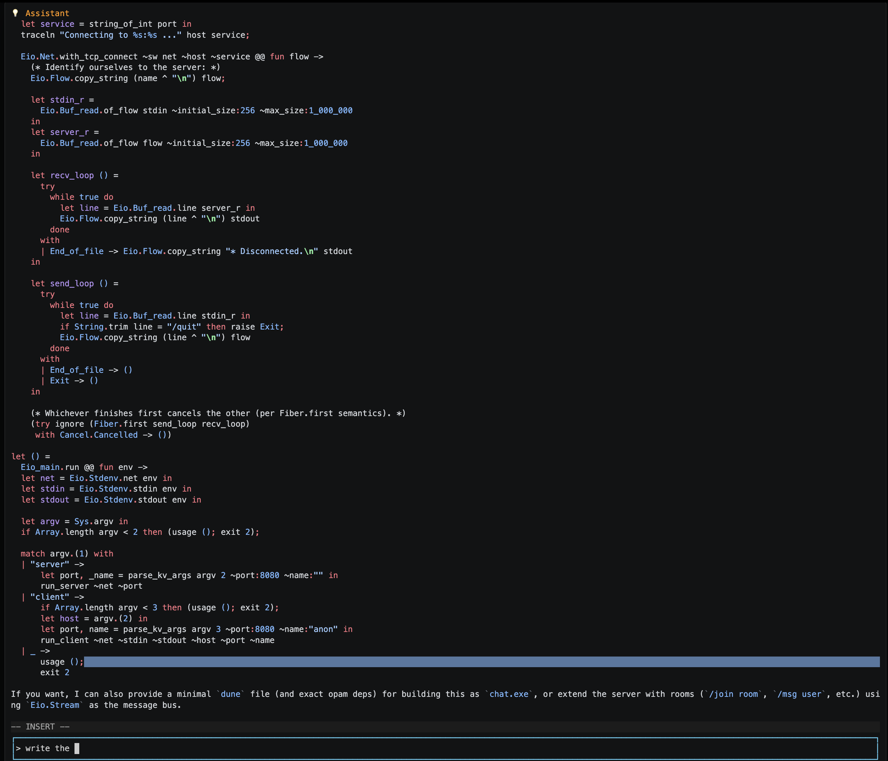

# chat_tui – interactive terminal client (guide + key bindings)

`chat_tui` is the Notty-based terminal UI for running **ChatMD (ChatMarkdown)** prompts interactively.

- **Installed binary name:** `chat-tui`
- **From the repo:** `dune exec bin/chat_tui.exe -- …`

## Current host modes

For new local work use [native local TUI](../agent-server/tutorials/local-tui.md);
it is transient and process-bound. For persistence/background work use
[daemon connections](../agent-server/tutorials/unix-daemon.md). The
[CLI reference](../bin/chat_tui.doc.md) explains mode selection and incompatible
flags. `--no-config` avoids ambient arguments selecting a legacy host.

Connected clients render server-owned state and preserve drafts across reconnect.
Quitting detaches; it does not export over the prompt or stop a detached session.
Read-only attachments cannot submit input or answer approvals. Security/transcript
visibility also depends on credential scopes. Shell authorization differs by
host: see [the host matrix](chatmd-shell-host-integration.md).

Keyboard, rendering, navigation and editing sections below apply where their
host offers the relevant capability. File-backed session and automatic prompt
export sections are explicitly legacy behavior, not native/daemon defaults.

ChatMarkdown is Markdown + a small XML dialect; the runtime does **not** depend on file
extensions, so any `.md` can be a ChatMarkdown prompt.

---

<div>

</div>

Historical interface screenshot. Use the current host guidance and controls below;
this image is not a recording of the current native or daemon workflow.

## chat_tui in 60 seconds

`chat_tui` is designed for the “draft → run → iterate” loop:

- **Multi-line drafts without accidental sends:** `Enter` inserts a newline; **`Meta+Enter` submits**.
- **Chat, Agent, and Shell Security views:** Chat keeps the transcript/editor, Agent shows tool/nested-agent progress, and Shell Security shows authority, approvals and audit.
- **Vim-ish interaction:** Insert / Normal / Cmdline modes, plus message selection and yank/edit/resubmit.
- **Sessions:** daemon sessions are durable in their configured store; legacy snapshots use `$HOME/.ochat/sessions/<id>`; native local sessions are transient.
- **Manual context compaction:** `:compact` produces a concise summary so long chats stay usable.
- **Syntax highlighting:** Rich syntax highlighting enabled for Markdown, XML, Json, Ocaml with more to come.


## Launch

Installed (via opam):

```console
$ chat-tui -file prompts/interactive.md
```

From the repo:

```console
$ dune exec bin/chat_tui.exe -- -file prompts/interactive.md
```

Notes:
- If `-file` is omitted, the default prompt file is `./prompts/interactive.md`.
- The prompt file may be any filename; `.md` is fine.

### Workspace and `read_file` roots

In native local mode, the directory where `chat-tui` is launched is `${workspace}`
and `${tool_dir}` for the agent. The location of `-file` does not change that
workspace; it selects the source to pin. Native local `${prompt_dir}` points to
that prompt's materialized artifact directory, not its original directory;
`${source_dir}` similarly follows captured imports. Uncaptured neighboring assets
are not copied. Use `${workspace}` or explicit tool roots for project data. In
daemon mode, the server resolves
the configured workspace and its own launch directory; the client's cwd does
not change either. Start a local TUI from the project the
agent should operate on:

```console
$ cd /work/my-project
$ chat-tui -file /work/prompts/coding-agent.md
```

A prompt can then give the model named read-only mounts:

```xml
<tool name="read_file" description="Use project for source and opam for package docs.">
  <read id="project" path="${workspace}" description="Current project"/>
  <read id="opam" path="${home}/.opam/default/doc"
        description="Installed package documentation"/>
</tool>
```

The tool description and JSON schema sent to the model contain the resolved
absolute paths and valid root IDs. Calls may use, for example,
`{"root":"project","file":"lib/main.ml","offset":0,"line_count":200}`.
Every root must exist at startup. See the
[tools reference](../overview/tools.md#configuring-read_file-roots) for path
variables, confinement rules, and host-wide access.

---

## Muscle-memory cheat sheet (high signal)

> Terminology: `Meta` is usually **Alt** (Linux terminals) or **Option** (macOS terminals).

### Normal mode (Vim-ish commands over the draft + history tools)

| Keys | Action |
|---|---|
| `i` | enter Insert mode |
| `a` | append (move right one char if possible) and enter Insert mode |
| `o / O` | open new line below / above and enter Insert mode |
| `:` | enter command-line (Cmdline) mode |
| `/ / ?` | search **message history** forward / backward |
| `n / N` | repeat last history search forward / backward |
| `h j k l` | move cursor in the draft (with counts: `10j`, `3l`, …) |
| `w / b / e` | word motion forward/back/**end-of-word** (with counts: `3w`, `2b`, `4e`, …) |
| `f{char}` | find next `{char}` on the current line |
| `F{char}` | find previous `{char}` on the current line |
| `t{char}` | move *till* next `{char}` (cursor lands just before it) |
| `T{char}` | move *till* previous `{char}` (cursor lands just after it) |
| `; / ,` | repeat last `f/F/t/T` forward / backward |
| `0 / ^ / $` | start of line / **first non-blank** / end of line (draft) |
| `gg / G` | go to first line / last line of the **draft buffer** (canonical Vim). Supports counts: `5gg`, `12G` |
| `v` | toggle **Visual selection** (character-wise) in the draft |
| `Esc` (selection active) | clear Visual selection (stay in Normal) |
| `y` (selection active) | yank (copy) selection to the register; clears selection |
| `d` (selection active) | delete selection (also yanks it); clears selection |
| `c` (selection active) | change selection (delete + enter Insert); clears selection |
| `↑ / ↓` | scroll history viewport (trackpad-friendly) |
| `Ctrl-f / Ctrl-b` | page down/up history viewport |
| `Ctrl-d / Ctrl-u` | half-page down/up history viewport |
| `[` / `]` | move the **selected message** up / down |
| `x` | delete character under cursor (**yanks it** to the register) |
| `p / P` | paste after / before cursor from the register |
| `y{motion}` | yank by motion (currently: `yw`, `yb`, `ye`, `y0`, `y^`, `y$`, plus find motions like `yf,`, `yT)`, `y2f/`) |
| `d{motion}` | delete by motion (currently: `dw`, `db`, `de`, `d0`, `d^`, `d$`, plus find motions like `df"`, `dt>`) |
| `c{motion}` | change by motion (currently: `cw`, `cb`, `ce`, `c0`, `c^`, `c$`, plus find motions like `ct)`, `cF:`) |
| `yy / dd / cc` | yank / delete / change current line |
| `u` | undo |
| `Ctrl-r` | redo |
| `r` | toggle draft mode: **Plain** ⇄ **Raw XML** *(note: differs from Vim’s replace-char)* |
| `Ctrl-g` | open the Agent page when at least one tool call is active |
| `Esc` | cancel streaming (if in-flight) else “quit-via-ESC” path (see below) |

---

## Chat, Agent, and Shell Security pages

The **Chat page** contains the canonical transcript, history viewport, status
bar, and draft editor. The **Agent page** is a transient live view of tool calls
that are executing now. The **Shell Security page** shows effective runtime
authority, persisted grants, audit replay, and interrupted requests. Press
`Ctrl-g` for Agent while calls are active, or run `:shell` for Shell Security.
Starting a call does not switch pages automatically.

The Agent header and selector list calls in start order. Tool names are not
unique, so the selector also shows a shortened call ID. Use:

| Keys | Agent-page action |
|---|---|
| `j / k` | select the next / previous call |
| `↓ / ↑` or `Ctrl-↓ / Ctrl-↑` | scroll the selected call's output one row (trackpad-friendly; encoding depends on the terminal) |
| `PageDown / PageUp` or `Ctrl-f / Ctrl-b` | scroll the selected call's output by a page |
| `Home / End` | scroll to the beginning / end |
| `Ctrl-g` or `Esc` | return to Chat |

Chat and Agent have independent scroll positions. Switching pages does not
pause, cancel, or restart the outer assistant stream or any tool. Assistant
deltas continue accumulating on Chat while Agent is visible.

Every executing tool shows start and finish lifecycle activity. Tools that emit
intermediate values additionally show channel-labelled assistant, reasoning,
stdout, stderr, or activity text. ChatMD agents used as tools expose nested
assistant/reasoning deltas and nested-tool activity. Process-backed custom
tools expose their combined command output while the process runs. One-shot
tools, including MCP calls, may show lifecycle only because they emit no
intermediate values. MCP server notifications are not correlated to individual
requests in this view.

Returned, raised, and cancelled calls disappear immediately. `Returned` means
the runner returned normally; its final text may still describe a
tool-defined error. Finishing an unselected call preserves the current
selection and page. Finishing the selected call repairs selection for any
surviving calls and returns to Chat; finishing the final call also returns to
Chat.

Live Agent activity is display-only. It never enters conversation history,
moderation input, persistence, or future model requests. Each tool still
produces one final canonical output through the existing Chat transcript path.

---

### Cmdline (after typing `:` in Normal mode)

| Command | Action |
|---|---|
| `:w` | submit the draft (same as `Meta+Enter`) |
| `:q` / `:quit` | quit |
| `:wq` | quit (**does not submit first**) |
| `:c` / `:cmp` / `:compact` | compact context |
| `:d` / `:delete` | delete the selected canonical occurrence while idle; native/daemon hosts require a writable attachment (see below) |
| `:e` / `:edit` | copy the selected canonical row's displayed text into the editor in **Plain** Insert mode |
| `:noh` / `:nohlsearch` | clear last-search highlight *(currently may be slower on very large histories due to cache invalidation strategy)* |
| `:shell` / `:security` | open Shell Security and refresh its management snapshot |

---

### Search prompt mode (entered via `/` or `?` in Normal)

| Keys | Action |
|---|---|
| (type) | edit the search query |
| `Enter` | execute search: select matching message + scroll to it |
| `Esc` | cancel search prompt |
| `← / →` | move caret within query |
| `Backspace` | delete previous character |

---

## Modes and the one subtle ESC behavior

`chat_tui` has three pages and four Chat-editor modes. Agent is a page, not an
editor mode:

- **Insert:** you type into the draft buffer.
- **Normal:** keys act like commands (Vim-ish) and you can navigate/search history.
- **Cmdline:** a `:` prompt for commands like `:compact`, `:edit`, `:noh`.
- **Search:** a `/` or `?` prompt to search message history.

### ESC is intentionally overloaded

This is the most important behavior to learn:

- **Insert + bare `Esc`** → switches to **Normal** mode (it does *not* cancel streaming).
- **Normal + bare `Esc`, Visual selection active** → clear the selection and
  pending command/count, remain Normal, and leave active work running.
- **Normal + `Esc`, no selection** → “cancel or quit”:
  - if a response is streaming: **cancel** the in-flight request
  - otherwise: triggers the “quit-via-ESC” shutdown path (which changes export prompting)
- **Agent page + `Esc`** → return to Chat without cancelling.

Practical tip:
- To cancel while typing in Insert with no suggestion or selection: press
  `Esc` (go Normal), then `Esc` again (cancel). Suggestions/previews and Visual
  selection consume their own Escape presses first.
- If Agent is visible, first press `Esc` to return to Chat, then use the
  existing Chat-page cancellation sequence.

---

## Editing & navigation (power features)

### Draft editing (Insert mode)

Beyond basic typing:

- **Line navigation:** `Ctrl-A` / `Ctrl-E` (start/end of line)
- **Whole-draft navigation:** `Ctrl-Home` / `Ctrl-End`
- **Word navigation:** `Ctrl+←/→`, `Meta+←/→`, plus `Meta-b` / `Meta-f`
- **Multi-line cursor movement inside the editor:** `Meta+↑/↓` or `Shift+↑/↓`.
  Plain and `Ctrl+↑/↓` scroll history. With the typeahead preview closed,
  `Ctrl+Shift+↑/↓` moves through the editor by its visible page height.
- **Duplicate line:** `Meta+Shift+↑/↓` duplicates the current line above/below.
  This is one undoable edit, distinct from Meta-arrow movement.
- **Indent/unindent line:** `Meta+Shift+→/←`
- **Kill/yank:** `Ctrl-k`, `Ctrl-u`, `Ctrl-w`, `Ctrl-y`
- **`Meta+Backspace`:** kill previous word

### Message selection + yank/edit/resubmit (a great workflow)

This is one of the fastest ways to iterate on a previous result:

1. `Esc` → Normal
2. `[` / `]` to select the message you care about
3. `:e` to copy its displayed text into the draft (Plain Insert mode)
4. Edit and submit with `Meta+Enter` (or `:w`)

This copies text; it does not replace the original entry or re-execute a tool
call. Moderator-inserted/replaced and transient rows cannot be edited this way.
Use it to quote and refine an earlier instruction. To author rich input,
explicitly toggle Raw XML and provide a `<user>...</user>` block.

`:delete` removes the selected canonical occurrence and, for a tool call or
result, its matching call/result occurrence. It does not undo tool effects.
Native/daemon clients send [`session.delete_history`](../agent-server/protocol.md)
with the stable history ID and expected revision; the actor requires a writable
attachment and idle/stopped session. Stale revisions and active work are rejected.
The committed replacement updates all subscribers; the TUI never deletes
optimistically. Legacy mode applies the same pairing rule to local history
while no operation is active. Moderator-projected and transient rows cannot be
deleted. Draft undo does not restore deleted history.

---

## Submitting, streaming, and mid-stream control

### Submitting

- `Meta+Enter` (Insert) or `:w` (Cmdline) submits the draft.
- The status bar displays an animated “Thinking” activity until output begins.
- Auto-follow is enabled on submit so new output stays visible.
- Outer assistant deltas continue updating Chat while tool lifecycle/progress
  updates the transient Agent page. Only completed tool outputs enter the
  canonical transcript.
- Incremental assistant, reasoning-summary, and tool-input events update the
  main Chat model before completion and request a throttled redraw. The default
  transport batch window is 12 ms and the default UI target is 30 FPS.
- Tool-call arguments are highlighted as JSON without altering the streamed
  `name(arguments)` text. Complete nested values receive JSON token styling;
  incomplete argument streams remain visible and are restyled as additional
  tokens arrive.
- Built-in `apply_patch` output uses the `ochat-apply-patch` highlighter for
  raw V4A patches and formatted success/hunk output. File operations, moves,
  `@@` selectors, additions, deletions, context, and begin/end markers have
  distinct syntax scopes. Both patch-only and status-plus-patch output select
  this path.
- Each wait for the next OpenAI stream event has a 600-second idle deadline.
  Set `OCHAT_OPENAI_IDLE_TIMEOUT_SECONDS` to a positive number of seconds to
  override it, up to one hour. Every received event resets the deadline, and
  later model/tool turns have independent deadlines, so responsive agentic
  workflows may continue without a whole-operation timeout. Provider error,
  incompleteness, malformed termination, idle timeout, and cancellation are
  surfaced as streaming errors instead of leaving the session indefinitely
  busy.
- Manual scrolling preserves the stable top row while streamed content is
  remeasured. Auto-follow recomputes the bottom offset from current geometry,
  so row growth and terminal resize do not reuse a stale scroll position.

### “Note From the User” while streaming

In native local and daemon modes, submitted messages are admitted by the session
actor. Input arriving during active work is queued with canonical identity and
applied at a safe boundary; it does not modify a provider request already sent.
The UI projects the accepted server history and admission state.

The older file-backed host instead records a deferred steering note, rendered
as transient developer input at the next safe model-input boundary:

> `This is a Note From the User:\n…`

This lets you steer subsequent work without restarting the run. It is not
injection into an already in-flight HTTP request. See
[safe-point semantics](../chatml-safe-point-and-effective-history.md) and
[agent-host orchestration](../agent-server/chatml-orchestration.md) for the
distinct persistence and ordering contracts.

---

## Draft modes: Plain Markdown vs Raw XML

### Type-ahead availability and privacy

Typeahead is an optional **client-local** feature in all three modes: native
local, daemon-connected, and legacy file-backed. It is **off by default**,
including for existing legacy configurations that omit the new flags.

```sh
# Explicit suggestions; your regular local prompt/agent remains unchanged.
chat-tui --no-config --local -file ./prompts/interactive.md --typeahead manual

# Automatic suggestions after eligible edits or cursor movement.
chat-tui --no-config --local -file ./prompts/interactive.md --typeahead auto
```

Enabling it requires a nonempty local `OPENAI_API_KEY`, even when connected to
a daemon. It uses the TUI process's `API_URL` and never borrows the daemon's
provider key or bearer token. **Enabling suggestions sends unsent draft text
to the provider and can incur additional charges.** History inclusion is
separately opt-in. Token limits are not a monetary spending cap.

| Setting | Default | Meaning |
|---|---|---|
| `--typeahead off\|manual\|auto` | `off` | No requests / Ctrl+Space only / also after eligible edits |
| `--typeahead-model MODEL` | `gpt-5.6-luna` | Independent of the ChatMD/daemon model |
| `--typeahead-history-messages N` | `0` | Newest 0–3 visible text messages; no tool/image payloads |
| `--typeahead-debounce-ms N` | `200` | Automatic debounce, 100–5000 ms |
| `--typeahead-max-output-tokens N` | `200` | Output limit, 1–512 |

These flags use the existing argument config file. Explicit CLI settings
override corresponding config-file settings; `--no-config` disables that file.
They do not select legacy mode. Invalid bounds or a missing enabled-feature
credential fail before session creation or connection.

In Insert mode on Chat with a nonblank Plain draft:

- Ctrl+Space requests a suggestion, or toggles an existing suggestion's preview.
  Ctrl+@/NUL terminal aliases are supported.
- Manual requests open the preview when the result arrives; automatic requests
  show an inline ghost first. The first line appears at the cursor with a count
  of hidden lines. The expandable preview uses at most ten rows and crops long
  lines to its width; it does not wrap them.
- While a preview is open, `Ctrl+Shift+Up/Down` scrolls one line,
  `PageUp/PageDown` scrolls five, and `Ctrl+Shift+Left/Right` jumps to its
  beginning/end.
- Tab accepts all; Shift+Tab accepts one line. Both affect only the local editor,
  with undo support. Acceptance itself does not start another request.
- Each acceptance is one undo step: `Esc` to Normal, then `u` to undo or
  `Ctrl+R` to redo. This restores draft text/cursor, not a dismissed popup,
  transcript, or tool effects. Shift+Tab includes the line's newline, closes
  the preview, and leaves any remaining suggestion available for acceptance.
- `[suggesting]` appears while a request is running, in both manual and auto
  modes; it does not appear during the automatic debounce. It is independent
  of the foreground agent's Thinking indicator. A first failed request can
  show `[typeahead unavailable]`; raw errors are not displayed and later errors
  are suppressed for that TUI instance. Narrow terminals can crop the status.
- Escape first closes the preview, then dismisses the suggestion, then follows
  normal editor mode/quit behavior. Dismissal cancels pending work.
- Requests are suppressed in Raw XML, read-only/disconnected attachments, other
  pages, startup/resize barriers, and blocking approval dialogs.
- Edits, cursor changes, submission, history replacement, attachment changes,
  and disconnect invalidate outstanding work. Disconnect preserves the draft
  but clears suggestions; reconnect alone never transmits it.

Requests contain an at-most-8192-byte UTF-8 draft window around the cursor,
plus omission/cursor markers. Optional visible history has a combined 16384-byte
budget. Results are sanitized and limited to 4096 UTF-8 bytes. Requests have a
ten-second total deadline, no automatic retries, and a 256 KiB response body
limit. Errors are nonfatal and shown without raw provider details. Typeahead
does not write raw request/response/error logs; other agent/provider requests
retain their existing logging behavior.

Suggestions are not session messages, tool calls, permission grants, or daemon
jobs. Other clients cannot see a private draft until explicit submission.
See [provider and lifecycle reference](../lib/chat_tui/type_ahead_provider.doc.md)
and [offline tests / visual check](../development/typeahead-verification.md).

### Plain and raw input

The draft buffer has two interpretations:

- **Plain**: normal Markdown text sent as a user message.
- **Raw XML**: parse a ChatMD user message, including inline document/image/agent
  helpers. This is not an arbitrary transcript or tool-call injection interface.

How to toggle:
- Insert: `Ctrl-r`
- Normal: `r` (bare) toggles Plain ⇄ Raw XML
  - (`Ctrl-r` in Normal is redo)

`:e` / `:edit` selects **Plain**, not Raw XML. Raw submission converts the first
`<user>` element; additional top-level messages are not appended as a transcript.
Text not starting with `<` is wrapped in `<user>`. A payload with no user message
is rejected by agent hosts. Legacy malformed/no-user input also starts no turn
and leaves canonical history unchanged. It restores the rejected text and draft
mode when the editor is empty; if a newer draft exists, that draft is preserved.
An error notice includes the rejected text so it can be recovered. This also
applies to deferred submissions. Use a well-formed user block rather than tool
records alone.

Example rich input (after explicitly toggling Raw XML):

```xml
<user>Explain this document: <doc src="docs-src/README.md" local/></user>
```

---

## Quitting & export (predictable rules)

The automatic prompt-file export rules in this section describe the legacy
file-backed host only. Native local quit closes its transient host; connected
quit detaches. Use explicit daemon export commands for a remote transcript.

There are two distinct shutdown experiences:

### Quit via `:q` (or `Ctrl-C`)

- Quits immediately.
- **Export happens automatically** to:
  - `--export-file FILE` if provided, otherwise
  - the original prompt file path (`-file …`).

### Quit via `Esc` while idle (Normal mode)

When no response is streaming and you press `Esc` in Normal mode, `chat_tui` treats that as a
“quit-via-ESC” request and prompts:

```text
Export conversation to promptmd file? [y/N]
```

If you say yes, it may also ask for an output path when `--export-file` is not set.

Notes:
- There is no `/quit` slash command.
- Bare `q` types a letter in Insert mode; it is not a quit shortcut. Prefer
  `:q`. In Insert mode `Ctrl-C` copies when a selection is active, otherwise
  it requests quit.
- The prompt text says “promptmd”; it refers to exporting a **ChatMarkdown transcript**.

---

## Persistent sessions (resume / branch / reset / export)

This section describes legacy `Session_store` sessions. For daemon sessions,
use the [connected lifecycle guide](../agent-server/sessions-and-workspaces.md);
do not mix the IDs, stores, flags or persistence defaults.

Session snapshots store identity-bearing canonical history. Every logical
occurrence has an application-owned `History_entry.Id`; provider item IDs and
tool `call_id` values remain transport/correlation metadata. The snapshot also
stores the next unused history sequence so resume, reset, compaction, and
moderator insertion cannot reuse an ID.

ChatMarkdown export may include `ochat-history-id`, but it is a semantic export
format rather than a claim of lossless snapshot round-tripping. The binary
session snapshot remains authoritative for full runtime state.

Sessions are stored under:

```text
$HOME/.ochat/sessions/<id>/
  snapshot.bin
  snapshot.bin.lock
  archive/
  .chatmd/cache.bin
  prompt.chatmd        (a copy of the prompt, when available)
```

Key behaviors:

- If you open a prompt without session flags, `chat_tui` uses a **deterministic session id**
  derived from the prompt path (so re-opening the same prompt resumes naturally).
- `--new-session` forces a fresh session id (handy for branching).

### Snapshot saving on exit

By default, `chat_tui` asks on exit whether to save the snapshot:

```text
Save session snapshot? [Y/n]
```

Use:
- `--auto-persist` to always save without prompting
- `--no-persist` to never save

### CLI flags (authoritative)

| Flag | Meaning |
|---|---|
| `--list-sessions` | list session ids and their prompt file |
| `--session <ID>` | resume a specific session |
| `--new-session` | start a brand-new session for the prompt |
| `--session-info <ID>` | print metadata and exit |
| `--reset-session <ID> [--prompt-file FILE] [--keep-history]` | archive snapshot and reset |
| `--rebuild-from-prompt <ID>` | archive snapshot, clear history/cache, and rebuild from stored prompt copy |
| `--export-session <ID> --out FILE` | export a session to a standalone ChatMarkdown file and exit |
| `--export-file FILE` | set export destination on normal quit |
| `--parallel-tool-calls` / `--no-parallel-tool-calls` | toggle parallel execution of tool calls |
| `--auto-persist` / `--no-persist` | control snapshot persistence on exit |
| `--authorize-shell-manifest` | authorize the exact compiled shell manifest for this interactive process |

---

<a id="context-compaction-compact--current-behavior"></a>

## Context compaction (`:compact`) — current behavior

When a conversation grows too large, you can compact it manually:

```text
:compact    (aliases: :c, :cmp)
```

Rules:
- Compaction cannot run while a response is streaming.
- The compactor generates a **summary** and replaces most of the history with that summary.

### What it actually does today (implementation details)

The current compactor:

- retains system/developer messages and up to ten most recent user-role
  `<system-reminder>` entries, preserving their canonical IDs,
- appends a fresh user-role summary wrapped in
  `<system-reminder>…</system-reminder>` (the tag does not set the message role).

The legacy host saves a pre-compaction snapshot when a session is present, but
does not invoke reset/archive as part of this action. Agent hosts durably archive
the pre-replacement state before committing replacement history. Retrieve an
archive revision from `session.get`'s `archived_revisions`, then request
`session.export` at that revision. Archives survive daemon restart and normal
journal pruning; transient session cleanup still removes them. This is export,
not automatic undo or restoration. See [session history](../agent-server/sessions-and-workspaces.md).

The summarizer retries parsing failures and can split work into two tool-pair-
preserving parts; online failure is explicit rather than silently installing a
truncated fallback. [Configuration](../context_compaction/config.doc.md) is loaded
through Eio. `context_limit` caps a local estimate of the resulting context;
optional `relevance_filtering` is disabled by default and may add paid requests.
See [compaction](../context_compaction/compactor.doc.md)
and [summarization](../lib/context_compaction/summarizer.doc.md).

---

## Shell approvals and Shell Security

### Native local and daemon permission dialog

Agent hosts show actor-owned pending tool permissions as a **Moderator choice
required** dialog on Shell Security. It lists the redacted invocation and only
the offered choices. Use `j/k` or arrows to select and Enter to submit; digits
select a listed choice. Escape chooses `deny`. This client submits a choice
without a free-text reason; generation checks protect against stale answers.
The legacy shell-dialog `m`/`i` controls below do not apply to this dialog.
Approval does not return to Chat automatically; press Escape after the dialog
closes. Read-only connections cannot answer permissions.

### Legacy local shell approval dialog

When a command reaches policy action `ask`, `chat_tui` opens a centered local
approval modal over the current page. The modal is not a conversation message
and does not mutate the draft or canonical history. It displays a redacted
command, runtime/executable identity, cwd, inferred effects, matching policy,
model rationale, available scopes, and queued-request count. Press `i` for
details and `m` for additional scope choices.

Approval keys:

| Key | Action |
|---|---|
| `1` | approve this execution once |
| `2` or `s` | exact command for this session, when offered |
| `3` or `p` | selected command prefix for this session, when expanded/offered |
| `4` | durable exact approval, when expanded/offered |
| `m` | show/hide additional scopes |
| `i` | show/hide technical details |
| `d` or `n` | enter an explicit denial reason |
| `Enter` | confirm selected choice or denial text |
| `Esc` | cancel and deny this request without quitting the session |

Prefix and durable choices require a separate confirmation step. The manifest
and administrative policy determine which scopes are enabled; the UI never
offers a broader scope. Parallel tool calls queue approval requests
deterministically. A pending shell approval has priority over moderator
text/choice input so ordinary submission cannot race or corrupt transcript
state.

### Shell Security page (all hosts)

Open Shell Security with `:shell`. Tabs are:

- **Overview:** requested/live manifest digests, administrative policy,
  signature, audit, grant counts, and interrupted count.
- **Runtimes:** effective profile, sandbox, network, and audit posture.
- **Grants:** persisted command grants and revocation.
- **Audit:** integrity status, recent requests, and a non-executing timeline.
- **Interrupted:** redacted requests that were not completed. They are never
  resumed; retry creates and authorizes a new request.

Page keys:

| Key | Action |
|---|---|
| `Esc` | return to Chat |
| `h/l`, left/right, or `Tab` | change tab |
| `j/k` or up/down | select or scroll |
| `PageUp` / `PageDown` | page scroll |
| `r` | refresh management/audit data |
| `x` on Grants | open revocation confirmation |

Revocation is persisted asynchronously and appends a chained management audit
event. Audit loading/replay is read-only and never executes a command.

Shell Security has independent selection and scroll state. Opening it,
refreshing it, or closing it does not rebuild or mutate Chat history. Approval
and moderator interactions are post-render overlays, so they do not invalidate
message-layout caches. Management workers return immutable generation-tagged
results; only the UI domain applies current generations.

The shell UI uses a centralized modern 256-color palette built with
`Highlight_styles` hex constructors. Borders and critical behavior remain
readable when a terminal reduces color fidelity or Unicode border support.
A persistent red warning banner appears when a YOLO profile is active.

`--authorize-shell-manifest` is a legacy-local, one-process authorization for
the exact canonical manifest. A security-relevant edit changes the digest and
requires new authorization. It is not global path trust and is rejected for
noninteractive selector commands.

See the [shell security guide](chatmd-shell-security.md),
[persistence/audit guide](chatmd-shell-persistence-and-audit.md), and
[`ochat shell` CLI](../cli/shell-runtime-management.md).

## Terminal & troubleshooting

### “Meta” / Alt / Option key confusion

Terminals differ in how they encode Alt/Option and which keys they report as `Meta`.
To see exactly what your terminal sends, run the key inspector:

```console
$ dune exec bin/key_dump.exe --
```

### Known limitations

- Draft, command and search input accept Unicode. Horizontal draft movement,
  backspace and Normal-mode character deletion respect extended grapheme
  boundaries, including combining marks and emoji sequences. Word motions are
  whitespace-based, not language-aware. Terminal glyph widths can still differ.
- Ordinary draft edits are checkpointed once per controller action; undo/redo
  restores text and cursor, and a new edit clears redo. Typeahead whole/line
  acceptance remains one checkpoint each. This is not history or tool-effect undo.
  Unmodified `ß` now inserts text; use Meta+S/Meta+V to toggle selection.
- Mouse input is disabled in `chat_tui` (keyboard-driven UI).
- Agent shows active calls only; completed calls are removed rather than kept
  as a second transcript.

### Tuning responsiveness (optional)

Native local and daemon-connected modes use a
[coalesced background layout worker](../lib/chat_tui/agent_history_layout.doc.md)
for initial history and width changes. Superseded results cannot publish. Home,
End and search destinations are applied after exact geometry is ready. At an
already-warm width, streaming updates synchronously warm dirty chunks only.

The progressive corridor pipeline below describes the **legacy reducer**;
native/daemon mode uses aggregate preparation, not that exact scheduling
algorithm. Do not interpret legacy worker metrics as native performance evidence.

Startup uses an animated barrier and one aggregate two-domain render. Ordinary
input is discarded until exact history is atomically published.

The detached render service remains active for width changes. A recent exact
width restores immediately. An uncached width follows:

```text
Warm(active width)
→ Resizing(target preparation and snake barrier)
→ Corridor(exact bounded target-width range)
→ Warm(globally exact target width)
```

The active exact width and one preparing width are isolated. Workers receive
immutable generation-tagged row jobs and own private TextMate and 128-entry
render caches. The UI domain alone owns model mutation, geometry, anchors,
scrolling, cache publication, redraws, and terminal presentation.

Initial target work uses 16-row batches and a bounded directional policy:
five viewport heights toward travel and three on the guard side. Visible work
has priority over directional, guard, and background work. Corridor scrolling
is cache-only and clamps at exact prepared boundaries; rejected movement is
discarded. Home, End, and off-corridor search reveal prepare a bounded
destination asynchronously with an explanatory loader.

Background batches continue after the first exact corridor. Once all current
stable row IDs and revisions are exact, Chat builds the complete chunk root,
removes corridor restrictions, and retains the width in a three-entry recent
width LRU. Width-independent prepared semantics and highlight spans survive
width eviction. Production admits at most 64 queued jobs plus two workers and
retains one preparing width. A failed row is retried once; exhausted failure
uses a visible resize barrier before synchronous full relayout.

The following environment variables tune or diagnose responsiveness:

- `OCHAT_TUI_FPS` – target frames-per-second for redraw throttling (default: 30).
- `OCHAT_STREAM_BATCH_MS` – batch window (ms) for coalescing streaming events (default: ~12ms, clamped to 1–50ms).
- `OCHAT_GRAMMAR_DIR` – additional TextMate grammar directories scanned after
  the first frame; workers rebuild isolated grammar runtimes for the new
  generation.
- `OCHAT_WRAP_SLOP_CELLS` – extra cells searched for a nearby whitespace wrap
  point.
- `OCHAT_TUI_STARTUP_TIMING` – when nonempty and not `0`, print startup phase
  timings to stderr. Disabled by default.
- `OCHAT_TUI_RENDER_METRICS` – when nonempty and not `0`, print one JSON object
  at shutdown with `startup_loader_duration_ms` and
  `publication_latency_ms`. Disabled by default.
- `OCHAT_TUI_SCROLL_TRACE` – when nonempty, write bounded history/resize JSONL
  diagnostics to the active TUI data directory. Resize records distinguish
  observation, settlement, first exact corridor readiness, complete-width
  readiness, frame presentation, retry, and synchronous fallback.

For unusually large histories, compare startup metrics separately from the
resize trace. The timestamps for `resize_first_corridor_ready` and
`resize_full_completion_ready` distinguish visible readiness from background
completion.

### Manual resize verification

1. Drag the terminal width repeatedly and verify only the newest width appears.
2. Scroll nearby immediately after the corridor appears; movement stays exact
   and stops cleanly at prepared boundaries.
3. Use Home, End, and search reveal outside the corridor; each shows a
   destination loader and lands at the requested placement.
4. Stream assistant/tool output while resizing; current content remains
   authoritative and no stale or mixed-width row appears.
5. Resize back to three recently used widths and verify direct restoration.
6. Verify the cursor is hidden during `Resizing` and restored after the exact
   `Corridor` frame is presented.
7. Enable `OCHAT_TUI_SCROLL_TRACE=1` and confirm first-corridor and
   full-completion events are both recorded.

### Ask AI subcommand (ask AI questions about using chat-tui):

Use this subcommand for a high-level help command to ask AI questions about using chat-tui:

```console
$ chat-tui ask-ai -query QUERY
```

---

## See also

- [chat_tui CLI reference](../bin/chat_tui.doc.md)
- [Key event inspector docs](../bin/key_dump.doc.md)
- chat_tui internals: `../lib/chat_tui/*.doc.md`
- [Meta-prompting CLI (not part of chat_tui)](../bin/mp_refine_run.doc.md)
