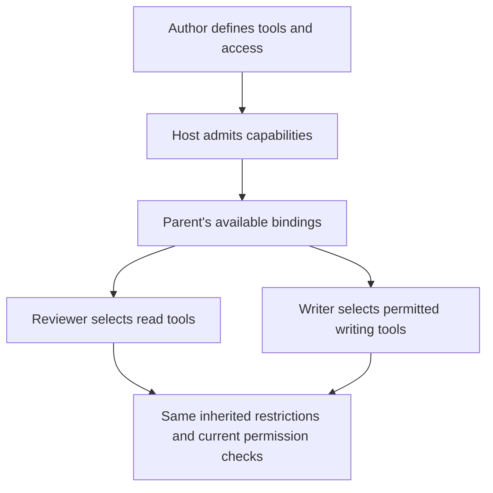

# Share tools and narrow authority

A specialist should have the capabilities its assignment needs. A documentation
reviewer may need to read tutorial files and check results, while a writer needs
an explicitly allowed way to propose or stage changes. Separating those roles
makes the workflow easier to understand and limits what each child can do.

For generated subagents, Ochat delegates existing tool bindings. The child can
choose a subset of those bindings; its instructions cannot enlarge their shell
rules, file access or tool-call authority.

## Follow a capability through the workflow

Suppose the parent has a file tool with a `docs` root and a shell tool configured
to run a tutorial checker. A generated reviewer can select the file reader alone,
or select both existing bindings if the parent can delegate them. The reviewer
does not gain a general shell merely because its instructions ask it to run one.

The same distinction applies to file access. Inheriting a configured file reader
retains its roots and checks. Naming a file outside those roots does not make it
readable. A workspace path is not a universal boundary for all tools; each
delegated implementation retains its own applicable contract.

## What a generated child can choose

| Choice | Meaning |
| --- | --- |
| Instructions | Define a task-specific role, evidence requirements and reporting format. |
| Supported model and reasoning configuration | Match the role's needs within the admitted configuration. |
| Selected inherited tool names | Use existing bindings made available for delegation, or fewer of them. |
| Supported lifecycle moderator | Add ChatML coordination within the delegated execution surface. |

A generated child does not define fresh native, shell, MCP, agent, standalone
script-tool or moderator-tool implementations. The
[ChatMD definitions reference](chatmd-authoring-definitions.md) explains the
generated-definition boundary; [root capability declarations](chatmd-authoring-capabilities.md)
explain what a human-authored root can configure beforehand.

If the role needs a capability that is not available, change the authored
configuration through the normal author/host process. Do not encode a broader
permission as a sentence in the child's prompt or a schema field and treat it as
enforced access.

## Authored dependencies and session identity

An authored specialist can carry private tool dependencies used by its own
implementation. Those dependencies do not automatically become public inherited
tools for arbitrary generated descendants. Declare the intended sharing model
explicitly and inspect admission errors rather than assuming every tool visible
somewhere in the prompt tree is delegable.

Tool names are not ambient authority. Actual calls use the caller's scoped
session context and current binding/permission checks. Retaining a session ID or
receiving an earlier approval does not grant unrestricted access to unrelated
sessions or future changed capabilities.

## Put the distinction to work

For a documentation team:

1. Give the parent approved file-reading and tutorial-checking tools.
2. Let reviewers inherit the relevant evidence-reading tools.
3. Keep any writing capability with the authored writer, or explicitly delegate
   an existing narrowly configured writing tool where supported.
4. Collect findings and proposed changes before running another check.
5. Keep lifecycle references so the parent can follow up or stop owned work.

Use [the delegation guide](subagents.md) to choose authored versus generated
specialists. For exact source capture, admission, lifetime and tool selection,
follow [persisted child agents](chatml-authoring-children.md). Static validation
helps catch invalid definitions; execution still depends on the actual host,
resources and current permissions.
