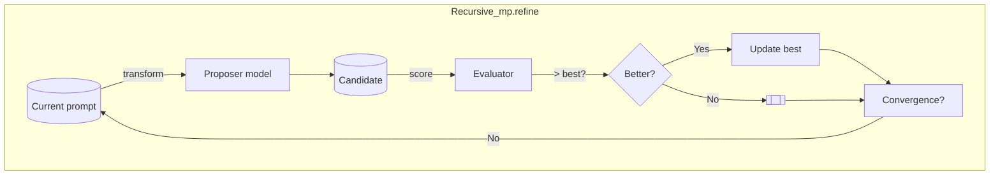

# `Mp_flow` – One-shot recursive meta-prompting helper

`Mp_flow` wraps the more general `Recursive_mp` API and exposes two
turn-key flows that cover the most common use-cases:

* **`first_flow`** — refines *general prompts* such as a system
  instruction you intend to send to Chat GPT.
* **`tool_flow`** — refines *tool descriptions* that will appear in the
  `tools` array of an OpenAI chat-completion request.

Both helpers follow the same four-step recipe:

1. **Seed prompt** – create a `Prompt_intf.t` from the caller-supplied
   `task` and `prompt` strings.
2. **Evaluator** – build a small `Evaluator.t` that uses a reward-model
   judge wrapped in *self-consistency* (`k = 6`, arithmetic mean).
3. **Parameterisation** – construct `Recursive_mp.refine_params` with
   a five-iteration budget and Thompson-sampling bandits enabled.
4. **Refinement loop** – call `Recursive_mp.refine` until the expected
   improvement becomes negligible.

The diagram below illustrates the control-flow:



## High-level API

```ocaml
val first_flow :
  env:Eio_unix.Stdenv.base ->
  task:string ->
  prompt:string ->
  ?action:Context.action ->
  unit -> string

val tool_flow :
  env:Eio_unix.Stdenv.base ->
  task:string ->
  prompt:string ->
  ?action:Context.action ->
  unit -> string
```

### Parameters

* **`env`** – Eio capability record obtained from `Eio_main.run`. All network
  IO (OpenAI calls, vector-database look-ups) is executed within this
  environment.
* **`task`** – Natural‐language description of the user task. Wrapped in a
  `<user-task>` tag so that the transformation agent always sees the full
  specification.
* **`prompt`** – The initial draft prompt (or tool description) you would like
  to improve.
* **`action`** – `Context.Generate` (default) or `Context.Update`.  Use the
  latter when you supply an existing prompt that should be edited in place.

### Return value

Both functions return the **body** of the refined prompt as a plain string.
Header, foot-notes and meta-data are handled internally.

## Usage examples

### Refining a system prompt

```ocaml
let () =
  Eio_main.run @@ fun env ->
  let improved =
    Mp_flow.first_flow
      ~env
      ~task:"Summarise a GitHub PR"
      ~prompt:"Rewrite the diff in plain English."
      ()
  in
  Format.printf "\nImproved prompt:\n%s\n" improved
```

### Refining a tool description

```ocaml
let () =
  Eio_main.run @@ fun env ->
  let improved_tool =
    Mp_flow.tool_flow
      ~env
      ~task:"Expose a translate function"
      ~prompt:"Translate text between languages."
      ()
  in
  Js_of_ocaml.Firebug.console##log (Js.string improved_tool)
```

## Known limitations / future work

* **Fixed iteration budget** – Both flows currently stop after five
  iterations or when Bayesian convergence is detected.  Making the
  limit configurable might be desirable in the future.
* **No streaming** – All OpenAI calls are performed synchronously.
  Enabling streaming could reduce perceived latency.
* **Evaluator rigidity** – The reward-model rubric is hard-coded. A more
  flexible API that allows callers to supply their own judges is under
  consideration.

## See also

* {!module:Recursive_mp}
* {!module:Evaluator}
* [OpenAI Function‐Calling documentation](https://platform.openai.com/docs/guides/function-calling)

