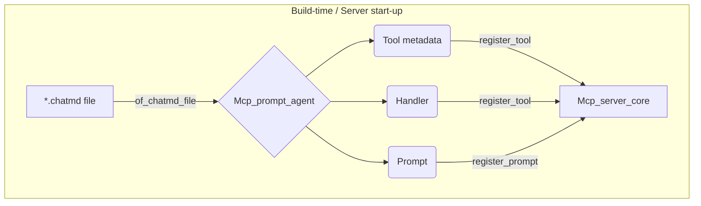

# `Mcp_prompt_agent` – wrap a *ChatMD* file as an MCP **tool** and **prompt**

> Phase-1 / Phase-2 server helper – requires the *server-core* registry to be
> available.

`Mcp_prompt_agent` is a tiny bridge between a *static* `*.chatmd` document and
the runtime entities understood by an MCP server:

| Artefact | Where it is used | Value returned by [`of_chatmd_file`](#val-of_chatmd_file) |
|----------|-----------------|----------------------------------------|
| **Tool metadata** (`Mcp_types.Tool.t`) | advertised by `"tools/list"`; invoked through `"tools/call"` | *1st component* |
| **Tool handler** (`Mcp_server_core.tool_handler`) | executes on every `"tools/call"` | *2nd component* |
| **Prompt** (`Mcp_server_core.prompt`) | listed by `"prompts/list"`, fetched via `"prompts/get"` | *3rd component* |

All three objects are derived from the file name and contents of the
`*.chatmd` document – no extra annotations are required inside the file.

---

## High-level workflow



After registration the server exposes:

* `tools/call::<file-name>` – LLMs can call the agent programmatically.
* `prompts/get::<file-name>` – clients may retrieve the original *ChatMD*
  template and show it in a UI.

---

## API Reference

### `of_chatmd_file`

```ocaml
val of_chatmd_file :
  env:Eio_unix.Stdenv.base ->
  core:Mcp_server_core.t ->
  path:_ Eio.Path.t ->
  Mcp_types.Tool.t * Mcp_server_core.tool_handler * Mcp_server_core.prompt
```

*Derives the triples described above.*

Parameters:

* `env` – the *Eio* standard environment used to resolve relative paths and
  execute external commands referenced by the prompt.
* `core` – server-side registry providing access to `notify_progress` and
  registration helpers.
* `path` – location of the `*.chatmd` file (absolute or relative to
  `env#cwd`).

Returned tuple:

1. Tool metadata – name is the file stem (without extension), description is
   currently `"ChatMD agent prompt"`, input schema is always:

   ```json
   {
     "type": "object",
     "properties": { "input": { "type": "string" } },
     "required"  : [ "input" ]
   }
   ```
2. Tool handler – a function `Jsonaf.t -> (Jsonaf.t, string) Result.t` that
   executes `Chat_response.Driver.run_agent` in a fresh `Eio.Switch`, collects
   the assistant’s reply and converts it into `Ok (`String result)`.
3. Prompt – a minimal record `{ description : string option; messages }` where
   `messages` is the raw XML representation of the *ChatMD* file.  No attempt
   is made (yet) to extract a human-readable description or sample input.

The function itself *does not* mutate the server state – the caller must add
the artefacts to the corresponding maps:

```ocaml
let tool, handler, prompt =
  Mcp_prompt_agent.of_chatmd_file ~env ~core ~path
in
Mcp_server_core.register_tool core tool ~handler;
Mcp_server_core.register_prompt core tool.name prompt;
```

### Progress reporting

The handler internally calls

```ocaml
Mcp_server_core.notify_progress
```

to send two progress events:

| Phase    | `progress` | `message`        |
|----------|------------|------------------|
| Start    | `0.0`      | "Starting agent" |
| Finished | `1.0`      | "Completed" / "Failed"|

Client applications can use the randomly generated `progress_token` (8 hex
characters) to correlate events.

---

## Usage Example

Assume the following `hello_world.chatmd` file:

```xml
<system>You are a very polite assistant.</system>
<assistant>Hello!  How can I help you today?</assistant>
```

Registering the agent during server start-up:

```ocaml
open Eio

let () =
  Eio_main.run @@ fun env ->
  let core = Mcp_server_core.create () in
  let path = Stdenv.cwd env / "hello_world.chatmd" in

  let tool, handler, prompt =
    Mcp_prompt_agent.of_chatmd_file ~env ~core ~path
  in

  Mcp_server_core.register_tool core tool ~handler;
  Mcp_server_core.register_prompt core tool.name prompt;

  Mcp_server_http.serve ~env ~core ~port:8080
```

At runtime a client can call the tool via JSON-RPC:

```jsonc
// request
{
  "id"     : 42,
  "method" : "tools/call",
  "params" : {
    "name" : "hello_world",
    "args" : { "input": "What is the weather?" }
  }
}

// response (simplified)
{
  "id"     : 42,
  "result" : "I'm afraid I don't have real-time weather data, but …"
}
```

---

## Limitations / Future work

* Only the `input` parameter is supported.  Extending the JSON schema to
  accept structured arguments would require changes in both the generator and
  the prompt template.
* The `{description}` field of the prompt is always `null`.  A future version
  may extract the first comment block or `<system>` tag.
* Errors raised inside the agent are surfaced as `Error ("…")` strings; call
  sites that ignore this may crash.  Structured error values are planned.

---

## Dependency surface

External OPAM packages used directly in this module:

* **Eio** – structured concurrency, file access, switches.
* **Core** – standard library extension (string utilities, random numbers …).

Both are part of Jane Street’s platform or the OCaml multicore ecosystem.

