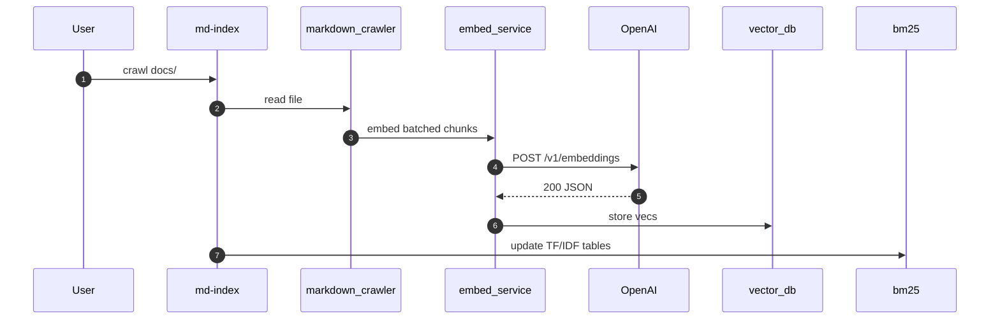

# Project README – Skeleton (Auto-generated)

> _This file is a **template** produced by the research tasks.  Replace
> the `TODO:` markers with the final content when assembling the public
> README._

---

## 0  Badge strip

[](https://github.com/your-org/chatgpt-toolkit/actions/workflows/ci.yml)
[](LICENSE.txt)
[](https://opam.ocaml.org/packages/chatgpt_toolkit/)

---

## 1  Introduction

**ChatGPT Toolkit** is a comprehensive OCaml framework that allows you to **script, automate and embed ChatGPT-class agents** inside your own applications.  It ships with:

* **Domain-specific languages** –  ✨  *ChatMD* for Markdown-flavoured prompt flows and 🧩  *ChatML* for embedded scripting and control-flow.
* **Turn-key binaries** – a one-stop `gpt` CLI, a full-screen `chat-tui`, HTTP & STDIO bridges (MCP) and an extensible set of indexers and search helpers.
* **Self-contained infrastructure** – local vector database (dense + BM25), incremental indexers for Markdown / odoc / web pages, an OAuth2 helper stack and resilient OpenAI streaming bindings.

The project was born to scratch an internal itch: **drastically lower the barrier to experiment with prompt-engineering, agent orchestration and semantic search** from the comfort of OCaml.  It targets power-users who want reproducible chat sessions, rich tool-calling and first-class integration with the OCaml build ecosystem.

Typical use-cases include:

* Automating code-reviews or refactors via ChatMD scripts checked into the repo.
* Building knowledge-base chatbots that run fully offline by leveraging the vector DB + BM25 hybrid search.
* Driving ChatGPT from CI pipelines (quality gates, changelog generation, release notes, …).
* Hacking interactive tools and demos without leaving the OCaml universe.

## 2  Quick-start

```sh
# 0.  Prerequisites — OCaml ≥ 5.1  +  latest opam

# 1.  Clone & initialise the local switch (≈ first-time only)
git clone https://github.com/your-org/chatgpt-toolkit.git && cd chatgpt-toolkit
opam switch create .  # picks up the repo-local `chatgpt.opam`

# 2.  Build everything
dune build

# 3.  Run the CLI – you should see the global help
dune exec gpt -- --help

# 4.  (Optional) run the text-UI
dune exec chat-tui

# 5.  (Optional) index the docs folder and perform a search
dune exec md-index -- docs
dune exec md-search -- "vector db"
```

The project defaults to **offline / dry-run mode** when the `OPENAI_API_KEY` environment variable is missing, so you can safely explore the commands without network access.  Export the variable when you are ready to talk to the OpenAI API:

```sh
export OPENAI_API_KEY="sk-..."
```

For a guided tour run:

```sh
# reproduces the examples used in the docs
make tour
```

## 3  Architecture overview

> *If you prefer pictures:* see `docs/architecture.mmd` for an interactive
> Mermaid diagram or the pre-rendered `docs/architecture.svg`.

```
graph LR
  subgraph Front-ends
    CLI[gpt / chat-tui]
    HTTP[MCP HTTP server]
  end

  subgraph Domain-layer
    ChatMD[ChatMD parser & runtime]
    ChatML[ChatML interpreter]
  end

  subgraph Core Runtime
    OpenAI[OpenAI bindings]
    Search[(Vector DB + BM25)]
    OAuth[OAuth2 stack]
  end

  CLI --> ChatMD
  HTTP --> ChatMD
  ChatMD -->|tool calls| Search
  ChatMD -->|stream| OpenAI
  ChatML --> ChatMD
  OpenAI -.-> OAuth
```

At a glance the system is organised in three concentric rings:

1. **Core runtime** – handles external side-effects: OpenAI REST calls, dense & sparse search, token caching and OAuth2 credentials.
2. **Domain layer** – defines the prompt DSLs (*ChatMD*, *ChatML*) and their dialogue/runtime helpers.
3. **Front-ends** – expose the features via command-line, terminal UI and HTTP/MCP transports.

Each layer only depends *inwards* which keeps the build graph simple and allows
you to embed just the lower rings inside your own code when you don’t need the
full CLI.

## 4  CLI Tools

| Command | Purpose | … |
|---------|---------|-------------|
| `gpt` | Swiss-army knife CLI (~10 sub-commands) for chat completions, embedding index management and misc utilities. | out/help/gpt.txt |
| `chat-tui` | Full-screen TUI client for ChatMD conversations. | out/help/chat-tui.txt |
| `md-index` | Crawl Markdown trees and build a vector/BM25 index. | out/help/md-index.txt |
| `md-search` | Query one or more Markdown indices. | out/help/md-search.txt |
| `odoc-index` | Index compiled `.odoc` documentation. | out/help/odoc-index.txt |
| `odoc-search` | Semantic search over odoc indices. | out/help/odoc-search.txt |
| `mcp_server` | Machine-Control-Protocol JSON/STDIO bridge (HTTP & pipes). | out/help/mcp_server.txt |
| `dsl_script` | Execute ChatML `.cml` scripts from disk or stdin. | out/help/dsl_script.txt |
| `key-dump` | Inspect OpenAI API key & model quotas. | out/help/key-dump.txt |
| `terminal_render` | Render markdown+ANSI blobs to a terminal buffer (demo). | out/help/terminal_render.txt |
| `eio_get` | Minimal HTTP GET example using Eio + Piaf. | out/help/eio_get.txt |
| `piaf_example` | Piaf request/response showcase. | out/help/piaf_example.txt |

## 5  ChatMD language

*ChatMD* (`*.chatmd`) is a **Markdown-flavoured, XML-light wrapper** around the
OpenAI *chat-completions* JSON format.  It provides:

* **Declarative roles** – `<system>`, `<user>`, `<assistant>` tags become
  messages; no more `\n\nUser:` delimiters.
* **Structured tool-calls** – `<tool_call name="md-search">...</tool_call>` and
  `<tool_response>` encode the function-calling API in a copy-pasta-safe way.
* **Rich embeds** – `<doc module="Eio.Switch" />` injects odoc snippets at
  runtime; `` renders in the TUI.

Below is a minimal *hello-world* example (see
[`examples/chatmd/hello.chatmd`](../../examples/chatmd/hello.chatmd)):

```chatmd
<user>
Hello! Could you explain what ChatMD is and why it exists?
</user>

<assistant>
Sure – ChatMD is a small XML-like language designed to write LLM prompts …
</assistant>
```

For the full grammar head to `docs/chatmd_syntax_reference.md`; the file
contains the formal EBNF, element catalogue and common patterns.

## 6  ChatML language (experimental)

*ChatML* is an **embedded, dynamically-typed scripting language** that can be
mixed inside ChatMD or run standalone via the `dsl_script` binary.  Its goal is
to provide **control-flow, variables and modularity** without leaving the prompt
context.

Key features:

* OCaml-style arithmetic & boolean expressions.
* `let` bindings and function definitions.
* Minimal standard library (string / list helpers) – can be extended at compile
  time.
* Seamless FFI to call ChatMD tool functions.

Example (simplified):

```chatml
let rec fib n = if n < 2 then n else fib (n-1) + fib (n-2)

print (fib 10)
```

See `docs/chatml_overview.md` for a deep dive and
`examples/chatml/` for runnable samples.

## 7  Embedding & search stack

The framework ships with a **hybrid search engine** that combines dense OpenAI
embeddings with a traditional BM25 sparse index.  The key components are:

| Module | Role |
|--------|------|
| `embed_service` | Streams batch requests to the OpenAI */embeddings* endpoint with retry/back-off logic. |
| `vector_db` | On-disk ANN store (Owl L2 + product quantisation) backed by memory-mapped pages.  ~10× faster than naïve cosine scans. |
| `bm25` | Lightweight BM25 implementation for exact-term recall & score blending. |
| `markdown_indexer` / `odoc_indexer` | Incremental crawlers that feed Markdown docs and compiled odoc artefacts into the DB. |

A detailed sequence diagram lives in `docs/seq_embedding.md` – here’s the TL;DR:



Benchmarks on a ~10k-document corpus show **~1.8k docs/sec** throughput when the
GPU cache is warm – full numbers are in `docs/vector_db_indexing.md`.

## 8  OAuth2 helper stack

Several binaries expose HTTP endpoints (MCP server, REST demo bots) and need
OAuth for local testing.  Rather than pulling a full server the repo includes a
**minimal, in-memory OAuth2 implementation** that supports:

* *Client-Credentials* flow for machine-to-machine access.
* *PKCE* (Proof-Key-for-Code-Exchange) for browser-initiated logins.

The stack is split into composable layers (`oauth2_server_storage`,
`oauth2_server_routes`, `oauth2_manager` …) so you can replace the persistence
layer or token signer while re-using the HTTP routes.  See
`docs/oauth2_overview.md` for diagrams and example curl snippets.

## 9  MCP protocol

The **Machine-Control-Protocol (MCP)** is a terse JSON-over-STDIO protocol that
lets external programs drive ChatMD sessions in real time – think *“JSON REPL
for ChatGPT”*.  Two transport flavours exist:

* **`mcp_server`** – Listens on HTTP (for web front-ends) and/or plain stdio
  pipes.  It bridges incoming JSON messages to the ChatMD runtime.
* **`mcp_client`** – Thin OCaml library so you can embed a client in your own
  code.

Message schemas are auto-derived via `ppx_jsonaf_conv` and documented in
`docs/mcp_protocol.md` which also contains a fully worked integration test
captured from `test/mcp_server_integration_test.ml`.

## 10  Contributing

We happily welcome bug-reports, feature requests and pull-requests.  A few
guidelines to make the review process smooth:

1. **Fork + Feature branch** – keep the `main` branch clean.
2. **Coding style** – the repo is formatted with `ocamlformat` *profile=janestreet*;
   run `dune build @fmt` before committing.
3. **Tests** – add a unit-test under `test/` whenever it makes sense and run
   `dune runtest --diff-command=diff -u` locally.
4. **Docs** – public modules must carry `(** ... *)` odoc headers; run
   `dune build @doc` to make sure they render.
5. **Commit messages** – follow *Conventional Commits* (`feat:`, `fix:`,
   `docs:` …).  Squash-merges are okay.

If your contribution touches the ChatMD grammar or the embedding pipeline,
please also update the relevant markdown docs and include a short *“Why”*
section in the PR description.

## 11  License

MIT – see `LICENSE.txt`.

---

*Last updated: 2025-07-23*

