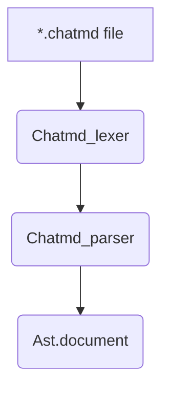
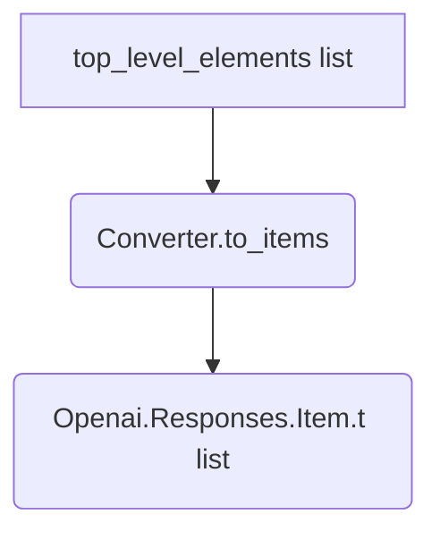
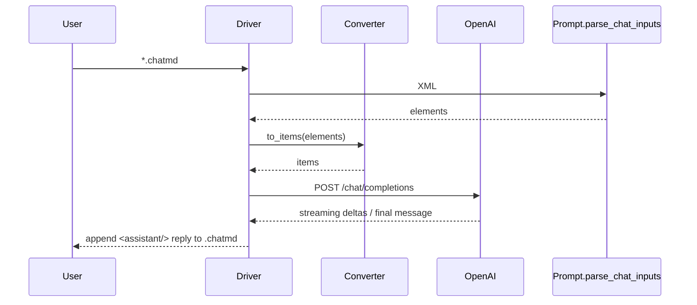

# ChatMD → OpenAI Pipeline

This document traces **every major transformation step** that turns a
user-authored `*.chatmd` file into the JSON payload sent to the
OpenAI *Chat Completions* API.

The information is gathered from the source code of the following
modules (links point to their implementation paths):

* `lib/chatmd/chatmd_lexer.mll` – tokeniser (Menhir-compatible).
* `lib/chatmd/chatmd_parser.mly` – Menhir grammar ⇒ *Document* AST.
* `lib/chatmd/prompt.ml` – import expansion, normalisation and
  `parse_chat_inputs` helper.
* `lib/chat_response/converter.ml` – `top_level_elements` ⇒
  `Openai.Responses.Item.t` conversion.
* `lib/chat_response/driver.ml` – orchestration & streaming loop.

For a **running example** see
`examples/chatmd/hello.chatmd` and the dry-run JSON captured in
`out/chatmd/hello.json`.

---

## 1. Parsing the source document



1. **Lexing** – `Chatmd_lexer` tokenises the input stream; the grammar
   looks very similar to XML but relaxed (self-closing tags, optional
   attributes etc.).
2. **Parsing** – `Chatmd_parser` (Menhir) builds a
   `Chatmd_ast.document` value – a forest of `Text` and `Element`
   nodes that still mirrors the original markup.

The output of this stage is a *lossless* representation – no
information is discarded so that pretty-printing round-trips.

## 2. Import expansion & normalisation

`Prompt.Import_expansion.expand_imports` walks the `Ast.document` and
recursively inlines:

* `<import src="path.chatmd"/>` – includes are resolved relative to the
  current file’s directory;
* nested prompts brought in by `<agent src="…"/>` (at this point they
  are *not* executed, only parsed).

After expansion the tree is passed to
`Prompt.chat_elements`/`parse_chat_element` which collapse low-level AST
nodes into *semantic* variants such as `User_msg`, `Assistant_msg`,
`Tool_call_msg`, `Config`, …

The helper `parse_chat_inputs ~dir` is the **single public entry point**:

```ocaml
let elements = Prompt.Chat_markdown.parse_chat_inputs ~dir prompt_xml
```

It returns a value of type:

```ocaml
type top_level_elements =
  | User of user_msg
  | Assistant of assistant_msg
  | Tool_call of tool_call_msg
  | Tool_response of tool_response_msg
  | Developer of developer_msg
  | System of system_msg
  | Config of config
  | Reasoning of reasoning
  | Tool of tool_decl
```

## 3. Conversion to OpenAI ‘Item’ records



`Converter.to_items` (in `lib/chat_response/converter.ml`) performs a
pure mapping except for two side-effects:

1. **Resource fetching** – `<doc src="…"/>` and remote images are
   downloaded (or stripped of HTML) via `Fetch.get / get_html` so that
   the assistant receives the actual content, not just a URL.
2. **Nested agents** – `<agent …>` elements are executed lazily through
   the callback `~run_agent` provided by the caller (see next section).

Each ChatMD element becomes a rich [`Openai.Responses.Item.t`]
variant:

* input/output messages (`Input_message`, `Output_message`),
* `Function_call`, `Tool_call`, `Tool_response`, …

All records carry `[@@deriving jsonaf]` so serialisation to the final
JSON is automatic.

## 4. Response loop & streaming

`Driver.run_completion{,_stream}` coordinates the actual API calls:

1. Extract `<config/>` block → `Openai.Responses.Request.t`.
2. Discover tools (`<tool …/>`, remote MCP, built-ins).
3. Feed items to `Response_loop.run` which:
   * posts the request via `Openai.Client.post_chat_completions`,
   * handles streaming deltas (if requested),
   * recursively resolves function / tool calls by invoking `Fork.run`
     or the user-supplied external process.



## 5. Caching & memoisation

The pipeline is designed to be *idempotent* and efficient:

* **LRU cache** – `chat_response/cache.ml` memoises network requests
  (agent outputs, fetched docs) across runs;
* **On-disk buffer** – the driver appends assistant answers back into
  the same `.chatmd` file so interrupted sessions can resume.

## 6. Error handling & diagnostics

* Parser errors bubble up with precise line/column positions thanks to
  Menhir’s `%positions` directive.
* Runtime failures (network, unknown tools) are captured by
  `Response_loop` and rendered inside `<error/>` elements so that the
  user sees them inline in the conversation buffer.

---

### Cheat-sheet – Where to hook custom logic?

| Stage | Module | Typical extension |
|-------|--------|-------------------|
| Parsing | `chatmd_parser.mly` | New tag or attribute |
| Normalisation | `prompt.ml` | Extra import mechanism |
| Conversion | `converter.ml` | Custom content kind |
| Response loop | `response_loop.ml` | Alternative retry policy |

---

*Last updated: <!--DATE-->*

