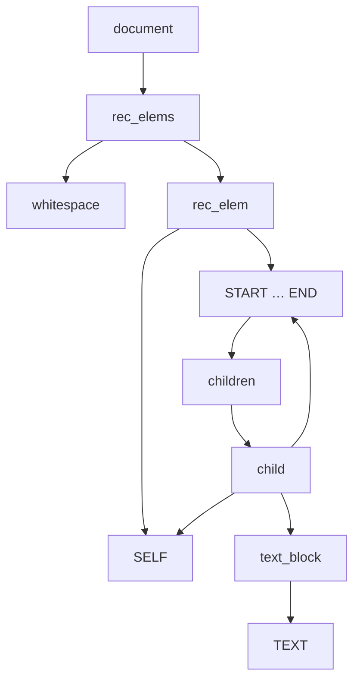

# ChatMD – Syntax Reference (Draft)

> **Status:** WORK-IN-PROGRESS – generated by the *README Research* effort to
> serve as the foundation for the upcoming formal specification.  Expect
> breaking changes and TODO markers.

---

## 1. Overview

ChatMD (Chat Markdown) is a *minimal, XML-inspired* markup designed for
authoring conversational prompts.  It purposely restricts the surface area to
keep parsing predictable while still allowing rich, structured interactions
with LLM-powered agents.

Key design principles:

* **Closed set of elements** – only the roles and constructs needed by the
  runtime are first-class.  Unknown tags are preserved as plain text so the
  language can coexist with arbitrary HTML/XML snippets.
* **Loss-free round-trip** – every byte of the source document survives
  parsing → AST → regeneration.
* **Easy authoring in editors** – syntax is close to familiar HTML but omits
  optional end-tags where possible.

---

## 2. Elements

The following element names are *reserved* and recognised by the lexer:

| Element | Purpose |
|---------|---------|
| `<msg>` (root) | Generic message container.  Sub-elements or the `role` attribute clarify intent. |
| `<user>` | Forces `role="user"` on the underlying `<msg>`.  Convenience shorthand. |
| `<assistant>` | Analogous to `<user>` but with `role="assistant"`. |
| `<agent>` | Message authored by an external programmatic tool. |
| `<system>` | System instruction visible to the LLM but hidden from the end-user. |
| `<developer>` | Maintainer comment; excluded from final prompt. |
| `<doc>` | Embeds documentation snippets (code, odoc, markdown). |
| `` | Inline image reference, self-closing. |
| `<import>` | Re-use cached snippets by logical identifier. |
| `<config>` | Per-message configuration overrides (model, temperature…). |
| `<reasoning>` | Segment earmarked for *hidden* chain-of-thought reasoning. |
| `<summary>` | Agent’s final answer derived from `<reasoning>`. |
| `<tool_call>` | Structured invocation sent to an external tool. |
| `<tool_response>` | Response payload from the tool. |
| `<tool>` | *Declaration* of an available tool (name, schema, etc.). |

All other tags are parsed as raw text.

### 2.1 Self-closing vs block elements

* `` and `<tool />` are typically **self-closing** because their
  semantics are carried entirely in attributes.
* Every element *can* be written in self-closing form if it has no children.

---

## 3. Attributes

* Attribute names are **case-sensitive**.
* Flag attributes (`disabled`) are represented by `name` with no value.
* Quoted values may use `'` or `"`.  The lexer decodes the basic entities
  `&amp;`, `&lt;`, `&gt;`, `&quot;`, `&apos;`.

Common attributes:

* `role` – one of `user | assistant | system | developer | agent`.
* `id`  – stable identifier for `<doc>` / `<import>` cross-reference.
* `src` – URL or data URI used by ``.

---

## 4. Raw blocks

Any content placed between `RAW|` *…* `|RAW` is passed through **verbatim**
without further tokenisation.  This escape hatch is intended for snippets that
contain untrusted XML/HTML or large code blocks.

Example:

```chatmd
RAW|
<complexSnippet lang="mermaid">
  graph TD;
  A --> B;
|RAW
```

---

## 5. Whitespace & text nodes

* Insignificant whitespace at the *top level* is ignored; inside elements it
  is preserved verbatim.
* Consecutive character data segments are merged into a single `Text` node.

---

## 6. Grammar (formal EBNF)

The following Extended-BNF is a faithful transcription of the Menhir grammar
(`lib/chatmd/chatmd_parser.mly`).  Non-terminals are in **bold**, terminals are
in *italics*.

```ebnf
document          =  rec_elems , *EOF* ;

rec_elems         =  { whitespace | rec_elem } ;

whitespace        =  *TEXT_WS* ;            (* a TEXT token containing only U+0020 / U+0009 / U+000A / U+000D *)

rec_elem          =  *SELF*
                 |  *START* , children , *END* ;

children          =  { child } ;

child             =  text_block
                 |  *SELF*
                 |  *START* , children , *END* ;

text_block        =  *TEXT* , { *TEXT* } ; (* one or more consecutive TEXT tokens *)
```

### 6.1 Token glossary

| Token | Shape | Notes |
|-------|-------|-------|
| *START* | `<tag …>` | Opening tag.  Carries the parsed *tag* enum and the attribute list. |
| *SELF*  | `<tag … />` | Self-closing element.  Semantically equivalent to `START … END` with empty children. |
| *END*   | `</tag>` | Closing tag – the lexer guarantees the name has been resolved to a known `tag` constructor. |
| *TEXT*  | character data | Arbitrary UTF-8 text (entities already decoded).  Multiple contiguous tokens are merged by the grammar. |
| *TEXT_WS* | whitespace | Specialisation of *TEXT* whose payload is **only** whitespace.  Filters top-level spacing. |
| *EOF*   | – | End-of-file marker inserted by the lexer. |

### 6.2 Mermaid diagram



The diagram highlights the tail-recursive structure that allows any element to
nest arbitrarily deep.

---

## 7. Examples

### 7.1 Classic Q/A

```chatmd
<msg role="user">How do I reverse a list in Python?</msg>
<assistant>
Use slicing:

```python
my_list[::-1]
```
</assistant>
```

### 7.2 Tool interaction

```chatmd
<tool name="weather" args_schema="{city:string}">Get weather</tool>

<user>What's the weather in London?</user>

<tool_call name="weather" city="London" />

<tool_response name="weather">
  {"temp": 23, "unit": "C"}
</tool_response>

<assistant>The temperature in London is 23 °C.</assistant>
```

---

## 8. Roadmap & open questions (to be addressed)

* Namespaces?  Currently banned but may be useful for vendor extensions.
* Attribute value *expressions* (e.g. `$(var)`) for ChatML integration.
* Official syntax for including non-UTF-8 binary payloads.

---

_Last updated: 2025-07-23_

