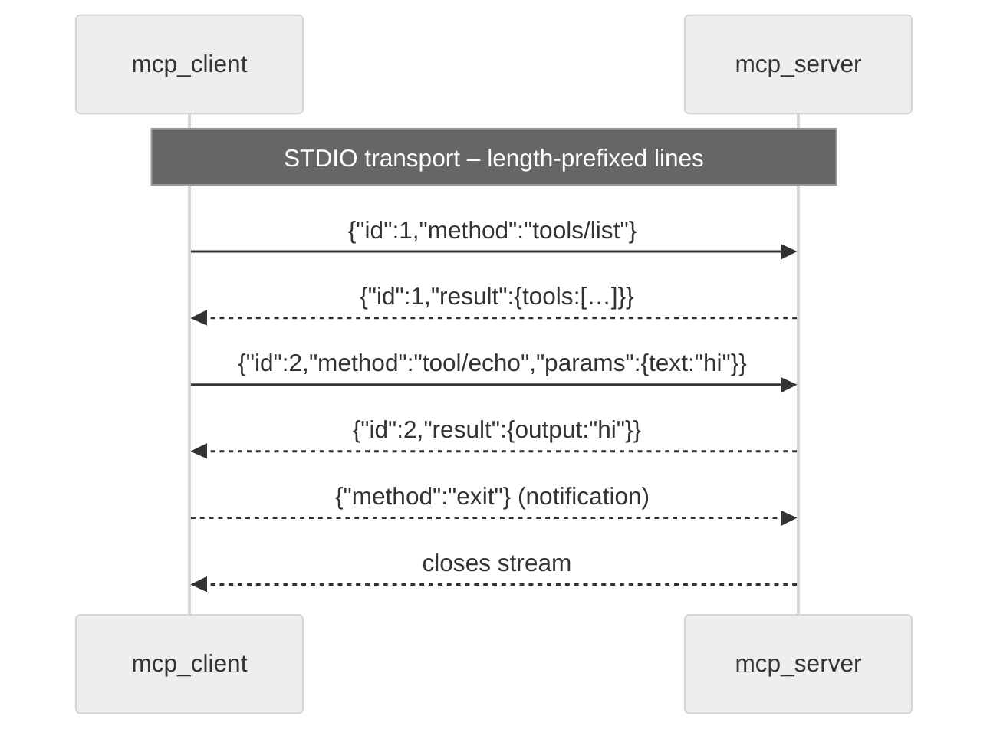

# Machine Control Protocol (MCP) – Overview

The **Machine Control Protocol** provides a *uniform, transport-agnostic
JSON-RPC* interface that external tools can use to control ChatGPT-based
agents.  In this repository MCP powers:

* the `mcp_server` / `mcp_client` pair for local scripts,
* the `mcp_tool` integration that exposes ChatGPT **functions** to remote
  clients,
* and the ChatMD prompt‐agent which turns `.chatmd` files into long-lived
  sessions.

The implementation is purposely *thin* – it defers persistence and
multi-tenant security to higher-level services.

Table of contents

1. Data model (`mcp_types.ml`)
2. Transports  
   2.1  STDIO (default)  
   2.2  HTTP/WebSockets  
3. Message flow (sequence diagram)
4. Example tool invocation
5. Extending the schema

---

## 1  Data model

`lib/mcp/mcp_types.ml` derives JSON (de)serialisers via `ppx_jsonaf_conv`
for all records.  Key entities:

* **JSON-RPC v2.0** envelope  – `Jsonrpc.request` / `response`
* **Capabilities**            – sent by both endpoints at connect time to
  advertise optional features (`tools`, `prompts`, `resources`).
* **Tool metadata**           – name, description & JSON-Schema-like
  `input_schema` returned by `tools/list`.
* **Tool call result**        – wrapper distinguishing
  `Ok Jsonaf.t` / `Error {code; message}`.

```ocaml
module Jsonrpc = struct
  type request = {
    jsonrpc : string ;    (* always "2.0" *)
    id      : Id.t ;      (* string | int *)
    method_ : string ;
    params  : Jsonaf.t option ;
  }
end
```

## 2  Transports

### 2.1  STDIO – `Mcp_transport_stdio`

*Each JSON-RPC envelope is framed as a length-prefixed line (`<len>\n<json>`)*.
This keeps the parser trivial while allowing binary payloads in the future.

```text
34\n{"jsonrpc":"2.0","id":1,"method":"ping"}
```

### 2.2  HTTP/WebSockets – `Mcp_transport_http`

Used by the TUI for bidirectional streaming in browser demos.  The HTTP
upgrade establishes a WebSocket whose text frames contain the very same
JSON strings exchanged by the STDIO variant.

The router is implemented in `mcp_server_router.ml`; Dream is the current
backend but can be swapped thanks to the small surface.

## 3  Message flow

Below diagram depicts a *tool call* round-trip over the STDIO transport.



## 4  Example session (STDIO)

```text
# client ─» server
38\n{"jsonrpc":"2.0","id":1,"method":"ping"}

# server ─» client
36\n{"jsonrpc":"2.0","id":1,"result":"pong"}

# Error example
83\n{"jsonrpc":"2.0","id":2,"method":"tool/unknown","params":null}
109\n{"jsonrpc":"2.0","id":2,"error":{"code":-32601,"message":"Unknown tool"}}
```

## 5  Extending the schema

1. Add new fields to the corresponding record in `mcp_types.ml`.  
2. Re-run `dune build` – `ppx_jsonaf_conv` regenerates the JSON encoder/
   decoder automatically.  
3. Update the client/server switch statements (pattern-matching on
   `method_`) to handle the new method.

Backwards compatibility note: all records are annotated with
`[@@jsonaf.allow_extra_fields]` so new fields arriving from the wire are
silently ignored by older binaries.

---

*Last updated: {{date}}*

