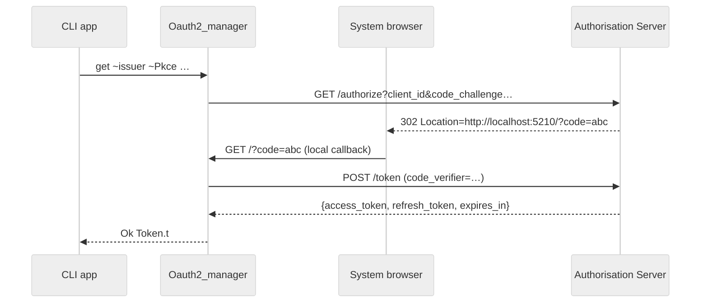

# OAuth 2.0 Helper Stack – Architectural Overview

This document provides a **bird’s-eye view** of the OAuth 2.0 support
shipped with this repository.  The implementation is intentionally
light-weight – it targets *automation scripts* and *desktop / CLI apps*,
not full-blown Web servers – yet still covers the two grant types
required by the rest of the code-base:

* **Client-Credentials Grant** – machine-to-machine authentication used by
  background services or CI jobs.
* **PKCE† (Proof-Key for Code Exchange) Flow** – interactive login for
  public clients that cannot keep a secret (desktop / CLI tooling).

> † Pronounced “pixie”.  Defined in RFC 7636, PKCE augments the classic
> *authorisation-code* grant with one round-trip proof to mitigate code
> interception.

Table of contents

1. Module map
2. Data model (`Oauth2_types`)
3. HTTP helper (`Oauth2_http`)
4. Grant-type helpers
   1. Client Credentials (`Oauth2_client_credentials`)
   2. PKCE (`Oauth2_pkce_flow`)
5. High-level manager (`Oauth2_manager`)
6. Server-side stubs (in-memory demo implementation)
7. Sequence diagrams

---

## 1  Module map

```
oauth/
├── oauth2_types.ml                    ── Immutable record types
├── oauth2_http.{ml,mli}               ── Thin wrapper around Piaf / Eio HTTP
├── oauth2_client_credentials.ml       ── RFC 6749 §4.4 implementation
├── oauth2_pkce_flow.ml                ── Interactive “pixie” flow
├── oauth2_manager.ml                  ── High-level cache + refresh layer
├── oauth2_server_types.ml             ── DTOs shared by the toy server
├── oauth2_server_storage.ml           ── In-memory data-store
├── oauth2_server_routes.ml            ── Router for Dream/Tyxml demo server
└── …
```

Libraries exposed via `dune`:

* `chatgpt.oauth`   – all client-side helpers (`oauth/` directory).
* `chatgpt.oauth_server` – miniature in-process AS used by tests & examples.

## 2  Data model – `Oauth2_types`

Central types:

* `Token.t` – access-token + optional refresh-token, `obtained_at` stamp,
  `expires_in` (seconds).  Convenience `is_expired` predicate.
* `Metadata.t` – subset of the [RFC 8414] discovery document – only
  `authorization_endpoint`, `token_endpoint`, `registration_endpoint` are
  required by the helper stack.

All records derive `ppx_jsonaf_conv` so they serialise to / from JSON with
**zero boiler-plate**.

## 3  HTTP helper – `Oauth2_http`

Thin façade over **Piaf** / Eio networks:

* `get_json ~env ~sw url` – perform GET and decode JSON body.
* `post_form ~env ~sw url params` – `application/x-www-form-urlencoded`
  POST returning JSON.

Retries and time-outs are delegated to the upstream `Piaf.Client` which is
already configured with sensible defaults elsewhere in the project.

## 4  Grant-type helpers

### 4.1  Client Credentials – `Oauth2_client_credentials`

Implements the simple machine-to-machine flow from RFC 6749 §4.4:

```ocaml
let get ~env ~sw ~issuer ~client_id ~client_secret ~scope =
  let params =
    [ "grant_type",    "client_credentials" ;
      "client_id",     client_id           ;
      "client_secret", client_secret        ]
    @ Option.value_map scope ~default:[] ~f:(fun s -> [ "scope", s ])
  in
  Oauth2_http.post_form ~env ~sw (issuer ^ "/token") params
  |> Result.map ~f:Oauth2_types.Token.t_of_jsonaf
```

Returns `Token.t` if the AS responds with 200.

### 4.2  PKCE Flow – `Oauth2_pkce_flow`

1. Generates *code-verifier* (128 bit random) and SHA256 *code-challenge*.
2. Opens the system browser at:

   ```text
   {authorization_endpoint}?response_type=code&client_id=…&code_challenge=…
   ```

3. Spins up a **one-shot local HTTP server** on `localhost:5210` waiting
   for the AS to redirect back with `?code=`.
4. Exchanges that code + verifier for an access / refresh token at
   `token_endpoint`.

The helper is *non-interactive* on the command line – the only user action
is completing the login in the browser window that pops up.

## 5  High-level cache + refresh – `Oauth2_manager`

`Oauth2_manager.get` wraps the two flows above adding:

* **`$XDG_CACHE_HOME`** persistence – token JSON is stored under
  `~/.cache/ocamlgpt/tokens/<md5(issuer)>.json` with `0600` permissions.
* Automatic **refresh-token** exchange when the token is about to expire
  (less than 60 s remaining).
* Graceful fallback when the AS does not expose a discovery document – it
  guesses the common `/authorize`, `/token` and `/register` endpoints.

The function never raises – all error paths return `Result.Error msg` so
callers can decide how to degrade.

## 6  Server-side stubs (for tests & demos)

To keep integration tests self-contained the repo ships a minimal OAuth 2
server implemented on top of Dream:

* `Oauth2_server_storage` – in-memory tables keyed by `(client_id, user)`.
* `Oauth2_server_routes`  – HTTP handlers for `/authorize`, `/token`,
  `/register` that understand the subset needed by clients.

They are **NOT** production grade – no database, no UI – but sufficient to
exercise both grant types in CI.

## 7  Sequence diagrams

Below is a high-level view of the PKCE flow as handled by the helper
stack.  Compared to the IETF spec the only simplification is the absence
of the user-info endpoint, which is irrelevant for access tokens.



---

### Further reading

* [RFC 6749] – The OAuth 2.0 Authorisation Framework
* [RFC 7636] – Proof Key for Code Exchange by OAuth Public Clients
* [RFC 8414] – OAuth 2.0 Authorisation Server Metadata

---

*Last updated: {{date}}*

