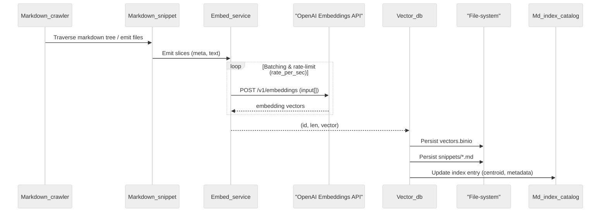

# Embedding Pipeline – Sequence Diagram

This diagram visualises the **end-to-end flow** when running the Markdown indexer (`bin/md_index.exe`).  Each component is an OCaml module, wired together under Eio’s structured-concurrency model:

1. **Markdown_crawler** streams files from the target directory.
2. **Markdown_snippet** slices each document into ~64-320 token windows with stable IDs.
3. **Embed_service** batches windows, enforces `rate_per_sec`, and retries transient errors before calling the OpenAI Embeddings REST endpoint.
4. **Vector_db** persists raw vectors to `vectors.binio` alongside the Markdown body for later retrieval.
5. **Md_index_catalog** maintains a small manifest per index (name, description, centroid vector) used by search tools to shortlist candidate indexes.

The pipeline is **idempotent**: unchanged snippets are detected via their stable hash and skipped on re-runs.

