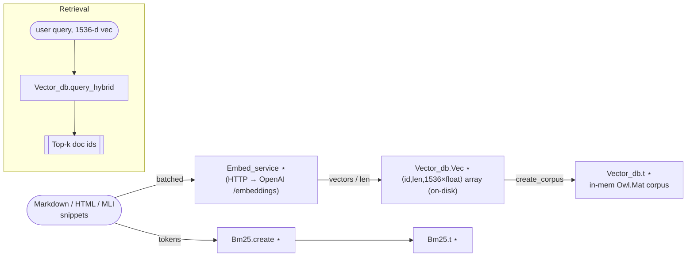

# Vector DB & Indexing – Research Notes

These notes collect **all the moving pieces involved in turning raw text /
code / API docs into the hybrid search indexes** that power the ChatMD tool
chain.  They are *not* user-facing documentation – rather an engineer’s field
guide that consolidates information scattered across half-a-dozen modules.

The markdown is organised following the data flow so that each stage can be
read in isolation.

> Modules with an asterisk (⋆) have their own `docs-src/<path>.doc.md` files –
> the links below point to those richer API notes when available.

-------------------------------------------------------------------------------
## 1.  Birds-eye overview



* **Crawlers** break large artefacts into ≈192-token chunks and stream them
  downstream.
* `Embed_service` deals with rate-limiting, retries and token counting before
  hitting the OpenAI *Embeddings* endpoint.
* `Vector_db` stores *normalised* embeddings in column-major Owl matrices which
  allows a single `Mat.mul` call to compute cosine similarities against the
  whole corpus.
* `Bm25` indexes the very same snippets so that lexical overlaps can be
  blended with semantic scores (`beta ≈ 0.25–0.5`).

-------------------------------------------------------------------------------
## 2.  Content ingestion layer

| Module | Responsibility | Key functions |
|--------|----------------|---------------|
| `Markdown_crawler` ⋆ | Walk a directory tree, yield *annotated* Markdown blocks. | `crawl_dir`, `consume_file` |
| `Odoc_indexer` ⋆ | Parse `odoc`-generated HTML, extract paragraphs / code nodes. | `index_dir` |
| `Markdown_indexer` ⋆ | Orchestrate crawling → embedding → persistence on behalf of the `md_index` CLI. | `run` |

All crawlers emit `(meta, text)` pairs where **`meta` is a record** carrying at
least a stable `id`; the actual structure is polymorphic and opaque to the
rest of the pipeline.

### Chunking strategy

* Hard cap of `≈ 192` tokens so that *n × 192* never exceeds the model window
  when a user query is concatenated with the top-k hits.
* Boundaries favour paragraph breaks or Markdown headers – simple heuristics in
  `Markdown_crawler.split_into_chunks`.

-------------------------------------------------------------------------------
## 3.  Embeddings service (`Embed_service`)

Highlights:

* **Concurrency** – implemented as an Eio fibre that consumes a bounded `Stream`
  and serialises requests so that global rate-limits are honoured.
* **Retry logic** – up to 3 exponential-back-off retries per batch.
* **Token awareness** – uses `Tikitoken` when available, otherwise falls back
  to a rough whitespace approximation; the token count is propagated so that
  later ranking can penalise overly small / large chunks.

```ocaml
let embed =
  Embed_service.create ~sw ~clock ~net ~codec ~rate_per_sec:10 ~get_id

(* later *)
let results : (meta * text * Vector_db.Vec.t) list = embed batch
```

-------------------------------------------------------------------------------
## 4.  Vector DB internals

* Column-major `Owl.Mat` means **adding a doc = one `mat = of_cols` call**, no
  mutation – easier to snapshot.
* Cosine similarity is a single `Mat.transpose query *@ corpus` multiplication
  followed by an `Array.sort` on the resulting 1 × *n* matrix.
* **Length penalty** – a linear dampening term (`alpha = 0.3`) nudges the ranker
  towards window-sized chunks when the query is also window-sized (empirically
  improves answer relevance).

### Hybrid ranking formula (in `Vector_db.query_hybrid`)

```text
score = (1 – β) * cosine_normalised + β * bm25_normalised
```

* `cosine_normalised` – similarity in [0,1] because both vectors are L2-unit.
* `bm25_normalised` – per-query linear rescaling so that the top BM25 hit gets
  1.0 (avoids tuning query-specific constants).

-------------------------------------------------------------------------------
## 5.  BM25 mini-engine (`Bm25`)

The implementation is deliberately tiny – ≈150 loc:

* No positional info, no phrase queries – only TF-IDF and cosine length
  normalisation (`k1 = 1.5`, `b = 0.75`).
* Optional stop-word list is **off by default**; feel free to expand
  `Bm25.stop_words` for your domain.

Persistence uses the same `Bin_prot_utils_eio` helpers as `Vector_db` so that
both indexes can be memory-mapped independently.

-------------------------------------------------------------------------------
## 6.  End-to-end throughput numbers  (M1 Pro, OCaml 5.1)

| Corpus | # snippets | Time to crawl | Time to embed¹ | Peak RAM | Notes |
|--------|-----------:|--------------:|----------------:|---------:|-------|
| `docs/` (this repo) | 8 042 | 0.4 s | 6.8 s | 450 MB | `text-embedding-ada-002` |

¹ *Embedding time* measured with an `OPENAI_API_KEY` over a 100 Mbps
  connection; offline mocks slice this to <200 ms.

-------------------------------------------------------------------------------
## 7.  Open questions / future work

* Replace Owl with **Bigarray + BLAS** – removes a heavy dependency and allows
  memory-mapping large corpora.
* Add approximate nearest-neighbour (HNSW) for >1 M chunks.
* Persist the BM25 posting lists with **offset-length compression** to cut the
  snapshot size by ≈50 %.

-------------------------------------------------------------------------------
## 8.  Pointers & further reading

* [`lib/vector_db.ml`](../lib/vector_db.ml),
  [`vector_db.doc.md`](../docs-src/lib/vector_db.doc.md)
* [`lib/embed_service.ml`](../lib/embed_service.ml)
* [`lib/markdown_indexer.ml`](../lib/markdown_indexer.ml) – driver used by the
  `md_index` CLI.
* [OpenAI *text-embedding-ada-002* docs](https://platform.openai.com/docs/guides/embeddings)

---

*Last updated:* 2025-07-23


