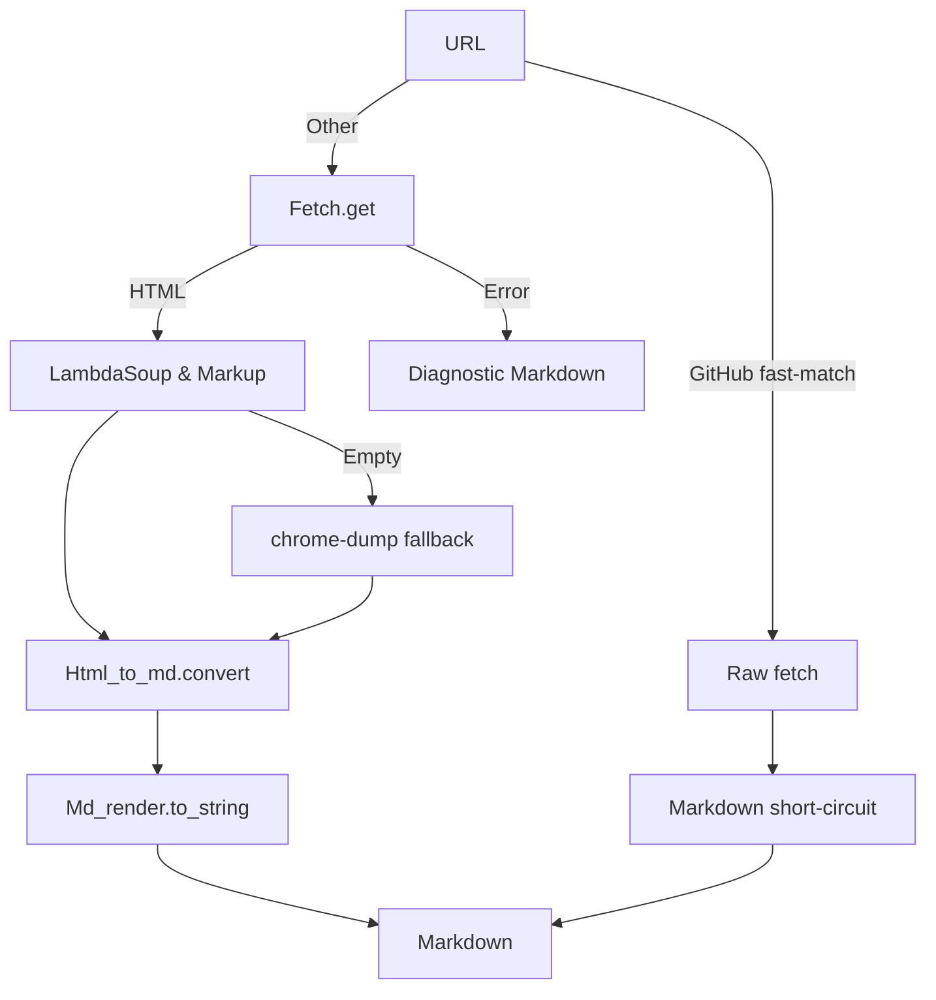

Webpage_markdown.Driver – Web-page → Markdown converter
=======================================================

> **Module path:** `Webpage_markdown.Driver`

The **Driver** module is the user-facing entry point of the
`chatgpt.webpage_markdown` library.  It turns web resources
(HTML pages, GitHub source blobs, local HTML files) into **pure Markdown
strings** that can later be stored, indexed, rendered, or fed directly to
LLMs.

At its core it offers a *single* public function – `fetch_and_convert` – plus a
thin helper `convert_html_file` and a value-module `Markdown` used to avoid
passing naked `string`s around.

---

Contents
--------

1.  [Quick start](#quick-start)
2.  [API reference](#api-reference)
3.  [Implementation overview](#implementation-overview)
4.  [Examples](#examples)
5.  [Known limitations](#known-limitations)

---

Quick start
-----------

```ocaml
open Webpage_markdown

Eio_main.run @@ fun env ->
  let net   = Eio.Stdenv.net   env in
  let cwd   = Eio.Stdenv.cwd   env in

  let md = Driver.fetch_and_convert
              ~env
              ~net
              "https://ocaml.org" in

  Eio.Path.save ~create:(`Or_truncate 0o644)
    (cwd / "ocaml-homepage.md")
    (Driver.Markdown.to_string md)
```

Running the snippet produces a `ocaml-homepage.md` file holding the Markdown
version of the OCaml homepage.

---

API reference
-------------

### `module Markdown`

```ocaml
type t
val to_string : t -> string
```

Opaque wrapper around raw Markdown.  The subtype is currently an alias for
`string` and comes with `sexp`, `bin_io`, `hash` and `compare` derived
implementations so that values integrate nicely with **Core**.

### `val fetch_and_convert : env:Eio_unix.Stdenv.base -> net:_ Eio.Net.t -> string -> Markdown.t`

Downloads the resource at the supplied URL and converts it to Markdown.

Behaviour summary:

* **GitHub fast-path** – URLs matching
  `https://github.com/<owner>/<repo>/blob/<branch>/<path>#Lx-Ly` are rewritten
  to the Raw-content endpoint and fetched without HTML parsing.  When an anchor
  is present only the requested line range is kept.  Non-Markdown sources are
  wrapped in an appropriate fenced code-block and line-numbered.

* **Generic path** – Any other address is retrieved via
  `Fetch.get`.  Successful responses go through
  `Html_to_md.convert` followed by `Md_render.to_string` resulting in readable
  Markdown.

* **Headless-Chrome fallback** – An empty conversion result triggers a second
  attempt that spawns the `chrome-dump` CLI utility (headless Chrome).  This
  helps with heavily JS-driven websites.  The sub-process is guarded by a
  60-second timeout.

Errors never raise; networking or parsing failures are returned as a single
Markdown paragraph describing the problem.


### `val convert_html_file : _ Eio.Path.t -> Markdown.t`

Reads a local HTML file and executes the same *HTML → Markdown* pipeline as
`fetch_and_convert`.  Use it for offline processing or to craft deterministic
unit tests without network dependencies.


---

Implementation overview
-----------------------



The full implementation lives in [`driver.ml`](./driver.ml).  All heavy-weight
operations are delegated to specialised modules so that `Driver` stays tiny and
stateless.

---

Examples
--------

### Extracting a code snippet from GitHub

```ocaml
Eio_main.run @@ fun env ->
  let markdown =
    Webpage_markdown.Driver.fetch_and_convert
      ~env
      ~net:(Eio.Stdenv.net env)
      "https://github.com/ocaml/ocaml/blob/trunk/runtime/caml/major_gc.h#L1-L20" in

  print_endline (Webpage_markdown.Driver.Markdown.to_string markdown)
```

Produces a fenced C code-block with the first 20 lines of `major_gc.h`,
line-numbered so the snippet can be referenced unambiguously.

### Batch conversion of local HTML files

```ocaml
Eio_main.run @@ fun env ->
  let cwd = Eio.Stdenv.cwd env in
  let html_files = [ "a.html"; "b.html"; "c.html" ] in
  List.iter html_files ~f:(fun file ->
    let md =
      Webpage_markdown.Driver.convert_html_file (cwd / file) in
    Eio.Path.save ~create:(`Or_truncate 0o644)
      (cwd / (Filename.chop_extension file ^ ".md"))
      (Webpage_markdown.Driver.Markdown.to_string md))
```

---

Known limitations
-----------------

* The fallback to `chrome-dump` depends on an *external* binary being available
  in `PATH`.  If the binary is missing the function returns a plain-text error
  instead of raising.

* JavaScript-heavy pages that require **dynamic interaction** (clicks, scrolls…)
  will not render correctly – only the initial DOM state is captured.

* Markdown wrapping of non-GitHub sources is naive: the language is detected
  solely from the file extension.

* The module is *not* streaming; large pages are held entirely in memory.

